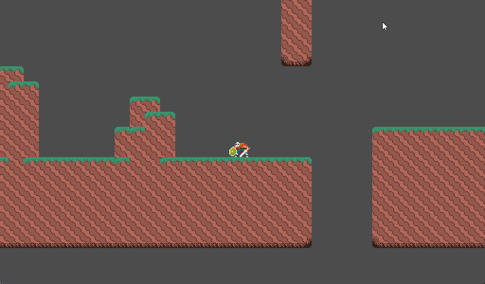
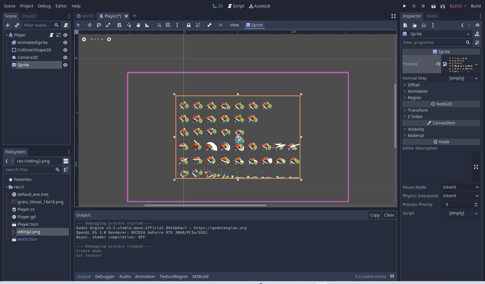
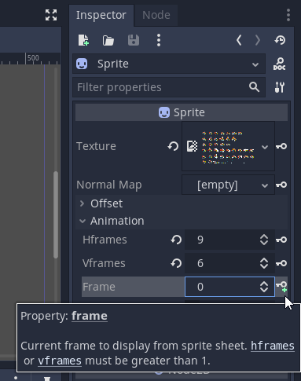
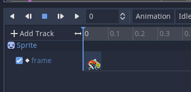
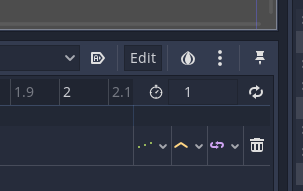
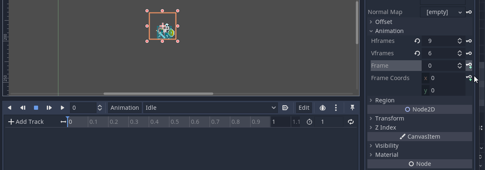

# AnimationTree <!-- omit in toc -->

- [Problématique](#problématique)
- [Solution](#solution)
- [Préparation](#préparation)
- [AnimationTree](#animationtree)
  - [Étape 1 : Convertir le noeud `Player` en scène.](#étape-1--convertir-le-noeud-player-en-scène)
  - [Étape 2 : Ajouter un noeud `Camera2D`](#étape-2--ajouter-un-noeud-camera2d)
  - [Étape 3 : Ajouter un noeud `Sprite`](#étape-3--ajouter-un-noeud-sprite)
  - [Étape 4 : Ajouter un noeud `AnimationPlayer`](#étape-4--ajouter-un-noeud-animationplayer)
- [Référence](#référence)

# Problématique
Une situation courante : vous avez un grand nombre d'animations, et il devient difficile de gérer les transitions entre elles. Votre code est devenu plein d'instructions `if`, et chaque fois que vous changez quelque chose, tout se casse.

# Solution
Utilisez un `AnimationTree` pour créer une machine à états d'animation. Cela nous permettra d'organiser nos animations et, surtout, de contrôler les transitions entre elles.

# Préparation
Dans le cadre de ce document, j'utiliserai mon dépôt de code [yt](https://github.com/nbourre/yt) et plus précisément la version [vBase_done](https://github.com/nbourre/yt/releases/tag/vBase_done).

Ce dernier contient le projet de base pour pour mes [vidéos YouTube](https://www.youtube.com/playlist?list=PLxPgLp3aTOhcEs_Rv0nXWXDHrxr83MVOB) sur la création d'un jeu de plateforme.

Voici à quoi ressemble le projet de base.

# AnimationTree

Pour utiliser l'`AnimationTree`, il faut avoir un noeud `AnimationPlayer` et ce dernier nécessite un noeud `Sprite`.

## Étape 1 : Convertir le noeud `Player` en scène.
Cliquer avec le bouton de droit sur le noeud `Player` et sélectionner "Sauvegarder la branche en tant que Scène".

Travailler sur une scène sera plus facile pour le futur.

## Étape 2 : Ajouter un noeud `Camera2D`
Ajouter à la scène `Player` un noeud `Camera2D` pour permettre le suivi du personnage.

- Configurer la propriété `Current` à "On" pour activer le suivi.
- Activer la propriété `Smoothing` à `Enabled` pour activer un suivi fluide.
- Tester le projet

## Étape 3 : Ajouter un noeud `Sprite`
Le noeud `Sprite` permettra d'ajouter facilement les images au noeud `AnimationPlayer`.

1. Ajouter un noeud `Sprite`.
2. Glisser l'image `viking2.png` sur la propriété `Texture` du noeud `Sprite`
   - On devrait obtenir une image similaire à cette capture d'écran
  
   
   
3. Il faudra configurer le nombre d'images à l'horizontal et à la vertical qui sont respectivement 9 et 6.
   - Il s'agit des propriétés `Hframes` et `Vframes` de la section `Animation`

## Étape 4 : Ajouter un noeud `AnimationPlayer`
Le noeud `AnimationPlayer` permet de gérer les animations.

1. Ajouter un noeud `AnimationPlayer`.
2. Dans le volet inférieur nommé « Animation », ajouter une nouvelle animation appelée « Idle »
   - On clique sur le bouton `Animation` et on sélectionne `Nouveau`

On verra une bande avec des nombres apparaître, il s'agit de l'échelle de temps de l'animation. On peut *zommer* sur celle-ci en maintenant la touche <kbd>CTRL</kbd> enfoncée et en faisant aller la molette de la souris.
- Dans le cadre du projet, je propose d'afficher le temps pour voir l'échelle affichée aux dizième de seconde.

3. Sélectionner le noeud `Sprite`.
4. Remarquer la propriété `Frame`, il y a une petite clé avec un "+" à la droite.
   

1. Cliquer sur ce bouton pour créer une nouvelle trame dans l'animation.
2. Si une petite fenêtre s'affiche, s'assurer que la courbe de Bezier ne soit pas cochée et cliquer sur `Créer`.

Une nouvelle image apparaîtra et la propriété `Frame` sera incrémentée de 1.
Le curseur du temps (ligne bleue) sera à zéro

> **Attention!**
> 
> Il y a un bogue dans Godot 3.x où il faut repositionner manuellement le curseur du temps après la première image. Il faudra répéter à chaque fois que l'on crée une nouvelle trame d'animation.

7. Repositionner le curseur du temps après la première image.
8. S'assurer que la propriété `Frame` soit à la valeur 1.
9. Cliquer sur la petite clé
10. Répéter l'opération jusqu'à la fin de l'animation.
11. Ajuster la durée de l'animation à l'aide de la zone de texte au bout du chronomètre.

L'action complète.

12. Répéter les étapes 2 à 11 pour l'ensemble des animations.
    
> Attention!
>
> Il faut souvent séparer les animations de saut. En effet, il y a l'animation de l'impulsion ainsi que l'animation de la chute.

# Référence
- [KidsCanCode.org : Controlling animation states](https://kidscancode.org/godot_recipes/3.x/animation/animation_state_machine/)