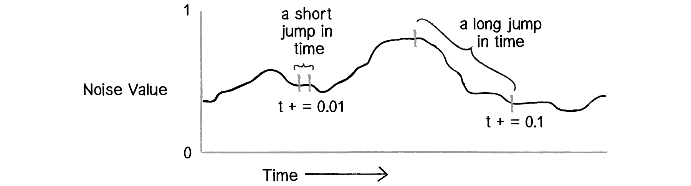
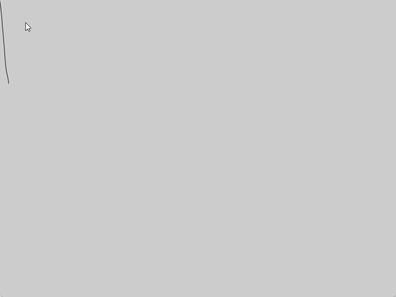
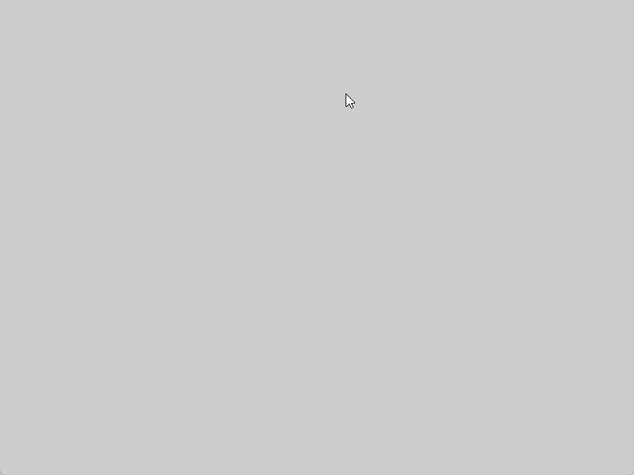
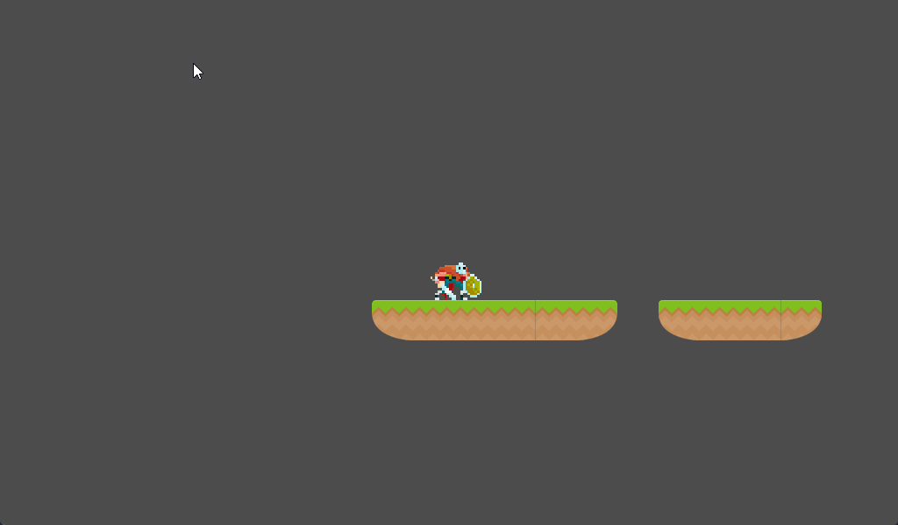

# Génération procédurale <!-- omit in toc -->

# Introduction
Dans ce court article, nous allons voir comment générer des plateformes de manière procédurale. Ainsi, je vais vous montrer une méthode que j'ai utilisé pour réaliser une démonstration.

La méthode ne répondra pas à toutes les solutions, mais elle peut vous donner une idée de comment procéder ou encore d'extrapoler pour d'autres cas.

# OpenSimplex Noise
Avant de commencer, je vais vous présenter le bruit que j'ai utilisé pour générer les plateformes. Il s'agit d'un bruit de Perlin, mais avec une fonction de transition plus lisse. Cela permet d'avoir un bruit plus naturel.

Le bruit de Perlin permet de générer des valeurs aléatoires, mais avec une certaine cohérence. J'utilise ce bruit pour générer des plateformes de manière procédurale.

En utilisant une graine aléatoire, on génère des valeurs différentes à chaque fois. À l'inverse, on peut utiliser une graine fixe pour générer toujours les mêmes valeurs.

Le bruit a une valeur déterminée par une position et une graine. Ainsi, on peut varié la position pour générer des valeurs plus ou moins lisses. Plus les positions seront proches, plus les valeurs seront similaires et vice versa. Vous pouvez vous reférer à l'image ci-dessous pour mieux comprendre.	



Voici un exemple de bruit de Perlin généré avec Processing.

```java
float yoff = 0.0;
float previous;
float t = 0;
float n = noise(yoff) * height;
float dir = 1;

void setup () {
  size (800, 600);
  background(204);
}

void draw() {
  previous = n; 
  yoff = yoff + .02;  
  n = noise(yoff) * height;  
  line (t - 1, previous, t, n);
  
  if (t > width)
    t = 0;
    
  t++;
}
```

Exemple avoir un saut de `0.02`


Exemple avoir un saut de `0.005`


Pour plus d'informations, je vous invite à lire l'article de [Khan Academy](https://www.khanacademy.org/computing/computer-programming/programming-natural-simulations/programming-noise/a/perlin-noise).

# Génération procédurale
Ainsi en utilisant les propriétés du bruit de Perlin, je génère des plateformes de manière procédurale. J'utilise une manière relativement simple pour générer les plateformes.

En gros, je créé un tableau de valeurs dans lequel j'enregistre les valeurs générées par le bruit. Chacune de ses valeurs me serviront pour déterminer la hauteur de la plateforme.

Par la suite, je parcours ce tableau et pour chacune des valeurs, je génère une valeur aléatoire qui déterminera la longtemps de la plateforme. À chaque fin de plateforme, je génère un autre nombre aléatoire qui déterminera la distance entre chaque plateforme.

Ceci sont les grandes lignes de ma génération procédurale. Je vous invite à regarder le code ci-dessous pour plus d'informations.

```cs
public class Map : Node
{
    /// Noeud enfant qui est un TileMap
    TileMap tileMap;
    TileSet tileSet;
    /// <summary>
    /// Dictionnaire contenant les différents types de tuiles
    /// Le nom de la tuile est la clé et la valeur est le ID de la tuile
    /// </summary>
    Dictionary<string, int> tileMapDictionary = new Dictionary<string, int>();
    
    int startTile;
    int endTile;
    int middleTile;

    bool debug = true;

    /// <summary>
    /// Objet pour le générateur de bruit
    /// </summary>
    OpenSimplexNoise noise;

    public override void _Ready()
    {
        tileMap = GetNode<TileMap>("TileMap");
        tileSet = tileMap.TileSet;

        GD.Randomize();
        noise = new OpenSimplexNoise();
        noise.Seed = (int)Mathf.Abs(GD.Randi());
        
        loadRessources();
        GenerateMap();
    }

    
    public void loadRessources() {
        var ids = tileSet.GetTilesIds();

        foreach (var id in ids)  {
            int? idx = id as int?;
            if (idx.HasValue)
            {
                tileMapDictionary.Add(tileSet.TileGetName(idx.Value), idx.Value);
            }
        }

        startTile = tileMapDictionary["ridge_left"];
        endTile = tileMapDictionary["ridge_right"];
        middleTile = tileMapDictionary["middle"];
    }

    public void GenerateMap()
    {
        tileMap.Clear();       

        float xOffset = 0f;
        float xIncrement = 0.35f;

        int yStart = 10;
        int yLevel = yStart;
        int yEnd = yStart;

        int nbPlatforms = 15;
        int platformLength = 5;

        int xStart = 0;
        int xEnd = xStart + platformLength;
        int gapLength = 2;
        var noiseValue = yStart;
        var noiseValuePrevious = yStart;

        for (int i = 0; i < nbPlatforms; i++)
        {
            
            tileMap.SetCell(xStart, (int)noiseValue, startTile);
            yEnd = (int)noiseValue;

            GD.Print($"Platform : {i}, xStart: {xStart}, xEnd: {xEnd}, length: {platformLength}, noiseValue: {(int)noiseValue}");

          
            for (int x = xStart + 1; x < xEnd; x++)
            {
                tileMap.SetCell(x, (int)noiseValue, middleTile);                
            }

            tileMap.SetCell(xEnd, yEnd, endTile);
            
            platformLength = (int)GD.RandRange(5, 10);
            gapLength = (int)GD.RandRange(2, 5);

            yStart = yEnd;
            xStart = xEnd + gapLength;
            xEnd += platformLength;
            xOffset += xIncrement;

            noiseValue = (int)(noise.GetNoise1d(xOffset) * 50) + yStart;
        }        
    }

    private float MapValue(float value, float fromLow, float fromHigh, float toLow, float toHigh) 
    {
        return (value - fromLow) * (toHigh - toLow) / (fromHigh - fromLow) + toLow;
    }
}
```

Voici un exemple de résultat de la génération procédurale.


Il ne s'agit pas de la meilleure méthode, mais c'est une manière simple de générer des plateformes.

# Résumé
Dans cet article, nous avons vu comment une manière simple de générer des plateformes de manière procédurale. On peut facilement améliorer cette méthode en retirant les dépendances au TileMap et TileSet. On peut générer les tuiles au fil de l'avancement du personnage. On peut aussi ajouter des obstacles, des ennemis, etc. Dans tous les cas, ce sera à vous de jouer!