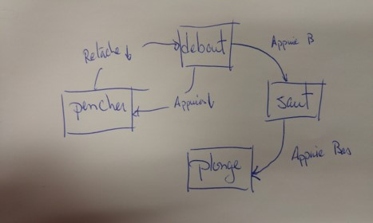
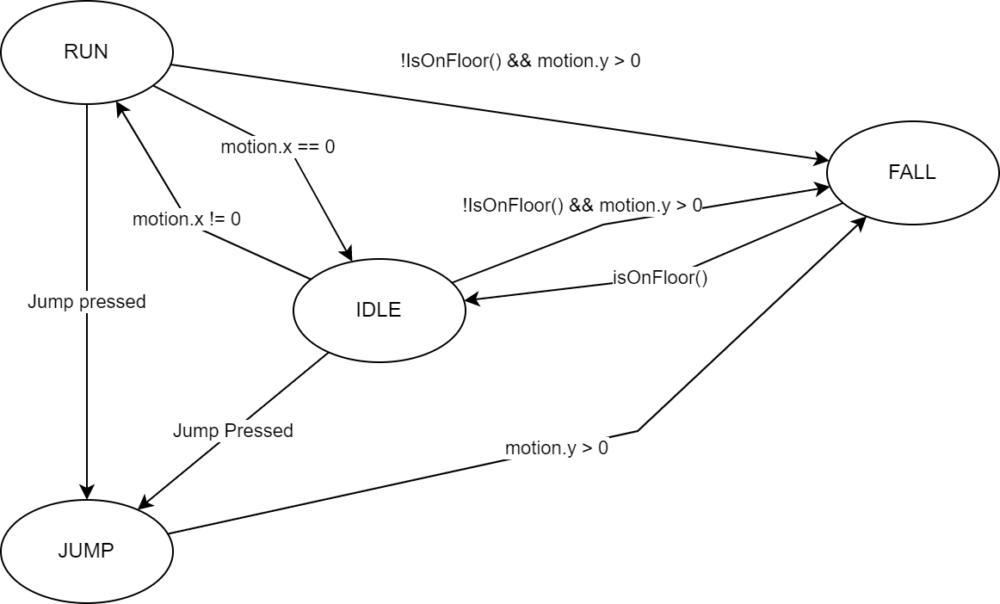
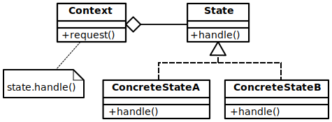

# La machine à état fini <!-- omit in toc -->
Améliorons nos personnages!

# Plan de leçon <!-- omit in toc -->
- [Étude de cas](#étude-de-cas)
- [Machine à état fini](#machine-à-état-fini)
- [Projet Godot](#projet-godot)
  - [Modification au code](#modification-au-code)
  - [Solution intermédiaire](#solution-intermédiaire)
    - [Diagramme d'états](#diagramme-détats)
  - [Solution intermédiaire : Modification du code](#solution-intermédiaire--modification-du-code)
  - [Résumé de la solution temporaire](#résumé-de-la-solution-temporaire)
- [Design pattern : L'état](#design-pattern--létat)
  - [Implémentation dans Godot](#implémentation-dans-godot)
- [Références](#références)

# Étude de cas

Évaluons le code suivant :
```cpp
void Heroine::handleInput(Input input){
    if (input == PRESS_B)    {
        yVelocity_ = JUMP_VELOCITY;
        setGraphics(IMAGE_JUMP);    
    }
}
```
*Code 01* 

Question : Quel est le problème?

<details><summary>Réponse</summary>
- Rien ne ll'empêche de faire du air jumping
</details>

```cpp
void Heroine::handleInput(Input input)
    if (input == PRESS_B){
        if (!isJumping_){
            isJumping_ = true;
            // Jump...
        }
    }
}

// Solution : air jumping résolu avec le booléen isJumping_.
// Maintenant, on veut que l’héroïne puisse se pencher lorsque l’on appuie en bas et se relever lorsque l’on relâche
```
*Code 02*

```cpp
void Heroine::handleInput(Input input){
    if (input == PRESS_B){
        // Jump if not jumping...
    }
    else if (input == PRESS_DOWN){
        if (!isJumping_){
                setGraphics(IMAGE_DUCK);
                }
        }
    else if (input == RELEASE_DOWN){
        setGraphics(IMAGE_STAND);
    }
}
```
*Code 03*

**Quelques secondes pour trouver le bogue :)**

- Le joueur pourra :
  - Appuyer sur la flèche du bas pour se pencher
  - Appuyer sur B pour sauter lorsqu’il est penché
  - Relâcher la flèche du bas lorsque dans les airs
  - On aura une image debout lorsqu’il sera dans les airs
- Corrigeons en ajoutant des nouveaux drapeaux...

```cpp
void Heroine::handleInput(Input input)
{
  if (input == PRESS_B)
  {
    if (!isJumping_ && !isDucking_)
    {
      // Jump...
    }
  }
  else if (input == PRESS_DOWN)
  {
    if (!isJumping_)
    {
      isDucking_ = true;
      setGraphics(IMAGE_DUCK);
    }
  }
  else if (input == RELEASE_DOWN)
  {
    if (isDucking_)
    {
      isDucking_ = false;
      setGraphics(IMAGE_STAND);
    }
  }
}
```
*Code 04*

Parfait! On a corrigé notre bogue.

Maintenant, ça serait amusant si l’héroïne pouvant faire un dive attack lorsque le joueur appuie sur la touche du bas dans les airs.

```cpp
void Heroine::handleInput(Input input)
{
  if (input == PRESS_B)
  {
    if (!isJumping_ && !isDucking_)
    {
      // Jump...
    }
  }
  else if (input == PRESS_DOWN)
  {
    if (!isJumping_)
    {
      isDucking_ = true;
      setGraphics(IMAGE_DUCK);
    }
    else
    {
      isJumping_ = false;
      setGraphics(IMAGE_DIVE);
    }
  }
  else if (input == RELEASE_DOWN)
  {
    if (isDucking_)
    {
      // Stand...
    }
  }
}

```
*Code 05*

Chasse aux bogues encore…

- On prévoit le air jumping lorsqu’il saute, mais pas en plongeant.
- On ajoutera un autre drapeau…
- On se rend compte qu’il y a un problème avec notre approche.
- À chaque fois que l’on touche au code, on brise quelque chose...

---

- On rage et on met au poubelle ce que l’on vient d’écrire et on se met à gribouiller un diagramme de flux de donnée où on fait des carré pour chaque chose que le personnage peut faire soit être debout, penché, en saut et en plonge.
- Lorsqu’il répond à une commande, on fait une flèche de l’état initial, vers l’état final en inscrivant l’action nécessaire.



- Félicitations! Vous venez de réaliser un diagramme de **machine à état fini**!

---

# Machine à état fini
- [La machine à état fini](https://fr.wikipedia.org/wiki/Automate_fini) (FSM) fait partie de la famille de la [Théorie des automates](https://fr.wikipedia.org/wiki/Th%C3%A9orie_des_automates)
- Il s’agit de la structure la plus simple
- Ce qu’il faut savoir :
  - Il y a un nombre déterminé d’état dans lequel la machine peut être. Par exemple : debout, saut, penché et plonge.
  - La machine ne peut être qu’en un seul état à la fois.
  - Une séquence d’actions ou d’entrées est envoyée à la machine. Dans notre cas, ce seront les boutons d’une manette.
  - Chaque état a un jeu de transitions, chacune de celle-ci est associée à une entrée et pointe vers un état. Quand un événement est déclenché, s’il est reconnu par une transition pour l’état courant, la machine passera à l’état que la transition pointe vers.

---

- Ce qu’il faut retenir ce sont : **états**, **entrées** et **transitions**
- Il y a un design pattern (DP) nommé **État** qui permet de constuire une FSM

---

# Projet Godot
- Le jeu de plateforme du dernier cours représente bien le sujet précédent
- Nous allons travailler avec ce projet
- Activez la branche « platformer_done »
  - `git checkout platformer_done`
- Créez et activez une nouvelle branche « platformer_fsm »
  - `git checkout –b platformer_fsm`
  - L’option `-b` permet de créer une nouvelle branche et activer celle-ci
- Ouvrez le projet `c03a_platformer_completed`

---

## Modification au code
- Avant toute chose, nous allons améliorer le code de base
- À la première ligne de la méthode `_PhysicsProcess`, ajoutez le code pour connaître la direction appuyée

```cpp 
var dir = Input.GetActionStrength("ui_right") - Input.GetActionStrength("ui_left");
```

Remplacez le code d'avant ci-bas avec celui après.

```cpp
// AVANT
if (Input.IsActionPressed("ui_left")) {
    motion.x += ACCEL * dir;
    facing_right = false;
    animPlayer.Play("Run");
} else if (Input.IsActionPressed("ui_right")) {
    motion.x += ACCEL * dir;
    facing_right = true;
    animPlayer.Play("Run");
} else {
    motion = motion.LinearInterpolate(Vector2.Zero, 0.2f);
    animPlayer.Play("Idle");
}
``` 
*Code 06*

```cpp
// APRÈS
if (dir != 0) {
    motion.x += ACCEL * dir;
    animPlayer.Play("Run");
}               
if (dir > 0) {
    facing_right = true;
} else if (dir < 0) {
    facing_right = false;
} else {
    motion = motion.LinearInterpolate(Vector2.Zero, 0.2f);
    animPlayer.Play("Idle");
}

```
*Code 07*

---

## Solution intermédiaire
Avant d’implanter le DP État, on fera une solution intermédiaire pour mieux comprendre la mécanique.

**Énumérations et switch** 
- Pour indiquer les états, on regardait si le personnage était au sol ou dans les airs ainsi que les touches appuyées.
- On aurait pu utiliser des booléens isJumping et isRunning, mais il ne faudrait pas qu’ils soient à vrai en simultané.
- Si on a besoin d’avoir plusieurs booléens et qu’un seul doit être vrai dans tous les cas, c’est un indice indiquant que l’on devrait utiliser des énumérations.

### Diagramme d'états
La première étape est de tracer le diagramme d’états. Tracer le diagramme facilite grandement la programmation.
- Alors sortez vos crayons! :)

L'ordre pour tracer le diagramme est relativement simple :
1. Identifier les états
2. Tracer les transitions et écrire les conditions de transition



3. Créer l'énumération qui contiendra les états.

---
## Solution intermédiaire : Modification du code

Dans la classe `Player`, ajoutez l’énumération ci-bas ainsi qu’un attribut pour sauvegarder l’état.

```cpp
public class player : KinematicBody2D
{

    enum State {
        STATE_JUMPING,
        STATE_IDLE,
        STATE_RUNNING,
        STATE_FALLING
    };
    
    State currentState = State.STATE_IDLE;
    // ..

```
*Code 08*

Ajouter un switch-case pour la gestion des états.

Voici le code de `_PhysicsProcess` modifié

```cpp

public override void _PhysicsProcess(float delta)
{
    var dir = Input.GetActionStrength("ui_right") - Input.GetActionStrength("ui_left");

    motion.x += ACCEL * dir;
    motion.y += GRAVITY;

    if (facing_right) {
        currentSprite.FlipH = false;
    } else {
        currentSprite.FlipH = true;
    }

    switch(currentState) {
        case State.STATE_FALLING:
            if (IsOnFloor()) {
                currentState = State.STATE_IDLE;
                animPlayer.Play("Idle");
            }
            break;
        case State.STATE_IDLE:                
            if (dir != 0) {
                currentState = State.STATE_RUNNING;
                animPlayer.Play("Run");
            }
            if (Input.IsActionJustPressed("ui_jump")) {
                currentState = State.STATE_JUMPING;
                motion.y = -JUMPFORCE;
                animPlayer.Play("jump");
            }
            if (!IsOnFloor()) {
                if (motion.y > 0) {
                    currentState = State.STATE_FALLING;
                    animPlayer.Play("fall");
                }
            }                
            break;
        case State.STATE_JUMPING:
            if (motion.y >= 0) {
                currentState = State.STATE_FALLING;
                animPlayer.Play("fall");
            } else {
                animPlayer.Play("jump");
            }                
            break;
      case State.STATE_RUNNING:                
            if (dir > 0) {
                facing_right = true;
            } else if (dir < 0) {
                facing_right = false;
            } else {
                currentState = State.STATE_IDLE;
                motion = motion.LinearInterpolate(Vector2.Zero, 0.2f);   
                animPlayer.Play("Idle");
            }
            if (!IsOnFloor()) {
                if (motion.y > 0) {
                    currentState = State.STATE_FALLING;
                    animPlayer.Play("fall");
                }
            }
            if (Input.IsActionJustPressed("ui_jump")) {
                currentState = State.STATE_JUMPING;
                motion.y = -JUMPFORCE;
                animPlayer.Play("jump");
            }                
            break;
        default:
            animPlayer.Play("Idle");
            break;
    }

    motion.x = Mathf.Lerp(motion.x, MAXSPEED * motion.x > 0 ? 1 : -1, (ACCEL * 1f) / MAXSPEED);

    if(motion.y > MAXFALLSPEED) {
        motion.y = MAXFALLSPEED;
    }
    motion = MoveAndSlide(motion, UP);
}

```
*Code 09*

**Points saillants**
- Toutes la gestions est dans un switch-case
- Chaque état est indépendant

Pour un lecteur, ce code a l’air compliqué. Pour améliorer la lisibilité, on crée des méthodes pour chaque état.

---

Ainsi, on crée des méthodes pour chaque état et ensuite on appelle ces méthodes dans les différents cas.

```cpp
//...
switch(currentState) {
    case State.STATE_FALLING:
        fall();
        break;
    case State.STATE_IDLE:
        idle();            
        break;
    case State.STATE_JUMPING:
        jump();          
        break;
    case State.STATE_RUNNING:                
        run();              
        break;
    default:
        idle();
        break;
}
//...

```
*Code 10*
- Cette solution ci-haut est beaucoup plus propre que celle d’avant.
- Une seule propriété pour gérer les états
- Un peu de structure conditionnelle pour chaque état, mais c’est utilisable pour bien des cas.
- C’est la méthode la plus simple pour implanter une FSM

<details><summary>Cliquer pour voir le code de chacune des méthodes.</summary>


```cpp
void jump() {
    if (motion.y >= 0) {
        currentState = State.STATE_FALLING;
        animPlayer.Play("fall");
    } else {
        animPlayer.Play("jump");
    }      
}

void fall() {
    if (IsOnFloor()) {
        currentState = State.STATE_IDLE;
        animPlayer.Play("Idle");
    }
}

void idle() {
    if (dir != 0) {
        currentState = State.STATE_RUNNING;
        animPlayer.Play("Run");
    }
    JumpCheck();
    FallCheck(); 
}

void FallCheck() {
    if (!IsOnFloor()) {
        if (motion.y > 0) {
            currentState = State.STATE_FALLING;
            animPlayer.Play("fall");
        }
    }  
}

void JumpCheck() {
    if (Input.IsActionJustPressed("ui_jump")) {
        currentState = State.STATE_JUMPING;
        motion.y = -JUMPFORCE;
        animPlayer.Play("jump");
    }         
}


void run(){
    if (dir > 0) {
        facing_right = true;
    } else if (dir < 0) {
        facing_right = false;
    } else {
        currentState = State.STATE_IDLE;
        motion = motion.LinearInterpolate(Vector2.Zero, 0.2f);   
        animPlayer.Play("Idle");
    }

    JumpCheck(); 
    FallCheck();
}
```
*Code 11*
</details>

---

## Résumé de la solution temporaire
Pour les petits jeux, cette solution peut convenir. Toutefois, si le jeux prend de l'ampleur, ça peut être un peu compliqué.

En effet, la solution présentée peut ne pas convenir à nos besoins lorsque les états deviennent trop nombreux.

Exemple :
- Disons que l’on désire que le personnage puisse voler, mais il devra courir pendant un certain temps avant de pouvoir s’exécuter.
- Dans le code, il faudra faire un suivi du temps pendant l'état de la course.

```cpp
float chargeTime;
void run(){
    chargeTime += delta;
    if (dir > 0) {
        facing_right = true;
    } else if (dir < 0) {
        facing_right = false;
    } else {
        currentState = State.STATE_IDLE;
        motion = motion.LinearInterpolate(Vector2.Zero, 0.2f);   
        animPlayer.Play("Idle");
    }
    FlyCheck();
    JumpCheck(); 
    FallCheck();
}

// On devra remettre à zéro le temps avant de changer vers l’état de courir

```
*Code 12*

Avec cette solution, nous avons eu besoin de modifier deux méthodes.
- On doit ajouter une propriété pour garder le temps de recharge qui n’est utilisé que lorsque le personnage court
- Le DP État permet de remédier à cette situation

---

# Design pattern : L'état
- Anglais : State
- Patron de conception comportementale
- Objectif : Permettre à un objet de modifier son comportement après un changement d’état interne
- Exemple de problème : Une section de l’application possède un switch avec trop de cas dépendant de l’état de celle-ci.



---

Principe :
- Définir une classe « contexte » qui présente une interface unique pour le monde
- Définir une classe abstraite « état »
- Représenter les différents états comme étant des classes héritantes de la classe abstraite
- Définir le comportement de l’état dans la classe qui hérite de la classe abstraite
- Garder un pointeur qui garde l’état courant dans la classe contexte
- Pour changer l’état, modifier le pointeur de l’état


---

- Le DP État n’indique pas où l’on doit intégrer le changement d’état
- On peut le faire dans la classe « contexte » ou dans chacun des états
  - L’avantage de faire l’intégration dans les états est la facilité de créer de nouveaux états
  - Le désavantage, c’est que chaque état doit connaître l’état qui suit la transition ainsi il y a un couplage par transition qui se forment


---

## Implémentation dans Godot
- Pour implémenter ce DP, il faudra tricher à quelques endroits pour optimiser les caractéristiques de Godot
- La première étape sera de créer une classe générique qui aura les méthodes de base pour l’ensemble des états
- Nous appellerons cette classe `BaseState`
  - Celle-ci héritera de la classe Node pour avoir les fonctionnalités de Godot

```cpp
using Godot;
using System.Collections.Generic;

public class State : Node
{
    /// <summary>
    /// # Reference à la `StateMachine` pour appeler sa méthode `transition_to()` directement.
    /// C'est notre triche pour l'implémentation du DP État, car cela ajoute une dépendance entre
    /// l'état et l'objet `StateMachine`, mais une méthode efficace pour nos besoins
    /// La machine à état qui l'assignera.
    /// </summary>
    public StateMachine _stateMachine = null;

    /// <summary>
    /// Fonction virtuelle. Reçoit les événements de `_unhandled_input()`.
    /// </summary>
    /// <param name="inputEvent"></param>
    public virtual void HandleInputs(InputEvent inputEvent)
    {
        return;
    }

    /// <summary>
    /// Fonction virtuel correspondant à `_process()`.
    /// </summary>
    /// <param name="delta"></param>
    public virtual void Update(float delta)
    {
        return;
    }

    /// <summary>
    /// Fonction virtuel correspondant à `_PhysicsProcess()`
    /// </summary>
    /// <param name="delta"></param>
    public virtual void PhysicsUpdate(float delta)
    {
        return;
    }

    /// <summary>
    /// Fonction virtuelle. Appelée par la machine à état pour modifier l'état courant. Le paramètre `msg`
    /// est un dictionnaire avec des données arbitraires que l'état peut utiliser pour initialiser.
    /// </summary>
    /// <param name="message"></param>
    public virtual void Enter(Dictionary<string, bool> message = null)
    {
        return;
    }

    /// <summary>
    /// Fonction virtuelle. Appelée par la machine à état avant de changer l'état courant. Utilisez cette
    /// fonction pour nettoyer les ressources utilisées par l'état.
    /// </summary>
    public virtual void Exit()
    {
        return;
    }
}

```
*Code 13*

---
# Références
- [Design Pattern Guru : State pattern](https://refactoring.guru/design-patterns/state)