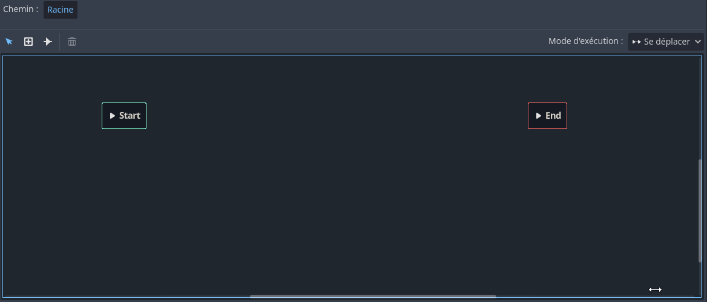

# AnimationTree <!-- omit in toc -->

- [Problématique](#problématique)
- [Solution](#solution)
- [Préparation](#préparation)
  - [Godot 3.5](#godot-35)
  - [Godot 4.x](#godot-4x)
- [Créer l'animation](#créer-lanimation)
  - [Étape 1 : Convertir le noeud `Player` en scène.](#étape-1--convertir-le-noeud-player-en-scène)
  - [Étape 2 : Ajouter un noeud `Camera2D`](#étape-2--ajouter-un-noeud-camera2d)
  - [Étape 3 : Ajouter un noeud `Sprite`](#étape-3--ajouter-un-noeud-sprite)
  - [Étape 4 : Ajouter un noeud `AnimationPlayer`](#étape-4--ajouter-un-noeud-animationplayer)
- [Ajouter un noeud `AnimationTree`](#ajouter-un-noeud-animationtree)
- [Programmer les transitions entre les états](#programmer-les-transitions-entre-les-états)
  - [Étape 1 : Objets pour la gestion de l'animation](#étape-1--objets-pour-la-gestion-de-lanimation)
  - [Étape 2 : Ajouter les méthodes pour gérer les transitions](#étape-2--ajouter-les-méthodes-pour-gérer-les-transitions)
- [Référence](#référence)

# Problématique
Une situation courante : vous avez un grand nombre d'animations, et il devient difficile de gérer les transitions entre elles. Votre code est devenu plein d'instructions `if`, et chaque fois que vous changez quelque chose, tout se casse.

# Solution
Utilisez un `AnimationTree` pour créer une machine à états d'animation. Cela nous permettra d'organiser nos animations et, surtout, de contrôler les transitions entre elles.

# Préparation

> **Attention!** Ce document a été partiellement mis à jour. La partie `Créer l'animation` a été développé à l'aide de Godot 3 et n'a pas été mis à jour. Cependant, il y a très peu de changement pour Godot 4.
> 
> La partie `AnimationTree` a été mis à jour pour Godot 4.

## Godot 3.5
Dans le cadre de ce document, j'utiliserai mon dépôt de code [yt](https://github.com/nbourre/yt) et plus précisément la version [vBase_done](https://github.com/nbourre/yt/releases/tag/vBase_done).

Ce dernier contient le projet de base pour pour mes [vidéos YouTube](https://www.youtube.com/playlist?list=PLxPgLp3aTOhcEs_Rv0nXWXDHrxr83MVOB) sur la création d'un jeu de plateforme.

Voici à quoi ressemble le projet de base.


## Godot 4.x
Pour la partie `AnimationTree`, j'utiliserai le projet [`c08_parallax`](https://github.com/nbourre/0sw_projets_cours/tree/master/c08_parallax) et plus spécifiquement la branche `cours_animTree`.

```bash	
cd # dans le répertoire des projets du cours
git pull
git checkout cours_animTree
``` 

Voici à quoi ressemblera le projet à la fin du document.


# Créer l'animation

Pour utiliser l'`AnimationTree`, il faut avoir un noeud `AnimationPlayer` et ce dernier nécessite un noeud `Sprite`.

## Étape 1 : Convertir le noeud `Player` en scène.
Cliquer avec le bouton de droit sur le noeud `Player` et sélectionner "Sauvegarder la branche en tant que Scène".

Travailler sur une scène sera plus facile pour le futur.

## Étape 2 : Ajouter un noeud `Camera2D`
Ajouter à la scène `Player` un noeud `Camera2D` pour permettre le suivi du personnage.

- Configurer la propriété `Current` à "On" pour activer le suivi.
- Activer la propriété `Smoothing` à `Enabled` pour activer un suivi fluide.
- Tester le projet

## Étape 3 : Ajouter un noeud `Sprite`
Le noeud `Sprite` permettra d'ajouter facilement les images au noeud `AnimationPlayer`.

1. Ajouter un noeud `Sprite`.
2. Glisser l'image `viking2.png` sur la propriété `Texture` du noeud `Sprite`
   - On devrait obtenir une image similaire à cette capture d'écran
  
   

3. Il faudra configurer le nombre d'images à l'horizontal et à la vertical qui sont respectivement 9 et 6.
   - Il s'agit des propriétés `Hframes` et `Vframes` de la section `Animation`

## Étape 4 : Ajouter un noeud `AnimationPlayer`
Le noeud `AnimationPlayer` permet, entre autres, de gérer les animations.

1. Ajouter un noeud `AnimationPlayer`.
2. Dans le volet inférieur nommé « Animation », ajouter une nouvelle animation appelée « Idle »
   - On clique sur le bouton `Animation` et on sélectionne `Nouveau`

On verra une bande avec des nombres apparaître, il s'agit de l'échelle de temps de l'animation. On peut *zommer* sur celle-ci en maintenant la touche <kbd>CTRL</kbd> enfoncée et en faisant aller la molette de la souris.
- Dans le cadre du projet, je propose d'afficher le temps pour voir l'échelle affichée aux dizième de seconde.

3. Sélectionner le noeud `Sprite`.
4. Remarquer la propriété `Frame`, il y a une petite clé avec un "+" à la droite.
   


1. Cliquer sur ce bouton pour créer une nouvelle trame dans l'animation.
2. Si une petite fenêtre s'affiche, s'assurer que la courbe de Bezier ne soit pas cochée et cliquer sur `Créer`.

Une nouvelle image apparaîtra et la propriété `Frame` sera incrémentée de 1.
Le curseur du temps (ligne bleue) sera à zéro


> **Attention!**
> 
> Il y a un bogue dans Godot 3.x où il faut repositionner manuellement le curseur du temps après la première image. Il faudra répéter à chaque fois que l'on crée une nouvelle trame d'animation.

7. Repositionner le curseur du temps après la première image.
8. S'assurer que la propriété `Frame` soit à la valeur 1.
9. Cliquer sur la petite clé
10. Répéter l'opération jusqu'à la fin de l'animation.
11. Ajuster la durée de l'animation à l'aide de la zone de texte au bout du chronomètre.


L'action complète.


12. Répéter les étapes 2 à 11 pour l'ensemble des animations.
    
> **Attention!**
>
> Il faut souvent séparer les animations de saut. En effet, il y a l'animation de l'impulsion ainsi que l'animation de la chute.

---

# Ajouter un noeud `AnimationTree`

Une fois que les configurations des animations est réalisées, on peut passer à l'étape de l'[`AnimationTree`](https://docs.godotengine.org/en/stable/tutorials/animation/animation_tree.html).


Vidéo où j'explique l'`AnimationTree`

[](https://www.youtube.com/watch?v=czMuvHbiDns&t=913s)


Ce noeud sert à créer et gérer une machine à état fini pour notre personnage.

Avant d'utiliser le noeud, il faut établir les différents états du personnage. Dans notre cas, les états sont définis dans les types d'animation que l'on a réalisé dans l'`AnimationPlayer`, par exemple, `idle`, `run`, `attack_1`, ...

Les étapes de base seront les suivantes :

1. Ajouter un noeud `AnimationTree` au personnage
   - Un **volet `AnimationTree`** apparaîtra dans le bas de l'IDE.
2. Sélectionner le type de machine que l'on désire avec la propriété `Tree Root`.
   - Dans notre cas, ce sera un `AnimationNodeStateMachine`
   - **Note :** Personnallement, n'ayant fait que du 2D, je n'ai exploré que l'option `AnimationNodeStateMachine`. Il se peut que vous ayez exploré d'autres options selon les tutoriels que vous avez suivi.
3. Associer l'`AnimationPlayer` que l'on désire gérer.
   - Dans notre cas, on n'a qu'un noeud `AnimationPlayer`.


4. Dans le volet `AnimationTree`, cliquer avec le bouton de droite dans l'espace de travail et ajouter l'animation `idle`.
   - Activer la propriété `Active` de l'`AnimationTree`.
   - Pour voir l'animation `idle`, il suffit d'appuyer sur le bouton `play` dans l'état (rectangle noir).
 


5. Répéter l'opération précédente en ajoutant l'animation `running`.
   - On peut tester l'animation.
6. Répèter l'opération précédente en ajoutant l'animation `attack1`.
   - Tester l'animation.
   - On remarque que l'attaque "gèle" après s'être exécutée. La raison est que l'animation ne boucle pas. Il faudra ajouter une transition pour qu'elle reviennent à l'état `idle`.


7. Ajouter une transition d'`idle` vers l'attaque.
   - Dans la petite barre d'outils, il y a une petite flèche avec une ligne (3e bouton). Ce bouton sert à ajouter des transitions entre les états.
   - Pour ajouter une transition, il faut cliquer-glisser de l'état source et vers l'état destination.
8. Tester l'animation d'attaque
   - Il gèle encore, car il n'y a pas de transition de l'attaque vers l'`idle`.
9. Ajouter une transition entre l'état "attaque" vers `idle`.
10. Tester l'attaque.
    - L'animation "gig", car elle passe successivement de l'`idle` à l'attaque et à l'`idle`. 
 


11. Sélectionner la transition de l'attaque vers l'`idle`
12. Modifier la propriété `Switch Mode` pour `AtEnd`.


13. Das les propriétés `Advance`, configurer le mode pour `Auto`


14. Tester l'attaque
    - Tout devrait fonctionner.
15. Ajouter les transitions entre `run` et `idle`.
    - Laisser les transitions telles quelles, car la n dn se fera dans le code.
16. Ajouter l'ensemble des animations.
    - Le saut devra être composé de `jump` et `fall`.
    - Il devra avoir un état `fall` seul avec des transitions aller-retour avec `idle`. La gestion se fera dans le code.
17. L'état `idle` sera l'état initial. Faire une transition entre `Start` et `idle`.
18. Définir `dead` comme étant l'état de fin. Il suffit de sélectionner l'état et de faire une transition vers `End`.


La configuration de l'`AnimationTree` est terminée. Il est maintenant temps de passer à la programmation.

---

# Programmer les transitions entre les états

Comme indiquer précédement, il faudra gérer les transitions entre les états dans le code.

Godot possède une mécanisme géniale qui permet de simplifier la gestion des transitions. En effet, il y a une classe nommée `AnimationNodeStateMachinePlayback` qui permet de "voyager" d'un état à un autre automatiquement.

## Étape 1 : Objets pour la gestion de l'animation
Dans la classe `Player.cs`, créer les deux membres suivants :

```csharp
AnimationTree animTree;
AnimationNodeStateMachinePlayback stateMachine;
```

Dans la méthode `_Ready()`, ajouter le code suivant :

```csharp
animTree = GetNode<AnimationTree>("AnimationTree");
animTree.Active = true;

// Récupère le paramètre "parameters/playback" de l'animation tree
stateMachine = (AnimationNodeStateMachinePlayback)animTree.Get("parameters/playback");

```

Dans Godot, la méthode `GodotObject.Get` permet de récupérer les propriétés d'un noeud. Dans notre cas, on récupère la propriété `playback` de l'`AnimationTree` qui est un [`AnimationNodeStateMachinePlayback`](https://docs.godotengine.org/en/stable/classes/class_animationnodestatemachineplayback.html).

Pour connaître la chaîne du paramètre, il suffit de sélectionner le noeud dans l'IDE et de cliquez avec le bouton droit sur la propriété qui nous intéresse. Un menu contextuel apparaîtra et il suffit de sélectionner `Copier le chemin de la propriété`.


## Étape 2 : Ajouter les méthodes pour gérer les transitions
Pour passer d'un état à l'autre, on utilise la méthode `AnimationNodeStateMachinePlayback.Travel` qui prend en paramètre le nom de l'état de destination.

Cette méthode trouve le chemin le plus court pour passer de l'état actuel à l'état de destination.

Dans le `if (isOnFloor())...`, il y a le `else` qui vérifie si le vecteur d'entrée est différent de zéro. Modifier cette partie pour avoir ce code.

```csharp
if (inputVector != Vector2.Zero) {
    stateMachine.Travel("run");
} else {
    stateMachine.Travel("idle");
}
```
Pour la portion aérienne où l'on retrouve le `if (!isOnFloor()...)`, modifier le code pour le suivant:

```csharp
if (!IsOnFloor()){
    if (velocity.Y < 0) {
        GD.Print("rising");
        stateMachine.Travel("jump");
    } 
    if (velocity.Y > 0) {
        GD.Print("falling");
        stateMachine.Travel("fall");
    }
}
```

Si tout fonctionne bien, on devrait avoir un résultat similaire à celui-ci.


---

# Référence
- [KidsCanCode.org : Controlling animation states](https://kidscancode.org/godot_recipes/4.x/animation/using_animation_sm/index.html)
- [GDQuest - Finite state machine](https://www.gdquest.com/tutorial/godot/design-patterns/finite-state-machine/)