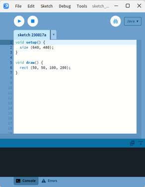
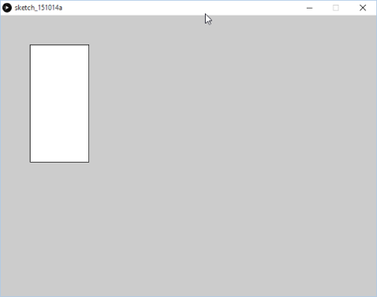
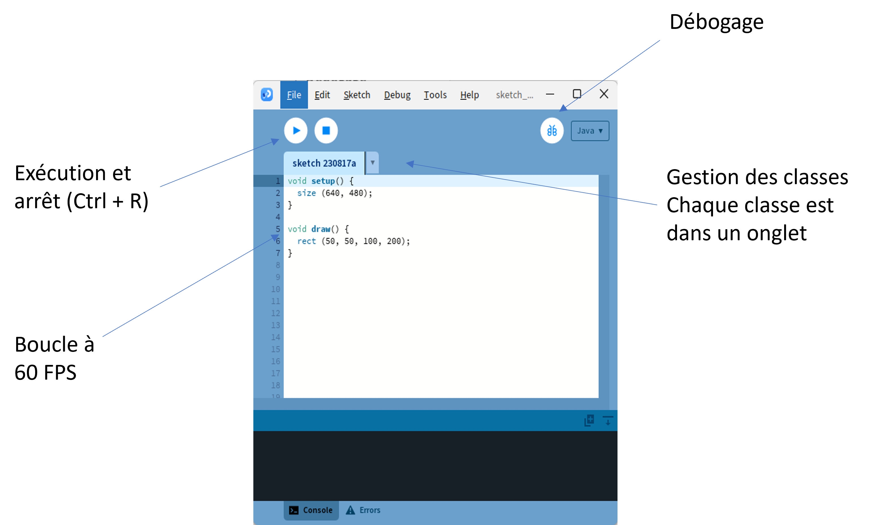
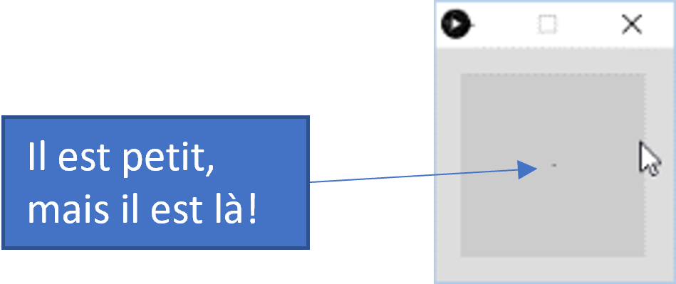
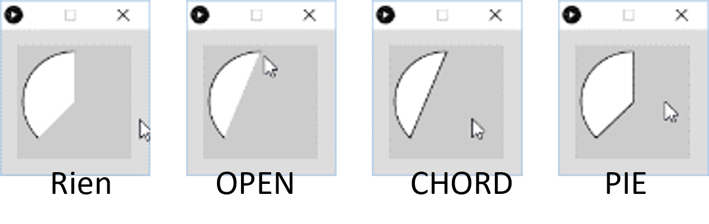
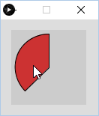
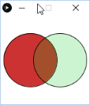
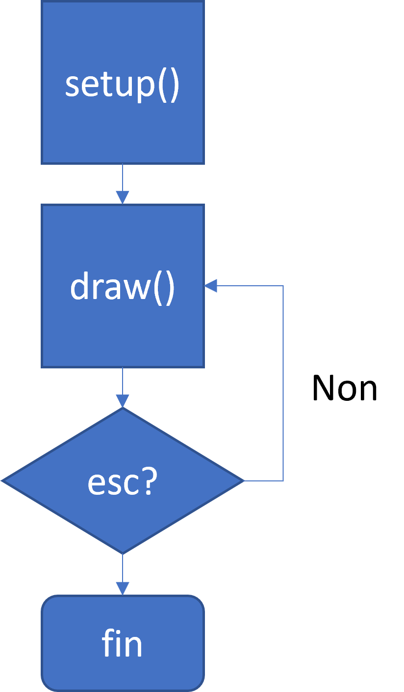
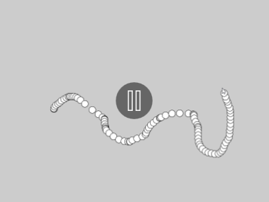

# Processing Crash Course <!-- omit in toc -->

# Table des matières <!-- omit in toc -->
- [Introduction](#introduction)
- [Processing](#processing)
  - [Qu’est-ce que Processing?](#quest-ce-que-processing)
  - [Processing : Interface](#processing--interface)
- [Premier jet](#premier-jet)
- [Les formes primitives 2D](#les-formes-primitives-2d)
  - [Arc de cercle](#arc-de-cercle)
  - [Liste de formes primitives](#liste-de-formes-primitives)
- [Couleurs](#couleurs)
  - [Récapitulatif](#récapitulatif)
- [Exercices courts](#exercices-courts)
- [Programme Processing](#programme-processing)
  - [setup()](#setup)
  - [draw()](#draw)
- [Les variables systèmes](#les-variables-systèmes)
- [Exercice #1](#exercice-1)

---

# Introduction
Avant de nous lancer en grand dans le développement de jeux vidéo avec Godot, nous allons retourner aux sources pour nous réapproprier les notions de base de mathématiques et de géométrie du secondaire. Nous allons utiliser un outil très simple qui permet de se familiariser avec la programmation créative : Processing.

---

# Processing
- Processing est un environnement de développement spécialisé dans
la programmation créative
- Il permet de programmer principalement en Java
- L’environnement est très simplifié, on est loin de Visual Studio!
- [Lien](http://processing.org/download) pour télécharger Processing

---

## Qu’est-ce que Processing?

<table style="border: none;">

<tr>
<td>



</td>
<td>



</td>
</tr>
</table>

---

## Processing : Interface



---

# Premier jet
- Ouvrez l’application Processing
- Tapez le code suivant :
  - `point (50, 50);`
- Cliquez sur le bouton `Run`
  - ou <kbd>CTRL</kbd> + <kbd>R</kbd>
- `point (x, y);` est une méthode permettant de dessiner un point à la position x et y
- En Java, la convention veut que les méthodes utilisent le ***lower camel case*** (casse du bas chameau - Loi 101 !)



---

1. Ajoutez trois autres points au programme que vous avez réalisé précédemment
2. Ajoutez la ligne de code suivante :
  `line (25, 25, 75, 50);`
3. Exécutez le code
4. Ajoutez trois autres lignes et essayez de comprendre comment fonctionne cette méthode

- La méthode  `line (x1, y1, x2, y2)` permet de tracer une ligne dans la fenêtre
- `x1` et `y1` représentent la position de départ de la ligne
- `x2` et `y2` représentent la position de fin de la ligne
- `x1`, `y1`, `x2` et `y2` sont ce que l’on nomme des paramètres
- Les paramètres permettent de configurer une méthode en indiquant à celle-ci comment agir

---

- Ajoutez la ligne `ellipse (40, 80, 20, 20);`
- Exécutez le code
- `ellipse (x, y, largeur, hauteur)` permet de dessiner une ellipse à la position x et y avec une largeur et une hauteur déterminées
- Ajoutez 2 autres ellipses dans votre programme
- La méthode `size (largeur, hauteur)` permet de configurer les dimensions de la fenêtre
  - On utilise cette méthode au début du code
  - Exemple : `size (640, 480);`

---

# Les formes primitives 2D
- Ce que nous avons expérimenté dans les diapos précédentes sont ce que l’on appelle des formes primitives
- Les formes primitives sont des objets graphiques de base
- Elles sont faciles à dessiner lorsque l’on comprend les coordonnées
cartésiennes
  - Plusieurs formes primitives sont disponibles dans Processing
  - Point, ligne
  - Rectangle, quadrilatère
  - Ellipse, arc
  - Triangle
- Nous verrons dans les prochaines diapositives comment utiliser les plus complexes

---

## Arc de cercle
- Il est possible de tracer des arcs de cercle avec Processing
- La méthode pour dessiner un arc de cercle est `arc` et ses paramètres sont x, y, largeur, hauteur, début, fin et le type qui est optionnel
- La syntaxe est la suivante :
  - `arc (x, y, largeur, hauteur, début, fin [, type]);`
  - `Type` peut être `OPEN`, `CHORD` ou `PIE`
- Exemple :
- `arc (75, 125, 50, 50, PI, PI + HALF_PI);`
- `PI` représente la constante mathématique 3,1415…
  - Il y a `QUARTER_PI`, `HALF_PI`, `PI`, `TWO_PI`
- Un cercle complet équivaut à 2 PI



---

## Liste de formes primitives

| Commande                       | Paramètres                                    | Remarque                                                  |
|--------------------------------|-----------------------------------------------|-----------------------------------------------------------|
| **`point (x, y)`**               | x, y ← position du point                      |                                                           |
| **`line (x1, y1, x2, y2)`**      |                                               |                                                           |
| **`ellipse (x, y, w, h)`**       | w ← width = largeur                           | x, y représentent le centre                                  |
|                                | h ← height = hauteur                          |                                                           |
| **`rect (x, y, w, h)`**          |                                               | x, y représentent le coin supérieur gauche                  |
| **`triangle (x1, y1, x2, y2, x3, y3)`** |                                         | Dessine un triangle                                        |
| **`quad (x1, y1, …, x4, y4)`**   |                                               | Dessine un quadrilatère                                    |
| **`arc (x, y, w, h, start, end)`** ou | start, end ← Début et fin de l’arc en radian | Mode est le type de finition pour l’arc                   |
| **`arc (x, y, w, h, start, end, mode)`** | mode ← OPEN, CHORD ou PIE              |                                                           |


---

# Couleurs
- Par défaut, les couleurs de Processing sont noires pour le contour, blanc pour le remplissage et gris pour l’arrière-plan
- Chaque caractéristique est programmable
- La méthode `background()` permet de changer la couleur de l’arrière-
plan
  - Exemple : `background (0);`
- La méthode `stroke()` permet de changer la couleur du contour des objets subséquents à l’instruction
  - Exemple : `stroke (204, 50, 50);`
- La méthode `fill()` permet de changer la couleur de remplissage des objets subséquents à l’instruction
  - Exemple : `fill (0, 200, 0, 127);`
  
> **Question :** Pour chaque exemple, quelle sera la couleur?

---

- En informatique, les couleurs fonctionnent sous le même principe qu’en art plastique
- Il y a trois couleurs primaires et le mélange de celles-ci permettent d’aller chercher d’autres couleurs
- Les couleurs primaires sont ROUGE, VERT, BLEU (RGB)
  - En art, c’est rouge, jaune, bleu
- Chaque couleur est un canal pouvant avoir **une valeur entre 0 et 255**
- Dans l’exemple `fill (204, 50, 50)`, le rouge a une valeur de 204, le bleu de 50 et le vert de 50
  - Le mélange des trois donne un rouge comme la figure ci-contre



---

- Il est ainsi possible d’avoir 16.7 millions de couleurs distinctes!
  - L’œil humain ne peut en distinguer à peine 7 millions*
- Dans Processing, il y a 3 méthodes pour déterminer une couleur
  - 1 canal = Niveau de gris (Noir et blanc)
  - 3 canaux = 16.7 millions de couleurs
  - 4 canaux = 3 canaux + couche de transparence (alpha)
- Exemple

<table style="border: none;">

<tr>
<td>

```java
size (150, 150);
background (255);
fill (204, 50, 50);
ellipse (width / 3, height/2, 90, 90);
fill (0, 200, 22, 50);
ellipse (width / 2 + 25, height/2, 90, 90);
```

</td>
<td>



</td>
</tr>
</table>

> **\*** : Selon les sources, entre 7 et 10 millions de couleurs… Il faudrait que je révise ma palette de 8 couleurs quand je peins !

---

## Récapitulatif

| Méthode       | Description courte                                    | Exemple                       |
|---------------|-------------------------------------------------------|-------------------------------|
| **background(couleur)** | Définit la couleur d'arrière-plan du canevas et efface le contenu de la fenêtre          | `background(255, 0, 0);`      |
| **fill(couleur)**       | Définit la couleur de remplissage pour les formes.     | `fill(244, 127, 33, 200);`            |
| **stroke(couleur)**     | Définit la couleur du contour des formes.              | `stroke(0, 0, 255);`          |
| **noFill()**            | Désactive le remplissage des formes.                    | `noFill();`                   |
| **noStroke()**          | Désactive le contour des formes.                        | `noStroke();`                 |


- Note : Lorsque l’on change la couleur, celle-ci est persistante jusqu’à ce quelle soit attribuée une nouvelle valeur

# Exercices courts
- Dans un nouveau projet
- Ajoutez les formes suivantes
  - Un rectangle rouge
  - Un cercle vert
  - Un triangle bleu
  - Une tarte jaune
- Modifiez la couleur du fond pour l’avoir en blanc

---

# Programme Processing
- Un programme Processing est au moins divisé en deux sections soit  `setup` et `draw`
- La méthode `setup` est la partie où l’on configure le programme avant l’exécution principale 
- La partie `draw` est la partie qui est répétée indéfiniment du projet
  - C’est ce que l’on appelle la « **game loop** »

Voici le cycle de vie d’un programme Processing



---

## setup()
- Comme indiqué précédemment, `setup()` permet de configurer le programme avant le lancement de la boucle `draw()`
- C’est dans cette méthode que l’on initialise, entre autres, la dimension de la fenêtre avec la méthode `size()`
- C’est aussi dans cette méthode que l’on chargera les ressources tels que les images ou les fichiers de son
- Exemple

```java
void setup () {
    // Code de configuration                          
    size (640, 480); // ou size(640, 480, P2D) 
}
```

---

## draw()
- La méthode draw() est la boucle infinie du programme
- Exemple :

```java
void draw () {
    background (0);
    fill (0, 0, 204);
    rect (50, 200, 100, 25);
    fill (204, 0, 0, 200);
    arc (75, 175, 75, 75, HALF_PI + QUARTER_PI, PIE);
}
```


# Les variables systèmes
Processing offre plusieurs variables système qui permettent de récupérer des valeurs qui sont disponibles au niveau du système :

| Variable      | Description                                                                 |
|---------------|-----------------------------------------------------------------------------|
| **width**     | Largeur de la fenêtre                                                       |
| **height**    | Hauteur de la fenêtre                                                       |
| **mouseX**    | Position x de la souris dans la fenêtre                                     |
| **mouseY**    | Position y de la souris dans la fenêtre                                     |
| **mouseButton** | Bouton de la souris appuyé                                                |
| **mousePressed** | Indique `true` si un bouton de la souris est appuyé                      |
| **keyPressed** | Indique `true` si une touche du clavier est appuyée                        |
| **Key**       | La valeur de la touche du clavier appuyée                                   |
| **keyCode**   | Permet de vérifier si les touches spéciales telles que les flèches, ALT, CONTROL et SHIFT |

- Les variables systèmes permettent de récupérer des valeurs qui sont disponibles au niveau du système
- Les principaux types de valeur que l’on retrouve sont ceux de l’écran, de la souris et du clavier

# Exercice #1
- Dans un nouveau projet, faites déplacer une ellipse qui rebondit sur les bords de la fenêtre
- Dans un nouveau projet, lorsque l’utilisateur clique, une ellipse doit apparaître
- Défi
- Dans un nouveau projet, lorsque l’utilisateur maintient le bouton gauche de la souris appuyé, le programme fait un tracer avec une ellipse

Résultat du défi


