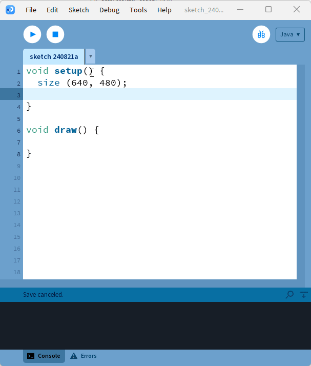

# Les classes dans Processing <!-- omit in toc -->

# Table des matières <!-- omit in toc -->
- [Introduction](#introduction)

# Les classes dans Processing

<table style="border: none;">

<tr>
<td>

- Pour créer une nouvelle classe, il faut ajouter un onglet et lui attribuer le nom de la classe
  - Flèche à droite du dernier onglet
- Par la suite, il suffit de coder comme pratiquement n’importe quelle classe

</td>
<td>

</td>
</tr>
</table>

---

- Les classes de base en Processing ont la particularité d’être des **classes internes**.
- En effet, Processing fusionne toutes les classes à l’intérieur d’une grande classe principale lors de la compilation.
- L’avantage de cette méthode est que le programme dispose de variables et constantes propres à Processing, telles que `width` et `height`.
- Il est possible de créer des classes totalement génériques en ajoutant l’extension `.java` au nom de l’onglet.
  - Cela aura comme conséquence qu’il ne sera pas possible d’accéder directement aux variables et constantes de Processing.
  - Pour pouvoir accéder aux propriétés de Processing, il faudra injecter un `PApplet` dans la classe.

---

