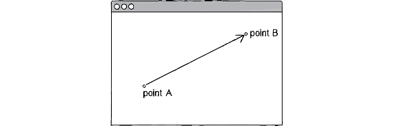
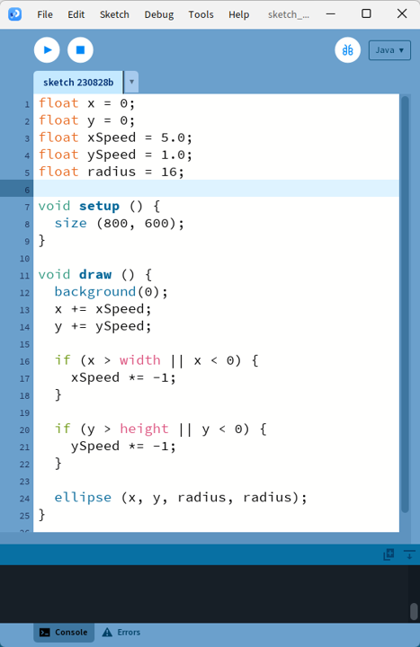

# Les vecteurs <!-- omit in toc -->

[Liste de vidéos de support](https://www.youtube.com/watch?v=mWJkvxQXIa8&list=PLRqwX-V7Uu6ZwSmtE13iJBcoI-r4y7iEc)

# Table des matières <!-- omit in toc -->
- [Vecteur : définition](#vecteur--définition)
- [Vecteur : utilité](#vecteur--utilité)
- [Vecteur : exemple de problème sans vecteurs](#vecteur--exemple-de-problème-sans-vecteurs)
  - [Simplification avec les vecteurs](#simplification-avec-les-vecteurs)
- [Vecteur : la classe PVector](#vecteur--la-classe-pvector)
  - [Vecteur : déplacement et mouvement](#vecteur--déplacement-et-mouvement)
- [Exercice 1 : Balle qui rebondit avec vecteurs](#exercice-1--balle-qui-rebondit-avec-vecteurs)
- [Opérations mathématiques avec les vecteurs](#opérations-mathématiques-avec-les-vecteurs)
  - [Addition et soustraction](#addition-et-soustraction)
  - [Multiplication et division par un scalaire](#multiplication-et-division-par-un-scalaire)
  - [Distance entre deux points](#distance-entre-deux-points)
  - [Rotation d'un vecteur](#rotation-dun-vecteur)
  - [Angle entre deux vecteurs](#angle-entre-deux-vecteurs)
  - [Applications pratiques](#applications-pratiques)
- [Références](#références)
  - [Ressources supplémentaires](#ressources-supplémentaires)

---

# Vecteur : définition
- Le terme **vecteur** peut signifier plusieurs choses dépendant du contexte.
  - En biologie : Décrit un organisme qui transmet une infection d'un hôte à un autre.
  - En programmation : Décrit une structure de tableau de données.
- **En mathématique**, un vecteur est un concept permettant de représenter une **magnitude** (longueur) et une **direction**.
- Un vecteur peut être représenté graphiquement par une flèche : la longueur indique la magnitude, l'orientation indique la direction.



# Vecteur : utilité
- Dans le monde des jeux vidéo, réalité virtuelle ou autre simulation, les vecteurs sont utilisés partout.
- **C'est une connaissance fondamentale à la programmation de jeux et d'applications multimédia.**
- C'est un bloc de construction nécessaire pour toute application ayant des implications mathématiques.
- **Exemples d'utilisation** :
  - Position d'objets dans l'espace
  - Vitesse et direction de déplacement
  - Forces physiques (gravité, vent, friction)
  - Calcul de trajectoires et de collisions

---

# Vecteur : exemple de problème sans vecteurs

- Voici du code représentant une balle qui rebondit aux limites de l'écran
- [Lien pour l'exécuter](pde://github.com/nbourre/0sw_processing_exemples/raw/master/bin/s01_no_vectors.pdez)



**Problèmes identifiés** :
- Utilisation de plusieurs variables X et Y similaires :
  - Position X et Y
  - Vitesse X et Y
- Complexité de gestion de toutes ces variables
- Imaginez maintenant que vous devez gérer l'accélération, la position d'une cible, le vent et la friction...
  - **Variables probables** : `accelX`, `accelY`, `targetX`, `targetY`, `windX`, `windY`, `frictionX`, `frictionY`
  - **En 2D** : 2 variables par concept
  - **En 3D** : 3 variables par concept → explosion du nombre de variables !

---

## Simplification avec les vecteurs

<table style="border: none;">

<tr>
<td style="width: 50%;">

**Sans vecteurs (verbeux)**
```java
float x, y, z;
float xSpeed, ySpeed, zSpeed;
float xAccel, yAccel, zAccel;
float targetX, targetY, targetZ;
```

</td>
<td style="width: 50%;">

**Avec vecteurs (concis)**
```java
PVector position;
PVector velocity;
PVector acceleration;
PVector target;
```

</td>
</tr>

<tr>
<td colspan="2">

✅ **Avantages** : Code plus lisible, moins d'erreurs, opérations mathématiques simplifiées

</td>
</tr>

</table>

---

# Vecteur : la classe PVector
- Processing offre la classe `PVector` qui représente un vecteur.
- **Propriétés principales** :
  - `x` : Composante horizontale
  - `y` : Composante verticale (⚠️ Y augmente vers le bas dans Processing)
  - `z` : Composante en profondeur (pour la 3D, optionnelle)

**Création et utilisation** :
```java
// Création d'un vecteur à la position (10, 20)
PVector position = new PVector(10, 20);

// Création d'un vecteur de vitesse
PVector vitesse = new PVector(2, -1); // 2 px/frame → droite, 1 px/frame ↑ haut

// Accès aux composantes
float x = position.x;  // Récupère la composante X
float y = position.y;  // Récupère la composante Y

// Modification des composantes
position.x = 50;
position.y = 100;
```

---

## Vecteur : déplacement et mouvement

**Concepts clés** :
- **Mouvement** = déplacement dans le temps
- **Vitesse** = vecteur représentant un déplacement par unité de temps
- **Translation** = addition de la vitesse à la position

**Formule fondamentale** :
```
nouvelle_position = ancienne_position + vitesse
```

**Rappel** :
L'addition de vecteurs se fait composante par composante, c'est-à-dire :
```
nouvelle_position.x = ancienne_position.x + vitesse.x
nouvelle_position.y = ancienne_position.y + vitesse.y
```

**Exemple complet** :
```java
// Variables globales
PVector position;
PVector vitesse;

void setup() {
  size(600, 400);
  position = new PVector(width/2, height/2);  // Centre de l'écran
  vitesse = new PVector(3, 2);                // 3 px/frame en X, 2 en Y
}

void draw() {
  background(240);
  
  // 1. Déplacement : position = position + vitesse
  position.add(vitesse);
  
  // 2. Dessiner la balle
  fill(255, 100, 100);
  ellipse(position.x, position.y, 30, 30);
  
  // 3. Rebond sur les bords
  if (position.x > width - 15 || position.x < 15) {
    vitesse.x *= -1;  // Inverse la direction X
  }
  if (position.y > height - 15 || position.y < 15) {
    vitesse.y *= -1;  // Inverse la direction Y
  }
}
```

**Comparaison sans vecteur** (beaucoup plus verbeux) :
```java
float posX = 300, posY = 200;
float vitX = 3, vitY = 2;

// Dans draw()
posX += vitX;
posY += vitY;

if (posX > width - 15 || posX < 15) vitX *= -1;
if (posY > height - 15 || posY < 15) vitY *= -1;
// + répétition pour chaque objet...
```

---

# Exercice 1 : Balle qui rebondit avec vecteurs

**Objectif** : Créer une animation de balle qui rebondit en utilisant des vecteurs.

**Instructions** :
1. Créez deux variables globales de type `PVector` :
   - `position` : pour la position de la balle
   - `vitesse` : pour la vitesse de déplacement

2. Dans `setup()` :
   - Initialisez `position` au centre de l'écran
   - Initialisez `vitesse` avec des valeurs comme (4, 3)

3. Dans `draw()` :
   - Effacez l'écran avec `background(240)`
   - Déplacez la balle avec `position.add(vitesse)`
   - Dessinez la balle à la position actuelle
   - Gérez les rebonds en inversant les composantes appropriées

**Code de base** :
```java
PVector position;
PVector vitesse;

void setup() {
  size(600, 400);
  // TODO: Initialiser position au centre
  // TODO: Initialiser vitesse (ex: 4, 3)
}

void draw() {
  background(240);
  
  // TODO: Déplacer la balle
  // TODO: Dessiner la balle (cercle de diamètre 25)
  // TODO: Gérer les rebonds sur les 4 bords
}
```

**Bonus** : 
- Ajoutez de la couleur qui change selon la direction
- Laissez une traînée en utilisant `background(240, 20)` au lieu de `background(240)`
- Ajoutez plusieurs balles avec des vitesses différentes

---

# Opérations mathématiques avec les vecteurs

## Addition et soustraction
```java
PVector a = new PVector(5, 4);
PVector b = new PVector(1, 2);

// Addition : a = a + b
a.add(b);          // a devient (6, 6)

// Soustraction : a = a - b
a.sub(b);          // a devient (5, 4)

// Sans modifier l'original
PVector resultat = PVector.add(a, b);  // a et b restent inchangés
```


https://github.com/user-attachments/assets/909774ad-a93a-4d33-8459-8265d2c59d02


## Multiplication et division par un scalaire
```java
PVector v = new PVector(2, 1);

// Multiplication par un scalaire
v.mult(3);         // v devient (6, 3) - double la magnitude
v.mult(0.5);       // v devient (3, 1.5) - divise la magnitude par 2

// Division par un scalaire
v.div(2);          // v devient (1.5, 0.75)
```

https://github.com/user-attachments/assets/708984b6-d1a7-404b-b227-afb59d83f2d6


**Utilité** : Changer la vitesse sans changer la direction.

## Distance entre deux points
```java
PVector point1 = new PVector(100, 100);
PVector point2 = new PVector(400, 300);

// Méthode 1 : fonction statique
float distance = PVector.dist(point1, point2);

// Méthode 2 : soustraction + magnitude
PVector diff = PVector.sub(point2, point1);
float distance2 = diff.mag();  // Même résultat
```

## Rotation d'un vecteur
```java
PVector v = new PVector(1, 0);
float angle = PI/2;  // 90 degrés

// Méthode 1 : utiliser rotate()
v.rotate(angle);    // v devient (0, 1)

// Méthode 2 : utiliser des formules trigonométriques
float x = v.x * cos(angle) - v.y * sin(angle);
float y = v.x * sin(angle) + v.y * cos(angle);
v.set(x, y);

```

## Angle entre deux vecteurs
```java
PVector v1 = new PVector(1, 0);
PVector v2 = new PVector(0, 1);
float angle = PVector.angleBetween(v1, v2); // Résultat : PI/2 (90°)
```

## Applications pratiques
- **Jeux de tir** : Calculer la trajectoire des projectiles
- **Animation** : Mouvements fluides et naturels
- **Intelligence artificielle** : Comportements de groupe (boids)
- **Physique** : Simulation de forces, collisions
- **Interface utilisateur** : Animations d'éléments GUI

---

# Références
- À lire pour le prochain cours
- https://natureofcode.com/book/introduction/
- https://natureofcode.com/book/chapter-1-vectors/

## Ressources supplémentaires
- [Documentation officielle PVector](https://processing.org/reference/PVector.html)
- [The Nature of Code - Vectors (vidéo)](https://www.youtube.com/watch?v=mWJkvxQXIa8)
- [The Nature of Code - Vectors (chapitre)](https://natureofcode.com/vectors/)
- [Exemples interactifs de vecteurs](https://p5js.org/examples/math-vector-math.html)
