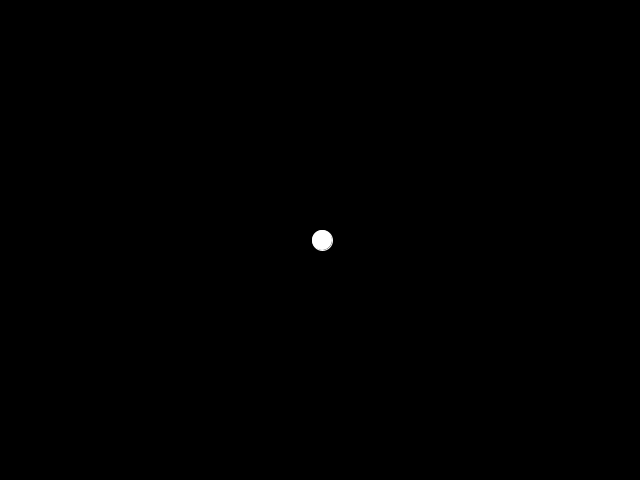

# Déplacement d'un objet avec les vecteurs


## Objectifs
- Comprendre le rôle du vecteur vitesse
- Comprendre le rôle du vecteur accélération
- Découvrir comment les forces déplacent un objet

## Astuce pour visualiser les vecteurs

Pour t'aider à mieux comprendre le mouvement, tu peux utiliser la fonction suivante pour afficher un vecteur sous forme de flèche dans Processing. Elle prend en paramètre le vecteur à afficher, la position de départ, et la couleur de la flèche.

```java
// Affiche une flèche représentant le vecteur v à partir du point (x, y)
void drawVectorArrow(PVector v, float x, float y, color arrowColor) {
  pushMatrix();
    translate(x, y);
    stroke(arrowColor);
    strokeWeight(2);
    fill(arrowColor);
    
    // Dessine la ligne principale
    line(0, 0, v.x, v.y);

    // Dessine la tête de flèche
    float arrowSize = 7;
    float angle = atan2(v.y, v.x);

    pushMatrix();
      translate(v.x, v.y);
      rotate(angle);
      triangle(0, 0, -arrowSize, arrowSize/2, -arrowSize, -arrowSize/2);
    popMatrix();
  popMatrix();
}
```

N'hésite pas à utiliser cette fonction dans tes exercices pour afficher la vitesse, l'accélération ou tout autre vecteur !
Dans ce chapitre, tu vas apprendre à utiliser les vecteurs pour déplacer un objet dans Processing. On part de la représentation d'un vecteur, puis on l'applique au mouvement.


## Structure de base

On utilise une classe abstraite `GraphicObject` pour représenter un objet graphique. Elle possède deux méthodes principales :
- `display` : affiche l'objet
- `update` : met à jour sa position

```java
abstract class GraphicObject {
  PVector location;
  PVector velocity;
  PVector acceleration;
  
  color fillColor = color (200);
  color strokeColor = color (255);
  float strokeWeight = 1;
  
  abstract void update(int deltaTime);
  
  abstract void display();
  
}
```


La classe `Mover` hérite de `GraphicObject`. On la modifiera plus tard pour gérer les forces.

```java
class Mover extends GraphicObject {
  int diameter = 20;

  Mover() {
    location = new PVector(width/2, height/2);
    velocity = new PVector(0, 0);
    acceleration = new PVector(0, 0);
  }

  Mover(float x, float y) {
    location = new PVector(x, y);
    velocity = new PVector(0, 0);
    acceleration = new PVector(0, 0);
  }

  void update(int deltaTime) {
    location.add(velocity); // Déplacement de l'objet
  }

  void display() {
    stroke(strokeColor);
    fill(fillColor);
    strokeWeight(strokeWeight);

    ellipse(location.x, location.y, diameter, diameter);
  }
```


# 1. La vitesse


La vitesse est un vecteur : elle a une direction et une grandeur (magnitude). Elle indique à quelle vitesse et dans quelle direction l'objet se déplace.

Exemple : « 20 km/h vers le nord » donne la magnitude (20 km/h) et la direction (nord).

Pour déplacer un objet, on ajoute le vecteur vitesse à sa position à chaque image :

$$ \text{position} = \text{position} + \text{vitesse} $$

```java
void update(int deltaTime) {
  location.add(velocity);
}
```


Exemple : déplacement en ligne droite

```java
Mover mover;
int currentTime = 0;
int lastTime = 0;
int deltaTime = 0;

void setup() {
  size(800, 800);
  mover = new Mover();
  mover.velocity = new PVector(2, -1);
}

void draw() {
  update();
  display();
}

void update() {
  currentTime = millis();
  deltaTime = currentTime - lastTime;
  lastTime = currentTime;
  mover.update(deltaTime);
}

void display() {
  mover.display();
}
```


Résultat :


**À retenir**
- La vitesse est un vecteur (direction + magnitude)
- Pour déplacer un objet, on ajoute la vitesse à la position

## Exercices
- Reproduisez l'exemple de cette section en modifiant la vitesse de l'objet.

## Exercices optionnels
- Modifie la vitesse de l'objet pour qu'il se déplace dans une autre direction.
- Ajoute un deuxième objet avec une vitesse différente.
- Affiche la magnitude et la direction du vecteur vitesse à l'écran.

# 2. L'accélération


L'accélération est aussi un vecteur : elle indique comment la vitesse change au fil du temps (variation de la vitesse).

Sur le graphique ci-dessous, la courbe bleue est la vitesse, la ligne verte est l'accélération à l'instant $t$.


Pour accélérer un objet, on ajoute le vecteur accélération à la vitesse :

$$ \text{vitesse} = \text{vitesse} + \text{accélération} $$

Donc, pour déplacer un objet avec accélération :

$$ \text{vitesse} = \text{vitesse} + \text{accélération} $$
$$ \text{position} = \text{position} + \text{vitesse} $$

Le code de la méthode `update` de la classe `Mover` devient donc :

```java

  void checkEdge() {
    var tempLoc = location.copy().add(velocity);
    
    if (tempLoc.x +  diameter / 2 > width || tempLoc.x - diameter / 2 < 0) {
      velocity.x *= -1;
    }
    
    if (tempLoc.y +  diameter / 2 > height || tempLoc.y - diameter / 2 < 0) {
      velocity.y *= -1;
    }
  }

  void update(long deltaTime) {
    checkEdge();
    velocity.add(acceleration); // Accélération
    location.add(velocity); // Déplacement de l'objet    
    acceleration.mult(0);    
  }
```


Remarque :
- On remet l'accélération à zéro à chaque frame pour éviter qu'elle ne s'accumule.
- La méthode `checkEdge` inverse la vitesse si l'objet touche un bord.

---


Exemple : accélération sur l'axe Y (effet de gravité)

```java
long currentTime;
long previousTime;
long deltaTime;

Mover m;

void setup () {
  size (800, 600);
  currentTime = millis();
  previousTime = millis();
  
  m = new Mover();
  m.velocity.x = 2;
  m.velocity.y = -1;
}

void draw () {
  timeManagement();
  update(deltaTime);
  display();
}

void accelerate() {
  m.acceleration.x = 0;
  m.acceleration.y = 0.5;
}

void update(long delta) {
  // Mettre les calculs ici
  accelerate();
  m.update(delta);
}

void display () {
  // Mettre le code d'affichage ici
  background(0);
  m.display();
}

void timeManagement (){
  currentTime = millis();
  deltaTime = currentTime - previousTime;
  previousTime = currentTime;
}

```

---


Résultat :


---


L'objet accélère vers le bas car l'accélération est positive sur Y : cela simule la gravité.


**À retenir**
- L'accélération est un vecteur (variation de la vitesse)
- Pour accélérer un objet, on ajoute l'accélération à la vitesse

## Exercices
- Reproduisez l'exemple de cette section en modifiant l'accélération de l'objet.
  - Inversez l'accélération sur l'axe des Y.

## Exercices optionnels
- Change la valeur de l'accélération pour simuler une gravité plus forte ou plus faible.
- Inverse l'accélération sur l'axe Y pour voir l'objet accélérer vers le haut.
- Ajoute une accélération sur l'axe X pour un mouvement diagonal.

# 3. Aller vers une cible


Pour déplacer un objet vers une destination, on utilise la soustraction de vecteurs (`PVector.sub`).

Exemple : la classe `Mover` modifiée pour viser une cible

```java
class Mover extends GraphicObject {
  
  int diameter = 20;
  PVector target;
  float topSpeed = 10;

  // -- Méthodes ajoutées --
  
  void setTarget (PVector _target) {
    target = _target;
  }
  
  void updateTarget (float x, float y) {
    if (target == null) {
      target = new PVector();
    }
    
    target.x = x;
    target.y = y;
  }
  
  void seekTarget() {
    
    var dir = PVector.sub(target, location);
    dir.normalize();
    dir.mult(0.2);
    
    acceleration = dir;
  }
  
  boolean isTargetReached() {
    if (target == null) {
      return true;
    }
    
    return PVector.dist(location, target) < 10;
  }

  // Méthode modifiée

  void update(long deltaTime) {
    checkEdge();
    
    if (target != null) {
      seekTarget();
    }
    
    velocity.add(acceleration); // Accélération
    velocity.limit(topSpeed);
    location.add(velocity); // Déplacement de l'objet
    
    acceleration.mult(0);    
    
    if (isTargetReached()) {
      target = null;
    }
  }

}
```


Exemple : déplacement vers la souris

```java
long currentTime;
long previousTime;
long deltaTime;

Mover m;

void setup () {
  size (640, 480);
  currentTime = millis();
  previousTime = millis();
  
  m = new Mover();
  m.velocity.x = 2;
  m.velocity.y = -1;
  m.setTarget(new PVector(mouseX, mouseY));
}

void draw () {
  timeManagement();
  update(deltaTime);
  display();
}

void update(long delta) {
  // Mettre les calculs ici
  m.updateTarget(mouseX, mouseY);
  m.update(delta);
}

void display () {
  // Mettre le code d'affichage ici
  background(0);
  m.display();
  
  fill (0, 200, 0);
  ellipse (mouseX, mouseY, 10, 10);
}

void timeManagement (){
  currentTime = millis();
  deltaTime = currentTime - previousTime;
  previousTime = currentTime;
}
```

---

# Synthèse

Ce chapitre t'a permis de comprendre comment utiliser les vecteurs pour déplacer un objet dans Processing :
- La vitesse détermine la direction et la rapidité du déplacement.
- L'accélération permet de faire varier la vitesse, simulant des effets comme la gravité.
- En combinant ces notions, on peut déplacer un objet vers une cible ou simuler des mouvements réalistes.

Pour aller plus loin, expérimente avec les exemples et les exercices proposés, puis consulte la référence “Nature of Code” pour approfondir la modélisation physique avec les vecteurs.

---


# Références
- [Nature of Code - Chapitre 1](https://natureofcode.com/book/chapter-1-vectors/)

---


