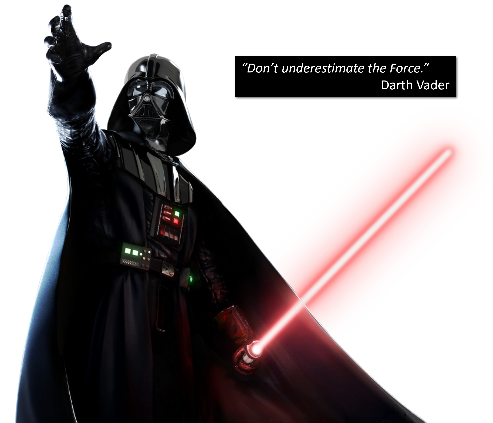
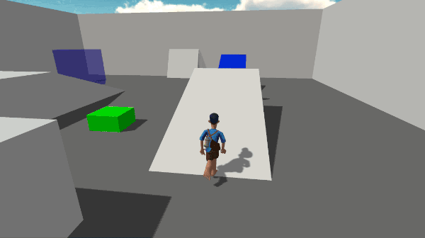
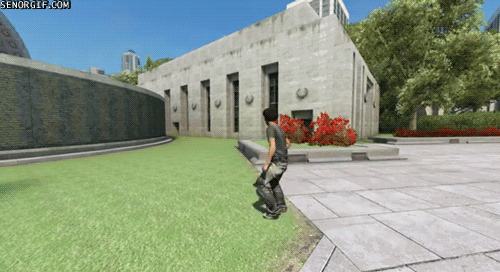
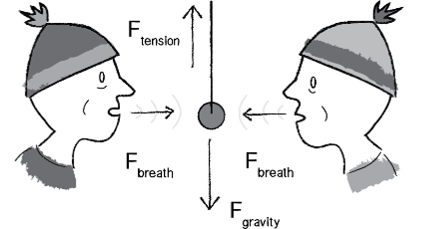
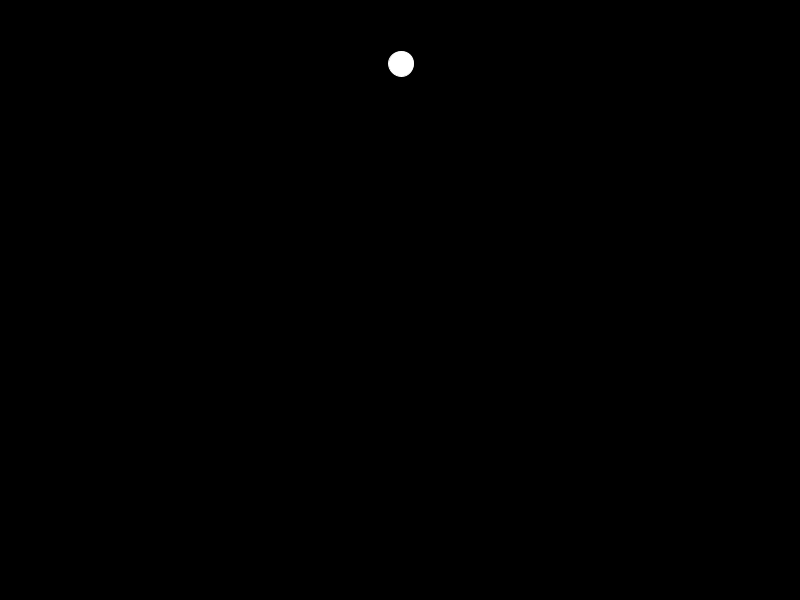
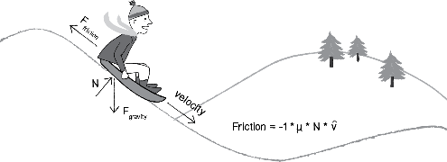

# Les forces <!-- omit in toc -->



---

# Table des matières <!-- omit in toc -->
- [Motivation](#motivation)
- [Introduction](#introduction)
  - [Clone et branchage du projet](#clone-et-branchage-du-projet)
- [Force](#force)
- [Première loi de Newton](#première-loi-de-newton)
- [Troisième loi de Newton](#troisième-loi-de-newton)
- [Deuxième loi de Newton](#deuxième-loi-de-newton)
  - [Poids vs masse](#poids-vs-masse)
  - [Exemple](#exemple)
- [Accumulation des forces](#accumulation-des-forces)
- [Travailler avec la masse](#travailler-avec-la-masse)
  - [Exercice](#exercice)
- [Autres forces](#autres-forces)
  - [Travailler avec les formules de forces](#travailler-avec-les-formules-de-forces)
  - [Friction](#friction)
  - [Résistance des fluides](#résistance-des-fluides)
- [Résumé](#résumé)
- [Exercices](#exercices)
- [Références](#références)

---

# Motivation
Pour développer des jeux, il est essentiel de comprendre comment les forces agissent sur les objets. Cela nous permet de créer des mouvements réalistes et d'interagir avec l'environnement de manière convaincante.






---

# Introduction
Dans ce chapitre, on verra comment appliquer différents types de forces à un objet ou plusieurs


## Clone et branchage du projet

Si ce n'est déjà fait, clonez le projet du cours :

```bash
git clone https://github.com/nbourre/0sw_processing_exemples
```

Créez une branche pour ce chapitre :

```bash
git checkout -b c02_forces
```

---

# Force 

- En physique, une force est une interaction qui tend à modifier la vitesse d’un objet.
  - **Lorsque la vitesse est modifiée, il y a obligatoirement une accélération.**
- Une force peut accélérer le déplacement d’un objet avec une masse.
- Une force possède une **magnitude** et une **direction**.
  - **Vecteur**!
- Ainsi, une force est un vecteur qui cause l’accélération d’un objet avec une masse.

---

# Première loi de Newton

- Un objet au repos reste au repos, un objet en déplacement reste en déplacement.
  - Plus en détail : Un objet au repos reste au repos, un objet en déplacement reste en déplacement à une vitesse et direction constantes à moins d’une force non équilibrée. Par exemple dans l’espace.
- $F = ma$ où $m$ est la masse et $a$ l’accélération.
  - Celle que tout le monde a vue au secondaire!
- La vitesse d’un objet atteindra une constante lorsqu’une force contraire annulera l’effet de la force initiale, i.e., que la somme des forces sera égale à zéro.
  - Ex : On applique une force initiale à une balle dans l’espace loin des astres, l’objet atteindra une vitesse constante.

---

- Une balle qui tombe d’un avion atteindra une vitesse terminale au moment où la résistance de l’air sera égale à la force de gravité.
- En programmation, la vélocité d’un objet va demeurer constante si elle est dans un état d’équilibre.



---

# Troisième loi de Newton

- Pour toute action, il y a une réaction égale et contraire.
  - En d’autres termes, les forces sont toujours en paire. Les deux forces sont égales mais dans une direction contraire.
  - Il faut séparer les éléments en deux systèmes distincts.
- Exemples :
  - Si je pousse un train immobile, le train ne bougera pas car une force égale va contre la mienne.
    - Il y a le système du train et le mien.
  - Si je pousse mon bureau, le bureau applique la même force sur ma main.
    - On peut le sentir car le bureau compressera ma main et le bureau se déplacera à un moment donné.
- [Autres exemples](https://www.khanacademy.org/science/physics/forces-newtons-laws/newtons-laws-of-motion/a/what-is-newtons-third-law)

---

# Deuxième loi de Newton
- C'est la loi la plus importante pour nous.
- **La force est égale à la masse multipliée par l’accélération.**
- L’accélération est directement proportionnelle à la force et inversement proportionnelle à la masse.
  - Ainsi, si vous êtes sur un chariot, le plus fort que l’on vous pousse, le plus rapide que vous vous déplacerez. Toutefois, plus lourd vous êtes, plus lentement vous vous déplacerez. <br />
  

Ainsi la formule est :
- $F = ma$

On peut la réécrite en fonction de l’accélération :
- $a = \frac{F}{m}$

C'est cette formule que l'on va utiliser pour simuler les forces.

---

## Poids vs masse

- La masse d’un objet est une mesure de la quantité de matière dans un objet qui est exprimée en kilogramme.
- Le poids, souvent mal interprété comme étant la masse, est techniquement la force de gravité sur un objet, soit le poids est la masse multipliée par la gravité, ce qui donne des **Newtons**.
- La densité ($\rho$ dit rhô) est la quantité de masse par unité de volume.
  - *On va en avoir besoin tantôt.*

---

## Exemple

- Pour simplifier la compréhension, nous allons utiliser une masse ($m$) de 1 dans les premiers exemples.
- Ainsi $F=ma$ à $F = a$.
- Disons que l’on reprend la classe `Mover` avec les propriétés `location`, `vélocité`, et `accélération`.
- La classe `Mover` est disponible dans le projet [`s02_forces_01`](https://github.com/nbourre/0sw_processing_exemples/raw/master/bin/s02_forces_01.pdez) dans les exemples Processing.
  - **Cliquez sur le lien pour télécharger et ouvrir le fichier directement.**
- Notre but est d’appliquer une force.
  - Par exemple : `mover.applyForce(wind)`
  - Ou encore : `mover.applyForce(gravity)`

Ajoutez la méthode suivante à la classe `Mover` :

```java
// Code ninja
void applyForce (PVector f) {
  acceleration = f;
}
```

Dans le fichier principal, voici la nouvelle méthode `update` ainsi qu'un vecteur vent :

```java
// Code ninja
void update(int delta) {
  PVector wind = new PVector(-0.1, 0);
  mover.applyForce(wind);
  mover.update(delta);
}
```



---

# Accumulation des forces

- Disons que l’on désire appliquer du vent et de la gravité en simultané.

```java
// Dans update
mover.applyForce(wind);
mover.applyForce(gravity);
mover.update();
mover.display();
```

- Si l’on prend cet exemple avec le code précédent, ce code est brisé car le vent sera toujours écrasé par la gravité! En effet, les paramètres sont passés par référence. N'oubliez pas que les vecteurs sont des objets.
  
- **L’accélération est égale à la somme de toutes les forces divisées par la masse**. Cette action se nomme l’accumulation des forces.

Dans la classe `Mover` :

```java
void applyForce(Pvector f) {
  acceleration.add(force);
}
```


---

Dans le point précédent, il y encore un problème.

```java
// Si l’on applique une force lorsque la souris est appuyée
if (mousePressed) {
  PVector wind = new PVector(0.5, 0);
  mover.applyForce(wind);
}
```

- Si l’on applique ce code, l’objet va toujours accélérer. Il faut remettre à zéro l’accélération à chaque appel de la méthode `update`.
- La méthode la plus simple serait de multiplier l’accélération par zéro à la fin du update

```java
void update() {
  velocity.add(acceleration);
  location.add(velocity);
  acceleration.mult(0);
}
```

# Travailler avec la masse

- L’ajout de la masse est relativement simple.
- En premier lieu, il faudra ajouter une propriété `mass` à notre objet qui sera un `float`.
  - Nous ne nous encombrerons pas des unités de mesure. Ce qui est important, c’est que celles-ci soient toutes sur la même base.
- Simplement, on pourrait modifier `applyForce` ainsi :

```java
void applyForce(PVector force) {
    force.div(mass);
    acceleration.add(force);
}
```

- Cependant, il y a un problème. Qu’arriverait-il si on appliquait le même objet `force` à deux objets distincts?

    <details><summary>Indice</summary>
    Problème au niveau du passage de paramètre
    </details>

---

- Le problème avec la question précédente est que l’on diviserait la force lors de l’application au deuxième objet.
  - N'oubliez pas que les vecteurs sont des objets.
- Ainsi, il faut créer une copie du vecteur avant de pouvoir l’additionner.

```java
void applyForce(PVector force) {
    PVector f = force.copy();
    f.div(mass);
    acceleration.add(f);
}
```

## Exercice
- Améliorez la fonction en utilisant la méthode startique `div` de la classe `PVector` au lieu de créer une copie.

---

# Autres forces

- Le vent et la gravité sont des forces qui sont simples à simuler.
- Au secondaire, nous avons vu la friction, la tension, l’élasticité, et plus.
- Dans cette partie, nous allons voir la friction et comment déconstruire une formule de force trouvée sur Wikipedia.
- La friction est une force qui est utile pour simuler la perte de vitesse d’un objet.
  - Par exemple, une balle qui roule au sol ou encore la résistance de l’air sur un objet qui est dans les airs.

---

## Travailler avec les formules de forces
- Il faut comprendre le concept derrière une force pour pouvoir la simuler.
- On déconstruit une force en deux parties
  - Comment calculons-nous la direction d’une force?
  - Comment calculons-nous la magnitude d’une force?
- Traduire la formule en code pour un vecteur.

## Friction



Voici un exemple où on trouve converti la formule de la friction en code :
- La formule de la friction est
  $\vec{F}_{\text{friction}} = -\mu N \hat{v}$

- $\mu$ tient pour le coefficient de friction.
  - Ce coefficient est déterminé par le type de matériau. Par exemple, de la glace a un coefficient faible alors que du caoutchouc a un coefficient plus élevé.
- $N$ tient pour la force normale, soit celle qui est perpendiculaire au mouvement.
- $\hat{v}$ est le vecteur unitaire de la vélocité.
- La friction est une force de dissipation, i.e., qu’elle fait perdre de l’énergie à une autre force.

Voici le code pour la friction :

```java

PVector friction = velocity.copy();
friction.normalize(); // Vecteur unitaire
friction.mult(-1); // Inverser la direction
friction.mult(mu); // mu < 1 coefficient de friction
```


---

## Résistance des fluides

$$\vec{F}_{\text{d}} = -\frac{1}{2} \rho \|v\|^2 A C_d \hat{v}$$

- Le coefficient n’est pas important ici car c’est de la simulation. Il faut retenir que c’est négatif.
- $\rho$ représente la densité du fluide.
- $\|v\|$Est la magnitude de la vitesse.
- $A$ est l’aire frontale qu’occupe l’objet. Par exemple, une Ferrari aura une aire plus petite qu’une Dodge Caravan.
- $C_d$ est le coefficient de friction du fluide (semblable à la friction).
- $\hat{v}$ est le vecteur unitaire de la vitesse.

---

- Pour nos besoins, occupons-nous que de la densité et de la surface de contact pour les scalaires
- On peut simplifier la simulation en utilisant l'équation suivante :

```java
float density = 1.229; // Densité de l'air
float vitesse = velocity.mag();
float surface = 1; // Aire frontale

PVector resistance = PVector.normalize(velocity);
resistance.mult(-0.5 * density * vitesse * vitesse * surface);
```

Ainsi en appliquant cette force lors du contact avec le "liquide", on aura l’impression que l’objet ralenti.

Attention! Ceci n'est pas la force de flottaison. Il s'agit d'une autre formule.

Voici le résultat de la résistance des fluides :


---

# Résumé

- Les forces sont cumulatives.

```java
//... autre code ...

// Code de base pour update
// adapter pour la classe
void update()  {
    velocity.add(acceleration);
    velocity.limit(maxSpeed); // Si limite de vitesse
    location.add(velocity);

    acceleration.mult(0); // On remet l'accélération à 0
}

// Fonction pour ajouter une force à l'accélération
void applyForce(PVector force) {
    var f = PVector.div(force, mass);
    acceleration.add(f);
}

//... autre code ...
```

---

# Exercices

Avec le projet inclus (s02_forces_01) avec ce cours :
- Corriger les bogues du projet.
- En utilisant les forces, simuler un ballon rempli d’hélium qui flotte vers le haut et qui rebondit lorsqu’il atteint le plafond.
  - Ajouter du vent qui change au fil du temps avec un bruit de Perlin.
- Créez une application où il y a une cinquantaine d’objets de masse différente auxquels on applique des forces identiques à l’aide de la souris.
  - Exemple : Cinquante objets auxquels on applique du vent.
- Créez une application où des objets tombent dans un liquide quelconque et dont l’on peut constater le ralentissement.
- Défi! Simuler un objet qui a un parachute qui ouvre.
  - [Lien vers la formule de la Nasa](https://www.grc.nasa.gov/WWW/k-12/VirtualAero/BottleRocket/airplane/rktvrecv.html)

---

# Références

- [http://natureofcode.com/book/chapter-2-forces/](http://natureofcode.com/book/chapter-2-forces/)
