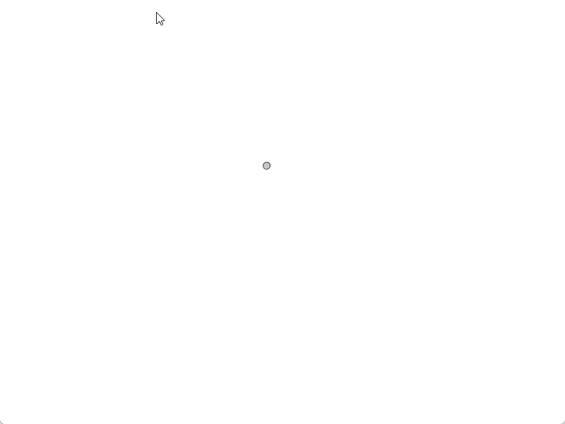

# Systèmes de Particules <!-- omit in toc -->

# Table des matières <!-- omit in toc -->
- [Introduction](#introduction)
- [Histoire et Concept](#histoire-et-concept)
  - [Exemple de Code en Processing](#exemple-de-code-en-processing)
- [Principe de fonctionnement](#principe-de-fonctionnement)
- [Particule unique](#particule-unique)
  - [Durée de vie et disparition de la particule](#durée-de-vie-et-disparition-de-la-particule)
  - [Performance](#performance)
- [Tableau de particules](#tableau-de-particules)
  - [Génération séquentielle de particules](#génération-séquentielle-de-particules)
- [L'émetteur de particules](#lémetteur-de-particules)
- [Conclusion](#conclusion)
- [Exercice](#exercice)
- [Références](#références)


---

# Introduction

Les systèmes de particules sont une technique largement utilisée en informatique graphique pour simuler des phénomènes naturels tels que le feu, la fumée, les cascades, et bien plus encore.

# Histoire et Concept

Le concept de système de particules a été introduit par William T. Reeves en 1982, lors de son travail sur le film *Star Trek II: The Wrath of Khan*. Pour créer l'effet de la "Genesis Device", une technique a été développée où de nombreux petits éléments, ou particules, interagissent pour former un effet visuel complexe, comme une onde de feu qui se propage.

> "Un système de particules est une collection de nombreuses petites particules qui, ensemble, représentent un objet flou."  
> — William Reeves, *ACM Transactions on Graphics*, 1983

---

 Pourquoi avons-nous besoin des systèmes de particules ?

Les systèmes de particules permettent de modéliser des phénomènes complexes en utilisant un grand nombre de petits objets simples. Ils sont essentiels pour simuler des systèmes où de nombreux éléments interagissent, tels que des explosions, des nuages de fumée, ou même des foules de personnes.

- **Flexibilité** : Les systèmes de particules permettent de gérer des quantités variables d'éléments, parfois zéro, parfois des milliers.
- **Approche orientée objet** : Au lieu de gérer chaque particule individuellement, nous pouvons créer une classe qui gère l'ensemble du système, facilitant ainsi la gestion et l'extension du code.

---

## Exemple de Code en Processing

Voici un exemple simple de mise en place d'un système de particules en Processing :

```java
ParticleSystem ps;

void setup() {
  size(640, 360);
  ps = new ParticleSystem(new PVector(width/2, height - 16));
}

void draw() {
  background(255);
  ps.run();
}
```

Dans cet exemple, un système de particules est créé et géré dans la fonction draw(), où il est continuellement mis à jour et affiché. La classe ParticleSystem gère la création, la mise à jour et l'affichage de chaque particule individuelle.

---

# Principe de fonctionnement
Un système de particules se compose de trois éléments principaux :

1. **Les Particules** : Ce sont les unités de base qui composent le système. Elles sont souvent représentées par des formes simples (cercles, carrés).
2. **L'Émetteur** : C'est l'origine des particules, souvent un point ou une zone d'où les particules sont émises.
3. **Le Gestionnaire** : Il gère la création, l'actualisation, et la destruction des particules au fil du temps.

---

# Particule unique
Avant d'élaborer un système de particules, il est important de comprendre comment une particule individuelle fonctionne. Une particule peut avoir les propriétés suivantes :

- **Position** : La position de la particule dans l'espace.
- **Vitesse** : La vitesse à laquelle la particule se déplace.
- **Accélération** : La variation de la vitesse de la particule.
- **Durée de vie** : La durée pendant laquelle la particule est visible.
- **Apparence** : La couleur, la taille, la forme de la particule.
- **Mise à jour** : La façon dont la particule est mise à jour à chaque image.
- **Affichage** : La façon dont la particule est affichée à l'écran.

---
Voici la classe de base pour une particule en Processing sans la durée de vie ni l'apparence :

```java
class Particle {
  PVector position;
  PVector velocity;
  PVector acceleration;

  Particle() {
    position = new PVector(width/2, height/3);
    velocity = new PVector(random(-1, 1), random(-2, 0));
    acceleration = new PVector(0, 0.05);
  }

  Particle(PVector l) {
    position = l.get();
    velocity = new PVector(random(-1, 1), random(-2, 0));
    acceleration = new PVector(0, 0.05);
  }

  void update() {
    velocity.add(acceleration);
    position.add(velocity);
  }

  void display() {
    stroke(0);
    fill(175);
    ellipse(position.x, position.y, 10, 10);
  }
}
```

Voici un exemple de code qui crée une particule et la met à jour et l'affiche à chaque image :

```java
int currentTime;
int previousTime;
int deltaTime;

Particle p;

void setup() {
  size (800, 600);
  p = new Particle();
  background(255);
}

void draw() {
  currentTime = millis();
  deltaTime = currentTime - previousTime;
  previousTime = currentTime;

  update(deltaTime);
  display();
}

void update(int deltaTime) {
  if (p.position.y > height) {
    p.position = new PVector(width/2, height/3);
    p.velocity = new PVector(random(-1, 1), random(-2, 0));
  }
  p.update();
}

void display() {
  p.display();
}
```


---

## Durée de vie et disparition de la particule

Le résultat physique de la particule fonctionne. Maintenant attaquons-nous à l'effet de disparition de la particule.

Dans cette partie, nous allons ajouter une durée de vie à la particule (`lifespan`). Lorsque la durée de vie de la particule est écoulée, elle disparaîtra.

Nous allons conjuguer la durée de vie avec la couche alpha de la particule pour créer un effet de disparition progressif.

```java
class Particle {
  PVector position;
  PVector velocity;
  PVector acceleration;
  float lifespan;

  Particle() {
    position = new PVector(width/2, height/3);
    initialize();
  }

  Particle(PVector l) {
    position = l.copy();
    initialize();
  }
  
  void initialize() {
    velocity = new PVector(random(-1, 1), random(-2, 0));
    acceleration = new PVector(0, 0.05);
    lifespan = 255;
  }

  void update() {
    velocity.add(acceleration);
    position.add(velocity);
    lifespan -= 2.0;
    
    if(isDead()) {
      reset();
    }
  }

  void display() {
    stroke(0, lifespan);
    fill(175, lifespan);
    ellipse(position.x, position.y, 10, 10);
  }
  
  boolean isDead() {
    return lifespan < 0.0;
  }
  
  void reset() {
    position.set (width/2,  height/3);
    velocity.set (random(-1, 1), random(-2, 0));    
    lifespan = 255;
  }
}
```
Voici le résultat.



## Performance

Remarquez qu'au lieu de recréer une nouvelle particule à chaque fois qu'elle meurt, nous réinitialisons simplement la particule existante. Cela permet d'économiser des ressources et d'améliorer les performances.

Dans le monde du jeux vidéo, où des milliers de particules peuvent être générées à chaque image, il est essentiel d'optimiser les performances pour garantir un rendu fluide.

---

# Tableau de particules

Maintenant que nous avons une particule fonctionnelle, nous pouvons créer un tableau de particules pour gérer plusieurs particules à la fois.

```java
ArrayList<Particle> particles;

void setup() {
  // ...

  // Ajoute 100 particules à la liste
  for (int i = 0; i < 100; i++) {
    particles.add(new Particle());
  }
}

// ...

void update(int deltaTime) {
  for (Particle p : particles) {
    p.update(deltaTime);
  }
}

void display() {
  background(255);
  for (Particle p : particles) {
    p.display();
  }
}

```


On dirait un générateur de particules de Wish... En effet, les particules apparaitront toutes en même temps.

---

## Génération séquentielle de particules
Dans le code précédent, le problème est que toutes les particules sont créées en même temps, ce qui donne un effet peu réaliste. Pour simuler un système de particules plus naturel, nous devons émettre les particules progressivement.

---

Voici un exemple de code qui émet progressivement des particules :

```java
int currentTime;
int previousTime;
int deltaTime;

ArrayList<Particle> particles;

int particleRate = 100;
int lastParticleTime;

void setup() {
  size (800, 600);
  particles = new ArrayList<Particle>();
  background(255);
}

void draw() {
  currentTime = millis();
  deltaTime = currentTime - previousTime;
  previousTime = currentTime;

  update(deltaTime);
  display();
}

void update(int deltaTime) {
  if (currentTime - lastParticleTime > particleRate) {
    lastParticleTime = currentTime;
    particles.add(new Particle());
  }

  for (Particle p : particles) {
    p.update(deltaTime);
  }
}

void display() {
  background(255);
  for (Particle p : particles) {
    p.display();
  }
}
```


Le résultat est beaucoup mieux que le précédent, mais il y a encore un problème de performance. Pouvez-vous l'identifier?

<details><summary>Réponse</summary>
Plus le temps avance, plus il y a de particules qui sont générées.
</details>

---

En effet, plus le temps avance, plus il y a de particules qui sont générées. Cela peut entraîner une baisse des performances si le nombre de particules devient trop important.

Pour résoudre ce problème, nous pouvons réutiliser les particules qui ne sont plus visibles à l'écran ou encore maximiser le nombre de particules à l'écran.

Voic la petite modification qui nous permet de limiter le nombre de particules à 100 :

```java
int maxParticles = 100;

// ...

void update(int deltaTime) {
  if (currentTime - lastParticleTime > particleRate && particles.size() < maxParticles) {
    lastParticleTime = currentTime;
    particles.add(new Particle());
  }

  for (Particle p : particles) {
    p.update(deltaTime);
  }
}
```

---

# L'émetteur de particules
Nous avons maintenant un système de particules qui génère des particules. Nous allons maintenant modifier le code pour ajouter un émetteur de particules qui émet des particules à partir d'une position donnée.

Il faudra créer une classe `Emitter` qui gère la génération de particules à partir d'une position donnée.

```java
class Emitter {
  PVector position;
  int particleRate;
  int lastParticleTime;
  ArrayList<Particle> particles;

  Emitter(PVector l, int rate) {
    position = l.copy();
    particleRate = rate;
    lastParticleTime = 0;
    particles = new ArrayList<Particle>();
  }

  void update(int deltaTime) {
    if (millis() - lastParticleTime > particleRate && particles.size() < maxParticles) {
      lastParticleTime = millis();
      particles.add(new Particle(position));
    }

    for (Particle p : particles) {
      p.update(deltaTime);
    }
  }

  void display() {
    for (Particle p : particles) {
      p.display();
    }
  }
}
```

Le code principal sera modifié pour inclure un émetteur de particules :

```java
int currentTime;
int deltaTime;
int previousTime;

Emitter emitter;

void setup() {
  size(800, 600);
  emitter = new Emitter (new PVector( width / 2, height / 3), 10, 100);
}

void draw() {
  currentTime = millis();
  deltaTime = currentTime - previousTime;
  previousTime = currentTime;
  
  update(deltaTime);
  display();
}

void update(int deltaTime) {
  emitter.update(deltaTime);
}

void display() {
  background(255);
  
  emitter.display();
}
```

---

# Conclusion

Les systèmes de particules sont un outil puissant pour simuler des phénomènes naturels et créer des effets visuels complexes. En comprenant les principes de base des particules individuelles, des tableaux de particules et des émetteurs de particules, vous pouvez créer une grande variété d'effets visuels, des explosions aux feux d'artifice en passant par les nuages de fumée.

---

# Exercice


Explorez l'exemple du cours [`s03e_smoke`](https://github.com/nbourre/0sw_processing_exemples/raw/master/bin/s03e_smoke.pdez).
- Vous pouvez modifier le `blendMode` pour obtenir des effets différents.
- Lisez la documentation de la fonction `blendMode()` pour comprendre comment elle fonctionne.

---

# Références
- [The Nature of Code - Chapter 4 : Particle Systems](https://natureofcode.com/particles/)