# Premier pas avec Godot <!-- omit in toc -->

Apprendre les rudiments de l’environnement de développement Godot. 

---

# Table des matières <!-- omit in toc -->
- [Plan de leçon](#plan-de-leçon)
- [Notes préliminaires](#notes-préliminaires)
- [Gestionnaire de projets](#gestionnaire-de-projets)
- [Création d’un nouveau projet](#création-dun-nouveau-projet)
- [L’environnement de travail](#lenvironnement-de-travail)
  - [Système de fichiers](#système-de-fichiers)
  - [Volet Scène](#volet-scène)
  - [Volet Inspector](#volet-inspector)
  - [La zone de travail (workspace)](#la-zone-de-travail-workspace)
  - [Volet inférieur](#volet-inférieur)
  - [Les types d’environnement de travail](#les-types-denvironnement-de-travail)
- [Scènes et nœuds](#scènes-et-nœuds)
  - [Les nœuds](#les-nœuds)
  - [Les scènes](#les-scènes)
- [Exercice : Bonjour le monde](#exercice--bonjour-le-monde)
  - [Ajout d’un nœud Label](#ajout-dun-nœud-label)
  - [Exécution de la scène](#exécution-de-la-scène)
  - [Configurer le projet](#configurer-le-projet)
- [Script](#script)
  - [Introduction](#introduction)
  - [Objectifs](#objectifs)
  - [Monter la scène](#monter-la-scène)
  - [Signification des éléments d'ajustement](#signification-des-éléments-dajustement)
  - [Ajouter un script](#ajouter-un-script)
  - [Le script](#le-script)
  - [Signal et GetNode](#signal-et-getnode)
  - [Exécution du script](#exécution-du-script)
- [`GetNode()`](#getnode)
- [Autres informations sur le script](#autres-informations-sur-le-script)
- [Les fonctions de rappel](#les-fonctions-de-rappel)
- [\_Process(float delta)](#_processfloat-delta)
- [\_PhysicsProcess(float delta)](#_physicsprocessfloat-delta)
- [Comparaison entre \_Process et \_PhysicsProcess](#comparaison-entre-_process-et-_physicsprocess)
- [Les groupes](#les-groupes)
- [Les méthodes surchargeables](#les-méthodes-surchargeables)
- [Créer et détruire un nœud](#créer-et-détruire-un-nœud)
- [Exercice](#exercice)
- [Les signaux](#les-signaux)
- [Les signaux : Exercice](#les-signaux--exercice)
- [Les signaux : Exercice (suite)](#les-signaux--exercice-suite)
- [Les signaux en code](#les-signaux-en-code)
  - [Exercice](#exercice-1)
  - [Signaux personnalisés](#signaux-personnalisés)
- [Instanciation](#instanciation)
  - [Exercice : Instanciation](#exercice--instanciation)
    - [Objectifs de l'exercice](#objectifs-de-lexercice)
  - [Exercice : Instanciation simple](#exercice--instanciation-simple)
    - [Étapes :](#étapes-)
  - [Exercice : Instanciation multiple](#exercice--instanciation-multiple)
  - [Exercice : Modification des instances](#exercice--modification-des-instances)
- [Conception de jeux avec des scènes](#conception-de-jeux-avec-des-scènes)
  - [Exemple de structure de jeu](#exemple-de-structure-de-jeu)
  - [](#)
- [Conclusion : Premiers pas avec Godot](#conclusion--premiers-pas-avec-godot)
- [Note importante](#note-importante)
  - [Attention :](#attention-)
  - [Exercice](#exercice-2)


---

# Plan de leçon

- Notes préliminaires
- Gestionnaire de projets
- L’environnement de travail

---

# Notes préliminaires

- Godot est un moteur de jeux vidéo 2D et 3D à code source ouvert.
- Le langage de base est le `GDScript` qui est un pseudo-python mais pour alléger la charge cognitive nous allons utiliser le langage C# pour les premiers cours.
- J’utiliserai l’interface en anglais pour faciliter la recherche de ressources.
- Vous pouvez utiliser la langue qui vous convient.
- Au moment de réviser ces notes j’utilisais la version 4.3 avec C# Mono.
- Je vous invite à regarder les séries de vidéos suivantes :
  - [Mes vidéos](https://youtu.be/D89lwa1TZ5c?si=Lb6ZWMvspNOkuoea) sur Godot (Attention! Certaines datent de l’ancienne version)

---

# Gestionnaire de projets

- Premier démarrage : le gestionnaire de projets est vide.

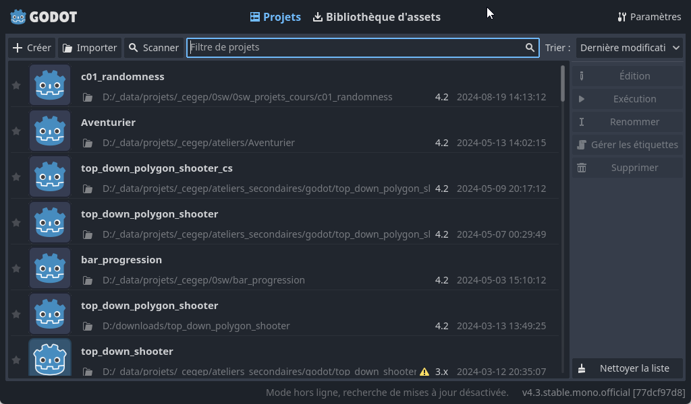

- C’est l’endroit où l’on retrouve nos projets récents.
- Dans cette fenêtre, on peut :
  - Créer un nouveau projet
  - Rechercher des projets dans un dossier (Scan)
  - Importer un projet
  - Effectuer d’autres opérations sur des projets
- Pour modifier la langue, il suffit de cliquer sur le bouton dans le coin supérieur droit avec une icône de globe.

---

# Création d’un nouveau projet

- Pour créer un nouveau projet, il faut le placer dans un dossier vide.
  - Je suggère de regrouper vos projets au même endroit, il y a un bouton pour créer le dossier du projet.
- Godot s’occupera de la création des différents fichiers nécessaires pour le projet.
- **Note :** J’utiliserai un seul dépôt pour mes projets Godot. Vous pouvez y accéder [ici](https://github.com/nbourre/0sw_projets_cours).

---

# L’environnement de travail

- L’environnement de travail de Godot peut sembler intimidant au début, mais si vous avez de l’expérience avec Visual Studio ou un autre environnement similaire, celui-ci s’y ressemble.
- À l’instar de VS, l’interface est très modulable; ainsi, on peut déplacer les panneaux aux endroits qui nous conviennent.

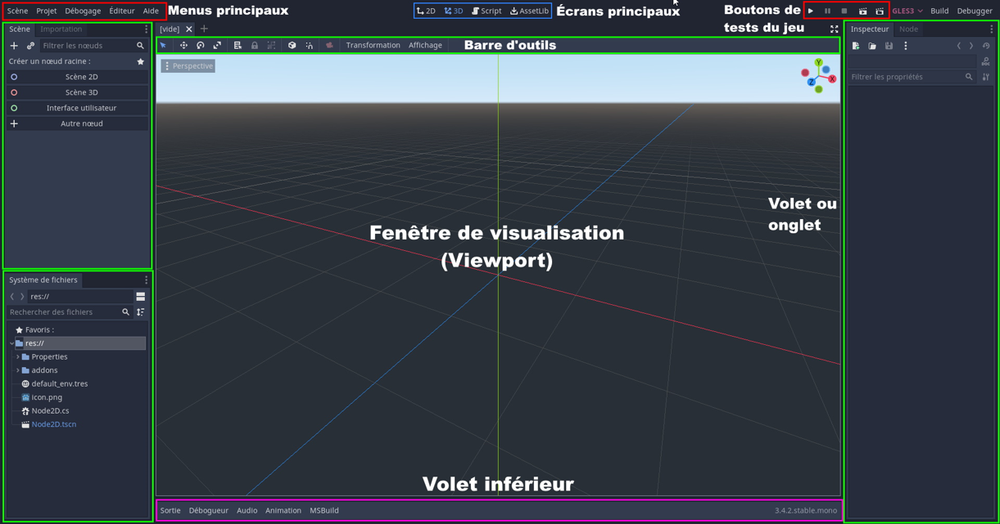

---

## Système de fichiers

- La barre de menus contient le menu principal, les workspaces, et les boutons de test.
- Le volet `FileSystem` contient la structure du dossier du projet.
- On y retrouve aussi les ressources (assets) :
  - Images, sons, etc.

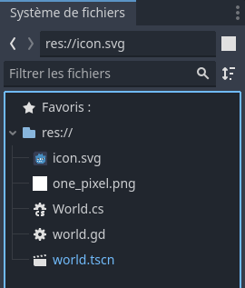

---

## Volet Scène

- Le volet "Scene" permet d’effectuer la gestion des scènes dans le projet.

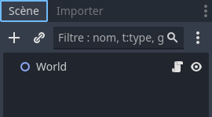

---

## Volet Inspector

- Il y a aussi le concept de nœud que l’on verra sous peu.
- Le volet `Inspector` permet de gérer les propriétés de la scène active.

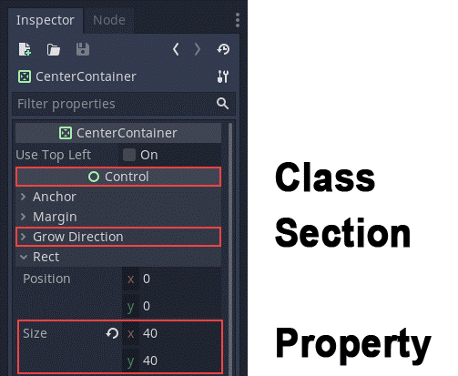

---

## La zone de travail (workspace)

- Lorsque l’on sélectionne une zone de travail, la barre d’outils s’adapte selon le contexte.
- La barre d’outils se retrouve dans la partie supérieure de la zone de travail.

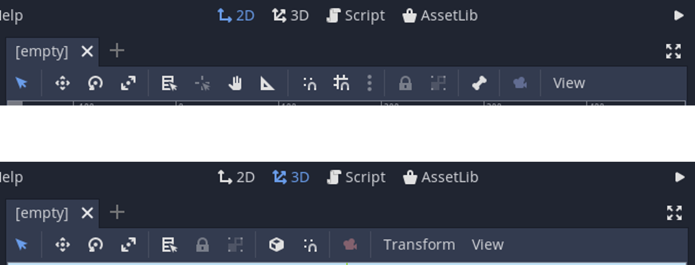

---

## Volet inférieur

- Comme plusieurs IDE, le volet inférieur contient plusieurs outils de débogage ainsi que d’édition d’animations.

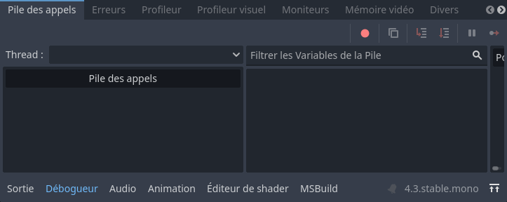

---

## Les types d’environnement de travail

- Dans la partie supérieure de la fenêtre de Godot, il y a quatre boutons qui permettent de changer l’environnement de travail.
- Il y a quatre environnements de travail (workspaces) :
  - 2D, 3D, Script et AssetLib
- L’environnement **2D** sert principalement pour le… 2D et les interfaces.
- L’environnement **3D** sert à travailler avec les meshes, l’éclairage, et le design de niveau pour les jeux 3D.
- L’environnement **Script** est un éditeur de code complet avec un débogueur.
- L’environnement **AssetLib** est une librairie de ressources telles que des scripts, des images, des add-ons, etc.

---

# Scènes et nœuds

- [Documentation officielle](https://docs.godotengine.org/en/stable/getting_started/step_by_step/scenes_and_nodes.html)
- Ma vidéo [Débuter avec Godot 4](https://www.youtube.com/watch?v=D89lwa1TZ5c)
- Godot fonctionne sous le concept de **scènes** et **nœuds**.

---

## Les nœuds

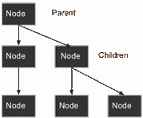

- Les nœuds sont les ingrédients de base pour créer un jeu.
- Chaque nœud a une fonctionnalité spécialisée.
- Chaque nœud possède les attributs suivants :
  - Il a un nom
  - Il a des propriétés modifiables
  - Il peut recevoir des fonctions de rappel (`callback`) pour traiter chaque *frame*
  - Il peut être étendu pour avoir plus de fonctionnalités
  - Il peut être ajouté à un autre nœud en tant qu’enfant
    - Cela crée un graphe.
- Ne vous inquiétez pas si vous n’avez pas tout compris, on revient sur le sujet plus tard.


---

## Les scènes


- Une scène est composée d’un groupe de nœuds organisés de façon hiérarchique.
- Une scène :
  - A toujours un nœud racine
  - Peut être sauvegardée et chargée
  - Peut être instanciée (comme un objet)
- Exécuter un jeu revient à exécuter une scène.
- Un projet peut contenir plusieurs scènes, mais un jeu pour démarrer doit avoir une scène principale.


---

# Exercice : Bonjour le monde

## Ajout d’un nœud Label
- Comme tout bon premier exemple, nous allons créer un projet `Bonjour le monde`.
- Nous allons ajouter un nœud `Label` via le bouton "+" dans le coin supérieur gauche du volet Scene.
- Le bouton "Other node" revient à la même action.
- Une fenêtre apparaîtra dans laquelle on pourra rechercher le nœud désiré.
- Effectuez la recherche "Label".
- Appuyez sur `Create`.

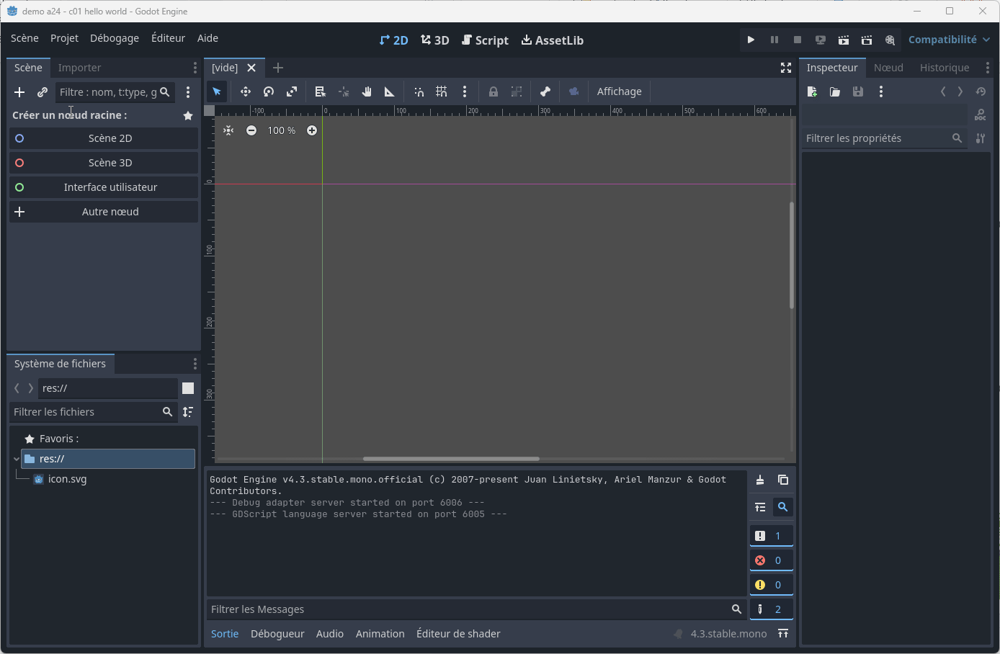

---

- Plusieurs choses se passent après avoir cliqué sur `Create` :
  - Premièrement, la scène se met en 2D car un `Label` est un nœud de type 2D.
  - Deuxièmement, l’étiquette apparaît sélectionnée dans la scène dans le coin supérieur gauche du *viewport*.
- La seconde étape sera de changer le texte dans le volet `Inspector`.
- Modifiez la propriété `Text` pour "Bonjour le monde!".

---

## Exécution de la scène

- Exécutez le code en cliquant sur le bouton Exécuter la scène dans le coin supérieur droit ou [F6].
- La première fois, Godot demandera à sauvegarder la scène.
- Donnez un nom significatif comme "bonjour".
- L’endroit de sauvegarde sera le dossier "res://" qui est le dossier des ressources.
- Si tout va bien, une fenêtre s’affichera avec le texte de l’étiquette.

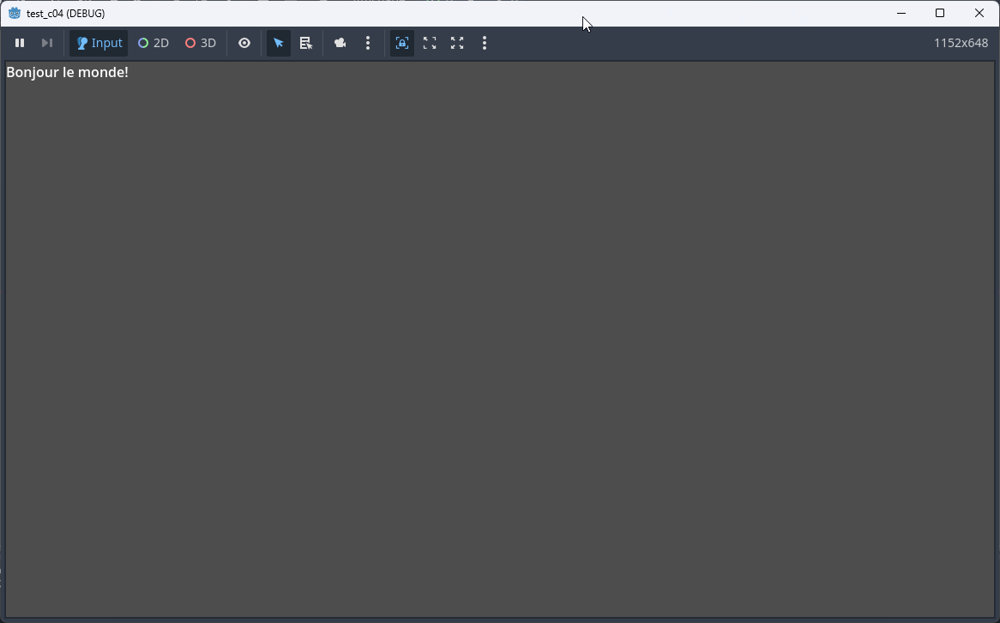

---

## Configurer le projet

- Comme indiqué plus tôt, un projet peut avoir plusieurs scènes.
- Il faut configurer le projet pour sélectionner la scène principale.
- Pour configurer le projet, il suffit d’aller dans le menu "Project --> Project settings".
- Configurons le projet pour exécuter la scène principale :
  - Dans le volet de gauche sous la catégorie `Application` sous `Run`
  - Changer la propriété `Main Scene` pour récupérer la scène de "Bonjour le monde".
  - Une fois modifié, lorsque l’on exécutera le jeu avec [F5], la scène principale sera lancée.

---

# Script

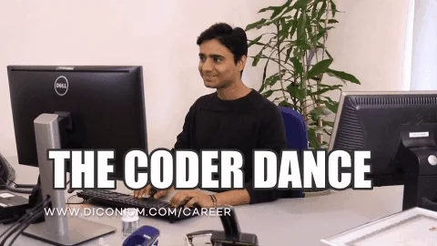

---

## Introduction

- Dans cette partie, nous allons faire un projet dans lequel un bouton changera le texte d’une étiquette à l’aide du code.
- Sans extension, Godot accepte 2 langages :
  - GDScript : Langage natif de Godot ressemblant à Python. C’est le favori de ceux qui apprennent à programmer. Il est utilisé dans la plupart des tutoriels.
  - C# : Langage favori des programmeurs et des gros projets. Ce sera le langage utilisé dans le cours pour faciliter l’apprentissage.
- On peut utiliser plusieurs langages dans un même projet.
- Lien vers la [documentation officielle](https://docs.godotengine.org/en/stable/getting_started/step_by_step/scripting_languages.html)

---

## Objectifs

- On verra les éléments suivants :
  - Attacher un script à un nœud
  - Accrocher un élément graphique (UI) via un signal (événement)
  - Écrire un script qui accède à d’autres nœuds dans la scène
- Il est suggéré de survoler les références de GDScript.

---

## Monter la scène

<table>
  <tr>
    <td>
    
- Avec le projet "Hello World"
- Ajoutez les nœuds suivants dans la même hiérarchie :
  - Panel
    - Label
    - Button
- Vous pouvez mettre un nœud à la racine de la scène en cliquant avec le bouton de droite.
- Positionnez les contrôles pour obtenir ce qui est affiché ci-contre.
- La propriété `Size` dans la section `Transform` de `Panel` permet de redimensionner le panneau.

    </td>
    <td>

    
    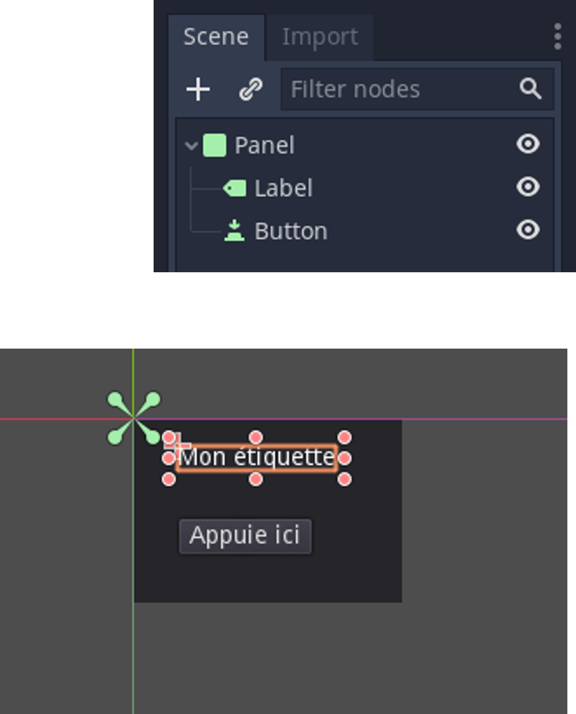
    

    </td>
  </tr>
</table>

---

## Signification des éléments d'ajustement

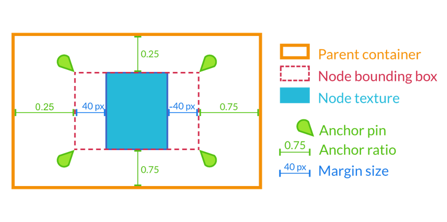

---

## Ajouter un script

- Dans le volet `Scene`, cliquez avec le bouton droit sur le nœud Panel et sélectionnez `Attach Script`.
- La boîte de dialogue pour la création de script s’affichera.
- On peut y régler entre autres :
  - Le langage de programmation
  - Le nom du fichier
- Sélectionnez le langage `C#`.
- Dans `Path`, donnez un nom significatif au script. Exemple : `TestPanel.cs`.
- Cliquez sur `Create`.
- L’éditeur de script s’ouvrira.
- Un bouton apparaîtra à côté du Panel. En cliquant dessus, on ouvre le script attaché.

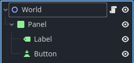

---

## Le script

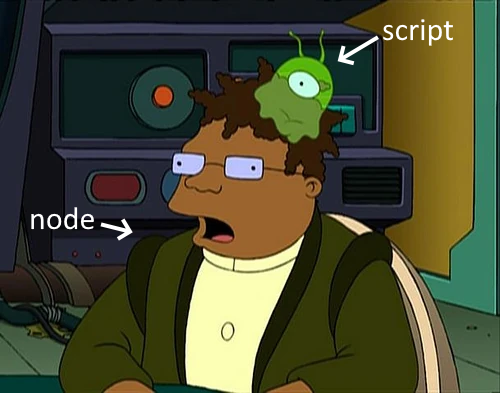

- La méthode `_Ready` est générée automatiquement.
- Celle-ci s’exécute une fois que tous les enfants entrent en activité dans la scène.
- Le rôle du script est d’ajouter des comportements à un nœud.

---

- Ajoutez la méthode suivante : 

```csharp
public void OnButtonPressed()
{
    Label label = GetNode<Label>("Label");
    label.Text = "Bonjour!";
}
```

- Modifiez la méthode `_Ready` pour qu’elle ressemble à ceci :

```csharp
public override void _Ready()
{
    Button button = GetNode<Button>("Button");

    // Ajoute un événement au bouton
    btn.Pressed += OnButtonPressed;

    // Méthode alternative qui donne plus de contrôle
    // button.Connect(Button.SignalName.Pressed, Callable.From(OnButtonPressed), (uint)GodotObject.ConnectFlags.Persist);
}
```

Dans `_Ready`, on retrouve :
- la méthode `GetNode<T>(nomNoeud)` qui permet de retrouver le nœud relatif au nœud possédant le script.
- on associe la méthode `OnButtonPressed` à l’événement `Pressed` du bouton.

---

## Signal et GetNode

- Godot utilise le terme **`signal`** qui est un synonyme d’événement.
- La convention Godot pour le nom des méthodes de signaux est celle-ci : On *[NomNoeud]* *[NomSignal]*.
  - Dans notre cas : OnButtonPressed.
- Pour attacher un signal à un événement, il suffit d’ajouter la méthode à l’événement.
- La méthode GetNode<T>(nomNoeud) permet de retrouver le nœud relatif au nœud possédant le script.

---

## Exécution du script

- Vous pouvez exécuter la scène pour tester le script.

---

# `GetNode()`

- La méthode `GetNode()` est fréquemment utilisée pour retrouver un nœud.
- Le chemin donné en paramètre est une string relative au nœud possédant le script.
- Assumons que le nœud courant est `Character` et le graphe suivant :
  - /root
  - /root/Character
  - /root/Character/Sword
  - /root/Character/Backpack/Dagger
  - /root/MyGame
  - /root/Swamp/Alligator
  - /root/Swamp/Mosquito
  - /root/Swamp/Goblin
- Des chemins possibles sont :
  - GetNode("Sword")
  - GetNode("Backpack/Dagger")
  - GetNode("../Swamp/Alligator")
  - GetNode("/root/MyGame")

---

# Autres informations sur le script

- Remarquez que le script précédent hérite du nœud.
  - Par exemple : `public class XYZ : Panel`.
- N’oubliez pas que c’est du C#, ainsi les propriétés du nœud sont directement accessibles dans le code.
  - Par exemple, la propriété `Text` sera accessible pour un nœud de type `Label`.
- Il est possible d’utiliser Visual Studio Code pour éditer le code et avoir l’auto-complétion.
- Veuillez consulter ce lien : [How to Use Visual Studio and vs Code with Godot 4](https://www.youtube.com/watch?v=OtfxxY4AeVQ).

---

# Les fonctions de rappel

- Godot fonctionne beaucoup avec des *callbacks* (fonctions de rappel) ou des fonctions virtuelles.
  - Cela évite de créer plusieurs `if` qui sont vérifiés à chaque fois dans une boucle.
- Toutefois, on peut quand même utiliser des fonctions de traitements continues comme les boucles de jeux classiques.
- Godot offre `_Process(float delta)` et `_PhysicsProcess()`.

---

# \_Process(float delta)

- La méthode `_Process` est appelée à chaque début de frame.
- Elle n’est pas synchronisée à aucune fréquence.
- Elle est donc exécutée à un interval de temps variable.
- Pour gérer la variabilité, le paramètre delta contient le temps défilé depuis le dernier appel de la fonction.
- Voir le projet `c01d_process`.
- `delta` peut être utilisé pour calculer des variations constantes, cela indépendamment du taux de rafraîchissement.
- Il s’agit d’une valeur en fraction de seconde, par exemple 0.016s.
- Par exemple, le mouvement d’une balle doit aller à 60px/sec, peu importe la puissance de la machine.
- Il suffit de multiplier la vitesse par le delta.
  - Ex : `vitesse.x = 60 * delta;`.

---

# \_PhysicsProcess(float delta)

- Similaire à `_Process`, cette méthode diffère car elle est synchronisée au FPS par défaut, qui est de 60 FPS.
- Elle est dépendante du FPS de l’application.
- Cependant, sur un appareil plus lent (ex. RasPi), les attentes pourraient être imprévisibles.
- Il est possible de configurer le taux de rafraîchissement dans les réglages du projet sous "Physics -> Common -> Physics FPS".
- Elle est exécutée après chaque exécution de la _process.

---

# Comparaison entre _Process et _PhysicsProcess

Voici une animation pour comparer les deux méthodes ainsi qu'une version avec delta. :

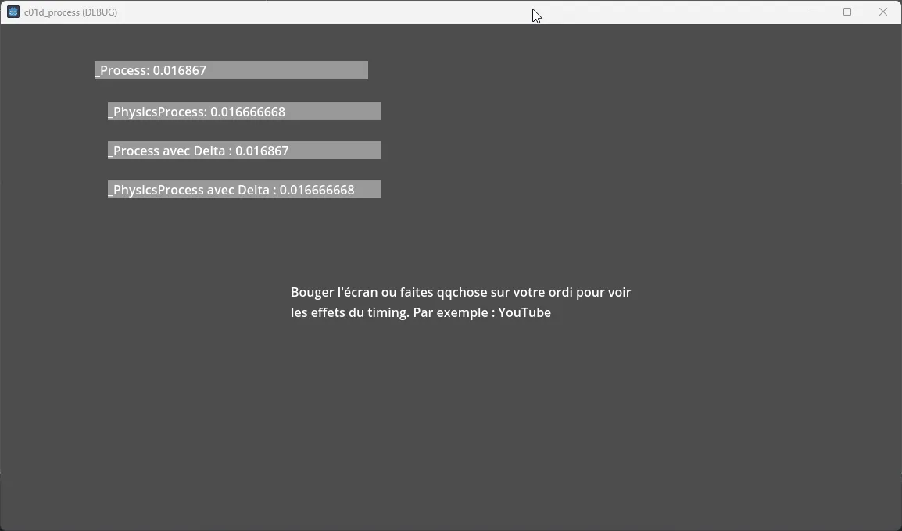

---

# Les groupes

- On se rappelle que Godot fonctionne avec un système de graphe (arbre hiérarchique).
- Il est possible d’associer les nœuds à des groupes pour exécuter des instructions à l’ensemble du groupe.
- Il faut faire appel à la méthode `AddToGroup(nomGroupe)`.
  - Exemple de cas :
    - Indiquer à un groupe d’ennemis d’atteindre un point donné sur la carte.
    - Notifier les objets qu’un événement X est arrivé.
- La fonction `GetTree().GetNodesInGroup(nomGroupe)` permet de récupérer les nœuds qui sont dans un groupe nommé en paramètre.

---

# Les méthodes surchargeables

- `_EnterTree()` : Appelée lorsque le nœud s’intègre au graphe.
  - Pour chaque nœud enfant, cette méthode est appelée.
- `_Ready()` : Appelée après _EnterTree().
  - Lorsque tous les nœuds enfants sont intégrés dans le graphe.
- `_ExitTree()` : Appelée lorsque le nœud sort du graphe.
  - Tous les nœuds enfants ont quitté le graphe à ce point.
  - Exemple :
    - NœudA entre en scène : `NœudA._EnterTree()` est exécutée.
    - NœudB est ajouté à NœudA : `NœudB._EnterTree()` et ensuite `NœudB._Ready()` sont appelées.
    - NœudC est ajouté à NœudA : `NœudC._EnterTree()` et ensuite `NœudC._Ready()` sont appelése.
    - `NœudA._Ready()` est exécutée.

---

# Créer et détruire un nœud

- Il est important de disposer des objets lorsqu’ils ne sont plus utilisés pour optimiser l’utilisation de la mémoire.
- Exemple de création d'un nœud :
  - `Sprite _sprite = new Sprite();`
  - `AddChild(_sprite); // Ajoute un enfant au nœud courant`
- Exemple de destruction d'un nœud :
  - Méthode 1 : `_nomNoeud.Free(); // Libère le nœud`
    - Problème potentiel au niveau des threads si le nœud exécute une tâche.
  - Méthode 2 : `_nomNoeud.QueueFree(); // Libère le nœud après que ses tâches sont complétées`

---

# Exercice

- Avec le projet qui contient le "Panel", "Label" et "Button" :
  - Modifiez le script en y ajoutant les méthodes ci-contre dans chacun des nœuds.
  - Exécutez.

```csharp
    public override void _Ready()
    {
        GD.Print($"{nameof(TestPanel)} ready");
        GetNode("Button").Connect("pressed", this, nameof(OnButtonPressed));
    }
    public override void _EnterTree()
    {
        GD.Print($"{nameof(TestPanel)} enter tree");
    }
    bool test = true;
    public override void _Process(float delta)
    {
        if (test) {
            GD.Print($"{nameof(TestPanel)} process");
            test = false;
        }
    }
```


---

# Les signaux
- Les signaux sont les événements de Godot
- Godot fonctionne avec le **patron de conception de l’observateur**.
- Ce patron permet à un nœud d’envoyer un message que certains nœuds peuvent écouter et réagir en conséquence.
  - Par exemple, au lieu de vérifier continuellement si un bouton est appuyé, il suffit que le bouton envoie un signal lorsqu’il est appuyé.
- Lectures suggérées :
  - [Game Programming Patterns - Observers](https://gameprogrammingpatterns.com/observer.html)
  - [Wikipedia - Observer Pattern](https://en.wikipedia.org/wiki/Observer_pattern)
- Les signaux permettent de découpler les objets du jeu, ce qui permet une meilleure organisation et gestion du code.
- Ainsi, lorsqu’un signal est émis, seulement les objets intéressés peuvent réagir.

---

# Les signaux : Exercice

- Dans un premier temps, nous allons faire un exemple en utilisant l’interface.
- Nous allons utiliser les nœuds `Timer` et `Sprite` pour faire clignoter une image.
- Dans un projet quelconque, ajoutez la hiérarchie suivante :
  - ExempleTimer : `Node2D`
    - Timer : `Timer`
    - Sprite : `Sprite2D`
- Sélectionnez le `Sprite2D` dans les nœuds.
- Dans l’inspecteur, à la propriété `Texture`, sélectionnez `Load` et chargez l’image `Icon.svg`.

---

# Les signaux : Exercice (suite)

- Attachez un script à `ExempleTimer`.
- Sélectionnez `Timer`.
- Dans les propriétés, cochez `On` pour Autostart.
  - Cela va faire en sorte que le chronomètre va débuter dès le démarrage de la scène.
- Allez dans l’onglet `Node`; vous allez voir les différents signaux acceptés pour chaque classe héritée.
  - Cela ressemble drôlement aux événements dans Visual Studio.
- Double-cliquez sur `timeout()`, une fenêtre apparaîtra.

&nbsp;

- `Timer` est en bleu car c’est l’objet émettant le signal.
- Dans le `Receiver Method`, on voit la méthode que l’observateur exécutera lorsqu’il recevra le message.
- On peut changer le nom de la méthode.
- Sélectionnez le nœud racine auquel vous aviez attaché un script.
- Cliquez sur `Connect`.
  - **Bug alert!** Il semble que la fonction générée soit à l’extérieur de la classe.
  
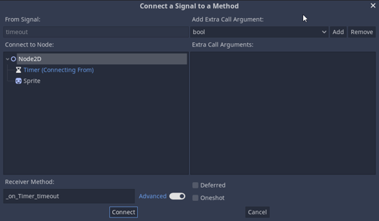

&nbsp;

- Ajoutez le code ci-bas :
  
```csharp
public void _on_timer_timeout() {
    var sprite = GetNode<Sprite2D>("../Icon");
    sprite.Visible = !sprite.Visible;
    GD.Print("Clignotement");
}
```

- Question : Que fait ce code?
- Exécutez le projet.


---

# Les signaux en code

- Il est possible de connecter des signaux via le code au lieu de l’éditeur.
- C’est surtout utilisé lorsque l’on crée des instances via le code et que l’on doit y attacher des signaux.
  - Pensez aux écouteurs d’événement en JavaScript que l’on attache en code avec "addEventListener".
- Pour attacher un signal avec le code, il faudra utiliser le nom de l’événement et ajouter la fonction à celui-ci.

Voici un exemple où on attache 2 fonctions à un événement :

```csharp
// Exemple où on attache 2 fonctions à un événement
monObjet.eventName += eventFunctionA;
monObjet.eventName += eventFunctionB;
```

<details><summary>🥚🐣</summary>
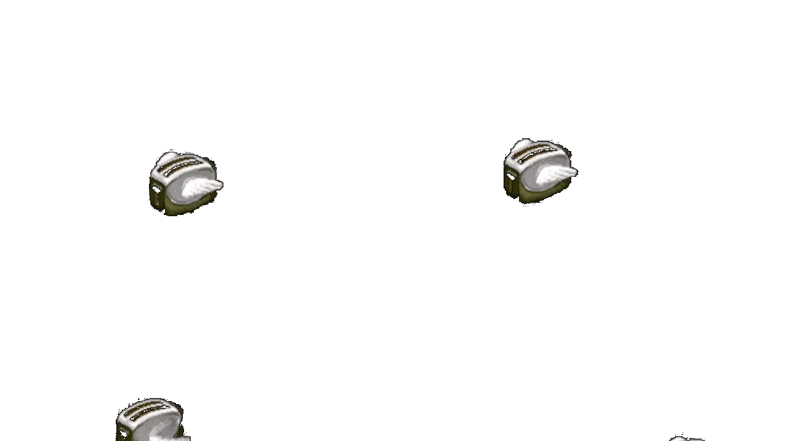
</details>


---

## Exercice

- Avec le projet `ExempleTimer` :
- Dans l’éditeur, déconnectez le signal `timeout()` à l’aide du bouton `Disconnect`.
- Nous allons utiliser la méthode `Connect()` dans la méthode `_Ready()` pour connecter.
  - La syntaxe est la suivante : `objet.nomSignal += nomMethode`. 
- Dans la méthode `_Ready()`, ajoutez le code qui suit.

```csharp
GetNode<Timer>("Timer").Timeout += _on_timer_timeout;
```

---

## Signaux personnalisés

- Il est possible de créer des signaux personnalisés ([Source](https://docs.godotengine.org/en/stable/getting_started/step_by_step/signals.html#custom-signals)).
- Exemples d’utilité :
  - Un personnage tire et je veux signaler que le projectile a été tiré.
  - Des ennemis approchent un lieu précis, je veux signaler que l’événement est arrivé.
  - Etc.
- Pour émettre un signal, on appelle la méthode `EmitSignal()`.

Exemple :

```csharp
public class Player : CharacterBody2D
{
    [Signal]
    public delegate void Hit(int damage);

    public override void _Ready()
    {
        EmitSignal(nameof(Hit), 42);
    }
}
```

---

# Instanciation

- Dans les petits projets l’utilisation d’une seule scène avec quelques nœuds peut fonctionner mais dans les projets plus grands le nombre de nœuds peut devenir ingérable
- L’instanciation permet d’intégrer des scènes sauvegardées à l’intérieur d’une autre scène

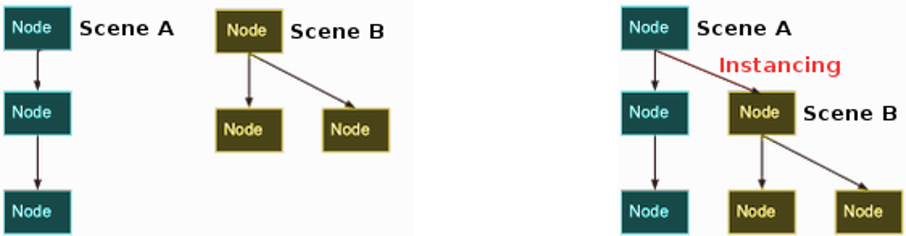

---

## Exercice : Instanciation

- À l’aide du fichier [`instancing_starter.zip`](https://github.com/godotengine/godot-docs-project-starters/releases/download/latest-4.x/instancing_starter.zip), décompressez le fichier à l’endroit désiré.
- À partir du gestionnaire de projet, importez ce dernier dans Godot.
  - Il se peut qu’il y ait un avertissement de version. Acceptez la mise à jour du projet.
   Réalisez l'exercice qui se retrouve [ici](https://docs.godotengine.org/en/stable/getting_started/step_by_step/instancing.html#instancing-by-example)

**Résumé du projet**

- Le projet contient deux scènes : `Ball.tscn` et `Main.tscn`.
- La scène `Ball` utilise un `RigidBody2D` pour la gestion de la physique.
- La scène principale utilise `StaticBody2D` pour les obstacles que la balle peut rencontrer.

### Objectifs de l'exercice

- Instancier la scène `Ball` dans la scène `Main`.
- Permettre à la balle d'interagir avec les obstacles.
- Tester et ajuster la configuration des propriétés physiques (ex. : bounce).

---

## Exercice : Instanciation simple

### Étapes :

1. Pour ajouter une instance de la balle dans la scène, sélectionnez le nœud racine.
2. Cliquez sur le bouton d’instance (icône de maillon de chaîne).
3. Placez la balle dans la scène, puis exécutez le projet pour observer le comportement.

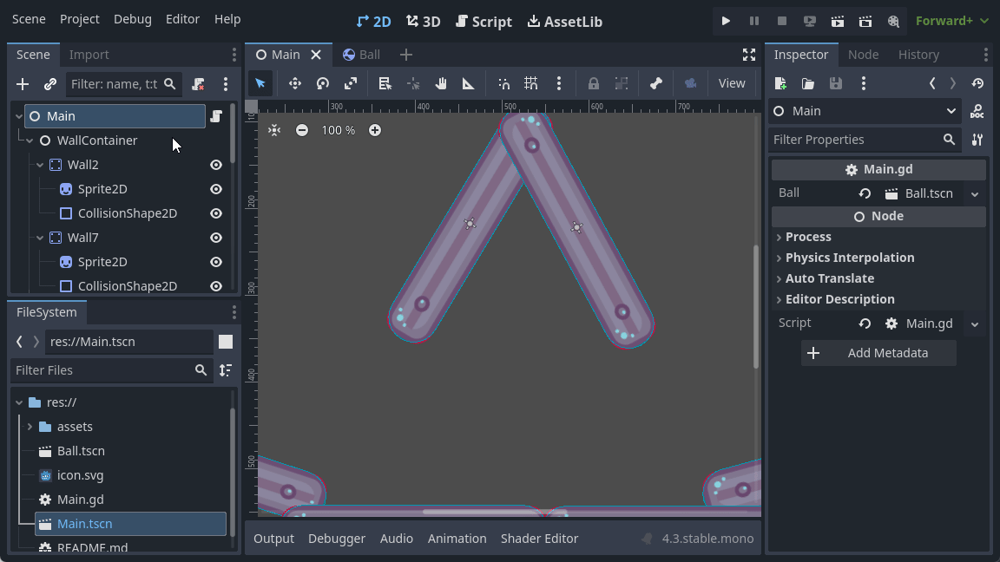

---

## Exercice : Instanciation multiple

1. Sélectionnez l’instance de la balle dans la scène.
2. Dupliquez l’instance en utilisant le raccourci `[Ctrl] + D` pour ajouter plusieurs balles à la scène.
3. Exécutez le projet et observez l’interaction des différentes instances avec les obstacles.

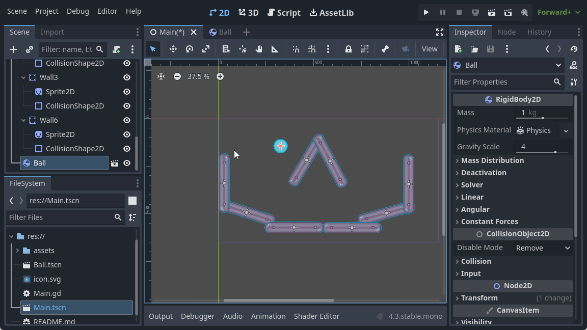

---

## Exercice : Modification des instances

1. Pour modifier le comportement des balles, ajustez la propriété `Bounce` dans le `PhysicsMaterial` de la balle pour la rendre plus rebondissante.
2. Modifiez la scène `Ball.tscn` pour que toutes les instances héritent des changements.
3. Si vous souhaitez personnaliser une seule instance, sélectionnez l’instance dans `Main.tscn` et apportez des modifications spécifiques.

---

# Conception de jeux avec des scènes

- Le concept de **scènes** est au cœur du fonctionnement de Godot.
- Cela permet de structurer efficacement les projets de manière hiérarchique.

## Exemple de structure de jeu

- Chaque rectangle représente une scène (ou un groupe de scènes) que vous pouvez instancier dans une scène parent. Ce système modulaire facilite le développement et l'organisation des ressources dans des projets complexes.


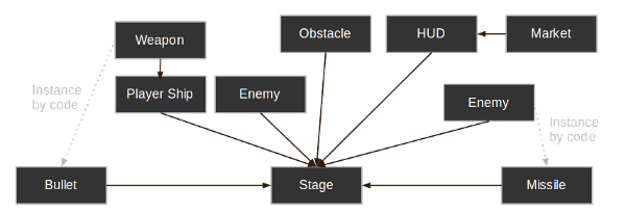
---

# Conclusion : Premiers pas avec Godot

Vous avez appris à :
- Créer et instancier des scènes dans Godot.
- Gérer plusieurs instances et ajuster leurs propriétés.
- Structurer un projet avec une approche modulaire en utilisant des scènes.

Ne vous inquiétez pas si tout n’est pas encore clair, cela deviendra plus naturel en travaillant sur des projets plus avancés.

---

# Note importante

## Attention :
Il existe encore de nombreux tutoriels et projets utilisant Godot 3.x. Assurez-vous d’adapter les tutoriels pour la version 4.x de Godot lorsque nécessaire.

---

## Exercice

- Veuillez effectuer le didacticiel complet que l’on retrouve ici [Lien vers le didacticiel](https://docs.godotengine.org/fr/4.x/getting_started/first_2d_game/index.html).
- Apportez des modifications à votre jeu pour le personnaliser.


<!-- Tableau html à 2 colonnes pour copier coller

<table>
  <tr>
    <td>
    

    </td>
    <td>
    

    </td>
  </tr>
</table>

-->

