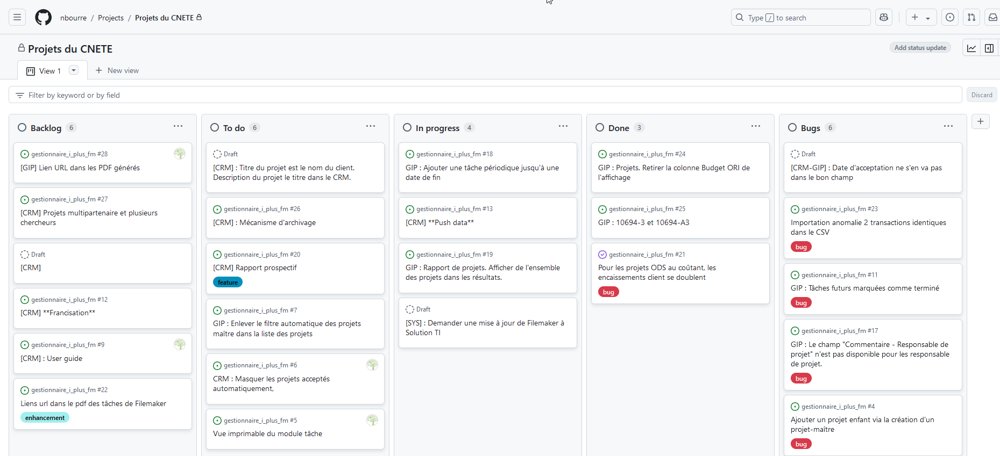
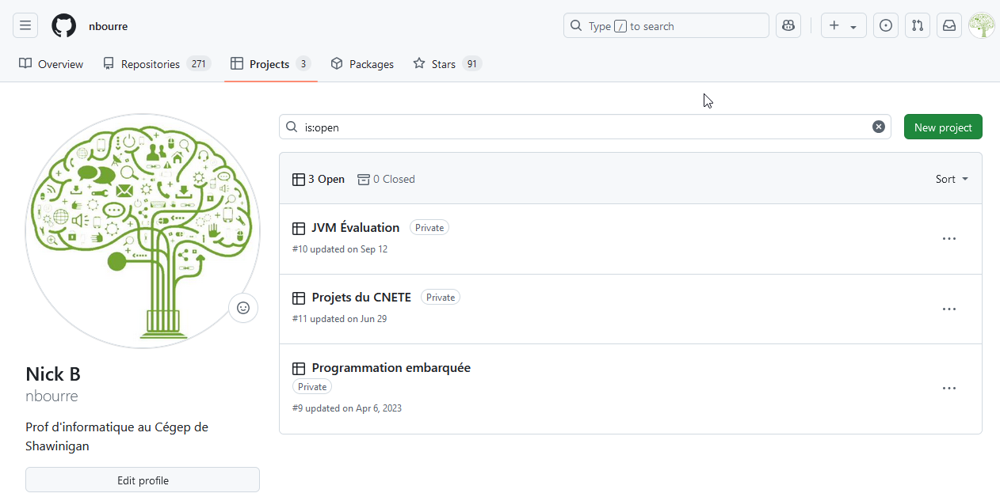
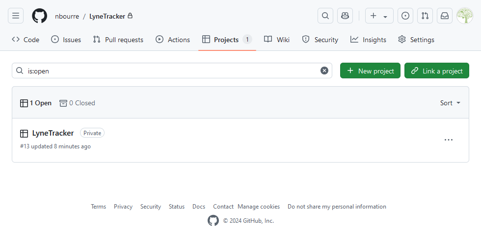
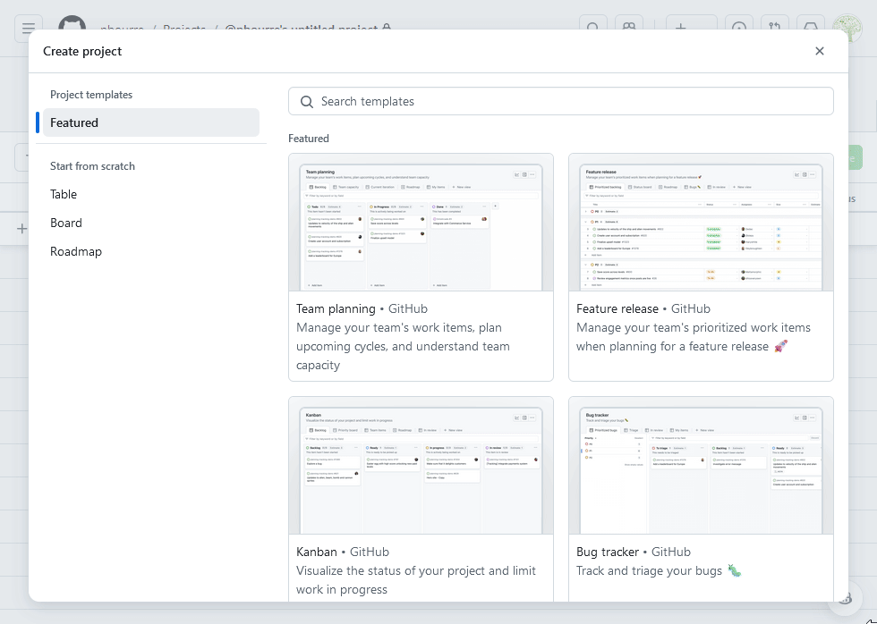
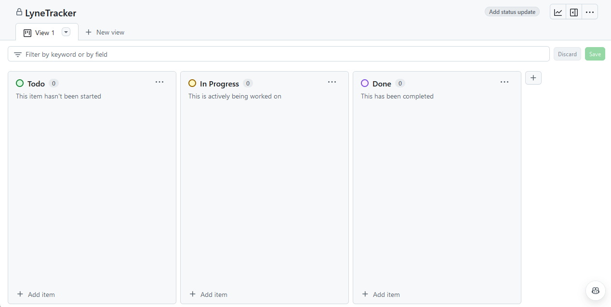
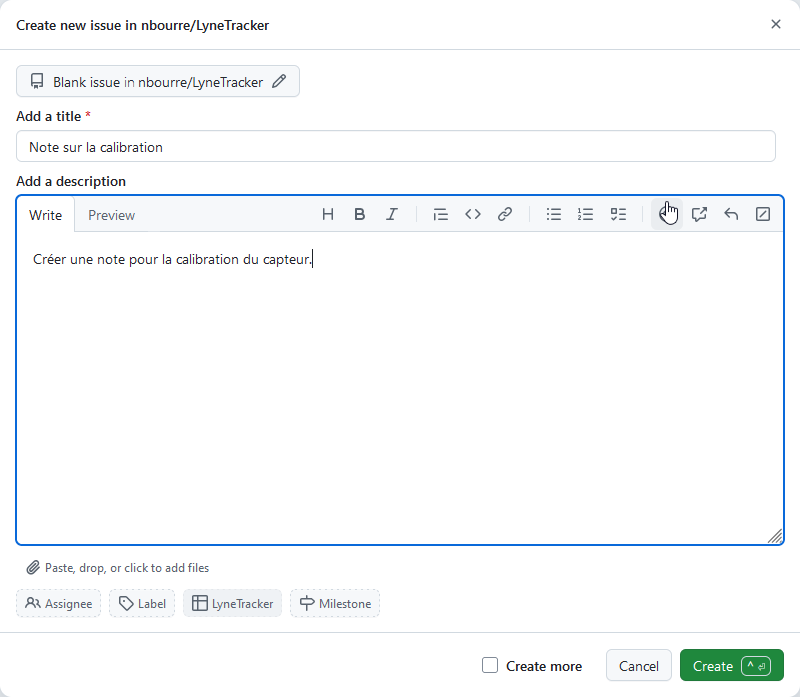

# Suivi du projet de session

Pour suivre le projet, vous allez devoir créer un projet sur GitHub. On utilisera un Kanban pour faire le suivi. Le Kanban est un tableau qui permet de suivre l'avancement des tâches. Vous pouvez créer un Kanban pour chaque membre de l'équipe ou un Kanban pour l'équipe entière.

# Nouveau projet sur GitHub
Pour accéder au projet sur GitHub, vous devez être connecté et atteindre l'onglet `Projects`.

## Méthode 1 : À partir d'un dépôt
Vous pouvez créer un projet à partir d'un dépôt existant.

Pour ce faire, 
1. Ouvrez le dépôt
2. Cliquez sur l'onglet `Projects`
3. Cliquez sur le bouton `New project`

## Méthode 2 : À partir de l'onglet `Projects`
Vous pouvez créer un nouveau projet en cliquant sur le bouton `New project`.

Sélectionnez le modèle `Board`, donnez un nom significatif et cliquez sur `Next`.

Vous devrez associer le projet à un dépôt. Sélectionnez le dépôt et cliquez sur `Link a project`.

# Configuration du projet

Configuration du projet :
- Nom du projet : Donnez un nom significatif
- Description : Ajoutez une description pour expliquer le projet

# Les colonnes
Un Kanban est composé de colonnes. Chaque colonne représente un état de la tâche. Par exemple, une tâche peut être `À faire`, `En cours` ou `Terminée`.

> **Note :** Le nombre de colonnes variera en fonction des besoins du projet et des standards de l'équipe ou de l'entreprise.

Pour ajouter une colonne, cliquez sur le bouton `+` à l'extrémité droite du tableau.

**Pour les besoins du suivi du projet, vous devez ajouter la colonne `Backlog` qui sera la première colonne.** Cette colonne contiendra toutes les tâches à faire éventuellement.

# Ajouter un collaborateur
Pour ajouter un collaborateur :

1. Cliquez sur le bouton `...` en dessous de votre logo
2. Cliquez sur `Settings`
3. Cliquez sur `Manage access`
4. Invitez un collaborateur en cliquant sur `Invite collaborators`

## Description des colonnes
- `Backlog`: Tâches à faire éventuellement
- `To do`: Tâches à faire prochainement
- `In progress`: Tâches en cours
- `Done`: Tâches terminées

# Ajouter des tâches
Les tâches sont représentées par des cartes. Chaque carte contient des informations sur la tâche.

- On peut ajouter des étiquettes, des assignés, des dates d'échéance, des descriptions, etc.
- On peut créer un *issue* directement à partir de la carte.
  - C'est ce que je recommande pour les tâches.

Pour ajouter une tâche :
1. Cliquer sur le bouton `+ Add item` dans le bas de la colonne désirée.
2. Taper `#` pour sélectionner un dépôt.
3. Cliquer sur `Create a new issue` pour créer une nouvelle tâche.
4. Ajouter les informations nécessaires pour la tâche.

---

# Exercice
1. Créez un projet sur GitHub pour votre projet de session.
   1. Prenez la méthode de création qui vous convient.
2. Assurez-vous que le dépôt est associé au projet.
3. Ajoutez moi comme collaborateur. Mon username : `nbourre`.
4. Ajoutez la colonne `Backlog`.
5. Ajoutez les tâches à faire dans la colonne `Backlog`.
   1. Voir ci-bas pour le tableau des critères que vous devrez convertir en tâches.

## Tableau des critères
Les critères ne sont pas nécessairement des tâches. Vous devrez les convertir en tâches. Il peut y avoir plusieurs tâches pour le même critère. Par exemple, le critère `Animation` pourrait être converti en plusieurs tâches tel que `Trouver un sprite sheet`, `Créer les animations`, `Intégrer les animations`, etc.

> **Note :** Dans tous les cas, il peut y avoir une équivalence pour être adapté à votre projet. Il faudra me faire approuver. Il faudra marquer l'équivalence dans la carte.

| Critère | Remarque |
|---------|----------|
| Type de projet | Le type de projet doit être défini |
| Sprite sheet | Personnage principale ou équivalent |
| Animation | |
| Contrôles | Contrôles de base du jeu |
| Base du terrain | Exemple : Niveau pour tester l’environnement |
| Camera ou équivalent | Mouvement de caméra ou limitation de l’environnement |
| Ennemi ou équivalent | Action/réaction avec des objets de l’environnement |
| Sprite sheet | Pour les animations non joueur |
| Ennemi mouvement | Les ennemis se déplacent |
| Niveau différent | Changement de niveau |
| Vie ou équivalent | Énergie, vie ou équivalent |
| Pointage | Système de pointage avec HUD |
| Son | Ajout de son interactif |
| Mécanique de jeu 1 | |
| Mécanique de jeu 2 | |
| Mécanique de jeu 3 | |
| Mécanique de jeu 4 | |
| Mécanique de jeu innovante 5 | |
| Mécanique de jeu innovante 6 | |
| Menu | |
| Scène de fin | |
| Mise en pause | |
| Projet finalisé | |
| Données pour le débogage | |
| Documentation | |

TODO :
- Ajouter des éléments de pointage aux critères.
- Ajouter des éléments de qualité esthétique ou d'appréciation générale.
- Ajouter des éléments d'attitude ou de comportement envers le projet.