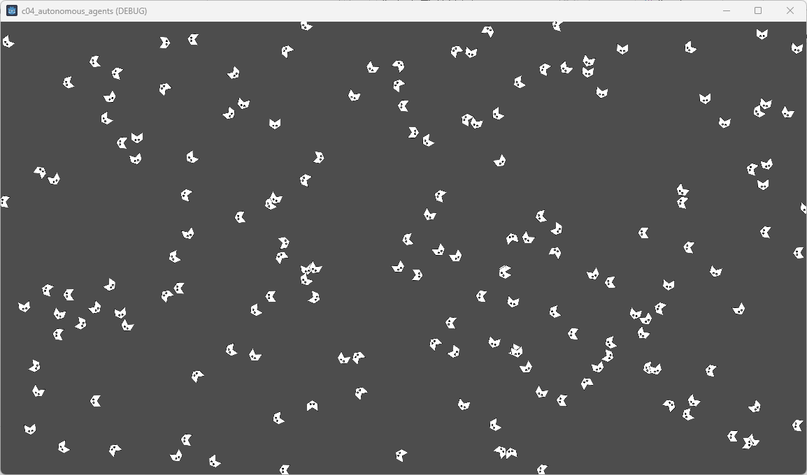
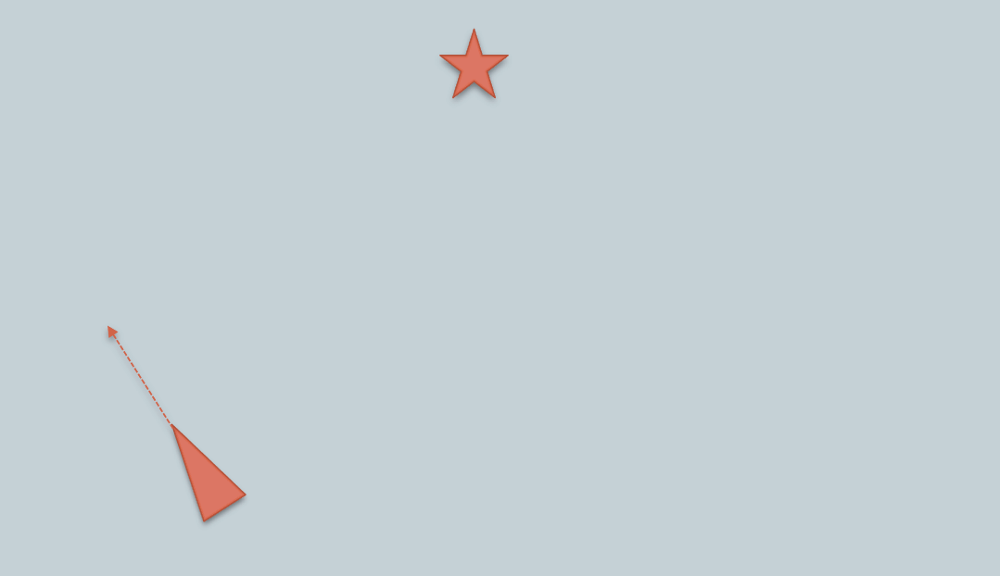
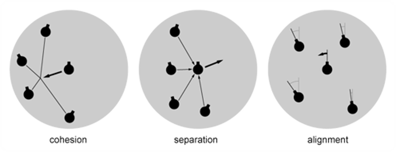
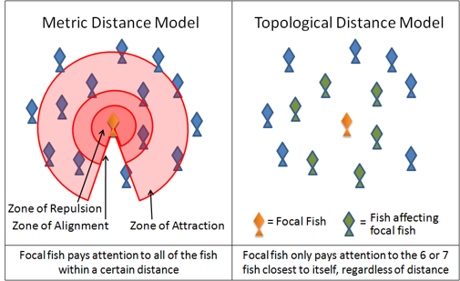
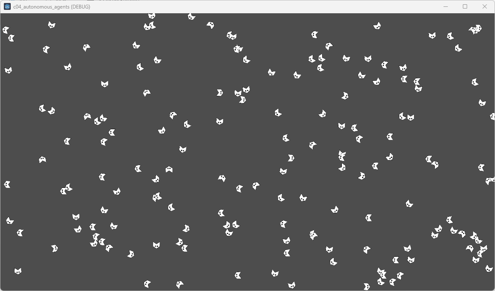
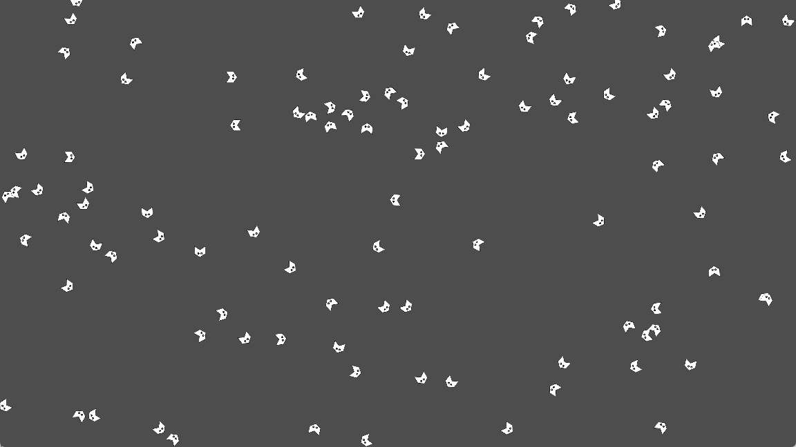
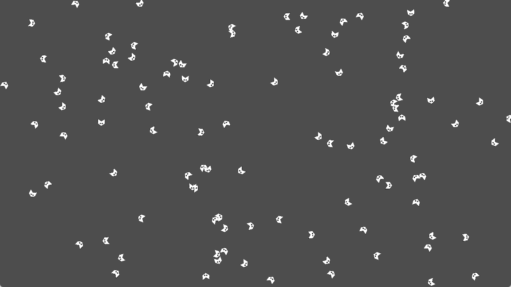
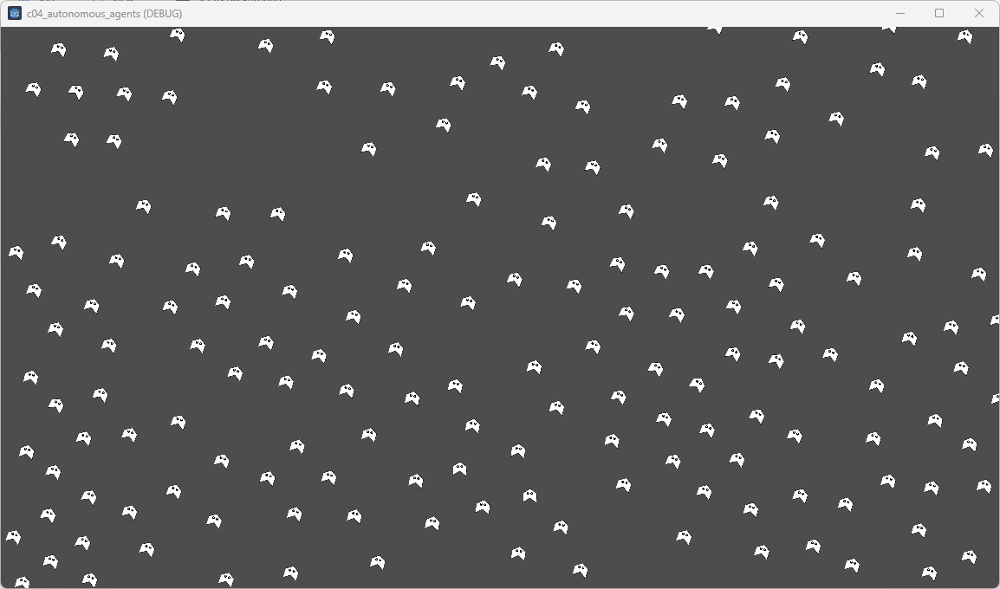
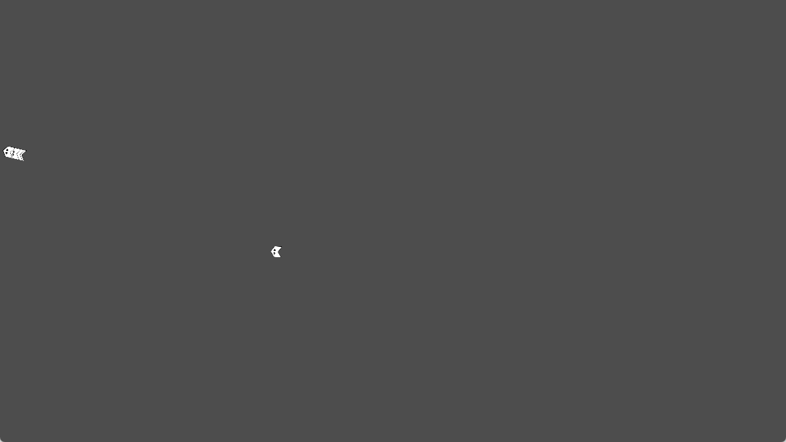

# Algorithme d'agrégation <!-- omit in toc -->
Programmation créative - L’agrégation et les collisions

## Table des matières <!-- omit in toc -->
- [Plan de leçon](#plan-de-leçon)
- [Récupération du projet](#récupération-du-projet)
  - [Projet sans agrégation](#projet-sans-agrégation)
- [Calculer le vecteur de braquage](#calculer-le-vecteur-de-braquage)
  - [Algo](#algo)
  - [Exemple](#exemple)
- [Qu’est-ce qu’une agrégation?](#quest-ce-quune-agrégation)
  - [Exemples d’agrégation](#exemples-dagrégation)
  - [Notions scientifiques](#notions-scientifiques)
  - [La séparation ou répulsion](#la-séparation-ou-répulsion)
    - [Algorithme](#algorithme)
    - [Visualisation](#visualisation)
  - [L’alignement](#lalignement)
    - [Algo](#algo-1)
    - [Visualisation](#visualisation-1)
  - [La cohésion](#la-cohésion)
    - [Calcul](#calcul)
    - [Algo](#algo-2)
    - [Visualisation](#visualisation-2)
  - [Sommation des forces](#sommation-des-forces)
  - [Jouer avec les forces](#jouer-avec-les-forces)
- [Références](#références)

---

# Plan de leçon
- Récupération du projet
- Chercher une cible
- L’agrégation
  - Qu’est-ce que l’agrégation?
  - Notions scientifiques
  - Cohésion
  - Séparation
  - Alignement

---

# Récupération du projet
- Pour cette leçon, nous allons utiliser le projet `c05_godot_agregation`
- Testez l’application
- Il s'agit seulement d'objets (boids) qui se déplacent dans une direction aléatoire.
- Parcourez le code pour comprendre les grandes lignes (5 min)

## Projet sans agrégation
Les boids ne se déplace qu’avec une vitesse initiale


---

# Calculer le vecteur de braquage
- Avant de débuter avec l’agrégation, il est important de comprendre comment calculer un vecteur de braquage
- Dans certaine situation, on voudrait qu’un objet atteigne une cible tout en ayant une vitesse de rotation limitée
  - Exemple : Véhicule qui se braque dans une direction
- C'est le cas avec la force de cohésion

## Algo
- Trouver le vecteur de différence entre la cible et l’objet
- Limiter le vecteur de différence (vitesse max)
- Trouver la différence entre le vecteur de différence en la vitesse de l’objet (vitesse de braquage)
- Limiter le vecteur de braquage
- Retourner le vecteur de braquage



## Exemple
```gdscript
# Dans un node2D
func steering(target: Vector2) -> Vector2:
	var desired = (target - location).normalized() * top_speed
	var steer = desired - velocity  # Calculer la force de direction vers la cible
	steer = steer.limit_length(top_steer)
	return steer
```

---

# Qu’est-ce qu’une agrégation?
- Une agrégation est un groupe d’agents dans lequel chaque individu est indépendant et dépendant des autres individus
- Dans la littérature, on va lire sur le *swarm*|*flocking behaviour*
- Chaque individu se nomme un *boid*
- Synonyme : Essaim, troupeau, banc, volée, etc.

---

## Exemples d’agrégation


Volée d'étourneaux


Banc de thons

---

## Notions scientifiques
- Le principe de volée nécessite 3 forces
  - La cohésion
  - La séparation
  - L’alignement
- L’addition de ces trois forces sur un ensemble d’agents simule l’effet du comportement de troupeau chez les animaux.



---

- Chacune des forces s’applique dans une **limite de distance**
- Généralement l’ordre de distance est la répulsion, l’alignement et ensuite la cohésion



---

## La séparation ou répulsion
- La force de séparation ou de répulsion est celle qui permet à l’agent de d’éloigner des voisins trop près
- On pourrait la définir comme la bulle personnelle
- On calcule en effectuant la ${\color{blue}moyenne\ de\ la\ différence\ des\ distances}$ divisé par la ${\color{blue}distance}$
- Ensuite on trouve le vecteur pour trouver la force de braquage

---

### Algorithme
- Pour chaque agents qui sont dans la bulle de répulsion
  - Diff <-- agent.position – autre.position
  - Normalise diff
  - Divise diff par la distance
  - Somme la diff
- Suivant
- Diviser la somme par le nombre d’agents trouvés
  - Cela calcule la direction à atteindre
- Normaliser la division
- Multiplier par la vitesse max
- Soustraire la vitesse de l’agent
- Limiter par la vitesse de braquage max

```gdscript
func separation(boids: Array) -> Vector2:
	var steer = Vector2()
	var total = 0
	
	for other in boids:
		var distance = location.distance_to(other.position)
		if distance < radius_separation and other != self:
			var diff = location - other.position
			diff = diff.normalized() / distance  # Inverser la direction de la force d'évitement
			steer += diff
			total += 1
			
		if total > max_neighbor - 1 :
			break
	if total > 0:
		steer /= total  # Moyenne de toutes les forces
		steer = steer.normalized() * top_speed - velocity  # Calcul du vecteur de direction
		steer = steer.limit_length(top_steer)  # Limiter la force de rotation
	return steer
```

---

### Visualisation
- Avec le projet `c05_godot_agregation` ouvert
- Exécutez le projet
- Pendant que le projet s'exécute dans Godot, sélectionnez la scène `World`
- Dans l'inspecteur, activez la propriété `Separation`
- Observez le comportement des boids. Que voyez-vous?

Voici ce que vous devriez voir



---

## L’alignement
- L’alignement est la force qui permet à l’agent de suivre le groupe
- Elle se calcule en effectuant la moyenne de la vitesse des agents qui sont dans le voisinage établi


### Algo	
- Calculer la moyenne des vitesses du voisinage
- Calculer la force de braquage avec la moyenne trouvée


### Visualisation
- Dans l'inspecteur, activez la propriété `Alignment`
- Observez le comportement des boids. Que voyez-vous?

Voici ce que vous devriez voir


## La cohésion
- La cohésion est la force à laquelle un agent s’attache à d’autres agents
- Généralement, c’est la force dont le voisinage est le plus grand

### Calcul
- On calcule la cohésion en effectuant la moyenne de la position de chacun des agents
- Ce calcul donne la cible à atteindre pour l’agent
- Ensuite, on calcule la force de braquage pour atteindre cette cible
 
### Algo
- Cible <- Calculer la moyenne des positions des voisins
- Calculer le vecteur de braquage pour atteindre la cible

---

### Visualisation
- Dans l'inspecteur, activez la propriété `Cohesion`
- Observez le comportement des boids. Que voyez-vous?

Voici ce que vous devriez voir.



---

## Sommation des forces
- Après avoir calculé les trois forces, on applique une pondération pour chacune d’elle
- Par la suite, on les applique à l’agent
- Le résultat final dépendra des facteurs suivants
  - La distance de l’application de chaque force
  - La pondération de chaque force
  - Le nombre de voisins à considérer



## Jouer avec les forces


---

# Références
- http://en.wikipedia.org/wiki/Swarm_behaviour
- http://processing.org/examples/flocking.html
- http://igeo.jp/tutorial/43.html
- http://gamedevelopment.tutsplus.com/tutorials/the-three-simple-rules-of-flocking-behaviors-alignment-cohesion-and-separation--gamedev-3444

---
