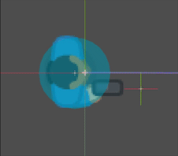

# Mécanique des Projectiles en Godot <!-- omit in toc -->

# Sommaire <!-- omit in toc -->
- [Introduction](#introduction)
- [Objectifs d'apprentissage](#objectifs-dapprentissage)
- [Création d’un projectile simple](#création-dun-projectile-simple)
  - [Exemple de projectile avec `Node2D`](#exemple-de-projectile-avec-node2d)
    - [Explication](#explication)
  - [Création d'un tireur de projectiles simple](#création-dun-tireur-de-projectiles-simple)
    - [Code pour le tireur de projectiles](#code-pour-le-tireur-de-projectiles)
    - [Explication](#explication-1)
- [Gestion des tirs avec intervalle de temps](#gestion-des-tirs-avec-intervalle-de-temps)
  - [Explication :](#explication-)
- [Optimisation des projectiles (Object pooling)](#optimisation-des-projectiles-object-pooling)
  - [Création du `Pool` d'objets](#création-du-pool-dobjets)
  - [Modification du tireur pour utiliser le `Pool`](#modification-du-tireur-pour-utiliser-le-pool)
- [Autres améliorations possibles](#autres-améliorations-possibles)
- [Conclusion](#conclusion)

# Introduction

La mécanique des projectiles est une partie importante dans la création de jeux 2D ou 3D. Un projectile est généralement un objet qui se déplace à une vitesse fixe et suit une trajectoire, souvent influencée par la physique ou les interactions avec l'environnement.

# Objectifs d'apprentissage

- Comprendre comment créer un projectile dans Godot.
- Utiliser des forces et la physique pour simuler le mouvement d'un projectile.
- Implémenter des comportements comme les collisions ou la désactivation des projectiles hors de l'écran.
- Gérer le tir des projectiles dans un intervalle de temps.
- Optimiser les performances en utilisant le pooling d'objets pour les projectiles.

> Note : J'utiliserai les ressources "Top-down shooter" de Kenney pour les graphismes des projectiles. Vous pouvez les trouver sur [Kenney.nl](https://kenney.nl/assets/top-down-shooter).


# Création d’un projectile simple
Pour commencer, nous allons créer un projectile basique qui se déplace en ligne droite. Le projectile sera instancié et ajouté à la scène lorsqu'un bouton est pressé.

Pour créer un projectile, nous pouvons utiliser un `Node2D` ou un `RigidBody2D` selon la complexité des interactions physiques souhaitées.

Dans cette leçon, nous allons utiliser un `Node2D` pour un projectile simple qui se déplace horizontalement.

Voici la hiérarchie de noeud que l'on aura :
- `Node2D` (Projectile)
  - `Sprite2D` (Apparence du projectile)
  - `Area2D` (Zone de collision)
    - `CollisionShape2D` (Forme de collision)

Voici l'image utilisée pour le `Sprite2D` du projectile :


## Exemple de projectile avec `Node2D`

On attachera un script au `Node2D` pour gérer le mouvement du projectile.

```gd
extends Node2D
class_name Projectile

var speed : int = 750

func _physics_process(delta: float) -> void:
	position += transform.x * speed * delta
	
func _on_area_2d_body_entered(body: Node2D) -> void:
	# On utilise mobs, mais cela peut être n'importe quel groupe
	if body.is_in_group("mobs"):
		body.queue_free()
	queue_free()

```

Il faudra connecter le signal `body_entered` de l'`Area2D` à la méthode `_on_area_2d_body_entered` pour gérer les collisions.

> **Note** : La propriété `transform` est celle que l'on retrouve dans l'inspecteur pour les noeuds 2D. Elle représente la transformation du noeud (position, rotation, échelle) par rapport à son parent. `transform.x` est un vecteur unitaire qui pointe dans la direction locale "droite" du noeud, en tenant compte de sa rotation.

### Explication
- On retire le projectile lorsqu'il entre en collision avec un autre corps.
- On retire également le corps représentant l'ennemi lorsqu'il est touché par le projectile.


---

## Création d'un tireur de projectiles simple
Pour le tireur de projectiles, nous allons utiliser un `CharacterBody2D` qui peut se déplacer et tirer des projectiles.

Voici l'image qui sera utilisé pour le tireur :


Voici la hiérarchie de noeud que l'on aura :
- `CharacterBody2D` (Tireur de projectiles)
  - `Sprite` (Apparence du tireur)
  - `CollisionShape2D` (Forme de collision)
  - `Camera2D` (Caméra pour suivre le tireur)
  - `Marker2D` (Marqueur pour la direction du tir)




### Code pour le tireur de projectiles

```gd
extends CharacterBody2D
class_name Player

@export var speed : int = 200
@export var bullet_scene : PackedScene

func get_input():
	look_at(get_global_mouse_position())
	
	var dir = Input.get_axis("back", "forward")
	velocity = transform.x * dir * speed
	if Input.is_action_just_pressed("shoot"):
		shoot()

func _physics_process(delta: float) -> void:
	get_input()

func shoot() -> void :
	var b : Projectile = bullet_scene.instantiate()
	get_parent().add_child(b)
	b.global_transform = $Muzzle.global_transform


```

### Explication
- `get_input()` : Gère les entrées du joueur pour déplacer le tireur et tirer.
- `look_at()` : Oriente le tireur vers la position de la souris.
- `transform.x` : Vecteur de direction du tireur.
- `shoot()` : Instancie un projectile, l'ajoute à la scène principale et le positionne au niveau du `Muzzle` (point de tir).
- `global_transform` : Est une propriété qui permet de positionner un noeud dans l'espace global de la scène.

# Gestion des tirs avec intervalle de temps

Pour simuler un intervalle entre les tirs, nous devons ajouter quelques éléments pour la gestion du temps.

Il faudra connaître la **fréquence de tir** et le **temps écoulé** depuis le dernier tir pour déterminer si le tireur peut tirer à nouveau.

**Exemple d'implémentation :**

```gd
extends CharacterBody2D

@export var speed = 200
@export var bullet_scene : PackedScene
var shoot_interval : float = 1.0 / 5.0  # 5 balles par seconde
var last_shot : float = 0.0  # Chronomètre pour le tir

func get_input(delta):
	look_at(get_global_mouse_position())

	# Gestion du mouvement avec les touches avant/arrière
	var dir = Input.get_axis("back", "forward")
	velocity = transform.x * dir * speed

	# Vérifier si l'intervalle de tir est respecté
	if Input.is_action_just_pressed("shoot") :
		if (last_shot >= shoot_interval) :
			shoot()
			last_shot = 0.0  # Réinitialiser le chronomètre après le tir

func _physics_process(delta):
	last_shot += delta  # Accumuler le temps écoulé entre les tirs
	get_input(delta)
	move_and_slide()

func shoot():
	var bullet = bullet_scene.instantiate()  # Instancier la scène de projectile
	get_parent().add_child(bullet)  # Ajouter le projectile à la même scène que le joueur
	bullet.global_transform = $Muzzle.global_transform  # Positionner le projectile au niveau du Muzzle

```

## Explication :
- `shoot_interval` : Définit l'intervalle de temps entre les tirs.
- `time_since_last_shot` : Un accumulateur qui suit le temps écoulé depuis le dernier tir.

---

# Optimisation des projectiles (Object pooling)

Dans les jeux, tirer et détruire des projectiles à répétition peut être coûteux en termes de performance. Une méthode efficace consiste à recycler les projectiles (Object Pooling). Au lieu de détruire les projectiles, ils sont désactivés et réutilisés. Cela réduit les allocations de mémoire et les suppressions, ce qui peut améliorer significativement les performances, surtout lorsque de nombreux projectiles sont générés.

Il faudra créer un nouvelle scène pour le `Pool` de projectiles. Cette scène ne contiendra qu'un `Node` que nous nommerons `BulletPool`. Ce `Node` contiendra un tableau de projectiles disponibles et un tableau de projectiles actifs.

## Création du `Pool` d'objets

Voici le code pour le `Pool` de projectiles :

```gd
extends Node
class_name BulletPool

@export var bullet_scene : PackedScene
@export var pool_size : int = 20

var bullet_pool : Array = []
var available_bullets : Array = []

func _ready() -> void:
	for i in range(pool_size):
		var bullet = bullet_scene.instantiate() as Projectile
		bullet.bullet_out_of_screen.connect(_on_bullet_out_of_screen.bind(bullet))
		add_child(bullet)
		bullet.visible = false  # Masquer le projectile au début
		bullet_pool.append(bullet)
		available_bullets.append(bullet)	

func get_bullet() -> Projectile:
	if available_bullets.size() > 0:
		var bullet = available_bullets.pop_back()
		bullet.visible = true  # Rendre le projectile visible lorsqu'il est tiré
		return bullet
	else:
		return null  # Si aucun projectile n'est disponible, retourner null
	

# Réinitialiser le projectile lorsqu'il est hors de l'écran
func _on_bullet_out_of_screen(bullet):
	bullet.visible = false  # Masquer le projectile
	available_bullets.append(bullet)  # Réintégrer le projectile dans le pool

```

Dans l'inspecteur, il faudra associer la scène `Bullet` au `BulletPool` de projectiles pour qu'il puisse instancier les projectiles.


**Explication**
- `bullet_pool` : Tableau de tous les projectiles créés.
- `available_bullets` : Tableau des projectiles disponibles pour le tir.
- La première étape consiste à créer un pool de projectiles lors de l'initialisation.
- `get_bullet()` : Récupère un projectile disponible dans le pool.
- `return_bullet()` : Réinitialise et retourne le projectile dans le pool.

## Modification du tireur pour utiliser le `Pool`

Il faudra adapter le tireur pour utiliser le `Pool` de projectiles au lieu d'instancier de nouveaux projectiles à chaque tir.

Il faudra modifier le `Player` à quelques endroits pour utiliser le `BulletPool`

```gd
@export var bullet_pool_scene : PackedScene  # Référence au gestionnaire de pool
var bullet_pool : BulletPool

#...

func _ready() -> void:
	bullet_pool = bullet_pool_scene.instantiate() as BulletPool
	get_parent().add_child.call_deferred(bullet_pool)

#...

func shoot():
	var bullet : Projectile = bullet_pool.get_bullet() # Récupérer un projectile du BulletPool
	if bullet :
		bullet.global_transform = $Muzzle.global_transform # Positionner le projectile au niveau du Muzzle
		bullet.visible = true # Rendre le projectile visible
    
**Explication**
- `bullet_pool_scene` : Référence à la scène du `BulletPool`.
- `bullet_pool` : Instance du `BulletPool` dans le jeu.
- `bullet_pool.get_bullet()` : Récupère un projectile du pool pour le tir.

## Modification du projectile

Le projectile émettra un signal lorsqu'il sortira de l'écran pour être recyclé dans le `BulletPool`. Ce dernier écoutera ce signal pour récupérer le projectile et le remettre dans le pool.

```gd
extends Node2D
class_name Projectile

var speed = 750

# Signal émis lorsque le bullet est hors de l'écran
signal bullet_out_of_screen

func _physics_process(delta):
    # Déplacement du projectile
    position += transform.x * speed * delta

    # Si le projectile est hors de l'écran, émettre le signal
    if is_out_of_screen():
        emit_signal("bullet_out_of_screen")

func _on_Bullet_body_entered(body):
    # Vérifier la collision avec les ennemis (ou autres objets)
    if body.is_in_group("mobs"):
        body.queue_free()  # Supprimer l'ennemi touché
    emit_signal("bullet_out_of_screen")  # Émettre le signal pour recycler le projectile

func is_out_of_screen() -> bool:
    var screen_rect = get_viewport_rect()
    return not screen_rect.has_point(position)

```

# Autres améliorations possibles
- Créer un Singleton pour gérer les `Pools` de projectiles.
- Créer une fabrique de projectiles pour gérer différents types de projectiles.
- Détacher la dépendance du `BulletPool` du tireur.

# Conclusion

Les projectiles dans Godot sont simples à implémenter mais peuvent devenir complexes en fonction des interactions et des effets que vous souhaitez ajouter. En utilisant des méthodes comme le pooling et la gestion des collisions, vous pouvez optimiser les performances et gérer efficacement de nombreux projectiles à l'écran.
