# Godot – Bases du jeux 2D <!-- omit in toc -->

# Table des matières <!-- omit in toc -->
- [Plan de leçon](#plan-de-leçon)
- [Notes](#notes)
- [Avant de débuter](#avant-de-débuter)
- [Les spritesheets et textures](#les-spritesheets-et-textures)
- [Les sprites animés](#les-sprites-animés)
- [Ajouter une feuille dans Godot](#ajouter-une-feuille-dans-godot)
- [AnimatedSprite](#animatedsprite)
  - [SpriteFrames](#spriteframes)
  - [Ajouter des images](#ajouter-des-images)
  - [Animer l’image](#animer-limage)
  - [Contrôler l’animation](#contrôler-lanimation)
- [Animer avec AnimationPlayer](#animer-avec-animationplayer)
  - [Configuration de la scène](#configuration-de-la-scène)
  - [Ajuster le nombre de cadres](#ajuster-le-nombre-de-cadres)
  - [Le volet `Animation`](#le-volet-animation)
  - [Ajouter une animation dans `AnimationPlayer`](#ajouter-une-animation-dans-animationplayer)
    - [Ajuster le temps de l'animation](#ajuster-le-temps-de-lanimation)
    - [Ajouter des cadres dans la timeline](#ajouter-des-cadres-dans-la-timeline)
    - [Ajuster les cadres de l'animation](#ajuster-les-cadres-de-lanimation)
    - [Visualiser l'animation](#visualiser-lanimation)
  - [Contrôler une animation avec `AnimationPlayer`](#contrôler-une-animation-avec-animationplayer)
- [Détail sur l'`AnimationPlayer`](#détail-sur-lanimationplayer)
- [Résumé](#résumé)

---

# Plan de leçon
- Feuille de sprites (*spritesheet*)
- Ajouter une feuille dans Godot
- `AnimatedSprite`
- Contrôle de base
- Déplacer un joueur

---

# Notes
- Plusieurs des images que j'aie prises dans ces diapositives proviennent du site itch.io
- Il y a plusieurs artistes qui offrent des ressources gratuites pour les jeux
- Plusieurs ensembles d'images sont à vendre à des prix très abordables (moins d'un repas à la cafétéria! 😅)

---

# Avant de débuter
- Avec le dépôt « 0sw_projets_cours »
- Faites un « git pull » pour mettre à jour le code
- Créez une nouvelle branche « c06_spritesheet »
- Assurez-vous que vous êtes sur la bonne branche soit « git branch »

---

# Les spritesheets et textures
- Charger une texture dans un jeu est très demandant pour le système
- Si le jeu devait charger 50 images pour la même animation, le jeu prendrait plus de mémoire et de temps de chargement
- Pour optimiser le chargement des images, on utilise une feuille d’images (*spritesheet*) que le système instancie

---

# Les sprites animés
- Les sprites animés représentent des dessins qui s’animent dans un jeu 2D
- Généralement, un sprite est une feuille avec plusieurs dessins de la même animation dont chacun est une pose différente

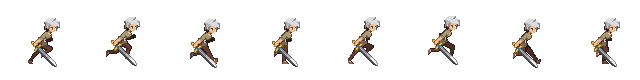

- Pour animer, on affiche qu’une seule partie de la feuille à l’aide d’une « fenêtre » qui se promène dans celle-ci pour donner l’impression d’animation

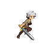

<!-- TODO : Faire une animation de fenêtre sur une feuille de sprite -->

---

# Ajouter une feuille dans Godot
- Glissez le fichier d'image dans le volet *FileSystem*
- Ensuite, vous aurez accès à ce fichier dans les ressources du projet

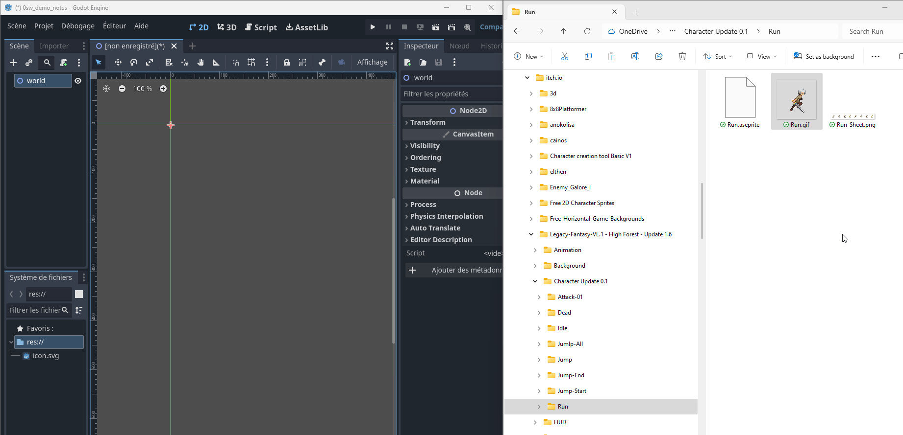

---

# AnimatedSprite
- Dans cette partie, nous allons voir comment utiliser une façon simple pour animer un sprite dans Godot
- Utilisez un `AnimatedSprite` pour animer un sprite dans Godot
- Voici une structure typique pour un personnage 2D qui inclut un `AnimatedSprite`:
  - CharacterBody2D
    - AnimatedSprite2D
    - CollisionShape2D
- Lien vers la documentation officielle: [AnimatedSprite](https://docs.godotengine.org/en/stable/tutorials/2d/2d_sprite_animation.html)
- Projet de démonstration: a20c02a_animatedSprite

---

## SpriteFrames
- Une fois que l’objet `AnimatedSprite` est dans la structure, il faudra lui assigner un `SpriteFrames` dans la propriété `Frames`
- Voici une méthode simple
  - Sélectionner l’AnimatedSprite, aller dans la propriété `Sprite Frames` et sélectionner `New SpriteFrames`
  - Dans le volet inférieur, on verra `SpriteFrames` apparaître
    - Si le volet n’apparaît pas, cliquer sur SpriteFrames
  - Ce volet sert à définir les animations

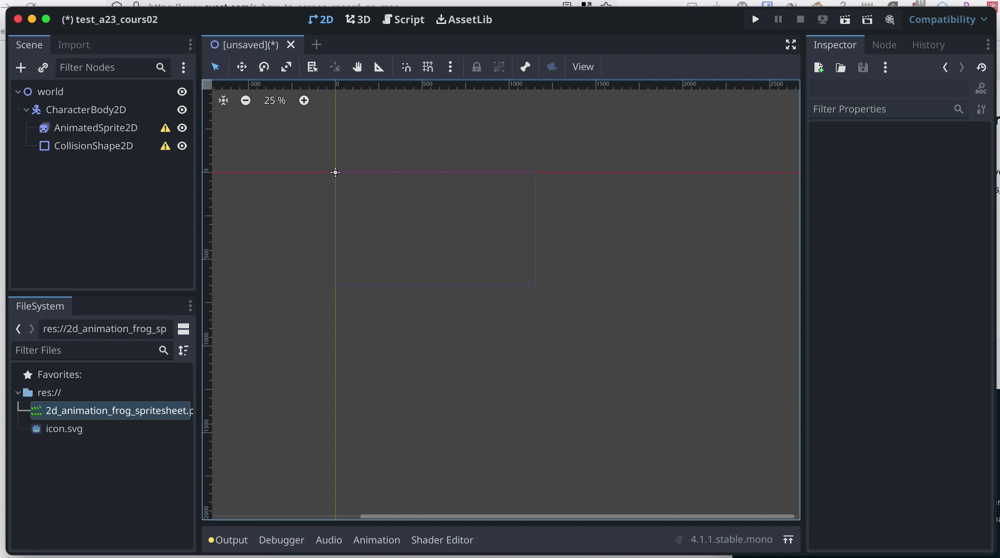

---

## Ajouter des images
- Dans la partie gauche du volet `SpriteFrames`, on y retrouve la liste des animations
  - Par défaut, on voit *default*
- Plusieurs façons existent pour ajouter des images dans l’animation
- Si on a plusieurs fichiers d’images pour l’animation dans le système de fichier, il suffit de les sélectionner et de les glisser dans la zone **Trames d’animation** (*Animation Frames*)

---

- L’utilisation d’un *sprite sheet* est favorable, car cela demande moins de ressource
- On peut utiliser le bouton `Add frame from sprite sheet` qui permet de sélectionner
- C’est le bouton qui ressemble à une grille
- Il suffira de sélectionner le fichier de la feuille d’images et ensuite de sélectionner les images désirées pour l’animation courante

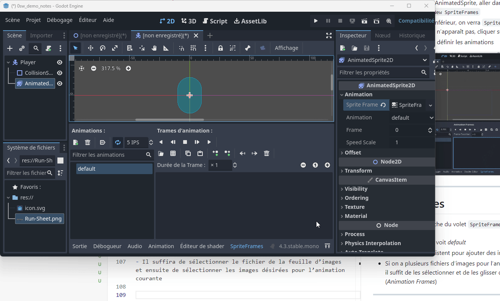

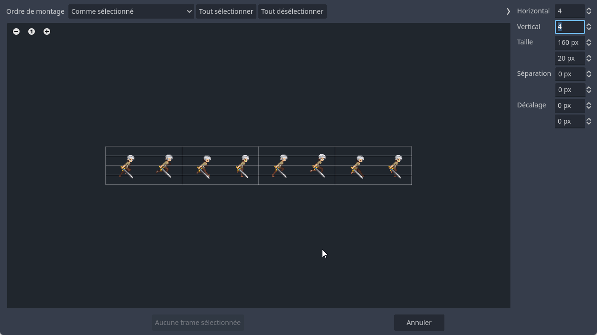

---

## Animer l’image
- Vous pouvez prévisualiser l’animation en cliquant sur le bouton Play dans SpriteFrames

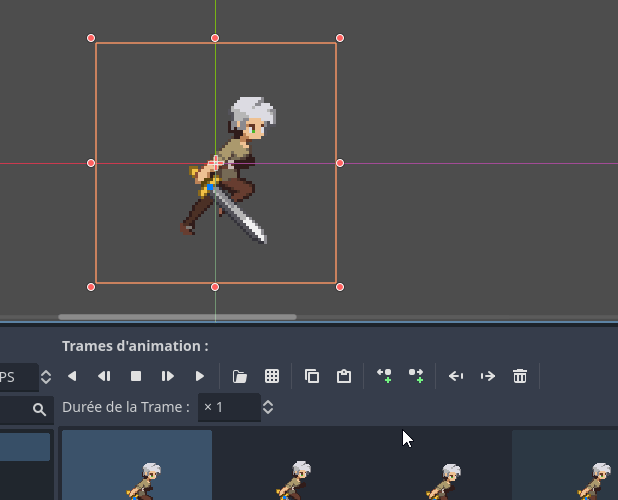

---

## Contrôler l’animation
Une fois que l'animation est prête, il est possible de contrôler l'animation à l'aide d'un script. Ajouter un script au noeud parent de l'AnimatedSprite2d et coller ce script simple en GDScript:

```gd
extends CharacterBody2D

@onready var _animated_sprite = $AnimatedSprite2D

func _process(_delta):
	if Input.is_action_pressed("ui_right"):
		_animated_sprite.play("run")
	else:
		_animated_sprite.stop()
```

> **Note**: Si on a suivi les étapes précédentes, il devrait y avoir un bogue. Pourquoi?

<!-- L'animation se nomme "default" au lieu de "run" -->

---

# Animer avec AnimationPlayer
- L'`AnimatedSprite` est une façon simple d'animer un sprite lorsqu'il y a peu d'animations
- Pour des animations plus complexes, il est préférable d'utiliser l'`AnimationPlayer`
- Il faudra un nœud `Sprite2D` pour afficher la texture, puis d'animer les changements de texture avec `AnimationPlayer`.

---

## Configuration de la scène

- Téléchargez la feuille de sprite ci-dessous et configurez votre scène.

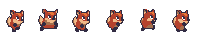

- Configurez l'arbre de scène avec les nœuds requis.

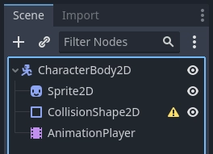

---

## Ajuster le nombre de cadres

- En ayant le nœud `Sprite2D` sélectionné, configurez les cadres en modifiant `Hframes` à 6.
  - C'est dans la section `Animation` de la propriété `Sprite2D`.

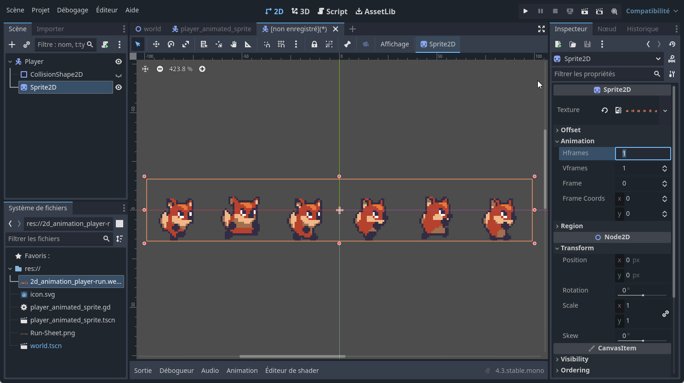

- Remarquez qu'il y a aussi la propriété `Vframes` qui représente le nombre de cadres verticaux.
- Les propriétés `Hframes` et `Vframes` sont utilisées pour diviser la feuille de sprite en cadres.

---

## Le volet `Animation`

- Vous devriez apercevoir un volet `Animation` dans le bas de la fenêtre de Godot. Cliquez sur le bouton `Animation` pour ouvrir le volet.
- C'est dans ce volet que vous pouvez ajouter des animations et des cadres.

---

## Ajouter une animation dans `AnimationPlayer`
- Cliquez sur le bouton `Animation` pour afficher le menu déroulant.
- Sélectionner `Nouveau...` pour ajouter une nouvelle animation.
- Dans la fenêtre qui apparaît, nommez l'animation "walk" et confirmez.

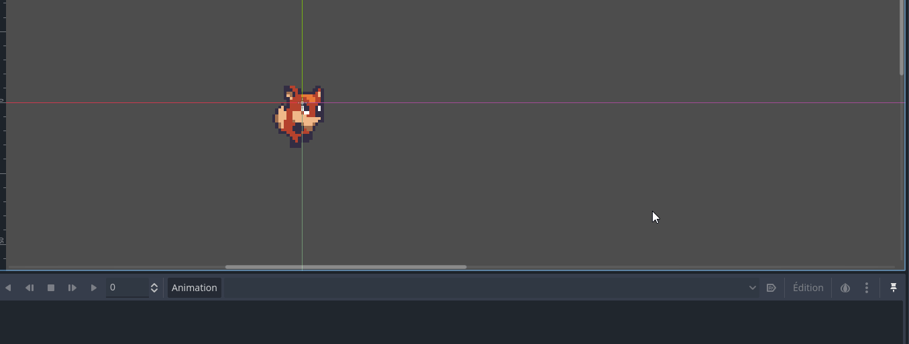

---

### Ajuster le temps de l'animation
- Dans le volet `Animation`, sélectionnez l'animation "walk".
- Au bout de la ligne de temps, cliquez où il est écrit 1.
- Inscrivez 0.6 pour ajuster la longueur de l'animation à 0.6 secondes.
- Ajustez la visualisation de la ligne de temps en maintenant la touche `Ctrl` enfoncée et en faisant défiler la souris sur la ligne de temps.

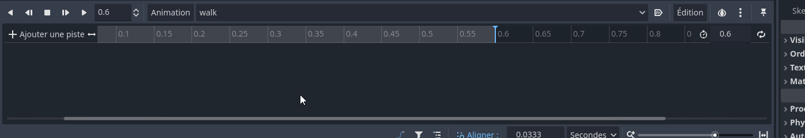

### Ajouter des cadres dans la timeline
- Dans la ligne du temps, cliquez sur le 0 pour ajuster le point de départ de l'animation.
  - Il s'agit de la petite ligne bleue sur la ligne du temps.
- Sélectionnez le noeud `Sprite2D` dans l'arbre de scène.
- Dans l'inspecteur, sélectionnez l'onglet `Animation`.
- Dans la propriété `Frames`, cliquez sur le bouton `+`
- Une fenêtre apparaîtra pour ajouter des cadres à l'animation.
- Cliquez sur `Créer` pour ajouter un cadre. 

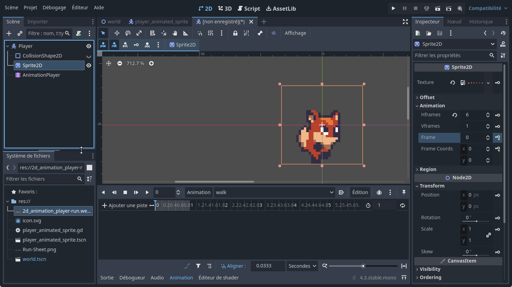

- Cette action ajouter une image à l'animation tout en ajoutant une piste dans le volet `Animation`.
- Cliquez encore sur le bouton `+` pour ajouter un autre cadre.
- Répétez cette étape pour ajouter les 6 cadres de l'animation.

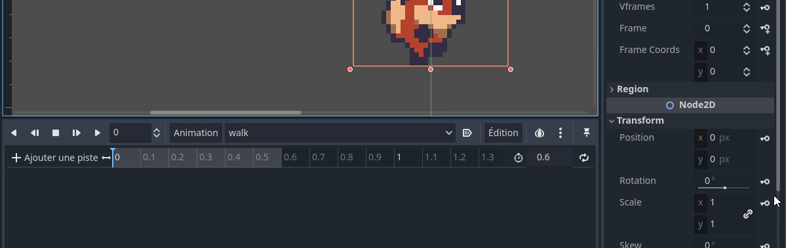

### Ajuster les cadres de l'animation
- Pour ajuster les cadres de l'animation, sélectionnez un cadre dans le volet `Animation`.
- Glissez le cadre pour ajuster l'ordre des cadres ainsi que l'emplacement dans la ligne du temps.

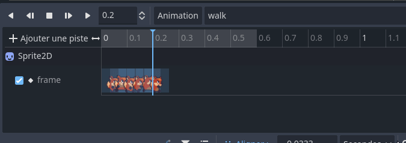

### Visualiser l'animation
- Pour visualiser l'animation, cliquez sur le bouton `Play` dans le volet `Animation`.
- On remarque que l'animation ne joue pas en boucle.
- Pour ajuster cela, sélectionnez l'animation dans le volet `Animation` et cochez le bouton `Loop`.
- Il se situe à la fin de la ligne du temps.

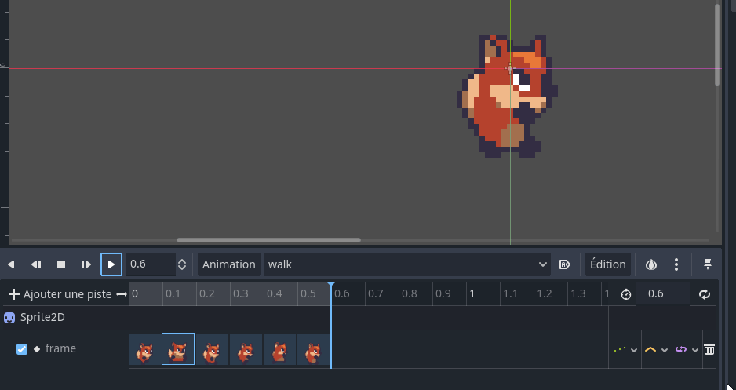

---

## Contrôler une animation avec `AnimationPlayer`

Tout comme avec `AnimatedSprite2D`, vous pouvez contrôler l'animation via code avec les méthodes `play()` et `stop()`. Voici un exemple similaire pour jouer l'animation pendant que la touche droite est enfoncée.

```gd
extends CharacterBody2D

@onready var _animation_player = $AnimationPlayer

func _process(_delta):
	if Input.is_action_pressed("ui_right"):
		_animation_player.play("walk")
	else:
		_animation_player.stop()

```

---

# Détail sur l'`AnimationPlayer`
- L'`AnimationPlayer` est un nœud qui permet, **entre autres**, de contrôler les animations dans Godot
- En fait l'`AnimationPlayer` est un contrôleur de valeurs
- Lorsque l'on a ajouté une animation, l'`AnimationPlayer` a contrôlé la propriété `frame` du `Sprite2D` pour changer l'image affichée
- L'`AnimationPlayer` peut contrôler n'importe quelle propriété d'un nœud dans Godot
- On pourrait faire varier la transparence, la position, la rotation, etc.

---

# Résumé
- Les sprites animés sont des images qui changent pour donner l'impression de mouvement
- Les sprites animés sont généralement des feuilles de sprites
- Les feuilles de sprites sont des images qui contiennent plusieurs images
- Pour animer un sprite dans Godot, on utilise un `AnimatedSprite` ou un `AnimationPlayer`
- `AnimatedSprite` est utilisé pour des animations simples
- `AnimationPlayer` est utilisé pour des animations plus complexes