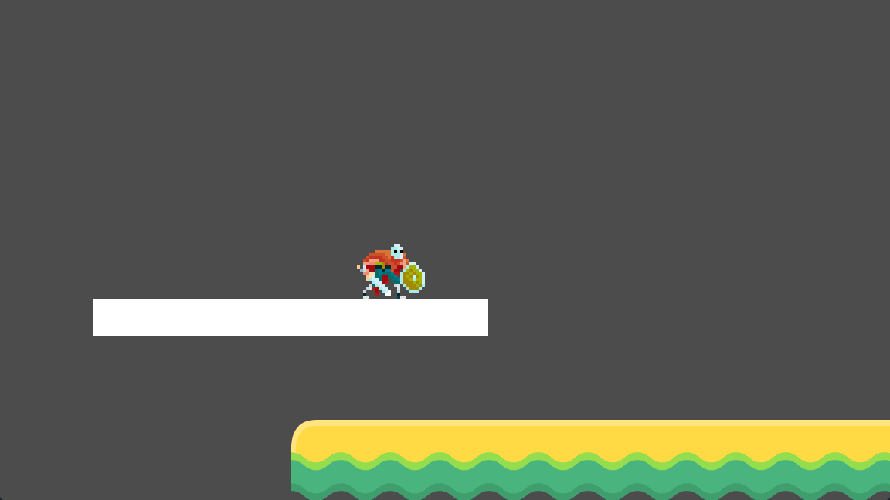
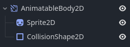
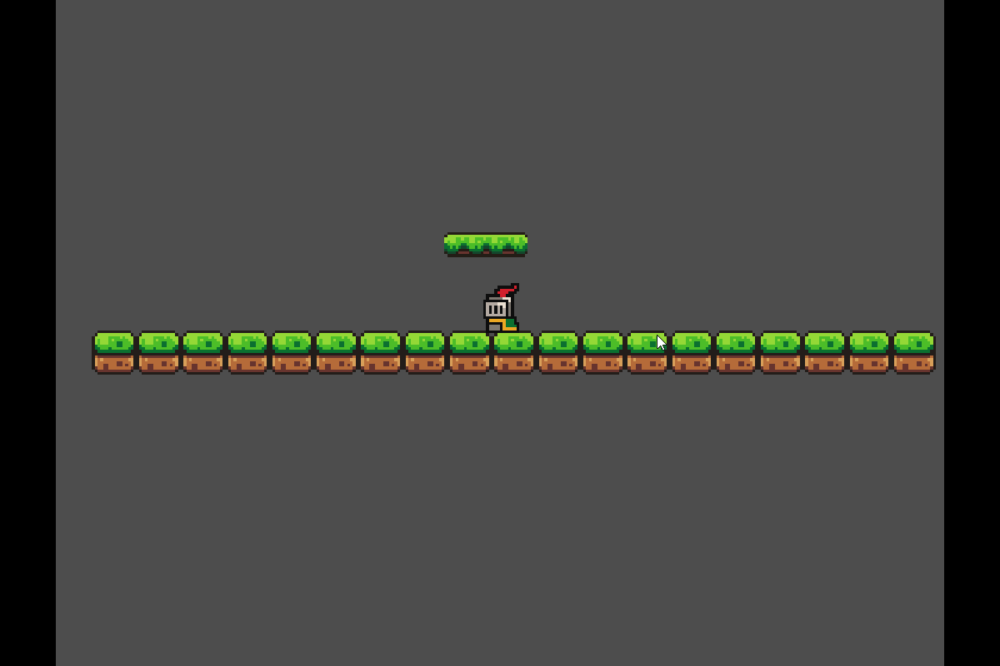
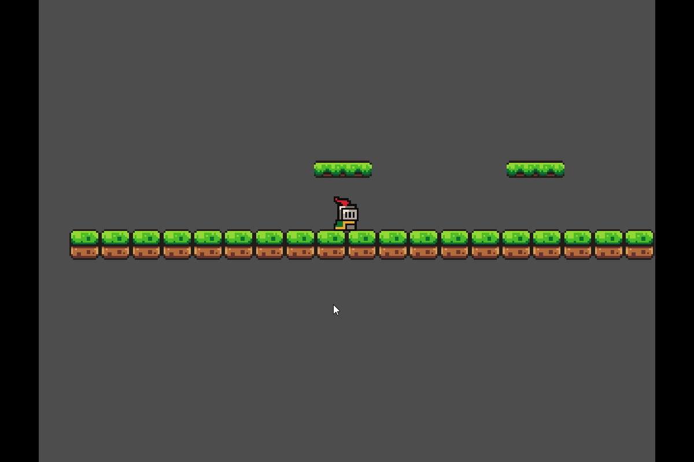
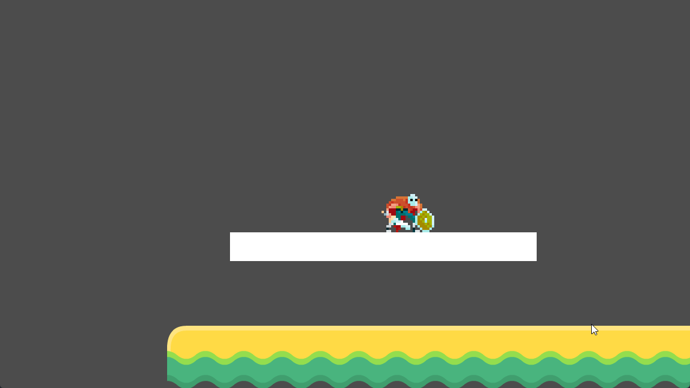

# Les plateformes mobiles <!-- omit in toc -->



# Table des matières <!-- omit in toc -->
- [Introduction](#introduction)
- [Noeud AnimatableBody2D](#noeud-animatablebody2d)
  - [Ajouter une plateforme](#ajouter-une-plateforme)
  - [Corriger l'ordre de rendu](#corriger-lordre-de-rendu)
  - [Collision à sens unique](#collision-à-sens-unique)
- [Ajouter le déplacement avec un AnimationPlayer](#ajouter-le-déplacement-avec-un-animationplayer)
- [Matière optionnelle](#matière-optionnelle)
  - [Qu'est-ce qu'un Tween ?](#quest-ce-quun-tween-)
    - [Exemple de code](#exemple-de-code)
      - [Explication des Principales Lignes](#explication-des-principales-lignes)
    - [Les méthodes d'intérêt de la classe `Tween`](#les-méthodes-dintérêt-de-la-classe-tween)
    - [Conclusion](#conclusion)
- [Références](#références)


# Introduction
Dans bien des jeux de type plateforme, les plateformes mobiles sont un élément essentiel pour créer des niveaux intéressants et stimulants. Dans cette leçon, nous allons apprendre à créer une plateforme mobile qui se déplace de manière fluide entre deux positions.

Il y a plusieurs façons de créer des plateformes mobiles dans Godot.

- Utiliser un `AnimationPlayer` pour animer les déplacements
  - Désavantage : Les animations sont fixes et ne peuvent pas être facilement modifiées.
- Utiliser un `Tween` pour créer des transitions entre les positions
- Calculer les déplacements en fonction du temps.
- Utiliser les noeuds `Path2D` pour définir des trajectoires de déplacement.

Dans cette leçon, nous allons utiliser une `Tween` pour créer une plateforme mobile.

---

# Noeud AnimatableBody2D

Un noeud qui facilite la création de plateformes mobiles est `AnimatableBody2D`. Ce nœud est similaire à `CharacterBody2D`, mais avec des fonctionnalités de mouvement animables. Il permet de gérer des objets mobiles avec des interactions physiques, tels que des plateformes ou des personnages, tout en conservant des mouvements interpolés.

Il nécessite un `CollisionShape2D` pour détecter les collisions et idéalement un noeud qui permet d'afficher l'image de la plateforme qui peut être un sprite ou un autre type de noeud. J'utilise dans mon exemple initial un `Sprite2D` pour afficher la plateforme.



## Ajouter une plateforme
1. Dans la scène principale, ajoutez la scène de la plateforme que vous avez créée.
2. Exécutez la scène principale.



## Corriger l'ordre de rendu
Si le joueur apparaît derrière la plateforme, vous pouvez ajuster l'ordre de rendu en modifiant la propriété `Z Index` du noeud joueur. Il suffit de mettre une valeur plus élevée que celle de la plateforme. Dans mon cas, j'ai mis `5` pour le joueur.

## Collision à sens unique
Pour permettre au joueur de sauter à travers la plateforme mobile, vous pouvez activer la propriété `One Way Collision` du `CollisionShape2D` de la plateforme. Cela permet au joueur de monter sur la plateforme depuis le bas, mais empêche de tomber à travers lorsqu'il est dessus.

# Ajouter le déplacement avec un AnimationPlayer
Pour animer la plateforme, vous pouvez utiliser un `AnimationPlayer` pour créer une animation qui déplace la plateforme entre deux positions. Voici comment faire :

1. Ajoutez un noeud `AnimationPlayer` en tant qu'enfant de votre plateforme.
2. Dans l'éditeur d'animation, créez une nouvelle animation.
3. Ajoutez une clé pour la propriété `position` de la plateforme au début de l'animation.
4. Déplacez la plateforme à la position souhaitée et ajoutez une clé pour la propriété `position` à la fin de l'animation.
5. Réglez la durée de l'animation selon vos besoins.
6. Activez l'option de boucle pour que l'animation se répète indéfiniment en aller-retour.
7. Activez l'animation en tant qu'animation par défaut.
8. Exécutez la scène principale.



---


# Matière optionnelle
## Qu'est-ce qu'un Tween ?
Les **Tweens** (diminutif de "in-betweens") trouvent leur origine dans l'animation traditionnelle, où ils désignent les images créées entre des images clés pour produire un mouvement fluide. Ce concept est devenu populaire avec des outils numériques comme **Adobe Flash**, où le **tweening** permettait aux animateurs de créer facilement des transitions douces pour des propriétés comme la position, la rotation, l’échelle ou la couleur. Flash a introduit différents types de tweens (tels que les **shape tweens** et **motion tweens**) pour simplifier l'animation des objets au fil du temps.

- **Définition** : Un Tween est un objet ou une technique utilisée pour créer une transition fluide entre deux valeurs de propriétés (position, rotation, échelle, opacité, etc.).
- **Interpolation** : Les Tweens interpolent progressivement entre des valeurs initiales et finales sur une période définie.
- **Utilité** :
  - **Animation d'objets** : Déplacement ou rotation d'objets de manière fluide.
  - **Transitions de propriétés** : Modifier des propriétés visuelles telles que la couleur ou l’opacité.
  - **Facilite l'animation** : Simplifie la gestion des animations sans créer de multiples étapes manuelles.
- **Modes de traitement** : Peut être utilisé dans les processus physiques ou indépendamment du temps de simulation.

On peut utiliser les tweens avec le concept `fire-and-forget` : on crée un tween, on le lance, et on n'a plus besoin de s'en soucier. Le tween s'occupe de lui-même et s'arrête automatiquement une fois qu'il a terminé.

### Exemple de code
Voici le code qui est derrière la plateforme mobile dans l'animation initiale.

```gdscript
extends Node2D

@export var offset = Vector2(350, 0)
@export var duration = 6.0

@onready var anim_body : AnimatableBody2D = $AnimatableBody2D

func _ready() -> void:
	start_tween()

func start_tween():
	var tween = get_tree().create_tween().set_process_mode(Tween.TWEEN_PROCESS_PHYSICS) as Tween
	tween.set_loops().set_parallel(false)
	tween.tween_property(anim_body, "position", offset, duration / 2)
	tween.tween_property(anim_body, "position", Vector2.ZERO, duration)

```

#### Explication des Principales Lignes

- **Ligne 1-2** :
  - `offset` détermine la distance de déplacement de la plateforme à partir de la position initiale, et 
  - `duration` contrôle la durée de l’animation.
- Fonction **`start_tween`** :
  - Crée une `Tween` dans la racine de l'arbre de scène et active le mode de traitement physique
  - `set_loops().set_parallel(false)` : Indique que doit être exécuté en boucle et en série. En effet, on peut avoir plusieurs animations en parallèle.
  - Deux déplacements sont définis :
    - **Déplacement vers `offset`** pendant la première moitié de la durée.
    - **Retour à la position initiale** pendant la durée entière.

Cette structure permet de créer une plateforme mobile avec des transitions fluides entre les positions définies.

### Les méthodes d'intérêt de la classe `Tween`
Plusieurs méthodes de la classe `Tween` peuvent être utilisées pour créer des animations plus complexes :

| Méthode | Description | Exemple |
| --- | --- | --- |
| `tween_property` | Anime une propriété d'un objet | `tween.tween_property($Sprite2D, "position", offset, duration / 2)` |
| `tween_method` | Appel une méthode d'un objet en fournissant des propriétés *tweener* | `tween.tween_method($Sprite2D, "set_position", offset, Vector2.ZERO, duration)` |
| `tween_callback` | Appel une fonction de rappel à la fin de l'animation | `tween.tween_callback(self, "_on_tween_completed")` |
| `set_loops()` | Définit le nombre de boucles de l'animation. | `tween.set_loops(2)` |
| `set_parallel()` | Définit si les animations doivent être exécutées en parallèle. | `tween.set_parallel(true)` |
| `set_trans()` | Définit la fonction d'interpolation utilisée pour l'animation | `tween.set_trans(Tween.TRANS_SPRING)` |



Il y a plusieurs autres méthodes qui peuvent être intéressantes pour votre projet. Je vous suggère d'aller voir la [documentation officielle](https://docs.godotengine.org/en/stable/classes/class_tween.html) pour plus d'informations.


### Conclusion
Les `Tween` peuvent être utilisés pour créer des effets intéressants pour votre projet. Je vous encourage à explorer les différentes méthodes et options disponibles adaptées à vos besoins.

---

# Références
- [Godot Engine : Tween](https://docs.godotengine.org/en/stable/classes/class_tween.html)