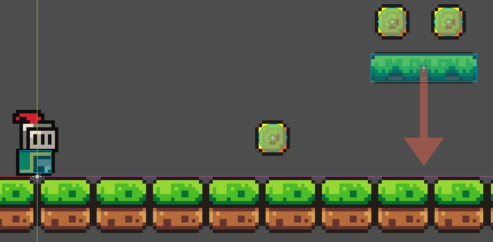
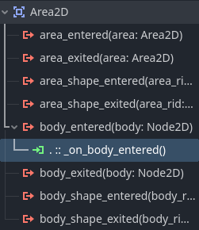
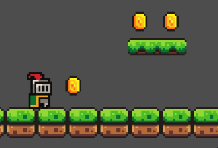

# Leçon 7 - Ajouter des pièces à ramasser

Pour rendre le jeu plus amusant, on peut ajouter des pièces (ou objets) à ramasser.

## Étape 1 : Créer une scène "Pièce"
1. Créez une nouvelle scène.
2. Ajoutez un nœud "Area2D" (pour détecter la collision avec le joueur).
3. Ajoutez un nœud "Sprite2D" pour l'image de la pièce.
4. Ajoutez un nœud "CollisionShape2D" pour la collision.
5. Renommez la scène en "Coin" et enregistrez-la.
6. Placez quelques pièces dans la scène principale.

Voici mon résultat du montage :





## Étape 2 : Détecter la collecte

1. Ajoutez un script au nœud "Area2D".
2. Dans le nœud "Area2D", connectez le signal "body_entered".
    
3. Ajoutez un script simple pour faire disparaître la pièce quand le joueur la ramasse.
    

Exemple de script :
```gdscript
func _on_body_entered(body: Node2D) -> void:
	print("Coin collected!")
	queue_free()

```

4. Exécutez le jeu et testez la collecte des pièces.
5. Mettez une pièce devant une plateforme mobile et remarquez le problème.
  - En effet, la pièce disparaît lorsque la plateforme touche la pièce. Pour éviter cela, on peut utiliser les masques de collision.
6. Dans la scène du joueur, sélectionnez le nœud "CharacterBody2D" et dans l'inspecteur, sous "Collision", définissez le `Collision Layer` à `2` (Player).
7. Dans la scène de la pièce, sélectionnez le nœud "Area2D" et dans l'inspecteur, sous "Collision", définissez le collision `Mask` à `2` (Player).

---

# Exercices
- Ajoutez des pièces dans les endroits stratégiques de votre niveau.
- Ajoutez d'autres types d'objets à ramasser (ex : gemmes, power-ups).