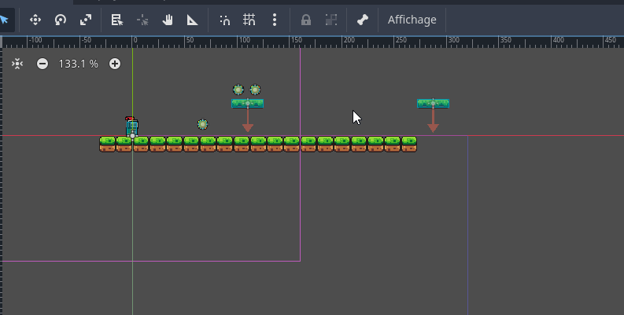
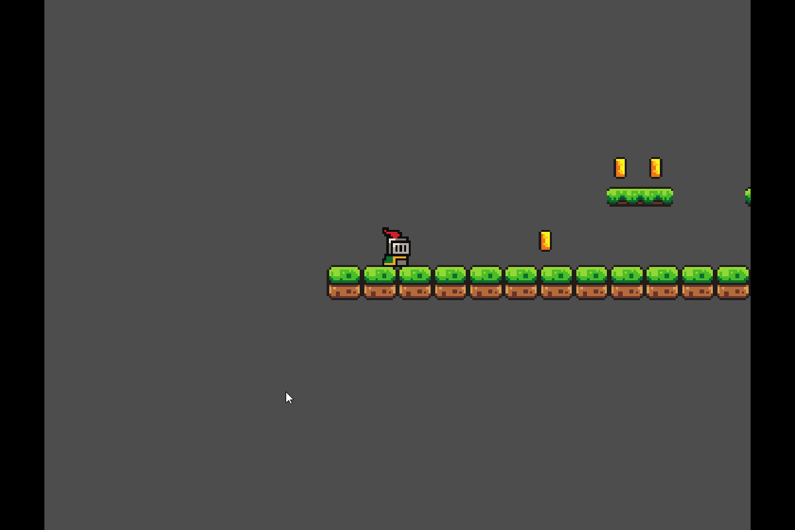

# Mourir <!-- omit in toc -->

# Table des matières <!-- omit in toc -->
<!-- Générer la table des matières automatiquement avec l'extension Markdown All in One -->

---

# Introduction
Dans le jeu actuel, lorsque le joueur tombe dans un trou, il continue à tomber indéfiniment.

---

# Mesurer la hauteur de la chute
1. Avez l'outil de mesure, mesurez la hauteur à laquelle on ne veut pas que la caméra aille plus bas.
2. Notez cette valeur, nous allons l'utiliser pour configurer les limites de la caméra.
 


# Configurer les limites de la caméra
1. Sélectionnez le nœud `Camera2D` dans la scène principale.
2. Dans l'inspecteur, sous la section `Limites (Limits)`, modifiez la valeur `Bottom` à la hauteur mesurée précédemment.
3. Tant qu'à être là, cochez l'option `Smoothed` pour que la caméra bouge en douceur.

# Créer une zone de mort (*Kill Zone*)
1. Créez une nouvelle scène.
2. Ajoutez un nœud `Area2D` et renommez-le en `KillZone`.
3. N'ajoutez pas de `CollisionShape2D` pour cette zone, car nous voulons réutiliser cette scène.
4. Configurez le masque de collision (`Collision Mask`) pour qu'il détecte uniquement le joueur (Layer 2).
5. Sauvegardez la scène dans le dossier `scenes` avec le nom `KillZone.tscn`.
6. Revenez à la scène principale et instanciez la scène `KillZone`.
7. Ajoutez un nœud enfant `CollisionShape2D` à la scène `KillZone`.
8. Pour la propriété `Shape` du `CollisionShape2D`, choisissez `WorldBoundaryShape2D`.
9. Déplacez le nœud `KillZone` en dessous de la caméra, juste en dessous de la limite inférieure.

## Ajoutezz la détection de collision
10. Ajoutez un script à la scène `KillZone` pour gérer la détection de collision avec le joueur.
11. Dans le script, connectez le signal `body_entered` pour détecter quand le joueur entre dans la zone de mort.
12. Pour tester, affichez un message dans la console lorsque le joueur entre dans la zone de mort.

```gdscript
func _on_body_entered(body: Node2D) -> void:
	print("Player entered killzone")
```

Au lieu de faire disparaître le joueur immédiatement, nous allons ajouter un délai avant de le faire réapparaître.

13. Ajoutez une minuterie (`Timer`) à la scène `KillZone`
14. Configurez le délai à, disons, 0.6 seconde et cochez `One Shot`
15. Connectez le signal `timeout` du `Timer` pour réapparaître le joueur.

16. Modifiez le script pour celui-ci :

```gdscript

@onready var timer = $Timer

func _on_body_entered(body: Node2D) -> void:
	print("Player entered killzone")
	timer.start()

func _on_timer_timeout() -> void:
	get_tree().reload_current_scene()

```

17. Testez le jeu, lorsque le joueur tombe dans la zone de mort, il devrait réapparaître au début de la scène après un délai.



---
# Références
- TODO : Ajouter les références...