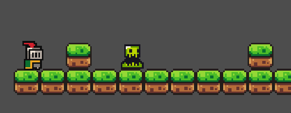
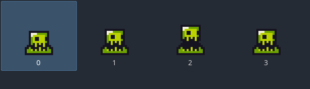
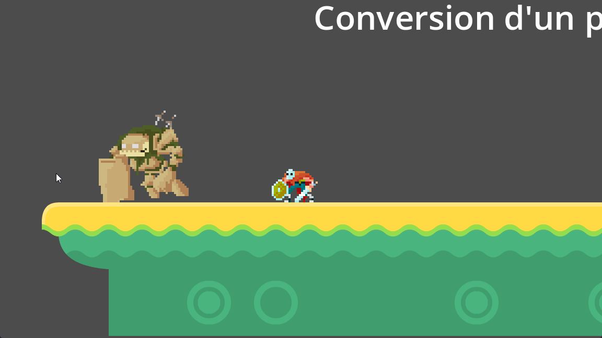
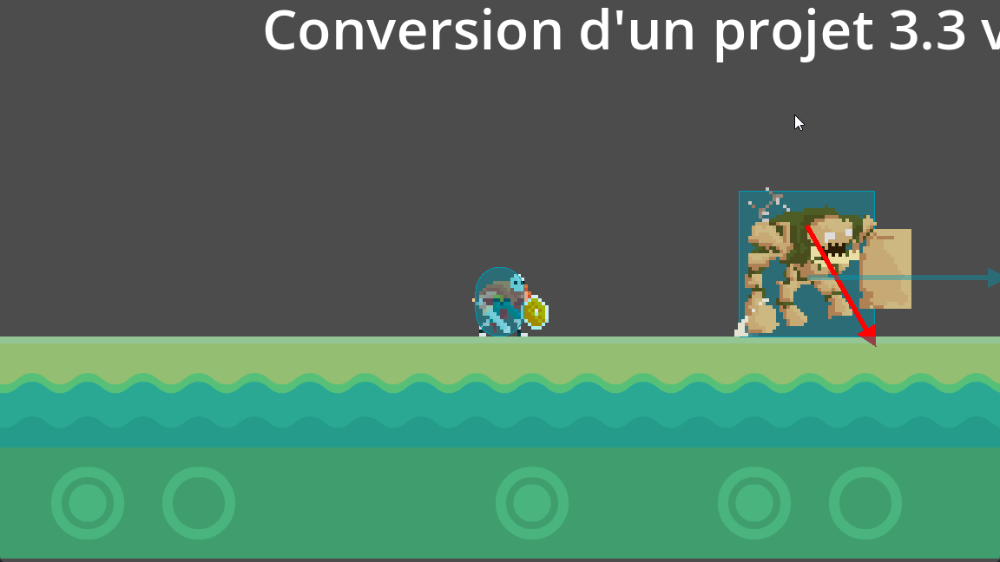
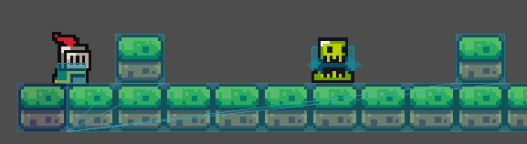
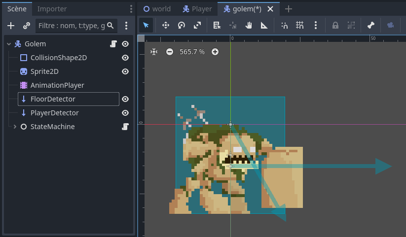
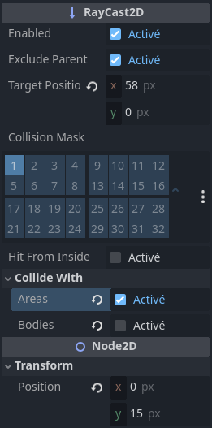
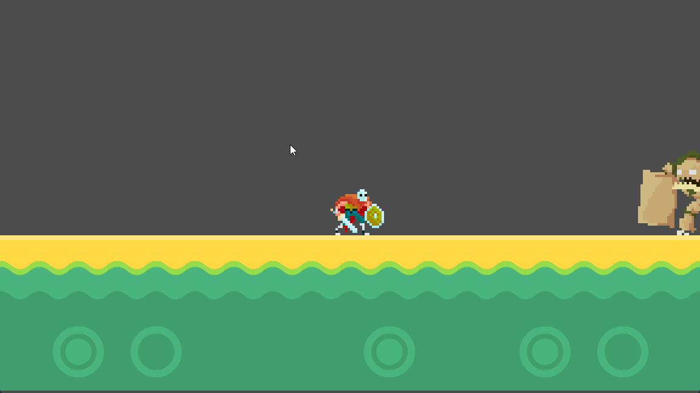
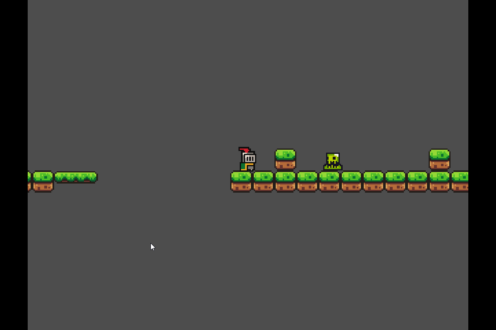
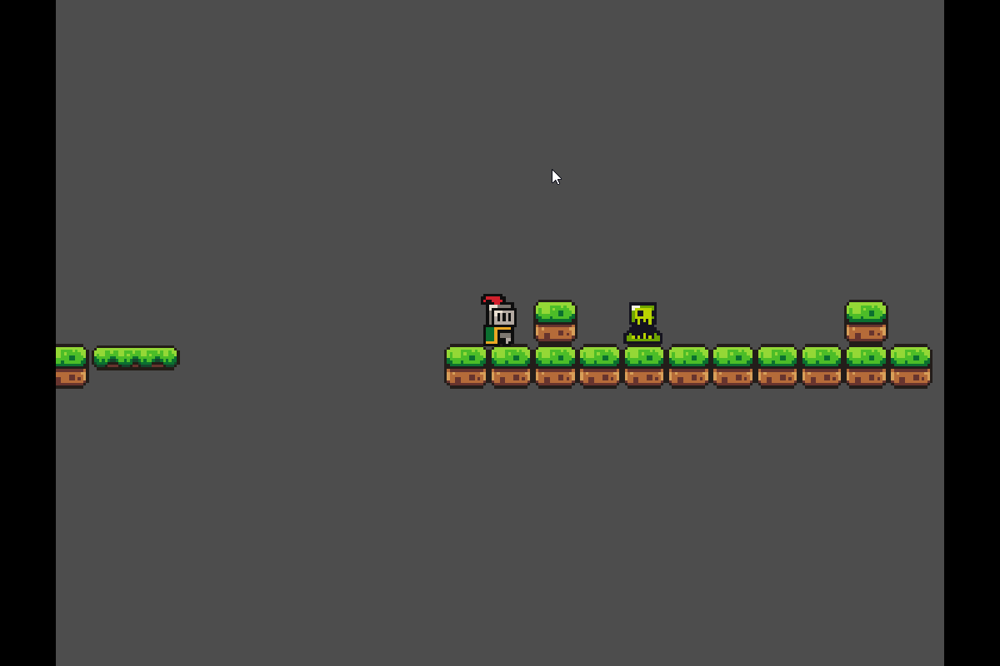

# Le ray casting <!-- omit in toc -->

# Table des matières <!-- omit in toc -->
- [Introduction](#introduction)
- [Ajouter un ennemi - Recette rapide](#ajouter-un-ennemi---recette-rapide)
  - [Script de déplacement de base](#script-de-déplacement-de-base)
- [RayCasting](#raycasting)
  - [Comment ça marche](#comment-ça-marche)
- [Noeud RayCast2D](#noeud-raycast2d)
- [Dans le code](#dans-le-code)
- [Fonctions utiles](#fonctions-utiles)
- [Conclusion](#conclusion)
- [Extra - Améliorer la mort](#extra---améliorer-la-mort)
- [Références](#références)

---



# Introduction
Dans ce chapitre, nous allons voir comment ajouter un ennemi rapidement et ensuite ajouter du ray casting pour qu'il puisse détecter le joueur et les obstacles.

Le ray casting est une technique dans laquelle on émet un rayon depuis un point donné dans une direction donnée, et on regarde ce que ce rayon touche. C'est une technique très utilisée dans les jeux vidéos pour simuler la lumière, les ombres et la détection d'objets.

La partie qui nous intéresse est la détection d'objets. En effet, le ray casting est utilisé pour détecter les collisions entre objets, et pour déterminer ce que le rayon touche.

La première étape sera d'ajouter un ennemi qui se déplace de gauche à droite. Ensuite, nous allons ajouter du ray casting pour qu'il puisse détecter le bout de la plateforme et changer de direction. Enfin, nous allons ajouter un autre rayon pour qu'il puisse détecter le joueur et changer d'état.

---

# Ajouter un ennemi - Recette rapide
Dans notre cas, nous allons ajouter un ennemi qui se déplace entre deux murs. Pour cela, nous allons créer une nouvelle scène avec un `Node2D` comme noeud racine. On aurait pu prendre un `CharacterBody2D`, mais dans notre cas, l'ennemi n'a pas besoin de sauter, donc un `Node2D` suffit.

Nous allons ensuite ajouter un `AnimatedSprite2D` pour animer l'ennemi.

Nous avons précédemment créer une scène qui se nomme `Killzone`. La beauté de cette scène est qu'elle contient le script pour gérer les collisions avec le joueur. Il nous restera à ajouter une collision en tant qu'enfant de la `Killzone`.

Ainsi la structure de l'ennemi sera la suivante:

```
Enemy (Node2D)
 ├── AnimatedSprite2D
 ├── Killzone
 └──── CollisionShape2D
```

Pour l'`AnimatedSprite2D`, j'ai utilisé un sprite dans les assets du cours. Vous pouvez utiliser n'importe quel sprite.



- Placez l'ennemi sur la scène principale.

## Script de déplacement de base
Dans sa première version, je veux que l'ennemi se déplace.

Je vais avoir besoin d'un script où dans le `_process(delta)` je vais déplacer l'ennemi.

```gd
func _process(delta: float) -> void:
	position.x += speed * delta
```

Si on lance la scène, on remarque que l'ennemi sort de l'écran. Pour éviter cela, il manque un élément important: Le ray casting.

---

# RayCasting
Observez le gif ci-dessous. L'ennemi (Golem) est capable de détecter le bout de la plateforme et de changer de direction. Cela est possible grâce au ray casting.



Voici ce à quoi ressemble le ray casting avec le debug activé.





## Comment ça marche
Dans les gifs précédents, on remarque qu'il y a deux flèches qui partent de l'ennemi. Ces flèches représentent les rayons. On envoie un rayon dans chaque direction, et on regarde ce que le rayon touche. Si le rayon ne touche plus le sol, alors on change de direction.

---

# Noeud RayCast2D
Godot propose un noeud `RayCast2D` qui permet de faire du ray casting en 2D. Ce noeud permet de détecter les collisions entre objets, et de déterminer ce que le rayon touche.

Son utilisation est relativement simple. Il suffit de placer un noeud `RayCast2D` dans la scène, et de le configurer pour qu'il détecte les collisions.

Voici la scène qui a été utilisée pour les gif précédents



J'ai renommé les noeuds `RayCast2D` en `FloorDetector` et `PlayerDetector` pour plus de clarté.

Les paramètres du `RayCast2D` qui nous intéressent sont les suivants:
- `Target Position`: La position de la cible du rayon. C'est la direction dans laquelle le rayon est envoyé.
- `Collision Mask`: Le masque de collision. Les objets qui sont sur le même masque de collision que le rayon peuvent être détectés.
- `Collide with ...`: Les types d'objets avec lesquels le rayon peut entrer en collision.
  -  `Areas`: Les noeuds `Area2D`
  -  `Bodies`: Les noeuds `PhysicsBody2D`
- `Position`: La position du noeud `RayCast2D`. C'est le point de départ du rayon.



**Question :** Avec les propriétés indiquées dans l'image ci-dessus, quelle flèche est représentée : le `FloorDetector` ou le `PlayerDetector`? Pourquoi?

---

# Dans le code
Pour détecter les collisions avec un `RayCast2D`, il suffit de vérifier si la méthode `is_colliding()` retourne `true`. Si c'est le cas, alors le rayon touche un objet.

```gd
  # Code du Golem
	if not floor_detector.is_colliding():
        character.direction *= -1
        floor_detector.target_position.x *= -1
        player_detector.target_position.x *= -1
```

Remarquez que le code ci-dessus est utilisé pour changer la direction du Golem. Si le rayon ne touche plus le sol, alors on change de direction. On doit aussi changer la direction du rayon pour qu'il soit envoyé dans la bonne direction.

Dans le code précédent, on ne regarde pas le type d'objet avec lequel le rayon entre en collision. Ainsi n'importe quel objet peut être détecté par le rayon. Cela pourrait être une source de bogue, mais dans notre cas, cela ne pose pas de problème.

Si l'on veut détecter un type d'objet spécifique, on peut utiliser la méthode `get_collider()` pour obtenir le noeud avec lequel le rayon entre en collision. Ensuite, on peut vérifier le type de l'objet avec lequel le rayon entre en collision.

```gd
func handle_player():
	if (player_detector.is_colliding()) :
        # On récupère le noeud avec lequel le rayon entre en collision
		var collider = player_detector.get_collider()
		
		if collider == player:
			# Player détecté
            # On change d'état
			Transitioned.emit(self, "dash")
			return
```



Voici le code de l'exemple avec le Slime.

```gd
extends Node2D

var speed : float = 60.0
var dir : int = 1

@onready var ray_cast_right: RayCast2D = $RayCastRight
@onready var ray_cast_left: RayCast2D = $RayCastLeft

func _process(delta: float) -> void:
	if ray_cast_right.is_colliding() or ray_cast_left.is_colliding()  :
		dir = -dir
		$AnimatedSprite2D.flip_h = dir < 0
	position.x += dir * speed * delta
```


---

# Fonctions utiles
- `is_colliding()`: Retourne `true` si le rayon touche un objet.
- `get_collider()`: Retourne la référence avec laquelle le rayon entre en collision.
- `get_collision_point()`: Retourne le point de collision.
- `get_collision_normal()`: Retourne la normale de la collision.

---

# Conclusion
- Le ray casting est une technique très utilisée dans les jeux vidéos pour détecter les collisions entre objets.
- Godot propose un noeud `RayCast2D` qui permet de faire du ray casting en 2D.
- Il suffit de vérifier si la méthode `is_colliding()` retourne `true` pour savoir si le rayon touche un objet.
- On peut utiliser la méthode `get_collider()` pour obtenir le noeud avec lequel le rayon entre en collision.
- On peut utiliser le masque de collision pour détecter un type d'objet spécifique.

---

# Extra - Améliorer la mort
Un petit *side track*, on aimerait améliorer la mort de l'ennemi. Actuellement, lorsqu'on le touche, la scène est rechargée. On aimerait plutôt que le joueur tombe lorsqu'il touche l'ennemi et aussi ajouter un effet de ralentissement.

Pour ce faire, nous allons débuter par modifier le script de la `Killzone`. Si vous remarquez, on a accès au joueur qui entre en collision avec la `Killzone`. En effet, le paramètre `body` de la fonction `_on_body_entered(body: Node)` est le noeud du joueur. Ce que l'on va faire est de retirer la `CollisionShape2D` du joueur pour qu'il puisse tomber.

```gd
func _on_body_entered(body: Node2D) -> void:
	print("Player entered killzone")
	body.get_node("CollisionShape2D").queue_free()
	timer.start()
```

- Testez la scène. Le joueur devrait tomber lorsqu'il touche l'ennemi.




On veut maintenant ajouter un effet de ralentissement. Pour ce faire, on va utiliser la fonction `Engine.time_scale` qui permet de modifier la vitesse du jeu.

```gd
func _on_body_entered(body: Node2D) -> void:
	print("Player entered killzone")
	Engine.time_scale = 0.5
	body.get_node("CollisionShape2D").queue_free()
	timer.start()

func _on_timer_timeout() -> void:
	Engine.time_scale = 1
	get_tree().reload_current_scene()
```

Il faudra faire attention de remettre la vitesse du jeu à 1 avant de recharger la scène. Sinon, la scène sera rechargée au ralenti.




---

# Références
- [RayCast In Godot Tutorial: How To Create Smarter Enemies (Enemy AI)](https://www.youtube.com/watch?v=_AheThiIiyg)
- [KidsCanCode - Godot Recipes - RayCast2D](https://kidscancode.org/godot_recipes/4.x/kyn/raycast2d/index.html)
- [How to use RayCast2D in Godot]([https](https://youtu.be/VqyxnKuAUH8?si=yhb4MgAw16hCczqK)