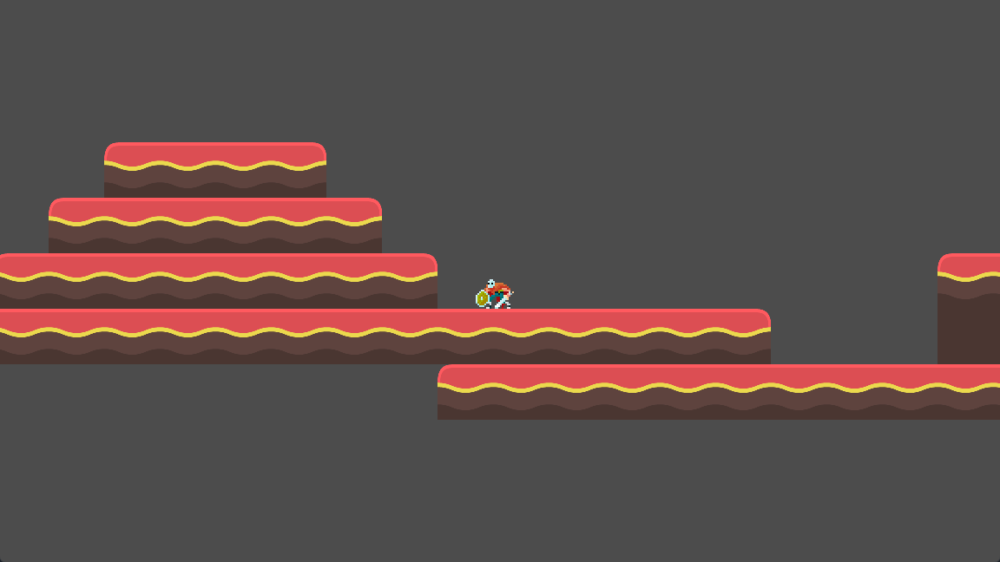
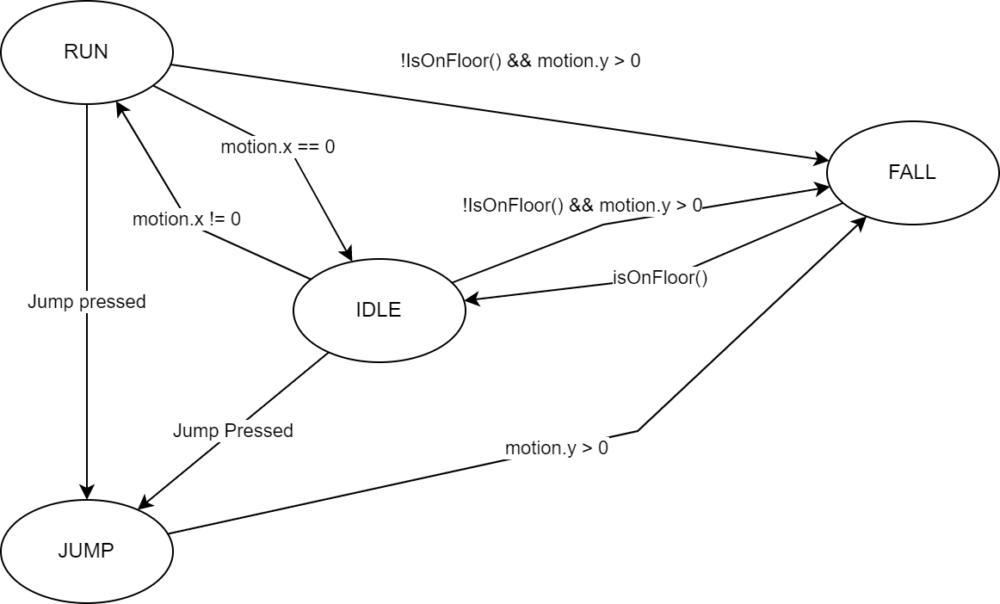
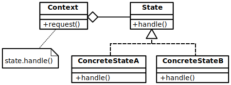
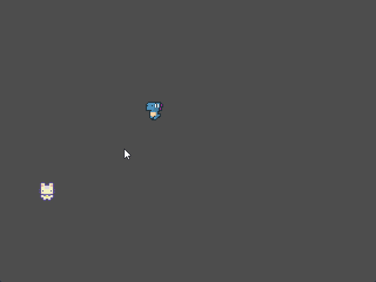

# La machine à état fini <!-- omit in toc -->
Améliorons nos personnages!

# Plan de leçon <!-- omit in toc -->
- [Introduction : Une approche par l'absurde](#introduction--une-approche-par-labsurde)
  - [Pourquoi par l'absurde?](#pourquoi-par-labsurde)
  - [Ce que vous apprendrez](#ce-que-vous-apprendrez)
- [Applicabilité dans le développement de logiciels standards](#applicabilité-dans-le-développement-de-logiciels-standards)
- [Étude de cas](#étude-de-cas)
- [Machine à état fini](#machine-à-état-fini)
  - [Principe de Single Responsibility (Responsabilité Unique)](#principe-de-single-responsibility-responsabilité-unique)
    - [Exemple](#exemple)
  - [Résumé](#résumé)
- [Projet Godot](#projet-godot)
  - [Modification au code](#modification-au-code)
  - [Solution intermédiaire](#solution-intermédiaire)
    - [Diagramme d'états](#diagramme-détats)
  - [Solution intermédiaire : Modification du code](#solution-intermédiaire--modification-du-code)
  - [Résumé de la solution temporaire](#résumé-de-la-solution-temporaire)
- [Design pattern : L'état](#design-pattern--létat)
- [Implémentation dans Godot](#implémentation-dans-godot)
  - [`BaseState`](#basestate)
  - [`StateMachine`](#statemachine)
  - [Ajouter la machine à état au joueur](#ajouter-la-machine-à-état-au-joueur)
  - [Solutions complètes](#solutions-complètes)
- [Conclusion](#conclusion)
- [Références](#références)

---

# Introduction : Une approche par l'absurde

Aujourd'hui, nous allons introduire un concept clé dans le développement de jeux vidéo : la **machine à états finis** (FSM). Pour bien comprendre pourquoi la FSM est une solution puissante, nous allons d'abord explorer une approche alternative... qui ne fonctionne pas très bien.

## Pourquoi par l'absurde?
Plutôt que de plonger directement dans le concept de la FSM, nous allons commencer par examiner du code qui, à première vue, peut sembler correct, mais qui comporte de nombreux problèmes de conception. Ce code va nous servir de point de départ pour découvrir les difficultés d'une approche simple (et erronée) à la gestion des comportements complexes de notre personnage.

## Ce que vous apprendrez
- Vous verrez comment une implémentation naïve de la gestion des états d'un personnage peut rapidement devenir ingérable.
- Vous découvrirez les pièges classiques, comme les bogues qui apparaissent lorsqu'on ajoute de nouvelles fonctionnalités, les difficultés de maintenir du code avec de multiples conditions, et la complexité croissante des transitions entre les comportements.
- Vous comprendrez, étape par étape, comment une FSM peut simplifier la gestion des états de votre personnage et pourquoi il s'agit d'un design pattern essentiel dans la création de jeux vidéo.

À travers cette méthode par l'absurde, nous vous montrerons que même si une solution simple peut sembler fonctionner initialement, elle devient rapidement une source de bugs et de difficultés. Cela nous amènera naturellement à introduire la FSM comme une solution propre, modulaire, et extensible pour gérer les comportements complexes dans vos jeux.

---

# Applicabilité dans le développement de logiciels standards

Bien que notre point de départ soit le développement de jeux vidéo, la **machine à états finis** (FSM) est un concept largement utilisé dans de nombreux domaines de l'ingénierie logicielle. Comprendre comment implémenter et utiliser une FSM vous servira également dans le développement de logiciels "standards". Voici quelques exemples concrets :

1. **Interfaces utilisateur complexes (UI/UX) :** La FSM est souvent utilisée pour gérer les transitions entre différents états d'une application, tels que des écrans de connexion, des fenêtres modales, ou des transitions entre différents modes d'édition. Cela permet de gérer de manière claire et extensible les comportements de l'interface utilisateur.

2. **Automates de traitement de texte ou de flux :** Les FSM sont couramment utilisées pour analyser et traiter des chaînes de texte, des protocoles de communication ou des workflows métiers. Par exemple, un logiciel de parsing XML ou JSON peut utiliser une FSM pour déterminer comment traiter chaque balise ou élément rencontré.

3. **Gestion d'états dans les systèmes embarqués :** Dans les systèmes embarqués (comme des microcontrôleurs), la FSM est souvent utilisée pour gérer les différents états d'un dispositif électronique (veille, actif, erreur) ou pour traiter les interruptions de manière structurée.

4. **Contrôle de processus métier :** De nombreux logiciels d'entreprise utilisent des FSM pour gérer des processus complexes, tels que le suivi des commandes, la gestion des stocks, ou le flux de travail (workflow) d'approbation de documents. Chaque état correspond à une étape du processus, et les transitions entre les états sont contrôlées par des événements ou des actions utilisateur.

En résumé, bien que nous utilisions le contexte des jeux vidéo pour introduire les FSM, cette approche est un outil fondamental pour concevoir des systèmes clairs et robustes dans une variété de domaines logiciels. L'apprentissage de ce concept vous permettra de gérer efficacement les comportements et les transitions dans des systèmes de plus en plus complexes, que vous soyez en train de concevoir un jeu, une application mobile, ou un système industriel.


---

# Étude de cas
Dans un premier jet, nous allons voir comment une approche naïve de la gestion des états d'un personnage d'un jeu de type plateforme peut rapidement devenir un cauchemar de maintenance et de bugs. Nous allons examiner un exemple de code qui tente de gérer les états d'un personnage (debout, en mouvement, en saut, etc.) de manière simple, mais qui finit par devenir complexe et fragile à mesure que de nouvelles fonctionnalités sont ajoutées.

Évaluons le code suivant :
```gdscript
# Classe Hero
func handle_input() -> void:
    if Input.is_action_just_pressed("jump"):
        y_velocity = JUMP_VELOCITY
        set_graphics(IMAGE_JUMP)
```
*Code 01* 

Question : Quels problèmes peut-on déceler?

<details><summary>Réponse</summary>
- Parmi ceux que je vois rapidement, rien ne l'empêche de faire du air jumping
</details>

---

```gdscript
func handle_input() -> void:
    if Input.is_action_just_pressed("jump"):
        if not is_jumping:
            is_jumping = true
            # Jump...

# Solution : air jumping résolu avec le booléen `is_jumping`.
# Maintenant, on veut que le héro puisse se pencher lorsque l’on appuie en bas et se relever lorsque l’on relâche
```

*Code 02*

```gdscript
func handle_input() -> void:
    if Input.is_action_just_pressed("jump"):
        if not is_jumping:
            # Jump...
    elif Input.is_action_just_pressed("down"):
        if not is_jumping:
            set_graphics(IMAGE_DUCK)
    elif Input.is_action_just_released("down"):
        set_graphics(IMAGE_STAND)

```
*Code 03*

**Quelques secondes pour trouver d'autres bogues :)**

- Le joueur pourra :
  - Appuyer sur la flèche du bas pour se pencher
  - Appuyer sur B pour sauter lorsqu’il est penché
  - Relâcher la flèche du bas lorsque dans les airs
  - On aura une image debout lorsqu’il sera dans les airs
- Corrigeons en ajoutant des nouveaux drapeaux...

---

```gdscript
func handle_input() -> void:
    if Input.is_action_just_pressed("jump"):
        if not is_jumping and not is_ducking:
            # Jump...
    elif Input.is_action_just_pressed("down"):
        if not is_jumping:
            is_ducking = true
            set_graphics(IMAGE_DUCK)
    elif Input.is_action_just_released("down"):
        if is_ducking:
            is_ducking = false
            set_graphics(IMAGE_STAND)

```
*Code 04*

Parfait! On a corrigé quelques bogues.

Maintenant, ça serait cool si l’héroïne pouvait faire un dive attack lorsque le joueur appuie sur la touche du bas dans les airs.

```gdscript
func handle_input() -> void:
    if Input.is_action_just_pressed("jump"):
        if not is_jumping and not is_ducking:
            # Jump...
    elif Input.is_action_just_pressed("down"):
        if not is_jumping:
            is_ducking = true
            set_graphics(IMAGE_DUCK)
        else:
            is_jumping = false
            set_graphics(IMAGE_DIVE)
    elif Input.is_action_just_released("down"):
        if is_ducking:
            # Stand...
```
*Code 05*

Chasse aux bogues encore…

- On prévoit le air jumping lorsqu’il saute, mais pas en plongeant.
- On ajoutera un autre drapeau…
- On se rend compte qu’il y a un problème avec notre approche.
- À chaque fois que l’on touche au code, on brise quelque chose...

---

- On rage et on met au poubelle ce que l’on vient d’écrire et on se met à gribouiller un diagramme de flux de donnée où on fait des carrés pour chaque chose que le personnage peut faire soit être debout, penché, en saut et en plonge.
- Lorsqu’il répond à une commande, on fait une flèche de l’état initial, vers l’état final en inscrivant l’action nécessaire.


- Félicitations! Vous venez de réaliser un diagramme de **machine à état fini**!

---

# Machine à état fini
- [La machine à état fini](https://fr.wikipedia.org/wiki/Automate_fini) (FSM) fait partie de la famille de la [Théorie des automates](https://fr.wikipedia.org/wiki/Th%C3%A9orie_des_automates)
- Il s’agit de la structure la plus simple
- Ce qu’il faut savoir :
  - Il y a un nombre déterminé d’état dans lequel la machine peut être. Par exemple : debout, saut, penché et plonge.
  - La machine ne peut être qu’en un seul état à la fois.
  - Une séquence d’actions ou d’entrées est envoyée à la machine. Dans notre cas, ce seront les boutons d’une manette.
  - Chaque état a un jeu de transitions, chacune de celle-ci est associée à une entrée et pointe vers un état. Quand un événement est déclenché, s’il est reconnu par une transition pour l’état courant, la machine passera à l’état que la transition pointe vers.
  - Chaque état a une responsabilité unique. Par exemple, l’état de saut s’occupe de la logique du saut, l’état de plonge s’occupe de la logique de plonge, etc.

Vous aurez deviné que la machine est représentée par le personnage et les transitions sont les actions que le personnage peut faire.

---

## Principe de Single Responsibility (Responsabilité Unique)

Dans le contexte d'une machine à états finis (FSM), chaque état devrait avoir une seule responsabilité : gérer un comportement spécifique du personnage et les transitions associées. Cela signifie que chaque état (comme "Idle", "Running", "Jumping") doit :
- Définir ce que le personnage fait pendant cet état (animation, mouvement, etc.).
- Gérer les transitions qui mènent vers d'autres états.

En adoptant ce principe de responsabilité unique, chaque état devient indépendant et modulaire. Cela rend le code :
- **Facile à comprendre** : Chaque état est clairement défini et gère uniquement ses propres comportements et transitions.
- **Facile à maintenir** : Si tu dois modifier le comportement d'un état, tu n'as qu'à changer le code de cet état sans affecter les autres.
- **Facile à étendre** : Ajouter de nouveaux états (par exemple, "Dashing" ou "Wall Slide") devient plus simple, car chaque état est isolé dans son propre script ou section de code.

### Exemple
Prenons deux états : `Idle` (immobile) et "Running" (course). Le script de l'état `Idle` ne doit gérer que ce qui est pertinent pour être immobile (comme jouer l'animation `Idle` et détecter quand passer à l'état `Running` si une touche directionnelle est pressée). Il ne devrait pas avoir de logique pour ce que le personnage doit faire en courant ou en sautant.

En respectant ce principe, chaque état devient une "**boîte noire**" : un module isolé qui gère ses propres règles, transitions et comportements, sans se soucier des détails internes des autres états.

---

## Résumé
- Chaque état a une responsabilité unique
- Les éléments clés à retenir : **états**, **entrées**, **sorties** et **transitions**
- Il y a un design pattern (DP) nommé **État** qui permet de constuire une FSM

---

# Projet Godot
- Pour suivre, je vous suggère de partir avec le projet de plateforme [`c08a_platformer_base_completed`](https://github.com/nbourre/0sw_projets_cours/tree/master/c08a_platformer_base_completed) dans le dépôt `0sw_projets_cours`



---

## Modification au code
- Avant toute chose, nous allons améliorer le code de base
- À la première ligne de la méthode `_PhysicsProcess`, ajoutez le code pour connaître la direction appuyée

```gdscript
# Ou l'équivalent dans votre code
var dir = Input.GetActionStrength("ui_right") - Input.GetActionStrength("ui_left");
```

Remplacez le code d'avant ci-bas avec celui après.

```gdscript
# AVANT
# Gestion des mouvements horizontaux
if Input.is_action_pressed("left"):
    motion.x -= ACCEL
    facing_right = false
    anim_player.play("Run")

elif Input.is_action_pressed("right"):
    motion.x += ACCEL
    facing_right = true
    anim_player.play("Run")
else:
    # Ralentissement progressif quand aucune touche n'est pressée
    motion.x = lerp(motion.x, 0.0, 0.2)
    anim_player.play("Idle")
``` 
*Code 06*

```gdscript
# APRÈS
var dir = Input.GetActionStrength("ui_right") - Input.GetActionStrength("ui_left");

if dir != 0:
    motion.x += ACCEL * dir
    anim_player.play("Run")
if dir > 0:
    facing_right = true
elif dir < 0:
    facing_right = false
else:
    motion.x = lerp(motion.x, 0.0, 0.2)
    anim_player.play("Idle")
```
*Code 07* : Amélioration logique

---

## Solution intermédiaire
Avant d’implanter le DP État, on fera une solution intermédiaire pour mieux comprendre la mécanique.

**Énumérations et switch** 
- Pour indiquer les états, on regardait si le personnage était au sol ou dans les airs ainsi que les touches appuyées.
- On aurait pu utiliser des booléens isJumping et isRunning, mais il ne faudrait pas qu’ils soient à vrai en simultané.
- Si on a besoin d’avoir plusieurs booléens et qu’un seul doit être vrai dans tous les cas, c’est un indice indiquant que l’on devrait utiliser des énumérations.

### Diagramme d'états
La première étape est de tracer le diagramme d’états. Tracer le diagramme facilite grandement la programmation.
- Alors sortez vos crayons! :)

L'ordre pour tracer le diagramme est relativement simple :
1. Identifier les états
2. Tracer les transitions et écrire les conditions de transition



3. Créer l'énumération qui contiendra les états.

---
## Solution intermédiaire : Modification du code

Dans la classe `Player`, ajoutez l’énumération ci-bas ainsi qu’un attribut pour sauvegarder l’état.

```gdscript
extends CharacterBody2D
class_name Player

enum State { STATE_JUMPING, STATE_IDLE, STATE_RUNNING, STATE_FALLING }

# Déclaration explicite du type
var current_state: State = State.STATE_IDLE

# Perle de culture : Méthode avec inférence de type
# var current_state := State.STATE_IDLE


# ...
```
*Code 08*

Ajouter un switch-case pour la gestion des états.

Voici le code de `_PhysicsProcess` modifié

```gdscript
# Fonction principale de physique appelée à chaque frame
func _physics_process(delta : float) -> void :
	# Calcul de la direction (non utilisé dans le code original - imperfection conservée)
	var dir = Input.get_axis("left", "right")
	
	motion.x += ACCEL * dir
	# Application de la gravité
	motion.y += GRAVITY
	
	if facing_right:
		current_sprite.flip_h = false
	else:
		current_sprite.flip_h = true

	match current_state:
		State.STATE_FALLING:
			if is_on_floor():
				current_state = State.STATE_IDLE
				anim_player.play("Idle")
		State.STATE_IDLE:
			if dir != 0:
				current_state = State.STATE_RUNNING
				anim_player.play("Run")
			elif Input.is_action_just_pressed("ui_jump"):
				current_state = State.STATE_JUMPING
				motion.y = -JUMP_FORCE
				anim_player.play("Jump")
			elif not is_on_floor() and motion.y > 0:
				current_state = State.STATE_FALLING
				anim_player.play("Fall")
		State.STATE_JUMPING:
			if motion.y >= 0:
				current_state = State.STATE_FALLING 
				anim_player.play("Fall")
			else:
				anim_player.play("Jump")
		State.STATE_RUNNING:
			if dir > 0:
				facing_right = true
			elif dir < 0:
				facing_right = false
			else:
				current_state = State.STATE_IDLE
				anim_player.play("Idle")

			if not is_on_floor() and motion.y > 0:
				current_state = State.STATE_FALLING
				anim_player.play("Fall")
			elif Input.is_action_just_pressed("ui_jump"):
				current_state = State.STATE_JUMPING
				motion.y = -JUMP_FORCE
				anim_player.play("Jump")
		_:
			anim_player.play("Idle")

	if dir != 0:
		motion.x = lerp(motion.x, MAX_SPEED * dir, (ACCEL * 1.0) / MAX_SPEED)
	else:
		motion.x = lerp(motion.x, 0.0, 0.2)

	if motion.y > MAX_FALL_SPEED:
		motion.y = MAX_FALL_SPEED

	velocity = motion
	move_and_slide()


```
*Code 09*

**Points saillants**
- Toutes la gestions est dans un `switch-case` (`match-case` en Godot)
- Chaque état est indépendant

Pour un lecteur, ce code a l’air compliqué. Pour améliorer la lisibilité, on crée des méthodes pour chaque état.

---

Ainsi, on crée des méthodes pour chaque état et ensuite on appelle ces méthodes dans les différents cas.

```gdscript
# Dans _PhysicsProcess
match current_state:
    State.STATE_FALLING:
        fall()
    State.STATE_IDLE:
        idle()
    State.STATE_JUMPING:
        jump()
    State.STATE_RUNNING:
        run()
    _:
        idle()

if dir != 0:
    motion.x = lerp(motion.x, MAX_SPEED * dir, (ACCEL * 1.0) / MAX_SPEED)
# ...

```
*Code 10*
- Cette solution ci-haut est beaucoup plus propre que celle d’avant.
- Une seule propriété pour gérer les états
- Un peu de structure conditionnelle pour chaque état, mais c’est utilisable pour bien des cas.
- C’est la méthode la plus simple pour implanter une FSM

<details><summary>Cliquer pour voir le code de chacune des méthodes.</summary>


```gdscript
func jump() -> void:
	if motion.y >= 0:
		current_state = State.STATE_FALLING
		anim_player.play("Fall")
	else:
		anim_player.play("Jump")

func fall() -> void:
	if is_on_floor():
		current_state = State.STATE_IDLE
		anim_player.play("Idle")

func idle() -> void:
	motion.x = lerp(motion.x, 0.0, 0.2)

	if dir != 0:
		current_state = State.STATE_RUNNING
		anim_player.play("Run")
	jump_check()
	fall_check()

func fall_check() -> void:
	if not is_on_floor() and motion.y > 0:
		current_state = State.STATE_FALLING
		anim_player.play("Fall")

func jump_check() -> void:
	if Input.is_action_just_pressed("ui_jump"):
		current_state = State.STATE_JUMPING
		motion.y = -JUMP_FORCE
		anim_player.play("Jump")

func run() -> void:
	if dir > 0:
		facing_right = true
	elif dir < 0:
		facing_right = false
	else:
		current_state = State.STATE_IDLE
		anim_player.play("Idle")

	jump_check()
	fall_check()

```
*Code 11*
</details>

---

## Résumé de la solution temporaire
Pour les petits jeux, cette solution peut convenir. Toutefois, si le jeux prend de l'ampleur, ça peut être un peu compliqué.

En effet, la solution présentée peut ne pas convenir à nos besoins lorsque les états deviennent trop nombreux.

Exemple :
- Disons que l’on désire que le personnage puisse voler, mais il devra courir pendant un certain temps avant de pouvoir s’exécuter.
- Dans le code, il faudra faire un suivi du temps pendant l'état de la course.

```gdscript
var charge_time: float = 0.0

func run() -> void:
    charge_time += delta
    if dir > 0:
        facing_right = true
    elif dir < 0:
        facing_right = false
    else:
        current_state = State.STATE_IDLE
        anim_player.play("Idle")

    fly_check()
    jump_check()
    fall_check()


# On devra remettre à zéro le temps avant de changer vers l’état de courir

```
*Code 12*

Avec cette solution, nous avons eu besoin de modifier deux méthodes.
- On doit ajouter une propriété pour garder le temps de recharge qui n’est utilisé que lorsque le personnage court
- Le **patron de conception (*design pattern*) de l'État** permet de remédier à cette situation

---

# Design pattern : L'état
- Anglais : State
- Patron de conception comportementale
- Objectif : Permettre à un objet de modifier son comportement après un changement d’état interne
- Exemple de problème : Une section de l’application possède un switch avec trop de cas dépendant de l’état de celle-ci.



---

Principe :
- Définir une classe « contexte » qui présente une interface unique pour le monde
- Définir une classe abstraite « état »
- Représenter les différents états comme étant des classes héritantes de la classe abstraite
- Définir le comportement de l’état dans la classe qui hérite de la classe abstraite
- Garder un pointeur qui garde l’état courant dans la classe contexte
- Pour changer l’état, modifier le pointeur de l’état

---

- Le patron de conception de l'État n’indique pas où l’on doit intégrer le changement d’état
- On peut le faire dans la classe « contexte » ou dans chacun des états
  - L’avantage de faire l’intégration dans les états est la facilité de créer de nouveaux états
  - Le désavantage, c’est que chaque état doit connaître l’état qui suit la transition ainsi il y a un couplage par transition qui se forment

---

# Implémentation dans Godot
- Pour implémenter ce DP, il faudra tricher à quelques endroits pour optimiser les caractéristiques de Godot

## `BaseState`
- La première étape sera de créer une classe générique qui aura les méthodes de base pour l’ensemble des états
- Nous appellerons cette classe `BaseState`
  - Celle-ci héritera de la classe Node pour avoir les fonctionnalités de Godot


Depuis la version 4.5 de Godot, on peut faire des classes abstraites en utilisant l'annotation `@abstract`.

```gdscript
@abstract class_name BaseState
extends Node

# Signal pour annoncer un changement d’état
signal Transitioned

@abstract func handle_inputs(input_event: InputEvent) -> void
@abstract func update(delta: float) -> void
@abstract func physics_update(delta: float) -> void
@abstract func enter() -> void
@abstract func exit() -> void
```
**Code 13a**

Si vous utilisez une version antérieure à Godot 4.5, voici le code sans l'annotation `@abstract` :

```gdscript
class_name BaseState
extends Node

# Signal pour annoncer un changement d’état
signal Transitioned

func handle_inputs(input_event: InputEvent) -> void:
	pass

func update(delta: float) -> void:
	pass

func physics_update(delta: float) -> void:
	pass

func enter() -> void:
	pass

func exit() -> void:
	pass

```

**Code 13b**


---

## `StateMachine`

- La classe `StateMachine` sera la classe qui gérera les états
- Elle aure l'état initial, l'état courant et les états disponibles

Voici le code de la classe `StateMachine`

```gdscript
extends Node

@export var initial_state : BaseState
var current_state : BaseState
var states : Dictionary = {}

# Called when the node enters the scene tree for the first time.
func _ready() -> void:
    # Pour ajouter les états, il suffit de les ajouter comme enfants de la machine à état
	for child in get_children():
		if child is BaseState:
			states[child.name.to_lower()] = child
			child.Transitioned.connect(on_child_transition)
	
	if initial_state :
		initial_state.enter()
		current_state = initial_state
	
func _process(delta: float) -> void:
	if current_state:
		current_state.update(delta)

func _physics_process(delta: float) -> void:
	if current_state:
		current_state.physics_update(delta)

# Fonction pour changer d'état
func on_child_transition(state, new_state_name):
	if state != current_state:
		return
	
	var new_state = states.get(new_state_name.to_lower())
	
	if !new_state:
		return
		
	if current_state:
		current_state.exit()
		
	new_state.enter()
	current_state = new_state

```

---

Une fois que nous avons nos classes de base, nous pouvons créer nos états. Nous allons créer un état pour chaque action que le personnage peut faire. Nous allons donc créer les états suivants :
- Idle
- Run

Voici le code pour l’état `Idle` du joueur dans le RPG

```gdscript
class_name PlayerIdle
extends BaseState

@export var player : Player
var anim_player : AnimationPlayer

func enter():
	anim_player = player.get_animation_player()
	

func _input(event: InputEvent) -> void:
	handle_inputs(event)

func handle_inputs(input_event: InputEvent) -> void :
	var dir : float = Input.get_axis("left", "right")

	if (dir != 0):
		Transitioned.emit(self, "PlayerRun")

func update(delta: float) -> void:
	if not anim_player :
		anim_player = player.get_animation_player()

func physics_update(delta: float) -> void:
	if not anim_player : return

	anim_player.play("Idle")

func exit() -> void:
	pass

```

Voici le code pour l’état `Run` du joueur dans le RPG

```gdscript
class_name PlayerRun
extends BaseState


@export var player : Player
var anim_player : AnimationPlayer

@export var move_speed := 50.0

var dir : float = 0.0

func _input(event: InputEvent) -> void:
	handle_inputs(event)

func handle_inputs(input_event: InputEvent) -> void :
	dir = Input.get_axis("left", "right")

func update(delta : float) -> void:
	if not anim_player :
		anim_player = player.get_animation_player()

	if dir != 0:
		player.velocity.x =  lerp(player.velocity.x, player.MAX_SPEED * dir, (player.ACCEL * 1.0) / player.MAX_SPEED)
	else :
		player.velocity.x = lerp(player.velocity.x, 0.0, 0.2)

	if (player.velocity.x == 0) :
		Transitioned.emit(self, "PlayerIdle")

	player.facing_right = dir > 0

func physics_update(delta: float) -> void:
	if (player.velocity.x != 0):
		player.facing_right = player.velocity.x > 0
		if not anim_player : return
		
		anim_player.play("Run")

func enter() -> void:
	# Called when entering this state
	pass

func exit() -> void:
	# Called when exiting this state
	pass

```

## Ajouter la machine à état au joueur
- Pour ajouter la machine à état au joueur, il suffit d'ajouter un nœud enfant de type `StateMachine` au nœud `Player`.
- Ensuite, il faut ajouter les états comme enfants de la machine à état.
- Il faudra aussi assigner la variable `player` de chaque état avec le nœud `Player`.

## Solutions complètes

Vous avez accès aux projets ayant les solutions complètes soit `c07_platformer_fsm` et `c08_rpg_done` respectivement.

Le projet platformer est fait à l'aide de C# et le projet RPG est fait à l'aide de GDScript.
 



# Conclusion
- La machine à état fini est un outil puissant pour gérer les états d’un objet
- Le design pattern État permet de structurer les états de manière modulaire
- On pourrait améliorer le projet en utilisant un `PlayerBaseState` ou `EnemyBaseState` pour éviter de répéter le code commun.

---
# Références
- [Design Pattern Guru : State pattern](https://refactoring.guru/design-patterns/state)
- [Machine à état fini et animation d’attaque](https://www.youtube.com/watch?v=ow_Lum-Agbs)