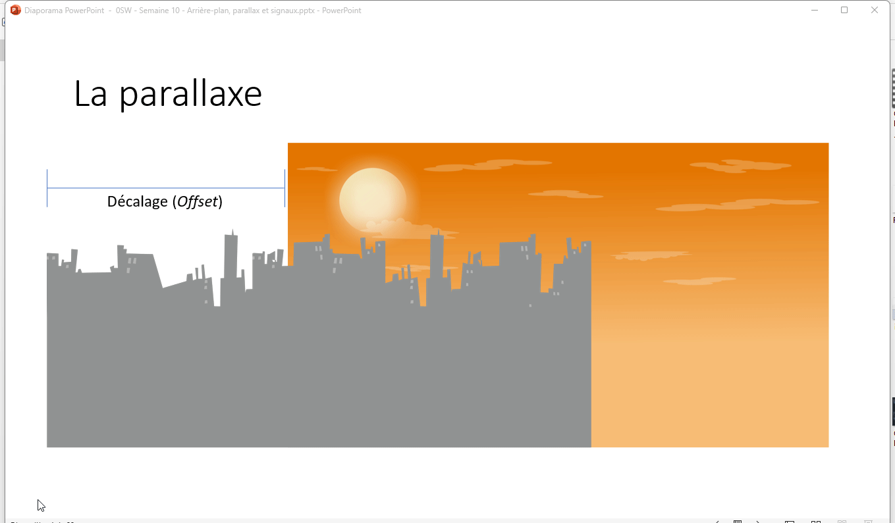

# La parallaxe <!-- omit in toc -->

# Table des matières <!-- omit in toc -->
- [Introduction](#introduction)
- [Parallax2D avec Godot 4](#parallax2d-avec-godot-4)
  - [Propriétés importantes](#propriétés-importantes)
  - [Structure typique](#structure-typique)
- [Défilement automatique](#défilement-automatique)
- [Bonnes pratiques sur les images](#bonnes-pratiques-sur-les-images)
- [Contourner certains problèmes](#contourner-certains-problèmes)
- [Exercice](#exercice)


---

# Introduction
- La **parallaxe** donne une impression de profondeur en faisant défiler plusieurs couches d’images à différentes vitesses, ce qui permet de simuler un monde 3D en 2D.
- On simule la parallaxe avec des images qui défilent à des vitesses variées.
- Pour simplifier la compréhension, prenons un décor à deux couches :

  - `couche_0` pour le fond (immobile, ex. montagnes ou étoiles)
  - `couche_1` pour le devant (défilement à 50 % de la vitesse de la caméra)
- Lors du défilement, si l’on atteint la limite d’une image, on la répète à partir de l’autre extrémité.



---

# Parallax2D avec Godot 4


- Depuis **Godot 4**, les anciens nœuds `ParallaxBackground` et `ParallaxLayer` ont été **remplacés par un seul nœud : `Parallax2D`**.
- Ce nœud combine toutes les fonctions de gestion du mouvement, du zoom et du défilement répétitif.
- Il suffit donc d’ajouter un `Parallax2D` comme parent, et d’y placer des `Sprite2D`, `TextureRect` ou d’autres éléments visuels comme enfants.

---

## Propriétés importantes

| Propriété                   | Description                                                                                                  |
| --------------------------- | ------------------------------------------------------------------------------------------------------------ |
| **scroll_scale**            | Détermine la vitesse relative du défilement (ex. `0.5` = deux fois plus lent que la caméra).                 |
| **repeat_size**             | Définit la taille de répétition de l’image si l’on veut qu’elle boucle.                                      |
| **repeat_time**             | Nombre de fois que l'on répète l'image de part d'autre. Utile pour la caméra lorsque l'on zoome.                                                                      |

| **follow_viewport** | Si activé, la couche suit automatiquement la caméra.                                                         |
| **autoscroll**              | Vecteur 2D qui permet de faire défiler automatiquement la couche sans script, pratique pour les nuages ou les fonds animés. |


> *Note :* Si vous faites un jeu à défilement horizontal uniquement, vous pouvez laisser `scroll_scale.y` à `0` pour éviter tout mouvement vertical du décor.

---

## Structure typique

Voici un exemple d’arbre de scène avec plusieurs couches parallaxes :

```
Node2D (ou Camera2D)
└─ Parallax2D (background)
│   └─ Sprite2D (montagnes)
└─ Parallax2D (midground)
│   └─ Sprite2D (forêt)
└─ Parallax2D (foreground)
    └─ Sprite2D (herbe)
```

Chaque `Parallax2D` possède ses propres paramètres `scroll_scale` et `repeat_size`.

---

# Défilement automatique

Le nœud `Parallax2D` offre directement une **propriété `autoscroll`**, qui permet de faire défiler le décor automatiquement sans avoir à écrire de code.
C’est idéal pour créer un ciel animé, des nuages, ou un fond qui bouge légèrement pour donner vie à la scène.


---

# Bonnes pratiques sur les images

Pour éviter des problèmes d’échelle et de performance :

- Utilise des **images déjà adaptées à la résolution du jeu**.
- Une image de fond trop petite devra être mise à l’échelle, ce qui peut créer des artéfacts visuels et ajoute de la complexité.
- Il est préférable de préparer et ajuster les images à la bonne taille avec un logiciel externe (comme GIMP ou Paint.net) avant de les importer dans le projet.
- Garde des proportions cohérentes entre les différentes couches pour éviter les déformations.


---

# Contourner certains problèmes
- Parfois les images ne sont pas tout à fait adaptées pour le jeu, par exemple elles ne sont pas assez hautes. On peut remédier à cela en utilisant un `ColorRect` de la même couleur que les extrémités de l’image pour combler le vide.


---

# Exercice
À partir du projet [c07d_pateforme_ennemi](https://github.com/nbourre/0sw_projets_cours/tree/master/c07_plateforme_ennemi).
- Ajouter un décor avec les images fournies dans le dossier `Legacy-Fantasy-PurpleBay/Background`.
  - La dimension des images est de 336x192
  - Faites défiler les nuages automatiquements
- Ajouter des props en avant-plan (arbres, herbes, etc.) qui défilent plus rapidement que le personnage.