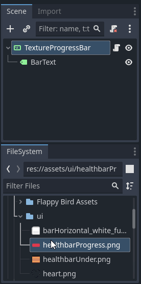
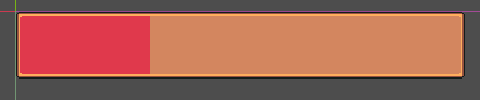
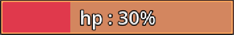
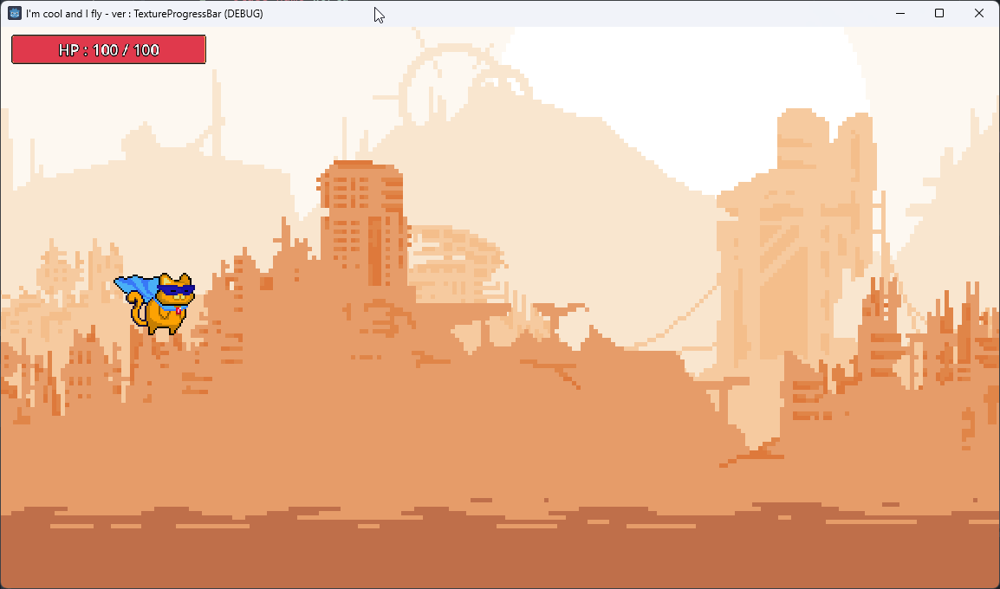
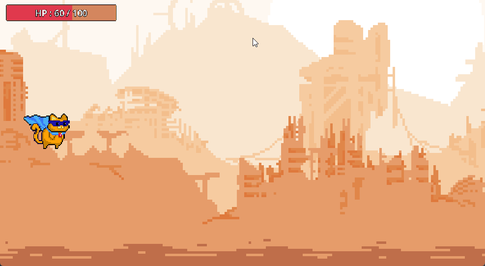

# Le `TextureProgressBar` <!-- omit in toc -->

# Table des matières <!-- omit in toc -->
- [Introduction](#introduction)
- [Configuration](#configuration)
  - [Image de fond et de progression](#image-de-fond-et-de-progression)
  - [Les propriétés](#les-propriétés)
- [Le script](#le-script)
- [Ajout de texte](#ajout-de-texte)
  - [Le script avec le texte](#le-script-avec-le-texte)
- [Utilisation](#utilisation)
  - [Mise à jour de la barre de progression](#mise-à-jour-de-la-barre-de-progression)
- [Références](#références)

---
# Introduction
Le `TextureProgressBar` est un contrôle qui permet d'afficher une barre de progression avec une texture. En plus d'être une barre de progression, il peut aussi être utilisé pour afficher des jauges, des compteurs, etc.

# Configuration
Il est relavivement simple à utiliser. Pour la configuration, il suffit d'avoir deux images. Une pour le fond et une pour la barre de progression. Ensuite, il suffit de les assigner aux propriétés `Under` et `Progress` du contrôle.

## Image de fond et de progression
À partir du système de fichiers, on peut simplement glisser-déposer les images dans les propriétés correspondantes ou encore directement sur le noeud dans la scène.



## Les propriétés
Quelques propriétés d'intérêt:

- `Nine Patch Stretch` : Permet de définir si l'image de fond peut être étirée ou non.
  - Important, l'image de fond doit être rectangulaire, les lignes horizontales et verticales seront étirées, mais les coins resteront intacts.
  - L'option `Stretch Margin` apparait lorsqu'on coche cette option. Elle permet de définir les marges qui ne seront pas étirées.




- `Min Value` et `Max Value` : Permet de définir les valeurs minimales et maximales de la barre de progression.
- `Value` : Permet de définir la valeur actuelle de la barre de progression.

# Le script

Étant donné que la barre de progression pourrait être utilisée pour plusieurs choses, je fais une classe de base générale qui pourrait être utilisée pour plusieurs choses.

On ajout une fonction `update_value` qui permet de mettre à jour la valeur de la barre de progression de l'extérieur.

```gd
class_name GenericProgressBar
extends TextureProgressBar

func update_value (new_value : int, max : int):
	max_value = max
	value = new_value
```

# Ajout de texte
Pour ajouter du texte à la barre de progression, il suffit d'ajouter un `Label` comme enfant du `TextureProgressBar`. Ensuite, il suffit de le configurer comme on le ferait pour un `Label` normal.



## Le script avec le texte
Étant donné que l'on a du texte, il faut maintenant le mettre à jour.

```gd
class_name GenericProgressBar
extends TextureProgressBar

@export var bar_name : String
@onready var text : Label = $BarText

func update_value (new_value : int, max : int):
	max_value = max
	value = new_value
	text.text = str(bar_name, " : ", int(value), " / ", int (max))
```

# Utilisation
Disons que l'on désire afficher une barre de progression pour la vie d'un personnage sur le HUD principal, il suffit de mettre un noeud `CanvasLayer` et d'y ajouter le `GenericProgressBar`.

On pourrait utiliser la composition pour contrôler la barre de progression au jeu ou au personnage.

Dans le cas présent, j'ajoute la barre de progression à la scène principale et je la configure pour afficher la vie du joueur.

```gd
class_name World
extends Node2D

@onready var player : Player = $Player
@onready var level : LevelOne = $Level

@onready var health_bar : GenericProgressBar = $Bars/GenericProgressBar

func _ready():
    health_bar.bar_name = "HP"
	  health_bar.update_value(100, 100)

```

Voici le résultat actuel:



## Mise à jour de la barre de progression
Dans cette partie, on va mettre à jour la barre de progression en fonction de la vie du joueur. Cependant, je ne vais que la simuler avec un `Timer`. L'adaptation se fera facilement selon votre jeu.

Nous allons mettre à jour le script du joueur pour qu'il émette un signal lorsque sa vie change.

Nous allons ajouter un noeud `Timer` à la scène du joueur pour simuler la perte de vie.

```gd
class_name Player
extends GenericCharacter

signal PlayerHit(value : int, max_value : int)
var life_timer : Timer = Timer.new()
var hp : int = 100
var max_hp : int = 100
var hp_increment : int = 2

func _ready() -> void:
	anim_player = $AnimationPlayer
	sprite = $Sprite2D
	anim_player.play("idle")
	add_child(life_timer)
	life_timer.wait_time = 1.0
	life_timer.autostart = true
	life_timer.timeout.connect(_on_life_timer_timeout)
	life_timer.start()
	

func _physics_process(delta: float) -> void:
	move_and_slide()

func _on_life_timer_timeout() -> void :
	
	if (hp <= 0 || hp >= max_hp):
		hp_increment = -hp_increment
	
	hp += hp_increment
			
	PlayerHit.emit(hp, max_hp)
```

Dans la scène possédant le joueur, on va connecter le signal `PlayerHit` à la fonction `hp_update` de la barre de progression.

```gd
func _ready() -> void:
	health_bar.bar_name = "HP"
	health_bar.update_value(100, 100)
	player.PlayerHit.connect(hp_update)
	
func hp_update(value : int, value_max : int):
	health_bar.update_value(value, value_max)
```

Voici le résultat final:



---
# Références
- [Godot documentation : TextureProgressBar](https://docs.godotengine.org/en/stable/classes/class_textureprogressbar.html)