# Les shaders en Godot <!-- omit in toc -->

- [Introduction](#introduction)
- [Les shaders dans Godot](#les-shaders-dans-godot)
  - [Projet de base](#projet-de-base)
  - [Créer un shader](#créer-un-shader)
    - [La classe `Material`](#la-classe-material)
- [Fragment Shader](#fragment-shader)
  - [Écrire le code GLSL](#écrire-le-code-glsl)
  - [Exemple simple](#exemple-simple)
  - [Utiliser des variables](#utiliser-des-variables)
  - [Pixel avec une texture](#pixel-avec-une-texture)
    - [Variable `UV`](#variable-uv)
    - [Variable `TEXTURE`](#variable-texture)
    - [Exemple](#exemple)
  - [Révision des mots-clés](#révision-des-mots-clés)
- [Rendre public des paramètres du shader](#rendre-public-des-paramètres-du-shader)
  - [Le mot clé `uniform`](#le-mot-clé-uniform)
- [Utiliser le shader dans un jeu](#utiliser-le-shader-dans-un-jeu)
  - [Appliquer le shader sur un objet](#appliquer-le-shader-sur-un-objet)
  - [Utiliser le shader dans un script](#utiliser-le-shader-dans-un-script)
    - [Autres exemples](#autres-exemples)
- [Vertex Shaders dans Godot](#vertex-shaders-dans-godot)
  - [Pourquoi utiliser un Vertex Shader?](#pourquoi-utiliser-un-vertex-shader)
  - [Création d’un Vertex Shader](#création-dun-vertex-shader)
    - [Exemple : Faire onduler un objet](#exemple--faire-onduler-un-objet)
    - [Explications de l'exemple :](#explications-de-lexemple-)
    - [Variables Utilisées dans les Vertex Shaders](#variables-utilisées-dans-les-vertex-shaders)
    - [Exemple : Déformation aléatoire basée sur le temps](#exemple--déformation-aléatoire-basée-sur-le-temps)
- [Ressources](#ressources)
  - [Godot Shaders](#godot-shaders)
  - [Shader-Lib](#shader-lib)
- [Conclusion](#conclusion)
- [Références](#références)

# Introduction
- Les shaders sont des programmes qui permettent de dessiner des objets dans un moteur de jeu.
- Ils sont utilisés pour les effets de lumière, les ombres, les textures, les effets de particules, etc.
- Les shaders sont écrits en GLSL (OpenGL Shading Language), un langage de programmation bas niveau.
- Le code est compilé pour la carte graphique et exécuté sur le GPU (Graphics Processing Unit).
- Les shaders sont écrits dans un fichier texte avec l'extension `.glsl` ou `.shader`
  - Godot sauvegarde avec l'extension `.gdshader` pour les shaders écrits dans l'éditeur de code.
- Les shaders sont utilisés dans Godot pour les matériaux, les post-process, les effets de particules, etc.

> **Note**
> 
> Étant donné que les shaders sont écrits en GLSL, il est possible, avec quelques conversions, d'utiliser des shaders dans d'autres moteurs de jeu. Par exemple, les shaders peuvent être utilisés dans Unity, Unreal Engine, etc.

# Les shaders dans Godot
Dans cet article, nous allons voir comment créer et utiliser un shader 2D dans Godot. On va faire clignoter une texture. Ce shader pourra être réutilisé, par exemple pour faire clignoter un ennemi ou un joueur qui se fait toucher ou encore pour d'autres effets.

## Projet de base
Étant donné que le code GLSL est identique pour tous les projets, vous pouvez prendre le projet de votre choix ou encore démarrer un projet vide pour suivre la démonstration.

**Note :** L'exemple pourra s'appliquer à facilement à votre projet de session. 

Dans le projet, vous devez avoir un sprite avec une texture. Comme indiquer précédemment, j'utilise le projet vide de Godot, j'ai pris le sprite `Icon` que j'ai mis directement dans la scène.

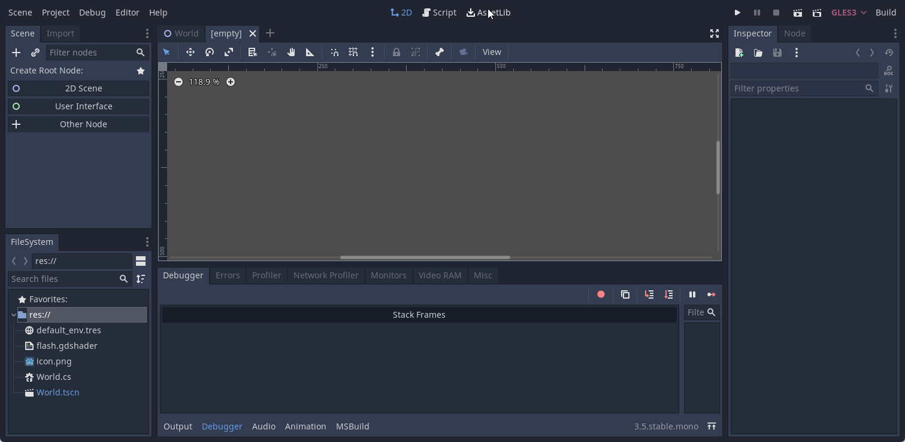

## Créer un shader
Pour créer un nouveau shader, vous pouvez suivre les étapes suivantes:

1. Sélectionnez le noeud `Sprite`
2. Dans l'inspecteur sous la section `CanvasItem`, sélectionnez le menu déroulant `Material`
3. Cliquez sur le bouton `New ShaderMaterial`
   - Une sphère apparait dans l'inspecteur
   - Un nouveau noeud `ShaderMaterial` est créé dans la hiérarchie
   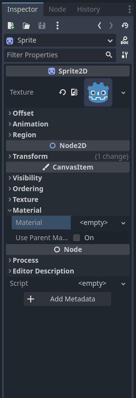
4. Cliquez `Material` dans l'inspecteur
5. Créez un nouveau `Shader` pour la propriété du même nom
6. Donnez un nom au fichier du shader. Par exemple `blink_shader.gdshader`
   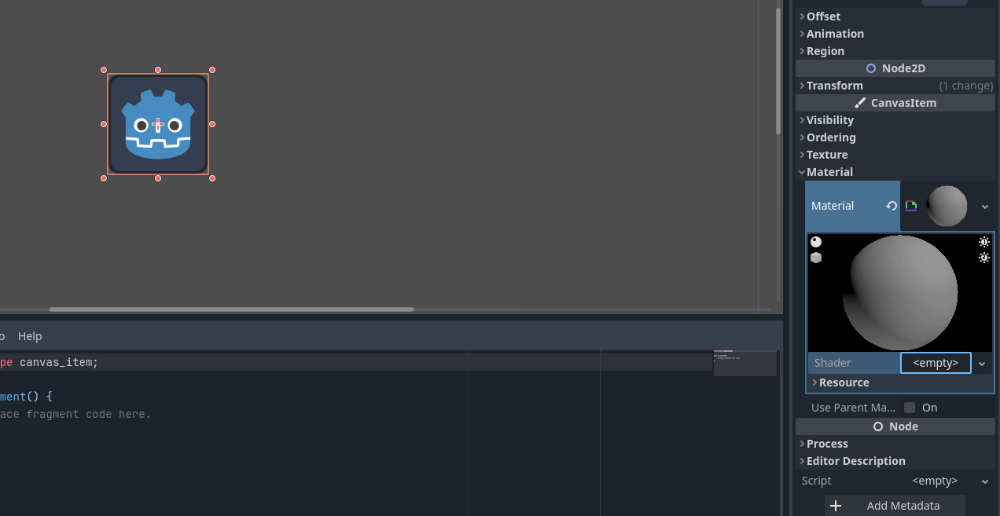
6. Cliquez sur le nouveau fichier pour développer l'éditeur de shader
    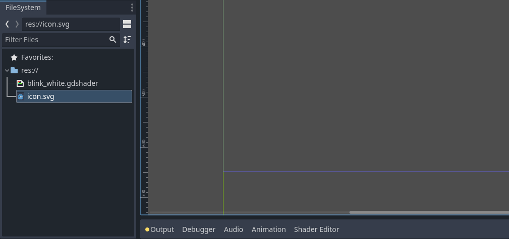

### La classe `Material`
Un `Material` (matériau?) est un ensemble de propriétés qui définissent comment un objet est rendu. Il contient des informations sur la couleur, la texture, la brillance, la transparence, etc. Il peut aussi contenir un shader qui permet de définir comment l'objet est rendu. Il s'agit d'un type de ressource.

Pour tracer différent objet avec le même shader, le matériau doit être attaché à chaque objet.

Tous les objets qui héritent de `CanvasItem` ont une propriété `Material`. Cela inclut les `Sprite`, les `TextureRect`, les `Control`, etc. Il y a aussi l'option d'hériter du matériau du parent.

# Fragment Shader

## Écrire le code GLSL
Le langage GLSL est basé sur le C. Il est donc possible d'utiliser des variables, des fonctions, des boucles, des conditions, etc.

Comme j'en ai fait part, nous allons programmer un *shader* relativement simple. Nous allons travailler sur les pixels directement.

La première étape sera de déterminer le type de shader que nous allons utiliser. Dans notre cas, nous allons utiliser un shader 2D. La première ligne de code doit définir le type de shader avec la syntaxe suivante.

```glsl
shader_type <type>;
```

Les types valides sont les suivants:
- spatial : pour le rendu 3D
- canvas_item : pour le rendu 2D
- particles : pour les systèmes de particules

Nous allons donc utiliser le type `shader_type canvas_item;`.

```glsl
shader_type canvas_item; // Première ligne de code
```

Ensuite, il faudra utiliser la fonction de shader qui sera utilisée. Dans notre cas, nous allons utiliser la fonction `fragment`. **Cette fonction est appelée pour chaque pixel du sprite**. Ainsi, nous allons donc pouvoir modifier les pixels directement. Elle permet de déterminer la couleur que le pixel doit avoir.

```glsl
shader_type canvas_item;

void fragment() {
  // Code du shader
}
```

> **Note**
>
> Si le sprite a une dimension de 1920x1080, la fonction `fragment` sera appelée 124 416 000 fois et ce à chaque seconde!

## Exemple simple

La variable `COLOR` contient la couleur du pixel et est de type `vec4` soit un vecteur de 4 valeurs qui représente la valeur des couches RGBA. Chaque valeur des composants est comprise **entre 0 et 1**.

Assignons la valeur 1 à tous les composantes de `COLOR` pour obtenir un pixel blanc.

```glsl
shader_type canvas_item;

void fragment() {
  COLOR = vec4(1, 1, 1, 1);
}
```
Sauvegardez et observez le résultat en direct dans la scène.

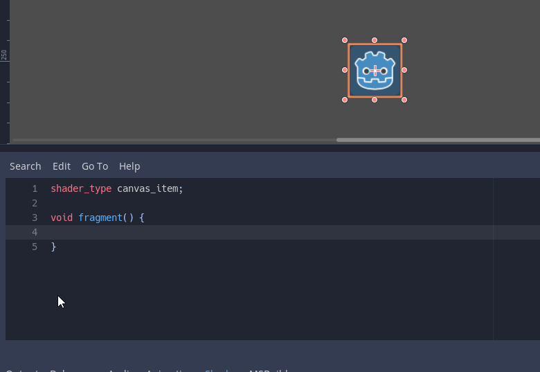

- Testez en modifiant la valeur de `COLOR` pour obtenir un pixel rouge ou dans une autre couleur
- Testez en modifiant la transparence

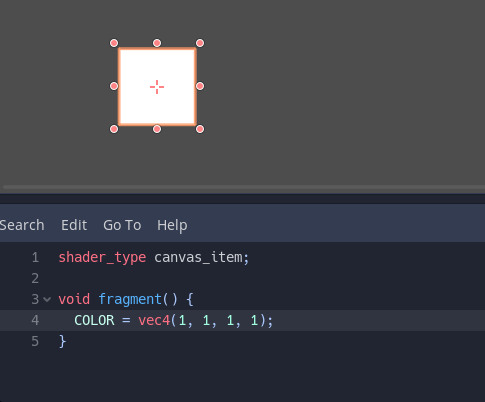

## Utiliser des variables
Pour être un peu plus efficace, on peut sauvegarder la valeur dans une variable.

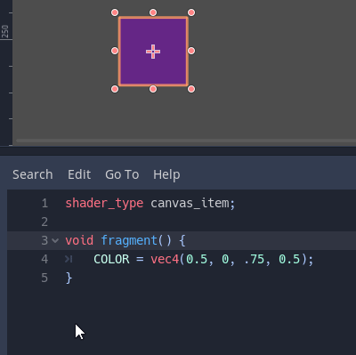

```glsl
shader_type canvas_item;

void fragment() {
	vec4 color = vec4(0.5, 0.5, .75, 0.5);
	COLOR = color;
}
```

## Pixel avec une texture
On remarque que la couleur change pour l'ensemble des pixels. Ce n'est généralement pas ce que l'on désire. On peut donc utiliser une texture pour déterminer la couleur du pixel. Pour ce faire, on va utiliser les variables `COLOR`, `UV` et `TEXTURE`.

### Variable `UV`
La variable `UV` contient les coordonnées du pixel (*fragment*). Il s'agit donc d'une paire de valeurs. Ainsi, elle est représenté par un type `vec2`. La première valeur est la coordonnée horizontale et la deuxième la coordonnée verticale. Les valeurs sont comprises **entre 0 et 1**.

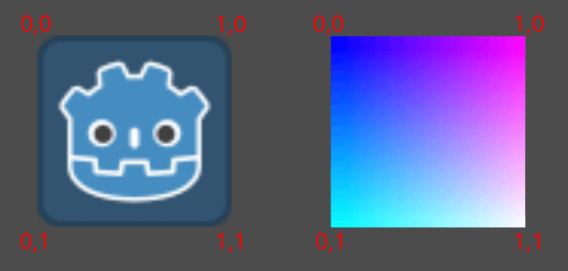

Exemple  
```glsl
void fragment() {
  // À chaque pixel, on met la composante bleue à 1.0
  // Plus la coordonnée horizontale est grande, plus le rouge est intense
  // Plus la coordonnée verticale est grande, plus le vert est intense
  COLOR = vec4(UV, 1.0, 1.0);
}
```
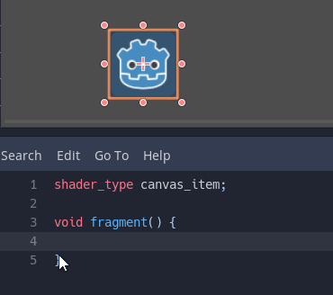

### Variable `TEXTURE`
La variable `TEXTURE` contient la texture du sprite. On peut donc utiliser la fonction `texture` pour obtenir la couleur du pixel à partir de la texture.

Exemple
```glsl
void fragment() {
  // Extraire la couleur de la texture à la position UV 
  COLOR = texture(TEXTURE, UV);
  COLOR.b = 1.0; // On met la composante bleue à 1.0
}
```

Vous remarquez que l'on peut modifier la couleur du pixel en utilisant les composantes de `COLOR`. Les composantes sont les valeurs suivantes: `r` pour le rouge, `g` pour le vert, `b` pour le bleu et `a` pour l'alpha. Il y a aussi la composante `rgb` qui contient les trois composantes précédentes.

### Exemple
Nous allons maintenant utiliser une texture pour déterminer la couleur du pixel. Pour ce faire, nous allons utiliser la fonction `texture` et la variable `TEXTURE`.

```glsl
void fragment() {
  vec4 color = texture(TEXTURE, UV); // Récupère la texture du pixel à la position UV
  color.rgb = mix(color.rgb, vec3(1, 1, 1).rgb, 1); // On met la couleur à blanc 
  COLOR = color;
}
```

Vous avez remarqué la fonction `mix()`? Cette fonction permet de mélanger deux couleurs. Le premier paramètre est la première couleur, le second est la 2e couleur et la troisième valeur est le pourcentage de mélange de la 2e couleur sur la 1ère. Ici, on met la valeur à 1 pour appliquer 100% de la 2e couleur.

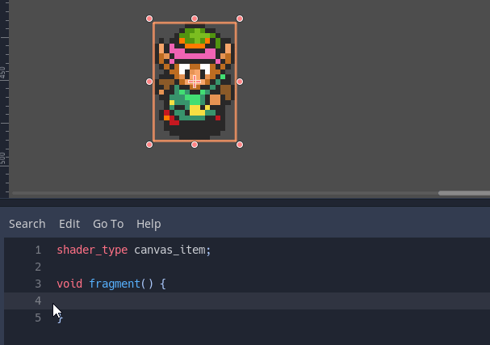

## Révision des mots-clés

Nous avons vu les mots-clés suivantes:
- `COLOR` : Couleur du pixel
  - Chaque composante est accessible par `r`, `g`, `b` et `a`
- `UV` : Coordonnées du pixel
  - Chaque composante est accessible par `x` et `y`
- `TEXTURE` : Texture du sprite

Les fonctions suivantes ont été utilisées:
- `vecX()` : Créer un vecteur de X valeurs
- `texture(sample2D sampler, vec2 coord)` : Obtenir la couleur d'une texture à une position donnée
- `mix(x, y, a)` : Interpoler entre deux valeurs
  - `x` : Valeur de départ.
  - `y` : Valeur d'arrivée.
  - `a` : Pourcentage de la valeur d'arrivée.

# Rendre public des paramètres du shader
Maintenant que l'on connaît les bases du shader, il est temps de rendre public des paramètres du shader. Cela permettra de modifier les paramètres du shader dans Godot (ou tout autre moteur de jeu).

## Le mot clé `uniform`
Le mot-clé `uniform` en GLSL est utilisé pour déclarer une variable dont la valeur est fixée par le programme principal (comme Godot ou un moteur graphique), et commune à tous les fragments ou vertex pendant un rendu. Les variables uniformes sont utiles pour transmettre des informations globales aux shaders, comme la couleur de la lumière, le temps, les textures, ou des transformations, sans les recalculer pour chaque pixel ou sommet.

C'est un peu comme un `@export` en GDScript.

Syntaxe
```glsl
uniform <type> <nom> [:indice] [= <valeur par défaut>];
```

Le `<nom>` est le nom qui sera affiché dans Godot. Le `<type>` est le type de la variable. Il peut s'agir d'un type prédéfini ou d'un type défini par l'utilisateur. Le `= <valeur par défaut>` est optionnel et permet de définir une valeur par défaut pour le paramètre.

Le `:indice` est optionnel et permet d'indiquer à l'inspecteur Godot quel sera l'utilisation du paramètre. Il peut s'agir d'un indice de texture, de couleur, de vecteur, etc.

Voici quelques valeurs l'indice :
- `source_color` : Utilisé comme sélecteur de couleur
- `hint_range(min,max [,step] )` : Utilisé comme sélecteur de nombre

Vous avez la liste complète des indices dans la [documentation de Godot](https://docs.godotengine.org/en/stable/tutorials/shaders/shader_reference/shading_language.html#uniforms).


Voici des exemples d'indice

| Type | Indice | Description |
| --- | --- | --- |
| vec4 | 	source_color |	Used as color|
|int, float| 	hint_range(min,max [,step] )| 	Used as range (with min/max/step)|


Exemple
```glsl
shader_type canvas_item;

uniform vec4 flash_color : source_color = vec4(1.0);

void fragment() {
  vec4 color = texture(TEXTURE, UV);
  color.rgb = mix(color.rgb, flash_color.rgb, 1);
  COLOR = color;
}
```

Nous avons maintenant accès à un paramètre `Flash color` dans l'inspecteur de Godot.

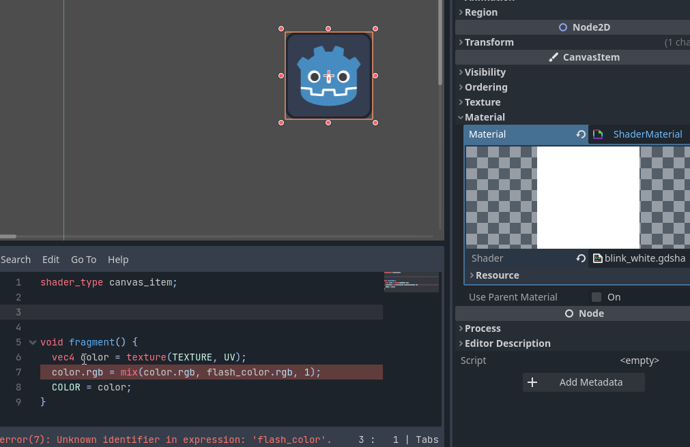

Exemple 2
```glsl
uniform vec4 flash_color : hint_color = vec4(1.0);
uniform float flash_modifer : hint_range(0.0, 1.0) = 1.0;

void fragment() {
  vec4 color = texture(TEXTURE, UV);
  color.rgb = mix(color.rgb, flash_color.rgb, flash_modifer);
  COLOR = color;
}
```

# Utiliser le shader dans un jeu
Pour exploiter un shader à son plein potentiel, il faut l'utiliser dans un jeu.

## Appliquer le shader sur un objet
Pour appliquer le shader sur un objet, il faut sélectionner l'objet et dans l'inspecteur, sélectionner le shader dans la propriété `Shader` et cliquer sur `Load`.

> **Important**
> 
> Dans le bloc `Resource`, il faut cocher `Local to Scene` pour que le shader ne soit appliquer qu'à l'objet actuel. Autrement, aussitôt que l'on activera le shader, il sera appliqué à tous les objets qui utilisent le même shader en simultané.

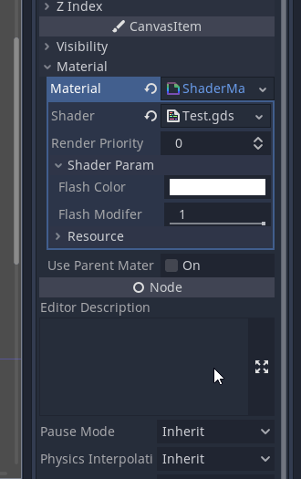

## Utiliser le shader dans un script
Dans la scène où j'utilise le shader, j'ai ajouté un noeud `Timer` qui dure 0.1 seconde.

La première étape consiste à se créer des références pour utiliser le `Sprite`, le `Timer` et le `Shader`.

```gdscript	
Sprite sprite;
Timer flashTimer;
ShaderMaterial shader;

public override void _Ready()
{
    sprite = GetNode<Sprite>("Icon");    
    flashTimer = GetNode<Timer>("FlashTimer");                        
    shader = sprite.Material as ShaderMaterial;
}
```

Ensuite, je crée une fonction `flash` qui va modifier le paramètre `flash_modifier` et démarrer `flashTimer`.

```gdscript
private void flash() {
    GD.Print("Flash");
    shader.SetShaderParam("flash_modifier", 1);
    flashTimer.Start();
}
```

Dans la méthode associée au signal `Timeout`, je vais modifier la propriété `flash_modifer` du shader pour la mettre à 0 et aussi arrêter le timer.

```gdscript
public void onTimerTimeout()
{
    GD.Print("Timer timeout");
    shader.SetShaderParam("flash_modifier", 0);
    flashTimer.Stop();
}
```

Enfin pour tester mon shader, je vais l'activer lorsque j'appuie sur la touche `Espace`.

```gdscript
public override void _Process(float delta)
{
    if (Input.IsActionJustPressed("ui_select"))
    {
        flash();
    }
}
```

Voici le résultat

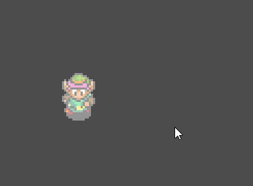

<details><summary>Version GDScript</summary>

```glsl
shader_type canvas_item;

uniform vec4 flash_color : source_color = vec4(1.0);
uniform float flash_modifier : hint_range(0.0, 1.0) = 0;

void fragment() {
  vec4 color = texture(TEXTURE, UV);
  color.rgb = mix(color.rgb, flash_color.rgb, flash_modifier);
  COLOR = color;
}
```

```gdscript
extends Node2D

@onready var sprite : Sprite2D = $Icon
@onready var timer : Timer = $Flashtimer
var shader : ShaderMaterial = sprite.material as ShaderMaterial

func flash() -> void:
	print("Flash")
	shader.set_shader_parameter("flash_modifier", 1);
	timer.start()

func _on_flashtimer_timeout() -> void:
	print("Timer timeout")
	shader.set_shader_parameter("flash_modifier", 0);
	timer.stop()

func _process(delta: float) -> void:
	if (Input.is_action_just_pressed("ui_select")):
		flash()
```

Version alternative

```gdscript
extends Node2D

@onready var sprite : Sprite2D = $Icon
@onready var timer : Timer = $Flashtimer
var shader : ShaderMaterial

const NB_FLASH : int = 8
var flash_counter : int
var flash_value : int = 0;

func _ready() -> void:
	shader = sprite.material as ShaderMaterial

func _on_flashtimer_timeout() -> void:
	shader.set_shader_parameter("flash_modifier", flash_value * 0.5);
	flash_value = !flash_value

	if flash_counter < NB_FLASH:
		flash_counter += 1
	else:
		flash_counter = 0
		shader.set_shader_parameter("flash_modifier", 0);
		timer.stop()

func _process(delta: float) -> void:
	if (Input.is_action_just_pressed("ui_select")):
		timer.start()
```

</details>

### Autres exemples


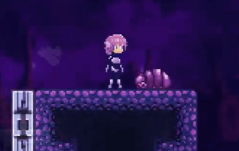

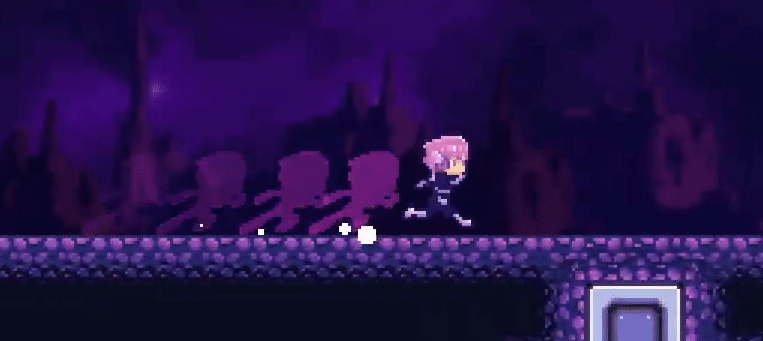

---

# Vertex Shaders dans Godot

Contrairement aux *fragment shaders* qui agissent sur chaque pixel de l'objet, les *vertex shaders* agissent sur chaque sommet (ou *vertex*) de la géométrie de l'objet. Les vertex shaders sont donc utiles pour modifier la forme ou la position d'un objet, pour des effets tels que les déformations, les vagues, les ondulations, ou les animations basées sur les sommets.

## Pourquoi utiliser un Vertex Shader?

Le vertex shader permet de :
- Déplacer des sommets pour créer des animations dynamiques ou des effets de distorsion.
- Modifier la géométrie sans avoir besoin de créer de nouveaux modèles.
- Optimiser certains effets visuels qui seraient coûteux à réaliser avec des calculs basés sur les pixels.

Par exemple, dans un jeu, on peut utiliser un vertex shader pour faire onduler de l'herbe ou pour simuler un effet de vague sur un plan d'eau.

## Création d’un Vertex Shader

Pour activer un *vertex shader*, on commence par indiquer le type de shader et la fonction `vertex`. Voici un exemple de base qui utilise le type de shader `canvas_item` (pour les objets 2D) et la fonction `vertex` :

```glsl
shader_type canvas_item;

void vertex() {
    // Code du shader de sommet ici
}
```

La fonction `vertex()` sera appelée pour chaque sommet de l'objet.

### Exemple : Faire onduler un objet

Voyons un exemple où nous faisons bouger les sommets de l'objet pour créer un effet d’ondulation. Nous allons utiliser la position de chaque sommet (`VERTEX`) et le temps (`TIME`) pour créer un déplacement en forme d'onde.

- La variable `VERTEX` contient la position du sommet actuel. Nous allons modifier la position `x` du sommet en fonction de sa position `y` et du temps pour créer une onde horizontale.
- La variable `TIME` contient le temps écoulé depuis le début de la scène. Nous allons l'utiliser pour animer l'onde. Elle est automatiquement mise à jour par Godot à chaque image.

Pour effectuer un mouvement ondulatoire, nous allons utiliser la fonction `sin()` pour créer une oscillation sinusoïdale en fonction de la position `y` du sommet et du temps.

Voici une animation pour vous rappeler la forme des cosinus et sinus par rapport à un cercle :


Objectif : Créer un effet d'ondulation sur de l'herbe.

Voici le résultat attendu :

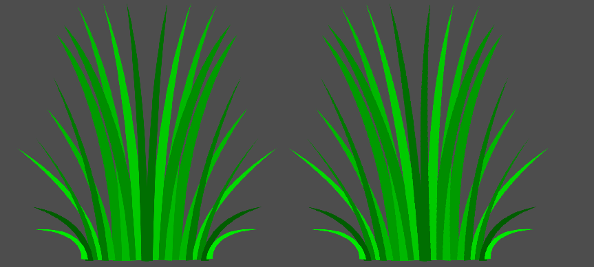

La première étape sera de déterminer l'amplitude et la fréquence de l'onde. L'amplitude contrôle l'intensité de l'onde ainsi le déplacement des sommets. La fréquence contrôle la densité des ondulations.

```glsl
shader_type canvas_item;

void vertex() {
    // Stocke la position originale du sommet
    vec2 og_pos = VERTEX;
    
    // Paramètres d'ondulation
    float amplitude = 100.0;  // Amplitude de l'onde
    float frequency = 5.0;   // Fréquence de l'onde

    // Calcul de l'oscillation sur l'axe X en fonction de la position Y du sommet
    float wave_offset = sin(frequency) * amplitude;

    // Applique l'offset d'ondulation à la position X du sommet
    VERTEX.x += wave_offset;
}
```

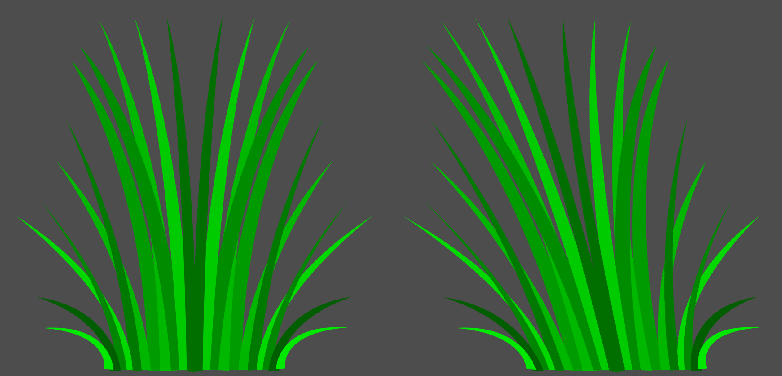

On observe que l'herbe a bien été déformée. Cependant, l'effet n'est pas encore animé. Pour cela, on va utiliser la variable `TIME` pour animer l'onde.

Modifiez la fréquence de l'onde en fonction du temps pour créer un effet d'animation fluide.

```glsl
    float frequency = 5.0 * TIME;   // Fréquence de l'onde
```

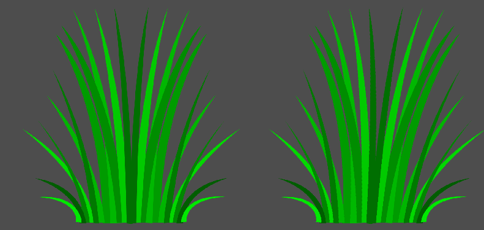

On observe que l'effet est trop rapide. Pour ralentir l'effet, on peut multiplier le temps par une valeur plus petite.

```glsl
    float frequency = TIME * 0.5;   // Fréquence de l'onde
```

<!-- TODO : Complete notes -->

### Explications de l'exemple :

1. **Variables `amplitude` et `frequency`** :
   - `amplitude` contrôle l'intensité de l'onde, ou à quel point les sommets se déplacent horizontalement.
   - `frequency` contrôle la fréquence des ondulations, influençant la densité des vagues.

2. **Oscillation en fonction de la position `y`** :
   - Nous utilisons `sin(og_pos.y * frequency + TIME)` pour obtenir une valeur oscillante pour chaque sommet en fonction de sa position verticale (`y`) et du temps (`TIME`).
   - Cela signifie que chaque ligne de sommets de l’objet aura un décalage différent, créant un effet de vague.

3. **Application du déplacement** :
   - Le calcul de l'onde est appliqué à la coordonnée `x` de `VERTEX`, ce qui entraîne une ondulation horizontale.

> **Note** : Ce shader est assez performant car il agit uniquement sur les sommets, ce qui demande moins de calculs qu’un effet appliqué aux pixels.

### Variables Utilisées dans les Vertex Shaders

Quelques variables importantes dans les *vertex shaders* :
- **`VERTEX`** : Position du sommet actuel. Cette variable peut être modifiée pour déplacer les sommets.
- **`UV`** : Coordonnées UV du sommet, permettant d'appliquer des textures.
- **`TIME`** : Temps écoulé, souvent utilisé pour créer des animations.
- **`COLOR`** : Couleur du sommet, qui peut être utilisée pour des effets de couleur par sommet (particulièrement utile en 3D).

### Exemple : Déformation aléatoire basée sur le temps

Voici un autre exemple où chaque sommet est décalé verticalement de façon aléatoire au fil du temps pour créer un effet de distorsion fluide.

```glsl
shader_type canvas_item;

void vertex() {
    float noise_factor = sin(VERTEX.x * 5.0 + TIME * 2.0);
    VERTEX.y += noise_factor * 5.0;
}
```

Dans cet exemple :
- Le facteur de bruit `noise_factor` est calculé en fonction de la position en `x` et du `TIME` pour que chaque sommet ait un décalage unique et évolutif.
- Ce décalage est appliqué à `VERTEX.y`, produisant une distorsion verticale qui change avec le temps.

Ces shaders permettent de transformer et d'animer des objets sans avoir à changer la géométrie de base, et peuvent être combinés avec des *fragment shaders* pour des effets visuels plus complexes.

# Ressources

## Godot Shaders
Il y a un site web qui regroupe plusieurs shaders pour Godot. Vous pouvez les utiliser dans vos projets. [GodotShaders.com](https://godotshaders.com/)

Cependant, c'est bien beau copier le travail des autres, mais c'est toujours important de comprendre comment la mécanique fonctionnent pour les adapter à vos besoins.

## Shader-Lib
`Shader-Lib` est un plugin pour Godot qui permet de créer des shaders à l'aide d'un outil visuel. Il est possible de créer des shaders sans écrire une seule ligne de code. Dans `AssetLib`, il suffit de chercher `Shader-Lib` pour l'installer.

 [Shader-Lib](https://github.com/DigvijaysinhGohil/Godot-Shader-Lib/) est disponible sur GitHub. La documentation est disponible sur [GitBook](https://github.com/DigvijaysinhGohil/Godot-Shader-Lib/blob/main/documentation/Documentation.md).

# Conclusion
Une fois que les bases sont apprises, les `shaders` ne sont pas si compliqué. Il faut juste prendre le temps de comprendre comment ils fonctionnent et de les tester.

Il y a plusieurs ressources gratuites de disponibles sur [GodotShaders.com](https://godotshaders.com/) que vous pouvez réutiliser dans vos jeux.


# Références
- [Godot Shading Language](https://docs.godotengine.org/en/stable/tutorials/shaders/shader_reference/shading_language.html) - Godot Documentation
- [Your first 2D shader](https://docs.godotengine.org/en/stable/tutorials/shaders/your_first_shader/your_first_2d_shader.html)
- [Shading Language](https://docs.godotengine.org/en/stable/tutorials/shaders/shader_reference/shading_language.html) (GLSL) - OpenGL Wiki
- [Godot 4 Shader Tutorial for Absolute Beginners](https://www.youtube.com/watch?v=KeHKKLuygoY)
- [The book of shaders](https://thebookofshaders.com/)
- [Godot 4 Shader Introduction for ABSOLUTE Beginners!](https://www.youtube.com/watch?v=rW_MjIeFz0Y)
