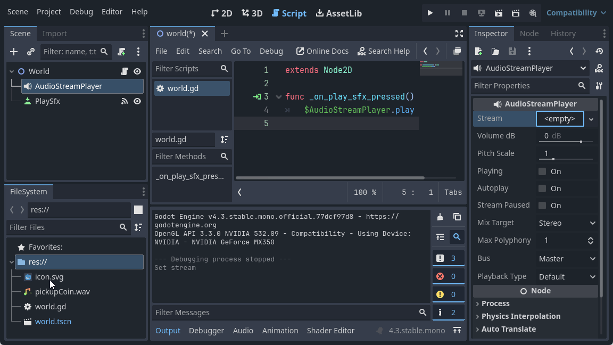
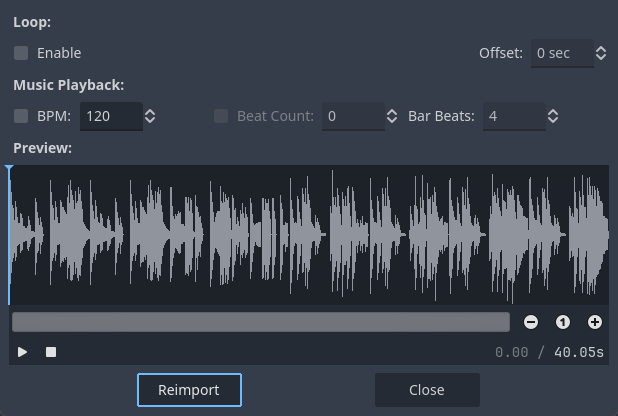

# Jouer des sons et de la musique dans Godot <!-- omit in toc -->

# Table des matières <!-- omit in toc -->
- [Introduction](#introduction)
- [Jouer un son](#jouer-un-son)
  - [Aperçu du son](#aperçu-du-son)
  - [Code](#code)
- [Jouer de la musique](#jouer-de-la-musique)
- [Mettre sur pause et reprendre la musique](#mettre-sur-pause-et-reprendre-la-musique)
- [Gestion du volume](#gestion-du-volume)
- [Projet](#projet)
- [Conclusion](#conclusion)
- [Références](#références)

---
# Introduction
L'objectif de ce chapitre est de voir les bases de comment jouer des sons et de la musique dans Godot. Nous n'irons pas dans le détail de la gestion des bus audio, des effets audio, etc. Nous nous concentrerons sur les bases.

---

# Jouer un son
Pour jouer un son, il suffit d'ajouter un noeud `AudioStreamPlayer` à la scène. Ensuite, il suffit de lui assigner un fichier audio à la propriété `Stream`. Le fichier audio doit être un fichier supporté par Godot (`.wav`, `.ogg`, `.mp3`, etc.).



## Aperçu du son
En cliquant sur la propriété `Stream`, vous avez la possibilité de jouer le son pour voir s'il correspond à ce que vous voulez.

## Code
Dans sa forme la plus simple, pour jouer un son, il suffit d'appeler la méthode `play()` du noeud `AudioStreamPlayer`.

Dans cet exemple, nous avons un bouton qui, lorsqu'il est pressé, joue le son.

```gd
extends Node2D

func _on_play_sfx_pressed() -> void:
	$AudioStreamPlayer.play()

```

---

# Jouer de la musique
Pour jouer de la musique, c'est essentiellement la même chose que pour jouer un son. Vous pouvez lors de l'importation du fichier audio, cocher la case `Loop` pour que la musique se répète en boucle et de réimporter le fichier audio.



---

# Mettre sur pause et reprendre la musique
Pour mettre sur pause et reprendre la musique, il faut sauvarder la position de lecture de la musique et arrêter la lecture. Lorsque vous voulez reprendre la lecture, vous pouvez reprendre à la position sauvegardée.

Dans cet exemple, nous avons un bouton qui, lorsqu'il est pressé, met en pause ou reprend la musique.

```gd
extends Node2D

@onready var sfx : AudioStreamPlayer = $Sfx
@onready var music : AudioStreamPlayer = $Music
@onready var btnPlay : Button = $PlayMusic

var music_pos : float = 0.0

func _on_play_sfx_pressed() -> void:
	sfx.play()

func _on_play_music_pressed() -> void:
	if (music.playing):
		music_pos = music.get_playback_position()
		music.playing = false
		btnPlay.text = "Jouer"
	else :
		music.play(music_pos)
		btnPlay.text = "Pause"

```

---

# Gestion du volume
L'unité de mesure pour le son est généralement en décibels (dB). Le dB est une échelle logarithmique. Si l'on utilise un contrôle linéaire pour le volume, il faudra convertir la valeur du contrôle linéaire en dB.

Godot offre une méthode pour convertir une valeur linéaire en dB : `linear_to_db()`. Cette méthode prend en paramètre une valeur linéaire entre 0 et 1 et retourne la valeur en dB.

Voici un exemple où nous utilisons un curseur pour contrôler le volume de la musique.

```gd
func _on_h_slider_drag_ended(value_changed: bool) -> void:
	var val = slider.value
	music.volume_db = linear_to_db(val)
    print ("val : " + str(val) + "\tdb : " + str(music.volume_db))
```

Il est important de configurer le curseur pour qu'il ait une valeur entre 0 et 1. Il est aussi important de configurer la propriété `step` du curseur pour qu'il ait une valeur de 0.01. Cela permettra d'avoir une valeur plus précise pour le volume.

---

# Projet
Vous pouvez tester le projet [`c13_audio`](https://github.com/nbourre/0sw_projets_cours.git) dans le dépôt des projets.

---

# Conclusion

Dans cet article, je ne fais que montrer les bases de la gestion du son et de la musique dans Godot. Il y a beaucoup plus de choses à apprendre sur la gestion du son tel que les bus audio, les effets audio, l'optimisation des ressources, etc. Je vous invite à consulter la documentation de Godot pour en apprendre plus.

---

# Références
- [Playing sounds effects and music in Godot 4](https://www.youtube.com/watch?v=N6-2Iwb8xoU)
- [Godot Engine - Audio](https://docs.godotengine.org/en/stable/tutorials/audio/index.html)