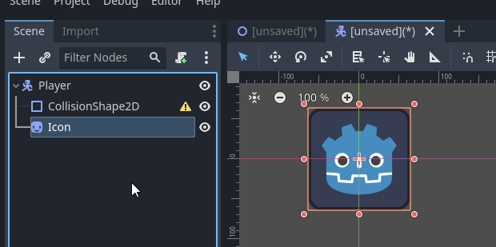
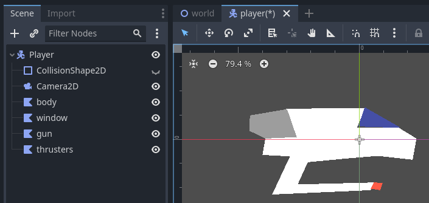
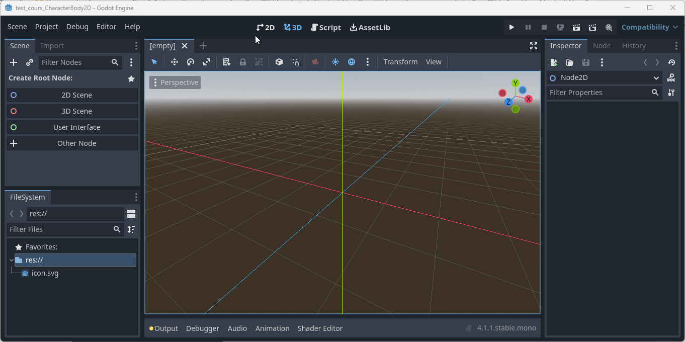
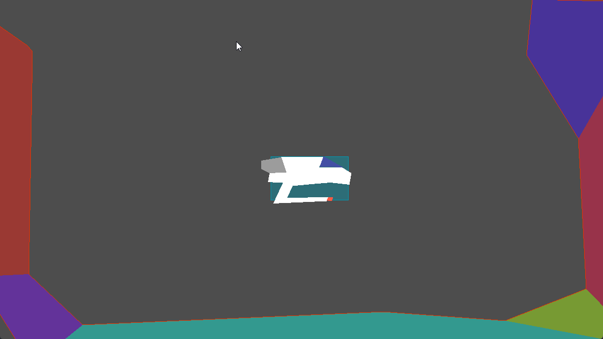
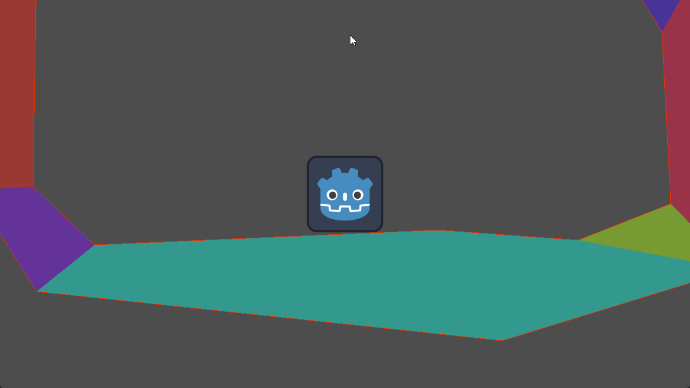

# Créer un joueur avec le CharacterBody2D

## Objectif
- Le noeud `CharacterBody2D`
- Les noeuds `CollisionShape2D` et `CollisionPolygon2D`
- Le noeud `Camera2D`
- Le script

## CharacterBody2D
Le noeud [`CharacterBody2D`](https://docs.godotengine.org/en/stable/classes/class_characterbody2d.html) est un noeud qui permet de gérer les collisions et les déplacements d'un personnage. Il est très utile pour créer un personnage jouable dans un jeu 2D que ce soit un jeu de plateforme, un jeu de type RPG ou top-down.

Il s'agit d'une classe spécialisée de `PhysicsBody2D` qui est destinés à être contrôlés par l'utilisateur.  Ils ne sont pas du tout affectés par la physique, mais ils affectent d'autres corps physiques sur leur trajectoire. Ils sont principalement utilisés pour fournir une API de haut niveau permettant de déplacer des objets avec une détection de murs et de pentes (méthode [`move_and_slide()`](https://docs.godotengine.org/en/stable/classes/class_characterbody2d.html#class-characterbody2d-method-move-and-slide)) en plus de la détection générale des collisions fournie par [`PhysicsBody2D.move_and_collide()`](https://docs.godotengine.org/en/stable/classes/class_physicsbody2d.html#class-physicsbody2d-method-move-and-collide). Cela le rend utile pour les corps physiques hautement configurables qui doivent se déplacer de manière spécifique et entrer en collision avec le monde, comme c'est souvent le cas avec les personnages contrôlés par l'utilisateur.

Pour les objets de jeu qui n'ont pas besoin d'un mouvement complexe ou d'une détection de collision, tels que les plates-formes mobiles, [AnimatableBody2D](https://docs.godotengine.org/en/stable/classes/class_animatablebody2d.html#class-animatablebody2d) est plus simple à configurer.

Ce noeud requiert un noeud `CollisionShape2D` ou `CollisionPolygon2D` pour fonctionner. Il est possible d'en ajouter plusieurs pour gérer les collisions avec différents types de formes.

Un noeud pour représenter l'image du joueur est aussi commun. Il peut s'agir d'un noeud `Sprite2D` ou `AnimatedSprite` par exemple.	


Pour que l'écran suive le joueur, il est possible d'utiliser un noeud `Camera2D` qui sera enfant du noeud `CharacterBody2D`.

### Propriétés importantes
Les principales propriétés pour ce noeud sont les suivantes:

| Propriété | Valeur | Description |
| --------- | ------ | ----------- |
| `MotionMode` | `Grounded` | S'applique lorsque les notions de murs, de plafond et de sol sont pertinentes. Dans ce mode, le mouvement du corps réagira aux pentes (accélération/ralentissement). Ce mode convient aux jeux à défilement latéral tels que les jeux de plateformes. |
| `MotionMode` | `Floating` | S'applique lorsque les notions de sol et de plafond n'existent pas. Toutes les collisions seront signalées comme étant sur un mur. Dans ce mode, lorsque vous glissez, la vitesse restera toujours constante. Ce mode convient aux jeux en vue de dessus. |
| `UpDirection` | `Vector2D` | Définit la direction de la gravité. |

Il y a d'autres propriétés qui peuvent être utiles pour configurer le noeud selon vos besoins.

## Image du joueur
Il y a plusieurs possibilités pour représenter l'image du joueur. Il peut s'agir d'un noeud `Sprite2D`, `Polygon2D` ou autres types d'images.





## Collision
Pour effectuer la gestion des collisions, le noeud `CharacterBody2D` a besoin d'un noeud `CollisionShape2D` ou `CollisionPolygon2D` pour fonctionner.

Le noeud [`CollisionShape2D`](https://docs.godotengine.org/en/stable/classes/class_collisionshape2d.html) est un noeud qui permet de gérer les collisions avec des formes simples. Par exemple, un cercle, un rectangle, un segment, etc. Il est possible d'en ajouter plusieurs pour gérer les collisions avec différents types de formes.

Le noeud [`CollisionPolygon2D`](https://docs.godotengine.org/en/stable/classes/class_collisionpolygon2d.html) est un noeud qui permet de gérer les collisions avec des formes complexes. Il faudra tracer à la main ou programmatiquement la forme de la collision. Il est possible d'en ajouter plusieurs pour gérer les collisions avec différents types de formes.

## Camera2D
Le noeud [`Camera2D`](https://docs.godotengine.org/en/stable/classes/class_camera2d.html) est un noeud qui permet de gérer la caméra dans un jeu 2D. Il est possible de configurer la caméra pour qu'elle suive un noeud spécifique. Dans notre cas, nous voulons que la caméra suive le joueur.

Les propriétés importantes pour ce noeud sont les suivantes:

| Propriété | Valeur | Description |
| --------- | ------ | ----------- |
| `Zoom`    | `Vector2` | Définit le zoom de la caméra. |
| `Limit`   | Multiple | Définit la limite de la caméra. |
| `Smoothing` | `Enabled` | Définit si le mouvement de la caméra doit être lissée. |
| `Smoothing` | `Speed` | Définit la vitesse de lissage de la caméra. |

## Script
Pour contrôler le joueur, il est possible d'utiliser un script. Il est possible d'utiliser un script `GDScript` ou `C#`. Depuis Godot 4, il y a la possibilité d'utiliser le script par défaut. Il s'agit d'un script adapté pour les jeux de plateforme.

### Plateforme
Le script par défaut en C# est le suivant:

```csharp
using Godot;
using System;

public partial class player : CharacterBody2D
{
	public const float Speed = 300.0f;
	public const float JumpVelocity = -400.0f;

	// Récupère la gravité qui est indiqué dans les propriétés du projet
	public float gravity = ProjectSettings.GetSetting("physics/2d/default_gravity").AsSingle();

	public override void _PhysicsProcess(double delta)
	{
		Vector2 velocity = Velocity;

		// Ajouter la gravité si le joueur n'est pas sur le sol.
		if (!IsOnFloor()) {
            // Remarquez le delta qui est utilisé
			velocity.Y += gravity * (float)delta;
        }

		// Gestions des sauts
		if (Input.IsActionJustPressed("ui_accept") && IsOnFloor())
			velocity.Y = JumpVelocity;

		// Récupère la direction du joueur
		// Bonne pratique: Créez vos propres actions dans les paramètres du projet
		Vector2 direction = Input.GetVector("ui_left", "ui_right", "ui_up", "ui_down");
		if (direction != Vector2.Zero)
		{
			velocity.X = direction.X * Speed;
		}
		else
		{
			velocity.X = Mathf.MoveToward(Velocity.X, 0, Speed);
		}

		Velocity = velocity;

        // Move and slide utilise la propriété Velocity pour déplacer le joueur
        // Retourne vrai s'il y a eu une collision
		MoveAndSlide();
	}
}
```

### Top-down
Il n'y a pas de script par défaut pour les jeux en vue de dessus. Il est possible d'utiliser le script suivant:

```csharp
using Godot;
using System;

public partial class ship : CharacterBody2D
{
	[Export]
	public float MaxSpeed = 1500.0f;
	[Export]
	public float Acceleration = 10.0f;

	public override void _PhysicsProcess(double delta)
	{
		var direction = Input.GetVector("ui_left", "ui_right", "ui_up", "ui_down").Normalized();

		if (direction.Length() > 0) {
			Velocity = Velocity.Lerp(direction * MaxSpeed, Acceleration * (float)delta);
		}
		else {
			Velocity = Velocity.Lerp(Vector2.Zero, Acceleration * (float)delta);
		}

        // Pour pointer vers la souris
        //LookAt(GetGlobalMousePosition());

		MoveAndSlide();
	}
}
```


## Résumé
Vous avez maintenant les ingrédients pour créer un joueur de base dans un jeu 2D. Évidement, il est possible de modifier les scripts pour ajouter des fonctionnalités supplémentaires qui sont propres à votre jeu.

Il restera à ajouer le monde dans lequel le joueur évoluera. Ce sujet sera vu dans un autre tutoriel.

### Exercice
1. Dans votre projet, créez une nouvelle scène avec un noeud `CharacterBody2D` à sa racine.
   - Si vous n'avez pas de projet, créez un nouveau projet avec une scène principale ayant un noeud 2D à sa racine. Nommez la scène `World`.

2. Renommez le noeud `Player`. <br/>
   
3. Glissez l'icône par défaut dans la scène pour créer un noeud `Sprite2D` enfant du noeud `Player` **ou** créez un noeud `Polygon2D` et tracez la forme du joueur. <br />
   - Modifiez la position pour que le noeud soit à la position (0, 0).
4. Ajoutez un noeud enfant `CollisionShape2D` ou `CollisionPolygon2D` au noeud `Player`. <br />
   - Si c'est un `CollisionShape2D`, pour la propriété `Shape`, sélectionnez `Rectangle` et donner la dimension 128x128. <br />
   
   - Si c'est un `CollisionPolygon2D`, tracez la forme désirée.
5. Ajoutez un noeud enfant `Camera2D` pour suivre le joueur.
   - Activez la propriété permettant de lisser le mouvement de la caméra.
6. Ajoutez un script au noeud `Player`. Prenez le script qui vous convient soit pour le jeu de plateforme ou le *top-down*/*sideview*.
7. Dans la scène principale, ajoutez un noeud `StaticBody2D` auquel vous ajoutez un noeud `CollisionPolygon2D` pour représenter le sol.
   - Ajoutez un noeud `CollisionPolygon2D` pour représenter le plafond.
   - Ajoutez un noeud `CollisionPolygon2D` pour représenter un mur.
   - Tracez les formes désirées pour chaque noeud `CollisionPolygon2D`.
8. Dans le menu `Debug`, activez l'affichage des collisions.
9. Exécutez votre projet et vérifiez que le joueur se déplace correctement.





