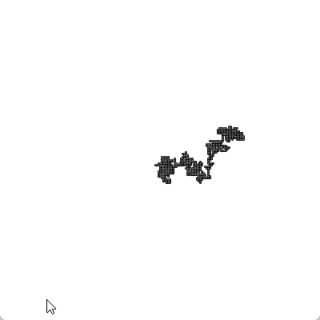
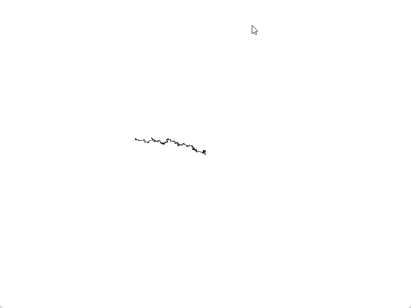
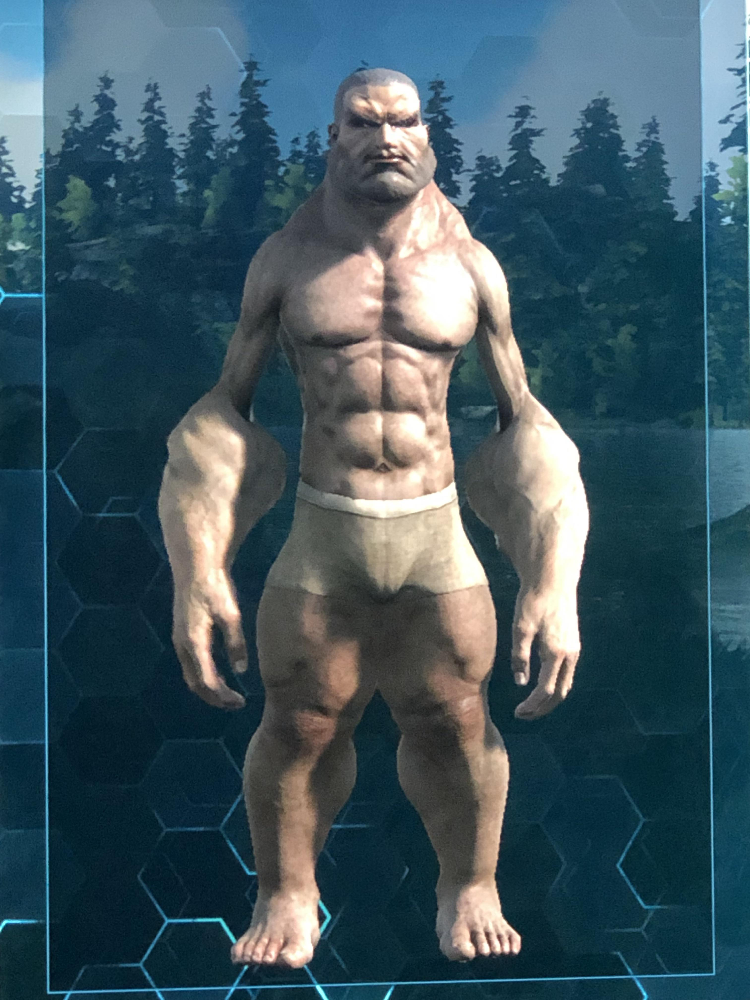
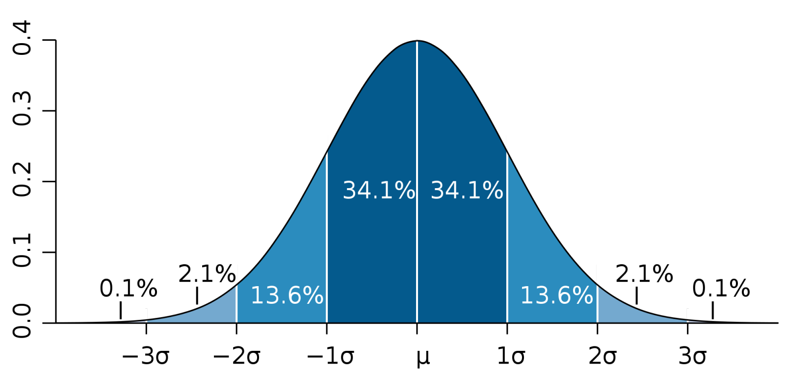
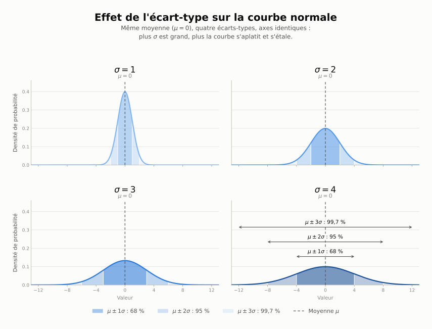
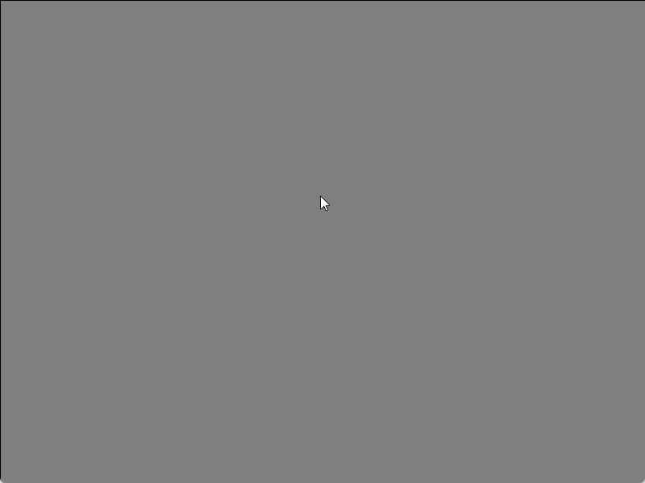
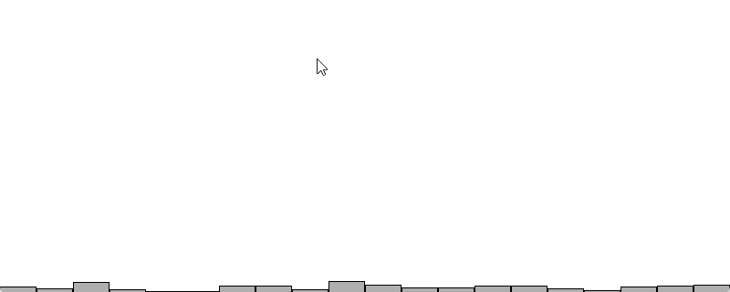
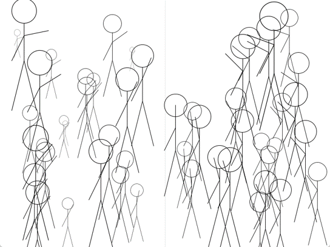

# Les nombres aléatoires <!-- omit in toc -->


## Objectifs
- Comprendre les bases des nombres aléatoires
- Comprendre la distribution uniforme
- Comprendre la distribution normale

## Introduction
Un ordinateur est une machine déterministe. Cela signifie que si vous lui donnez les mêmes données d'entrée, il donnera toujours la même sortie. Ainsi, il ne peut pas générer de vrais nombres aléatoires. Cela peut être un problème si vous voulez simuler des phénomènes aléatoires. Pour cela, on utilise des générateurs de nombres pseudo-aléatoires.

Ces nombres sont générés à partir d'une graine (**seed**) qui est un nombre initial. Si vous utilisez la même graine, vous obtiendrez les mêmes nombres aléatoires. Cela peut être utile pour déboguer un programme.

> **Note :** Je sais que vous avez hâte d'avoir les pieds dans `Godot`. Cependant, il est important de comprendre les bases mathématiques et algorithmiques qui se cachent derrière les jeux vidéo. `Processing` permet de simplifier la programmation graphique. C'est pourquoi je vous propose de commencer par ce langage. 

## Le marcheur aléatoire
Un exemple classique de simulation aléatoire est le marcheur aléatoire. Un marcheur aléatoire est un objet qui se déplace aléatoirement dans un espace. Il peut se déplacer dans n'importe quelle direction avec une probabilité égale.

Voici un exemple Processing pour simuler un marcheur aléatoire.

```java
int x = 0;
int y = 0;
int step = 2;

void setup() {
  size(400, 400);
  background(255);

  x = width / 2;
  y = height / 2;
}

void draw() {  
    int r = int(random(4));

    if (r == 0) {
        x += step;
    } else if (r == 1) {
        x -= step;
    } else if (r == 2) {
        y += step;
    } else {
        y -= step;
    }
    
    // Dessiner le point
    point(x, y);
}
```

!!! note "Résultat"

    Ce code donnera un résultat similaire à celui-ci :

    

## La graine aléatoire (seed)

Un générateur de nombres pseudo-aléatoires fonctionne comme une formule mathématique : à partir d'une valeur de départ (la graine), il produit une longue suite de nombres qui *semblent* aléatoires, mais qui sont en réalité entièrement déterminés par cette graine de départ.

Par défaut, la plupart des langages (dont Processing) choisissent automatiquement une graine différente à chaque exécution du programme, souvent basée sur l'horloge de l'ordinateur. C'est pourquoi, normalement, chaque fois que vous lancez votre sketch, vous obtenez une suite de nombres aléatoires différente de la précédente — le marcheur aléatoire vu plus haut ne trace jamais deux fois le même chemin.

On peut toutefois fixer la graine manuellement avec la fonction `randomSeed()`. En lui donnant toujours la même valeur, on force le générateur à toujours produire exactement la même suite de nombres, dans le même ordre.

!!! tip "Minecraft"
    Vous avez probablement déjà croisé ce concept sans le savoir : dans **Minecraft**, chaque monde est généré à partir d'une graine (le fameux *seed* qu'on peut entrer à la création d'un monde). Deux joueurs qui utilisent la même graine obtiennent exactement le même terrain, les mêmes villages, les mêmes grottes — même si le monde semble « généré aléatoirement ». C'est exactement le même principe que `randomSeed()` en Processing : la graine détermine entièrement la suite de valeurs « aléatoires » utilisées pour placer les blocs, les biomes, les structures, etc.

### Cas où la graine n'est pas régénérée

Que se passe-t-il si on fixe la graine une seule fois et qu'on ne la change jamais? Reprenons l'exemple du marcheur aléatoire ci-dessus, en ajoutant une seule ligne dans `setup()` :

```java
void setup() {
  size(400, 400);
  background(255);

  randomSeed(42); // La graine est fixée une seule fois, ici

  x = width / 2;
  y = height / 2;
}
```

Résultat : à chaque fois que vous exécutez ce sketch, le marcheur trace **exactement le même chemin**, pixel pour pixel. Visuellement, la trajectoire a toujours l'air aléatoire (on ne peut pas la prédire à l'œil nu), mais elle est parfaitement reproductible d'une exécution à l'autre, puisque la graine ne change jamais.

C'est très utile pour :

- **Déboguer** un programme : si un bogue apparaît seulement après un certain nombre d'itérations « aléatoires », fixer la graine permet de reproduire le bogue à volonté plutôt que d'espérer qu'il se reproduise par hasard.
- **Partager un résultat** : comme dans Minecraft, donner la même graine à quelqu'un d'autre lui permet d'obtenir exactement le même résultat que vous.
- **Tester** un système qui dépend du hasard (par exemple, vérifier qu'une distribution normale produit bien les valeurs attendues).

À l'inverse, si vous **retirez** la ligne `randomSeed(42)` (ou si vous appelez `randomSeed(millis())`, qui change à chaque exécution), le marcheur empruntera un chemin différent chaque fois que vous lancerez le programme, car la graine de départ change d'une exécution à l'autre.

> **Attention :** Un piège classique consiste à appeler `randomSeed()` avec la **même valeur à chaque frame**, à l'intérieur de `draw()` plutôt que dans `setup()`. Dans ce cas, le générateur est réinitialisé continuellement avec la même graine, et `random()` retournera alors **le même nombre à chaque frame** — le mouvement semblera figé plutôt qu'aléatoire. La graine doit normalement être fixée une seule fois, au démarrage du programme.

## Nombre aléatoire
Un nombre aléatoire est un nombre que l'on ne peut généralement pas prédire. Dans la plupart des langages de programmation, une fonction `random` est utilisée pour générer des nombres aléatoires entre 0 et 1. Par exemple, en Processing, la fonction `random(float)` génère un nombre aléatoire entre 0 (inclu) et `high` (exclu).

À partir de la valeur retournée par `random()`, on peut générer des nombres aléatoires dans un intervalle donné. Par exemple, pour générer un nombre aléatoire entre 0 et 9, on peut utiliser la formule suivante :

```java
int r = int (random(1f) * 10);
```

> **Question :**
>
> Que fera l’instruction suivante? 
> `line (width / 2, height / 2, random (0, width), random (0, height));`

Remarquez l'animation ci-dessous. Elle montre comment les nombres aléatoires sont distribués de manière uniforme entre 0 et 20.

<div class="p5-embed">
  <div id="sketch-uniform-distribution"></div>
  <script src="assets/sketch.js"></script>
  <script>
    (() => {
      const holder = document.getElementById("sketch-uniform-distribution");
      if (holder._p5Instance) holder._p5Instance.remove();
      holder._p5Instance = new p5(window.sketchUniformDistribution, holder);
    })();
  </script>
</div>

Ainsi, c'est comme si l'on avait un dé à 20 faces. Chaque face a la même probabilité d'apparaître. On appellera cette distribution une **distribution uniforme**.

### Marcheur aléatoire guidé

Si on veut que le marcheur tende vers l'ouest, comme dans l'exemple ci-contre, comment pourrait-on faire?



<details>

<summary>Indice</summary>

On peut utiliser une distribution uniforme pour guider le marcheur. Par exemple, si on veut que le marcheur aille plus souvent vers l'ouest, on peut générer un nombre aléatoire entre 0 et 1. Si le nombre est inférieur à 0,4, on ira vers l'ouest.

</details>


### Dans les jeux
On retrouve la distribution uniforme dans plusieurs types de jeux. Par exemple, dans un jeu de cartes, chaque carte a la même probabilité d'apparaître. Dans un jeu de dés, chaque face a la même probabilité d'apparaître. Certains jeux utilisent la distribution uniforme pour générer des caractéristiques physiques de personnages aléatoires.

{width="50%"}

## Distribution normale
Disons que l'on désire générer une population de zombies. Chaque zombie a une taille donnée en mètres. Dans une population réelle, la taille des zombies ne suit pas une distribution uniforme, c'est-à-dire qu'il y a plus de chances que l'on tombe sur un zombie de 1,72 mètre qu'un zombie de 2 mètres. Dans ma population, j'ai plus de zombies qui ont des tailles variant entre 1,65 et 1,75 mètre que des individus de 2 mètres et plus. La même chose pour des zombies de moins de 1,50 mètre. La taille des populations animales suit généralement une distribution normale. Ainsi, il y a une concentration des tailles plus fréquentes autour de la moyenne qu'aux extrêmes.

---

Voici un graphique montrant une distribution normale.



La lettre grecque μ (mu) représente la moyenne et σ (sigma) l'écart-type. **L'écart-type** est une mesure de la dispersion des valeurs autour de la moyenne. Plus l'écart-type est grand, plus les valeurs sont dispersées. Plus l'écart-type est petit, plus les valeurs sont regroupées autour de la moyenne.

Ainsi, à ±1 écart-type, on retrouve 68 % de la population. À ±2 écart-types, on retrouve 95 % de la population. À ±3 écart-types, on retrouve 99,7 % de la population.

> **Note :** La distribution normale est également appelée distribution gaussienne, courbe normale ou cloche de Gauss.




---


Dans l'exemple qui suit, nous avons une distribution normale avec une moyenne de 25 et un écart-type de 5.

<div class="p5-embed">
  <div id="sketch-gaussian-distribution"></div>
  <script src="assets/sketch.js"></script>
  <script>
    (() => {
      const holder = document.getElementById("sketch-gaussian-distribution");
      if (holder._p5Instance) holder._p5Instance.remove();
      holder._p5Instance = new p5(window.sketchGaussianDistribution, holder);
    })();
  </script>
</div>


La fonction que l'on retrouvera dans Processing sera `randomGaussian()` qui retourne une valeur avec une moyenne de 0 et un écart-type de 1.

Voici le code pour l'animation précédente :

```java
// Retourne un nombre avec une moyenne de 0 et un écart-type de 1.
// La règle générale de la courbe normale (ou gaussienne)
// ±1 écart-type : 68% de la population
// ±2 écart-type : 95% de la population
// ±3 écart-type : 99.7% de la population

int[] randomCounts;

void setup() {
  size(800, 320);
  randomCounts = new int[50];
}

void draw() {
  background(255);
  
  float num = randomGaussian();
  float sd = 5; // Standard deviation | Écart-type
  float mean = randomCounts.length / 2; // Moyenne
  
  int index = int(sd * num + mean);
  randomCounts[index]++;
  
  stroke(0);
  fill(175);
  int w = width / randomCounts.length;
  
  for (int x = 0; x < randomCounts.length; x++) {
    rect(x * w, height - randomCounts[x], w - 1, randomCounts[x]);
  }  
}
```


### Comment faire pour gérer la distribution normale?
Pour générer une distribution normale, on fait ce que l'on appelle un changement d'échelle :
- On prend une valeur aléatoire générée par `randomGaussian()`
- On la multiplie par l'écart-type désiré
- On ajoute ensuite la moyenne désirée

Cela nous donne une valeur aléatoire avec la distribution normale désirée.

```java
float num = randomGaussian();
float sd = 5; // Standard deviation | Écart-type
float mean = randomCounts.length / 2; // Moyenne

int value = int(sd * num + mean);
```

Voici [un exemple de code](pde://github.com/nbourre/0sw_processing_exemples/raw/master/bin/s01_distribution_comparaison.pdez) qui compare les deux types de distribution où l'on peut voir comment on peut contrôler les valeurs.

### Exemple de cas d'utilisation
Dans un jeu de tir, on peut utiliser une distribution normale pour gérer la précision des tirs. Lorsque le joueur tire, on génère une valeur aléatoire avec une distribution normale selon son niveau de fatigue, la distance de la cible, etc. Par exemple, après un sprint, le joueur sera plus fatigué et sa précision sera moins bonne. Ainsi, en augmentant l'écart-type, on augmente la dispersion des tirs.

Dans les logiciels de dessin, on peut utiliser une distribution normale pour simuler l'aérographe. Plus l'écart-type est grand, plus la zone de peinture sera grande et dispersée.

<div class="grid cards" markdown>

- 
- Dans l'exemple ci-contre, les tranches représentes une multiplication de l'écart-type soit 1, 2 et 3.

</div>

Voici un exemple de code pour gérer la précision des tirs à l'aide de la souris.

```java
float precision = 5; // Précision de base
float fatigue = 0; // Fatigue du joueur

void setup() {
  size(800, 600);
  background(127);
}

void draw() {
  fill(127, 127, 127, 10);
  rect(0, 0, width, height);

  if (mousePressed) {
    drawBullet();
  }

  if (keyPressed) {
    if (key == 'a') {
      fatigue += 0.1;
    } else if (key == 'z') {
      fatigue -= 0.1;
    }

    if (key == 'r') {
        background(127);
    }
  }
}

void drawBullet() {
  float numX = randomGaussian();
  float numY = randomGaussian();

  float sd = precision + fatigue; // Standard deviation | Écart-type
  float mean = 0; // Moyenne

  int x = int(sd * numX + mean);
  int y = int(sd * numY + mean);

  fill(0);
  ellipse(mouseX + x, mouseY + y, 5, 5);
}

```

!!! note "Résultat"

    Ce code donnera un résultat similaire à celui-ci :

    


---

## Distribution uniforme vs normale

<div class="grid cards" markdown>

- 
- 

</div>

---

### Question

<div class="grid" markdown>

Dans l'image ci-contre, de quel côté est la distribution uniforme et pourquoi?



</div>

---

## Exercices
- Modifiez l'exemple avec la distribution normale pour qu'il affiche une distribution normale avec une moyenne de 175 et un écart-type de 10.

---

## Le bruit de Perlin
Voici le lien vers mes notes sur la [génération procédurale](../procedural_generation/)


### Exemple
Voici un [exemple](pde://github.com/nbourre/0sw_processing_exemples/raw/master/bin/s01_simulation_fatigue.pdez) combinant le bruit de Perlin et la distribution normale.