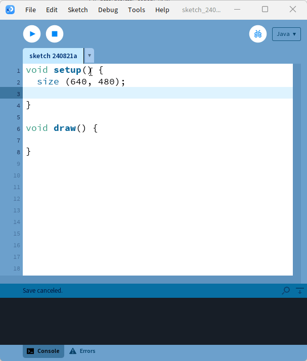

# Les classes dans Processing
## Classes internes vs classes génériques

- Les classes de base en Processing ont la particularité d'être des **classes internes**
- En effet, Processing fusionne toutes les classes à l'intérieur d'une grande classe principale lors de la compilation
- L'avantage de cette méthode est que le programme dispose de variables et de constantes propres à Processing, telles que `width` et `height`
- Il est possible de créer des classes totalement génériques en ajoutant l'extension `.java` au nom de l'onglet
    - Cela aura comme conséquence qu'il ne sera pas possible d'accéder directement aux variables et constantes de Processing
    - Pour pouvoir accéder aux propriétés de Processing, il faudra injecter un `PApplet` dans la classeclasse, il faut ajouter un onglet et lui attribuer le nom de la classe
    - Utiliser la flèche à droite du dernier onglet
- Par la suite, il suffit de coder comme dans pratiquement n'importe quel langage orienté objetcessing <!-- omit in toc -->


## Introduction

Dans Processing, la programmation orientée objet est possible grâce aux classes. Les classes permettent d'organiser le code de manière modulaire et de créer des objets réutilisables.

## Création d'une classe

<div class="grid cards" markdown>

-   Pour créer une nouvelle classe, il faut ajouter un onglet et lui attribuer le nom de la classe

    - Flèche à droite du dernier onglet

    Par la suite, il suffit de coder comme pratiquement n’importe quelle classe

-   

</div>


---

- Les classes de base en Processing ont la particularité d’être des **classes internes**.
- En effet, Processing fusionne toutes les classes à l’intérieur d’une grande classe principale lors de la compilation.
- L’avantage de cette méthode est que le programme dispose de variables et constantes propres à Processing, telles que `width` et `height`.
- Il est possible de créer des classes totalement génériques en ajoutant l’extension `.java` au nom de l’onglet.
    - Cela aura comme conséquence qu’il ne sera pas possible d’accéder directement aux variables et constantes de Processing.
    - Pour pouvoir accéder aux propriétés de Processing, il faudra injecter un `PApplet` dans la classe.

---

Voici un exemple de classe de base que j'utilise fréquemment lorsque je fais du Processing.

```java

/// Classe abstraite pour les éléments graphique
abstract class Actor { // ou GraphicObject
  PVector location;
  PVector velocity;
  PVector acceleration;
 
  color fillColor = color (255);
  color strokeColor = color (255);
  float strokeWeight = 1;
  
  // Méthode qui permet de mettre à jour les informations
  // interne de la classe
  abstract void update(int time);
  
  // Méthode qui fait le rendu de la classe
  abstract void display();
  
}

```


