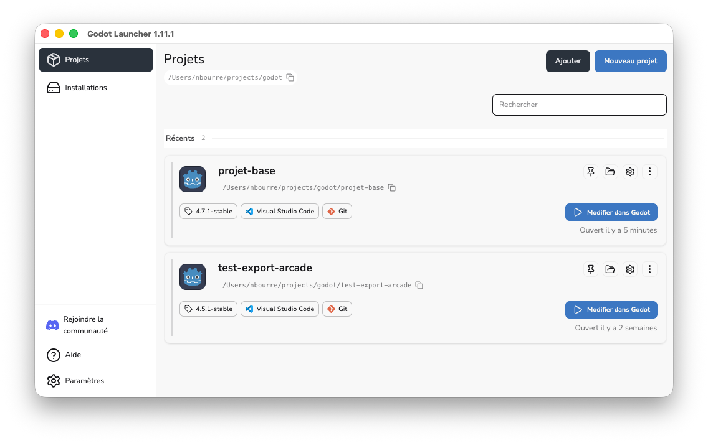

# Premier pas avec Godot <!-- omit in toc -->

Apprendre les rudiments de l'environnement de développement Godot.

## Préambule

Pour la suite du cours, je vous suggère fortement de cloner mon dépôt GitHub [0sw_projets_cours](https://github.com/nbourre/0sw_projets_cours), qui contient les projets de cours. Vous pouvez aussi fourcher le dépôt si vous préférez.

## Plan de leçon

- Notes préliminaires
- Gestionnaire de projets
- L'environnement de travail
- Scènes et nœuds
- Script et fonctions de rappel
- Signaux
- Instanciation

## Notes préliminaires

Au moment de réviser ces notes, j'utilisais la version 4.7.1 de Godot. Godot est un moteur de jeux vidéo 2D et 3D à code source ouvert. Le langage de script natif est le `GDScript`, un pseudo-Python; il est aussi possible d'utiliser le C# avec l'édition incluant Mono (.NET).

J'utiliserai l'interface en anglais pour faciliter la recherche de ressources en ligne, mais vous pouvez utiliser la langue qui vous convient.

Je vous invite aussi à regarder [ma série de vidéos sur Godot](https://youtu.be/D89lwa1TZ5c?si=Lb6ZWMvspNOkuoea) — attention, certaines datent d'une version plus ancienne du logiciel.

!!! note "Lanceur Godot"
    Personnellement, j'utilise l'outil [Godot Launcher](https://godotlauncher.org/), qui facilite la gestion des projets lorsqu'on en a plusieurs.

    

## Gestionnaire de projets

Au premier démarrage, le gestionnaire de projets est vide.


C'est l'endroit où l'on retrouve nos projets récents. Dans cette fenêtre, on peut créer un nouveau projet, rechercher des projets dans un dossier (Scan), importer un projet, ou effectuer d'autres opérations sur des projets existants.

Pour modifier la langue de l'interface, il suffit de cliquer sur le bouton "Settings" dans le coin supérieur droit.

## Création d'un nouveau projet

Pour créer un nouveau projet, il faut le placer dans un dossier vide — un bouton permet de créer ce dossier directement depuis le gestionnaire. Je suggère de regrouper tous vos projets au même endroit. Une fois le dossier choisi, Godot s'occupe de créer les différents fichiers nécessaires au projet.

!!! note
    J'utilise un seul dépôt pour l'ensemble de mes projets Godot. Vous pouvez y accéder [ici](https://github.com/nbourre/0sw_projets_cours).

## L'environnement de travail

L'environnement de travail de Godot peut sembler intimidant au premier abord, mais si vous avez de l'expérience avec Visual Studio ou un environnement similaire, il vous semblera familier. Comme dans VS, l'interface est modulable : les panneaux peuvent être déplacés à l'endroit qui vous convient.


### Système de fichiers

La barre de menus, en haut, contient le menu principal, les boutons pour changer de zone de travail (workspace) et les boutons de test du jeu. Le volet `FileSystem` contient la structure du dossier du projet, y compris les ressources (*assets*) comme les images et les sons.


### Volet Scène

Le volet `Scene` permet de gérer les scènes du projet : la structure hiérarchique des nœuds qui la composent.


### Volet Inspector

Il y a aussi le concept de nœud, que l'on verra sous peu. Le volet `Inspector` permet de gérer les propriétés du nœud sélectionné dans la scène active.


### La zone de travail (workspace)

Lorsqu'on sélectionne une zone de travail, la barre d'outils qui la surplombe s'adapte selon le contexte.


### Volet inférieur

Comme dans plusieurs IDE, le volet inférieur regroupe divers outils : sortie, débogueur, éditeur d'animations, etc.


### Les types d'environnement de travail

Dans la partie supérieure de la fenêtre de Godot, plusieurs boutons permettent de changer d'environnement de travail (*workspace*) :

- **2D** sert principalement au 2D et aux interfaces.
- **3D** sert à travailler avec les meshes, l'éclairage et le design de niveaux 3D.
- **Script** est un éditeur de code complet avec un débogueur intégré.
- **Game** permet de visualiser le jeu directement dans l'éditeur, pour des tests rapides.
- **Asset Store** est une boutique de ressources telles que des scripts, des images ou des add-ons.

!!! note "Coup de chapeau à un ancien"
    Un ancien du programme, [spimort](https://www.youtube.com/@spimortdev), a développé **[TerraBrush](https://spimort.github.io/TerraBrush/#/)**, un plugin de sculpture de terrain 3D pour Godot devenu très populaire dans la communauté. Il partage aussi son travail et ses projets Godot sur sa [chaîne YouTube](https://www.youtube.com/@spimortdev) — un bel exemple de ce qu'on peut accomplir après le cours!

## Scènes et nœuds

Godot fonctionne autour des concepts de **scène** et de **nœud**.

- [Documentation officielle](https://docs.godotengine.org/fr/4.x/getting_started/step_by_step/nodes_and_scenes.html)
- Ma vidéo [Débuter avec Godot 4](https://www.youtube.com/watch?v=D89lwa1TZ5c)

### Les nœuds


Les nœuds sont les ingrédients de base pour construire un jeu; chaque nœud a une fonctionnalité spécialisée. Chaque nœud possède un nom, des propriétés modifiables, et peut recevoir des fonctions de rappel (*callbacks*) exécutées à chaque frame. Il peut aussi être étendu pour offrir plus de fonctionnalités, et être ajouté comme enfant d'un autre nœud — ce qui forme un graphe. Ne vous inquiétez pas si tout n'est pas clair pour l'instant, on y revient plus loin.


### Les scènes

Une scène est composée d'un groupe de nœuds organisés de façon hiérarchique. Elle possède toujours un nœud racine, peut être sauvegardée et chargée, et peut être instanciée comme un objet. Exécuter un jeu revient à exécuter une scène : un projet peut en contenir plusieurs, mais il doit toujours avoir une scène principale pour démarrer.

!!! tip "Astuce"
    Pensez à un fichier `.json` qui contient des données structurées — une scène Godot suit un peu la même logique.


## Exercice : Bonjour le monde

### Lancer Godot et créer un nouveau projet

- Ouvrez Godot.
- Créez un nouveau projet.
- Nommez-le `HelloWorld`.
- Choisissez le dossier dans lequel vous allez le sauvegarder.
- Cliquez sur `Create`.

### Ajout d'un nœud Label

Comme tout bon premier exemple, nous allons créer un projet « Bonjour le monde ». Ajoutez un nœud `Label` via le bouton "+" dans le coin supérieur gauche du volet Scene (le bouton "Other node" revient à la même action). Une fenêtre de recherche de nœuds apparaît : cherchez "Label" et appuyez sur `Create`.


Plusieurs choses se passent après avoir cliqué sur `Create` : la scène passe en 2D, puisqu'un `Label` est un nœud de type 2D, et l'étiquette apparaît sélectionnée dans le coin supérieur gauche du *viewport*. La seconde étape consiste à changer le texte dans le volet `Inspector` : modifiez la propriété `Text` pour "Bonjour le monde!".

### Exécution de la scène

Exécutez la scène en cliquant sur le bouton d'exécution dans le coin supérieur droit, ou avec [F6]. La première fois, Godot demandera de sauvegarder la scène : donnez-lui un nom significatif comme "bonjour" — l'endroit de sauvegarde par défaut est le dossier `res://`, le dossier des ressources du projet. Si tout va bien, une fenêtre s'affiche avec le texte de l'étiquette.


### Configurer le projet

Comme indiqué plus tôt, un projet peut avoir plusieurs scènes; il faut donc configurer le projet pour indiquer laquelle est la scène principale. Ouvrez le menu `Project → Project settings`, puis, dans le volet de gauche, sous `Application → Run` (ou `Exécuter`), changez la propriété `Main Scene` pour la scène "Bonjour le monde". Une fois la fenêtre fermée, exécuter le jeu avec [F5] lancera directement la scène principale.

## Script


### Introduction

Dans cette partie, nous allons construire un projet dans lequel un bouton change le texte d'une étiquette à l'aide du code. Sans extension, Godot accepte deux langages : le GDScript, langage natif de Godot ressemblant à Python (le favori de ceux qui apprennent à programmer, et utilisé dans la plupart des tutoriels), et le C#, le langage favori des programmeurs et des gros projets, celui que je vous suggère si vous désirez être sérieux avec Godot. Il est possible d'utiliser plusieurs langages dans un même projet. Voir la [documentation officielle](https://docs.godotengine.org/en/stable/getting_started/step_by_step/scripting_languages.html).

### Objectifs

- Attacher un script à un nœud
- Accrocher un élément graphique (UI) via un signal (événement)
- Écrire un script qui accède à d'autres nœuds dans la scène

Il est suggéré de survoler les références de GDScript.

### Monter la scène

<div class="grid" markdown>

<div markdown>

Avec le projet "Hello World", ajoutez les nœuds suivants dans la même hiérarchie :

- `Node2D`
    - `Panel`
        - `Label`
        - `Button`

</div>

<div markdown>

Vous pouvez ajouter un nœud à la racine de la scène en cliquant avec le bouton droit. Positionnez les contrôles pour obtenir ce qui est affiché ci-contre. La propriété `Size` dans la section `Transform` du `Panel` permet de le redimensionner.

</div>

</div>

{width="25%"}

### Signification des éléments d'ajustement


!!! tip "Astuces"
    Si vous devez **ajouter des nœuds** enfants souvent, je vous suggère d'apprendre le raccourci <kbd>CTRL</kbd>+<kbd>A</kbd> lorsque vous êtes dans le volet `Scène`.

    Pour **renommer** des nœuds, faites <kbd>F2</kbd>

### Ajouter un script

Dans le volet `Scene`, renommez le `Node2D` pour `World` — une convention que l'on utilisera pour désigner le monde du jeu. Cliquez avec le bouton droit sur le nœud `World` et sélectionnez `Attach Script`; la boîte de dialogue de création de script s'affiche.


On y règle entre autres le langage de programmation et le nom du fichier. Sélectionnez le langage `GDScript` — il est possible de modifier le nom du fichier, mais Godot utilise par défaut celui du nœud auquel le script est attaché (`world.gd` dans notre cas). Cliquez sur `Create`; l'éditeur de script s'ouvre. Une icône de parchemin apparaît à côté du nœud `World` : en cliquant dessus, on ouvre le script attaché.


### Le script


Les méthodes `_ready` et `_process` sont générées automatiquement. `_ready` s'exécute une fois que tous les enfants sont entrés en activité dans la scène; `_process` s'exécute le plus souvent possible, idéalement à chaque frame — le paramètre `delta` correspond au temps écoulé depuis sa dernière exécution. Le rôle du script est d'ajouter des comportements à un nœud.

!!! note "Convention de nommage"
    Dans le texte, les noms de méthodes et de propriétés sont écrits selon la convention GDScript (`snake_case`, ex. `_ready`, `get_node`). En C#, la convention est plutôt `PascalCase` (ex. `_Ready`, `GetNode`) — les deux s'exécutent exactement de la même façon; seule l'écriture change. Les onglets de code ci-dessous montrent les deux versions.

Ajoutez la méthode suivante :

=== "GDScript"

    ```gdscript
    func _on_button_pressed() -> void:
        var label = get_node("Panel/Label") as Label
        label.text = "Bonjour!"
    ```

=== "C#"

    ```csharp
    public void OnButtonPressed()
    {
        var label = GetNode<Label>("Label");
        label.Text = "Bonjour!";
    }
    ```

Modifiez la méthode `_ready` pour qu'elle ressemble à ceci :

=== "GDScript"

    ```gdscript
    func _ready() -> void:
        var button = get_node("Panel/Button") as Button

        # Ajoute un événement au bouton
        button.pressed.connect(_on_button_pressed)
    ```

=== "C#"

    ```csharp
    public override void _Ready()
    {
        var button = GetNode<Button>("Button");

        // Ajoute un événement au bouton
        button.Pressed += OnButtonPressed;

    }
    ```

Dans `_ready`, on retrouve la méthode `get_node(nomNoeud)`, qui permet de retrouver un nœud relatif à celui qui possède le script, et l'association de la méthode `_on_button_pressed` à l'événement `pressed` du bouton.

### Signal et get_node

Godot utilise le terme **signal**, synonyme d'**événement**. La convention Godot pour le nom des méthodes de signaux est *\_on\_[nom_noeud]_[nom_signal]* — dans notre cas, `_on_button_pressed`. Pour attacher un signal à un événement, il suffit d'ajouter la méthode à l'événement. La méthode `get_node(nomNoeud)` permet de retrouver un nœud relatif à celui qui possède le script. Remarquez le `as Label` dans la version GDScript et `<Label>` dans la version C# : il s'agit d'une conversion de type, car `get_node()` retourne un nœud générique.

### Exécution du script

Vous pouvez exécuter la scène pour tester le script.

## `get_node()`

La méthode `get_node()` est fréquemment utilisée pour retrouver un nœud; le chemin donné en paramètre est une chaîne relative au nœud possédant le script. Supposons que le nœud courant soit `Character`, dans le graphe suivant :

```
/root
/root/Character
/root/Character/Sword
/root/Character/Backpack/Dagger
/root/MyGame
/root/Swamp/Alligator
/root/Swamp/Mosquito
/root/Swamp/Goblin
```

Des chemins possibles sont :

```
get_node("Sword")
get_node("Backpack/Dagger")
get_node("../Swamp/Alligator")
get_node("/root/MyGame")
```

## Autres informations sur le script

Remarquez que le script précédent hérite du nœud, par exemple `extends Node2D` (ou `public class XYZ : Node2D` en C#). N'oubliez pas que c'est de l'héritage, donc les propriétés du nœud sont directement accessibles dans le code — par exemple, la propriété `Text` est accessible pour un nœud de type `Label`.

Il est possible d'utiliser Visual Studio Code pour éditer le code et profiter de l'auto-complétion. Consultez ce lien : [Setup Godot 4.3 C# In Windows With Visual Studio Code .NET8 in 7 minutes | 2024 | 2025 | Debug](https://www.youtube.com/watch?v=QetDIxDorFI). Pour coder avec VS Code, je vous suggère d'installer l'extension [Godot Tools](https://marketplace.visualstudio.com/items?itemName=geequlim.godot-tools).

## Les fonctions de rappel

Godot fonctionne beaucoup avec des *callbacks* (fonctions de rappel) ou des fonctions virtuelles, ce qui évite de vérifier plusieurs conditions `if` à chaque tour de boucle. On peut tout de même utiliser des fonctions de traitement continu, comme les boucles de jeu classiques : Godot offre `_process(delta)` et `_physics_process(delta)` pour exécuter du code périodiquement.

## `_process(delta)`

La méthode `_process` est appelée à chaque début de frame; elle n'est synchronisée à aucune fréquence fixe et s'exécute donc à un intervalle de temps variable. Le paramètre `delta` contient le temps écoulé depuis le dernier appel de la fonction (une fraction de seconde, par exemple 0.016s) et sert à calculer des variations constantes indépendamment du taux de rafraîchissement — voir le projet `c01d_process`.

Par exemple, si une balle doit se déplacer à 60px/sec peu importe la puissance de la machine, il suffit de multiplier la vitesse par `delta` :

=== "GDScript"

    ```gdscript
    vitesse.x = 60 * delta
    ```

=== "C#"

    ```csharp
    vitesse.x = 60 * delta;
    ```

## `_physics_process(delta)`

Similaire à `_process`, cette méthode est synchronisée au FPS, par défaut 60 FPS, et est donc dépendante du taux de rafraîchissement de l'application — sur un appareil plus lent (ex. Raspberry Pi), les résultats peuvent être imprévisibles. Il est possible de configurer ce taux dans les réglages du projet, sous `Physics → Common → Physics FPS`. Elle s'exécute après chaque appel de `_process`.

## Comparaison entre `_process` et `_physics_process`

Voici une animation pour comparer les deux méthodes, ainsi qu'une version utilisant `delta` :


## Les groupes

Godot fonctionne avec un système de graphe (arbre hiérarchique). Il est possible d'associer des nœuds à des groupes pour exécuter des instructions sur l'ensemble du groupe, via la méthode `add_to_group(nomGroupe)` — par exemple pour indiquer à un groupe d'ennemis d'atteindre un point donné sur la carte, ou pour notifier des objets qu'un événement est arrivé. La fonction `get_tree().get_nodes_in_group(nomGroupe)` récupère les nœuds d'un groupe donné, et `get_tree().get_first_node_in_group(nomGroupe)` en récupère le premier.

## Les méthodes surchargeables

- `_enter_tree()` : Appelée lorsque le nœud s'intègre au graphe. Cette méthode est appelée pour chaque nœud enfant.
- `_ready()` : Appelée après `_enter_tree()`, une fois que tous les nœuds enfants sont intégrés dans le graphe.
- `_exit_tree()` : Appelée lorsque le nœud sort du graphe, une fois que tous les nœuds enfants ont quitté le graphe.


<div class="grid" markdown>

<div markdown>

Supposons la hiérarchie suivante :

- `NoeudA`
    - `NoeudB`
    - `NoeudC`

</div>

<div markdown>

L'ordre d'exécution :

- `NoeudA` entre en scène : `NoeudA._enter_tree()` est exécutée.
- `NoeudB` est ajouté à `NoeudA` : `NoeudB._enter_tree()`, puis `NoeudB._ready()` sont appelées.
- `NoeudC` est ajouté à `NoeudA` : `NoeudC._enter_tree()`, puis `NoeudC._ready()` sont appelées.
- `NoeudA._ready()` est exécutée.

</div>
</div>


## Créer et détruire un nœud

Il est important de disposer des objets lorsqu'ils ne sont plus utilisés, pour optimiser l'utilisation de la mémoire.

Exemple de création d'un nœud :

=== "GDScript"

    ```gdscript
    var sprite = Sprite.new()
    add_child(sprite) # Ajoute un enfant au nœud courant
    ```

=== "C#"

    ```csharp
    Sprite _sprite = new Sprite();
    AddChild(_sprite); // Ajoute un enfant au nœud courant
    ```

Exemple de destruction d'un nœud :

=== "GDScript"

    ```gdscript
    nom_noeud.queue_free() # Libère le nœud après que ses tâches sont complétées
    ```

=== "C#"

    ```csharp
    _nomNoeud.QueueFree(); // Libère le nœud après que ses tâches sont complétées
    ```

## Exercice

Avec le projet `c01_godot` (qui contient `Panel`, `Label` et `Button`), complétez le script `TestPanel` avec les méthodes ci-dessous, puis exécutez pour observer l'ordre d'exécution des méthodes de rappel.

=== "GDScript"

    ```gdscript
    func _ready():
        print("TestPanel ready")
        (get_node("Button") as Button).pressed.connect(on_button_pressed)

    func _enter_tree():
        print("TestPanel enter tree")

    var test = true
    func _process(delta):
        if test:
            print("TestPanel process")
            test = false

    func on_button_pressed():
        print("TestPanel button pressed")
    ```

=== "C#"

    ```csharp
    public override void _Ready()
    {
        GD.Print($"{nameof(TestPanel)} ready");
        GetNode<Button>("Button").Pressed += OnButtonPressed;
    }

    public override void _EnterTree()
    {
        GD.Print($"{nameof(TestPanel)} enter tree");
    }

    bool test = true;
    public override void _Process(double delta)
    {
        if (test)
        {
            GD.Print($"{nameof(TestPanel)} process");
            test = false;
        }
    }

    public void OnButtonPressed()
    {
        GD.Print($"{nameof(TestPanel)} button pressed");
    }
    ```

## Les signaux

Les signaux sont les événements de Godot. Godot fonctionne avec le **patron de conception de l'observateur** : ce patron permet à un nœud d'envoyer un message que certains nœuds peuvent écouter et auquel ils peuvent réagir. Par exemple, au lieu de vérifier continuellement si un bouton est appuyé, il suffit que le bouton envoie un signal lorsqu'il est appuyé.

Les signaux permettent de découpler les objets du jeu, ce qui favorise une meilleure organisation et gestion du code. Ainsi, lorsqu'un signal est émis, seuls les objets intéressés y réagissent.

Lectures suggérées :

- [Documentation officielle sur les signaux](https://docs.godotengine.org/fr/4.x/classes/class_signal.html)
- [Game Programming Patterns - Observers](https://gameprogrammingpatterns.com/observer.html)
- [Wikipedia - Observer Pattern](https://en.wikipedia.org/wiki/Observer_pattern)

### Les signaux : Exercice

Dans un premier temps, nous allons faire un exemple en utilisant l'interface, avec les nœuds `Timer` et `Sprite`, pour faire clignoter une image. Dans un projet quelconque, ajoutez la hiérarchie suivante :

- `ExempleTimer` : `Node2D`
    - `Timer` : `Timer`
    - `Sprite` : `Sprite2D`

Sélectionnez le `Sprite2D`. Dans l'inspecteur, à la propriété `Texture`, sélectionnez `Load` et chargez l'image `icon.svg`.

### Les signaux : Exercice (suite)

Attachez un script à `ExempleTimer`. Sélectionnez `Timer` et, dans les propriétés, cochez `On` pour `Autostart` : le chronomètre débutera dès le démarrage de la scène. Allez dans l'onglet `Node` — vous y verrez les différents signaux acceptés pour chaque classe héritée, ce qui ressemble aux événements de Visual Studio. Double-cliquez sur `timeout()` : une fenêtre apparaît.


`Timer` est en bleu, car c'est l'objet émettant le signal. Le champ `Receiver Method` indique la méthode que l'observateur exécutera à la réception du signal — on peut renommer cette méthode. Sélectionnez le nœud `ExempleTimer` (celui auquel vous avez attaché un script) et cliquez sur `Connect`.

!!! warning "Bug connu"
    Il semble que la méthode générée par l'éditeur se retrouve à l'extérieur de la classe — déplacez-la à l'intérieur au besoin.

Ajoutez le code ci-dessous :

=== "GDScript"

    ```gdscript
    func _on_timer_timeout():
        # Adaptez le chemin selon votre hiérarchie
        var sprite = get_node("../Icon") as Sprite2D
        sprite.visible = !sprite.visible
        print("Clignotement")
    ```

=== "C#"

    ```csharp
    public void _on_timer_timeout() {
      // Adaptez le chemin selon votre hiérarchie
      var sprite = GetNode<Sprite2D>("../Icon");
      sprite.Visible = !sprite.Visible;
      GD.Print("Clignotement");
    }
    ```

Question : Que fait ce code? Exécutez le projet pour vérifier votre réponse.

## Les signaux en code

Il est possible de connecter des signaux via le code plutôt que par l'éditeur — utile notamment lorsqu'on crée des instances dynamiquement et qu'on doit y attacher des signaux. Pensez aux écouteurs d'événements en JavaScript qu'on attache en code avec `addEventListener`. Pour attacher un signal via le code, on relie une fonction au signal du même nom.

Voici un exemple où on attache deux fonctions à un même signal :

=== "GDScript"

    ```gdscript
    # Exemple où on attache 2 fonctions à un signal
    mon_objet.signal_name.connect(fonction_a)
    mon_objet.signal_name.connect(fonction_b)
    ```

=== "C#"

    ```csharp
    // Exemple où on attache 2 fonctions à un événement
    monObjet.eventName += eventFunctionA;
    monObjet.eventName += eventFunctionB;
    ```


### Exercice

Avec le projet `ExempleTimer` :

- Dans l'éditeur, déconnectez le signal `timeout()` à l'aide du bouton `Disconnect`.
- Dans la méthode d'initialisation (`_ready` en GDScript, `_Ready()` en C#), connectez le signal par code :

=== "GDScript"

    ```gdscript
    (get_node("Timer") as Timer).timeout.connect(_on_timer_timeout)
    ```

=== "C#"

    ```csharp
    GetNode<Timer>("Timer").Timeout += _on_timer_timeout;
    ```

### Signaux personnalisés

Il est aussi possible de créer des [signaux personnalisés](https://docs.godotengine.org/fr/stable/getting_started/step_by_step/signals.html#custom-signals). Quelques exemples d'utilité :

- Un personnage tire et je veux signaler que le projectile a été tiré.
- Des ennemis approchent un lieu précis, et on veut signaler que l'événement est arrivé.

Pour émettre un signal, on appelle la méthode `emit_signal()` (`EmitSignal()` en C#).

Exemple :

=== "GDScript"

    ```gdscript
    extends CharacterBody2D

    signal hit(damage)

    func _ready():
        emit_signal("hit", 42)
    ```

=== "C#"

    ```csharp
    public class Player : CharacterBody2D
    {
        [Signal]
        public delegate void Hit(int damage);

        public override void _Ready()
        {
            EmitSignal(nameof(Hit), 42);
        }
    }
    ```

## Instanciation

Dans les petits projets, l'utilisation d'une seule scène avec quelques nœuds peut suffire, mais dans les projets plus grands, le nombre de nœuds peut vite devenir ingérable. L'instanciation permet d'intégrer des scènes sauvegardées à l'intérieur d'une autre scène.


### Exercice : Instanciation

À l'aide du fichier [`instancing_starter.zip`](https://github.com/godotengine/godot-docs-project-starters/releases/download/latest-4.x/instancing_starter.zip), décompressez-le à l'endroit désiré, puis importez-le dans Godot à partir du gestionnaire de projet. Il se peut qu'il y ait un avertissement de version : acceptez la mise à jour du projet. Réalisez ensuite l'exercice qui se retrouve [ici](https://docs.godotengine.org/en/stable/getting_started/step_by_step/instancing.html#instancing-by-example).

**Résumé du projet**

Le projet contient deux scènes : `Ball.tscn` et `Main.tscn`. La scène `Ball` utilise un `RigidBody2D` pour la gestion de la physique. La scène principale utilise `StaticBody2D` pour les obstacles que la balle peut rencontrer.

**Objectifs de l'exercice**

- Instancier la scène `Ball` dans la scène `Main`.
- Permettre à la balle d'interagir avec les obstacles.
- Tester et ajuster la configuration des propriétés physiques (ex. : bounce).

### Exercice : Instanciation simple

1. Pour ajouter une instance de la balle dans la scène, sélectionnez le nœud racine.
2. Cliquez sur le bouton d'instance (icône de maillon de chaîne).
3. Placez la balle dans la scène, puis exécutez le projet pour observer le comportement.


### Exercice : Instanciation multiple

1. Sélectionnez l'instance de la balle dans la scène.
2. Dupliquez l'instance avec le raccourci `[Ctrl] + D` pour ajouter plusieurs balles à la scène.
3. Exécutez le projet et observez l'interaction des différentes instances avec les obstacles.


### Exercice : Modification des instances

1. Pour modifier le comportement des balles, ajustez la propriété `Bounce` dans le `PhysicsMaterial` de la balle pour la rendre plus rebondissante.
2. Modifiez la scène `Ball.tscn` pour que toutes les instances héritent des changements.
3. Si vous souhaitez personnaliser une seule instance, sélectionnez l'instance dans `Main.tscn` et apportez des modifications spécifiques.

## Conception de jeux avec des scènes

Le concept de **scènes** est au cœur du fonctionnement de Godot. Cela permet de structurer efficacement les projets de manière hiérarchique.

### Exemple de structure de jeu

Chaque rectangle représente une scène (ou un groupe de scènes) que vous pouvez instancier dans une scène parent. Ce système modulaire facilite le développement et l'organisation des ressources dans des projets complexes.


## Conclusion : Premiers pas avec Godot

### Bilan des apprentissages

Au terme de cette introduction, vous avez découvert :

- L'interface de Godot et ses principaux volets (Scene, Inspector, FileSystem, etc.)
- La gestion des projets et la création d'un nouveau projet
- Le concept fondamental de scènes et de nœuds, et leur organisation hiérarchique
- Comment ajouter et configurer des nœuds (Label, Button, Panel, Node2D, etc.)
- L'exécution d'une scène et la configuration de la scène principale
- L'attachement de scripts aux nœuds, l'utilisation de C# et de GDScript
- La connexion d'événements (signaux) pour interagir avec l'interface
- Les fonctions de rappel (`_ready`, `_process`, `_physics_process`, etc.)
- L'instanciation de scènes et la gestion de plusieurs instances
- La structuration d'un projet de jeu avec une approche modulaire

### Conseils pour progresser

- N'hésitez pas à explorer l'interface et à tester les différents types de nœuds.
- Consultez la documentation officielle et les vidéos recommandées pour approfondir.
- Essayez de modifier les exemples pour mieux comprendre leur fonctionnement.
- Travaillez sur de petits projets pour vous familiariser avec la logique de Godot.

### Pour aller plus loin

- Expérimentez avec les signaux personnalisés et la gestion des groupes.
- Explorez les méthodes surchargeables pour personnaliser le comportement des nœuds.
- Testez l'instanciation dynamique de scènes pour des jeux plus complexes.
- Personnalisez vos projets en modifiant les propriétés, les scripts et la structure des scènes.

Ne vous inquiétez pas si tout n'est pas encore clair : la pratique et l'expérimentation sont essentielles pour progresser. Plus vous créerez de projets, plus l'utilisation de Godot deviendra intuitive.

## Note importante

Il existe encore de nombreux tutoriels et projets utilisant Godot 3.x. Assurez-vous d'adapter les tutoriels pour la version 4.x de Godot lorsque nécessaire.

### Exercice

Veuillez effectuer le didacticiel complet que l'on retrouve ici : [Lien vers le didacticiel](https://docs.godotengine.org/fr/4.x/getting_started/first_2d_game/index.html). Apportez ensuite des modifications à votre jeu pour le personnaliser.

<!-- Grille à 2 colonnes pour copier coller

<div class="grid" markdown>


</div>

-->
