# Utilisation des TileSets <!-- omit in toc -->

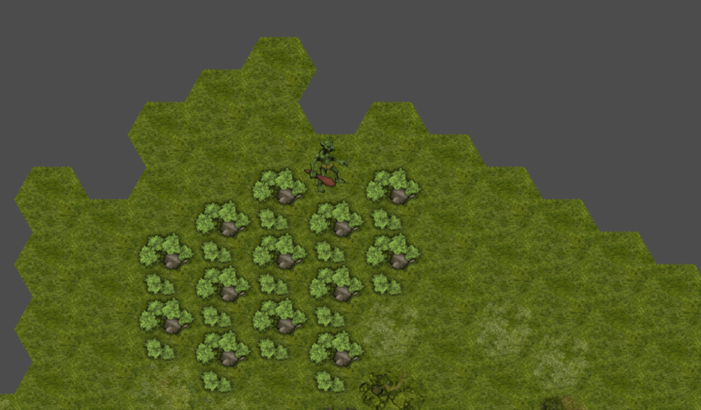

<!-- TODO : Voir les animations, le scattering, supprimer des tiles, etc.
Src : https://youtu.be/G6TC6ukmSc4?si=LgjDakCLC3O_O4qk&t=188
prj : everthing -> jackie-codes

-->

## Pré-requis

- Utilisez le projet `c07_plateforme` comme base.

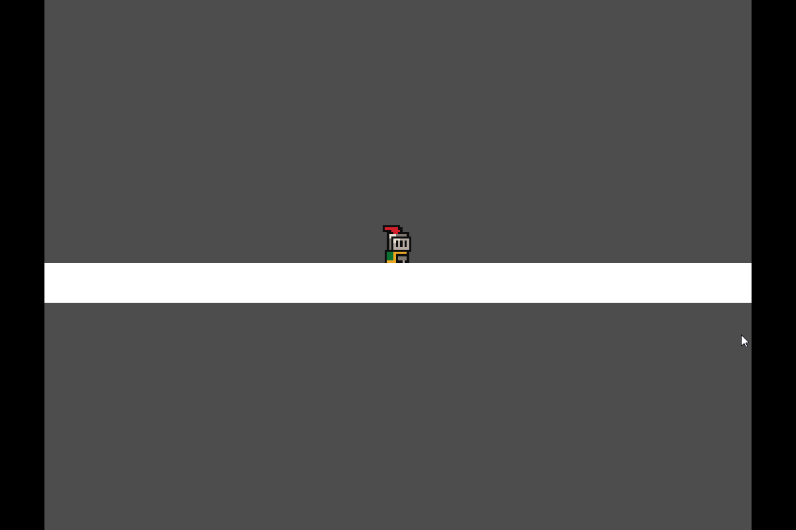

---

## Introduction

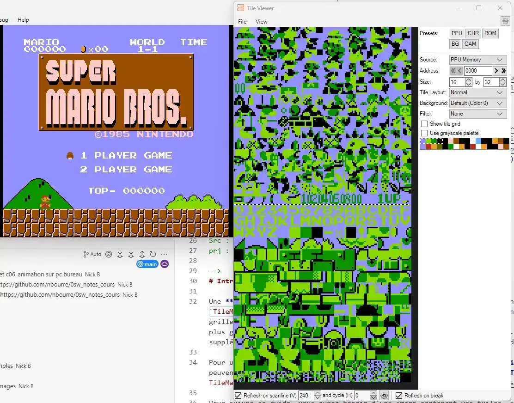

Une **TileMap** est une grille de tuiles utilisée pour créer la disposition d’un jeu. Il y a plusieurs avantages à utiliser des nœuds `TileMapLayer` pour concevoir vos niveaux. Tout d'abord, ils vous permettent de dessiner une mise en page en "peignant" des tuiles sur une grille, ce qui est beaucoup plus rapide que de placer des nœuds `Sprite2D` individuellement un par un. Ensuite, ils permettent des niveaux plus grands car ils sont optimisés pour dessiner un grand nombre de tuiles. Enfin, ils vous permettent d'ajouter des fonctionnalités supplémentaires à vos tuiles avec des formes de collision, d'occlusion et de navigation.

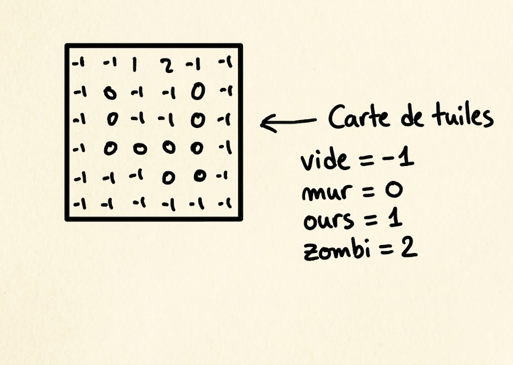

Pour utiliser des nœuds **TileMapLayer**, vous devrez d'abord créer un **TileSet**. Un **TileSet** est une collection de tuiles qui peuvent être placées dans un nœud **TileMapLayer**. Après avoir créé un **TileSet**, vous pourrez les placer [en utilisant l'éditeur de TileMap](https://docs.godotengine.org/fr/stable/tutorials/2d/using_tilemaps.html#doc-using-tilemaps){target=_blank}.

Pour suivre ce guide, vous aurez besoin d'une image contenant vos tuiles, où chaque tuile a la même taille (les grands objets peuvent être divisés en plusieurs tuiles). Cette image est appelée un *tilesheet*. Les tuiles ne doivent pas forcément être carrées : elles peuvent être rectangulaires, hexagonales ou isométriques (perspective pseudo-3D).

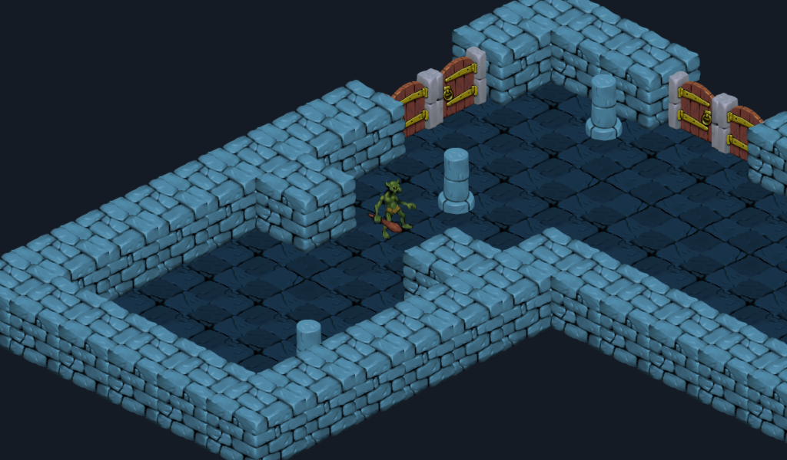

---

## Création d’un nouveau TileSet

### Utilisation d'un tilesheet

Cette démonstration utilise les tuiles suivantes tirées du pack ["Brackey's Platformer Bundle"](https://brackeysgames.itch.io/brackeys-platformer-bundle). Nous utiliserons cette *tilesheet* particulière du set :

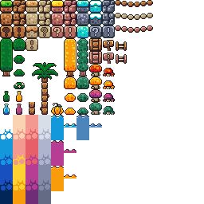{width=50%}

1. Créez un nouveau nœud **TileMapLayer**
2. Sélectionnez-le nouveau noeud `TileMapLayer`
3. Dans la propriété `Tile Set`, cliquez dessus pour créer une nouvelle ressource **TileSet** dans l'inspecteur :

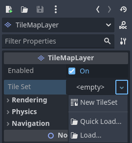

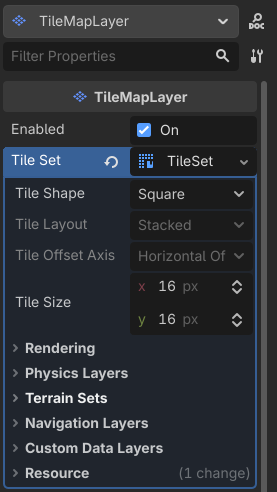

---

### Ajout de tuiles au TileSet

Une fois que vous avez créé un **TileSet**, vous devez y ajouter des tuiles. Vous pouvez le faire dans l'éditeur de **TileSet**.

1. Ouvrez l'éditeur **TileSet** qui est dans le volet inférieur de l'éditeur de scène.
2. Ajustez la dimension des tuiles dans la propriété `Tile Size` de l'éditeur de **TileSet**. Dans notre exemple, les tuiles sont de 16x16 pixels.

!!! note
    Lorsque l'on désire utiliser la fonctionnalité de création de tuiles automatiques, il est important de bien définir la taille des tuiles **avant** de créer l'atlas. Cela permettra à Godot de découper correctement les tuiles de votre *tilesheet*.

3. Avec l'éditeur de TileSet ouvert, glissez et déposez la texture de tuiles dans la zone de l'éditeur pour créer un atlas de tuiles.
4. Cliquez sur "Oui" pour confirmer la création de l'atlas.

<video autoplay controls src="assets/TileSet_add.mp4" title="Title"></video>

5. Les tuiles seront automatiquement créées et affichées dans l'éditeur de **TileSet**.

Il est possible d'ajouter plusieurs feuilles de tuiles à un **TileSet** pour créer des jeux plus complexes. Pour ajouter une autre feuille de tuiles, répétez les étapes à partir de l'étape 3.

Les propriétés suivantes peuvent être ajustées dans l'atlas selon vos besoins :

- **ID** : L'identifiant (unique dans ce TileSet), utilisé pour le tri.
- **Nom** : Le nom lisible de l'atlas. Utilisez un nom descriptif ici à des fins organisationnelles (comme "terrain", "décoration", etc).
- **Marges** : Les marges sur les bords de l'image qui ne doivent pas être sélectionnées comme tuiles (en pixels). Augmenter cela peut être utile si vous téléchargez une image de feuille de tuiles qui a des marges sur les bords (par exemple pour l'attribution).
- **Séparation** : La séparation entre chaque tuile sur l'atlas en pixels. Augmenter cela peut être utile si l'image de la feuille de tuiles que vous utilisez contient des guides (comme des contours entre chaque tuile).
- **Taille de la région de texture** (*Texture Region Size*) : La taille de chaque tuile sur l'atlas en pixels. Dans la plupart des cas, cela devrait correspondre à la taille de la tuile définie dans la propriété `TileMapLayer` (bien que ce ne soit pas strictement nécessaire).
- **Utiliser le rembourrage de texture** : Si coché, ajoute un bord transparent de 1 pixel autour de chaque tuile pour éviter les saignements de texture lorsque le filtrage est activé. Il est recommandé de laisser cette option activée sauf si vous rencontrez des problèmes de rendu dus au rembourrage de texture.

---

## Ajouter la collision, navigation et l'occlusion aux jeux de tuiles

Nous avons maintenant créé un `TileSet` de base. Nous pourrions commencer à l'utiliser dans le nœud TileMapLayer maintenant, mais il manque actuellement toute forme de détection de collision. Cela signifie que le joueur et d'autres objets pourraient traverser directement le sol ou les murs.

Si vous utilisez la navigation 2D, vous devrez également définir des polygones de navigation pour les tuiles afin de générer un maillage de navigation que les agents peuvent utiliser pour la recherche de chemin.

Enfin, si vous utilisez des lumières et des ombres 2D ou des particules `GPUParticles2D`, vous voudrez peut-être également que votre TileSet puisse projeter des ombres et entrer en collision avec des particules. Cela nécessite de définir des polygones d'occlusion pour les tuiles "solides" sur le TileSet.

Pour pouvoir définir des formes de collision, de navigation et d'occlusion pour chaque tuile, vous devrez d'abord créer une **couche de physique**, de **navigation** ou d'**occlusion** pour la ressource `TileSet`.

Pour ce faire,

1. Sélectionnez le nœud `TileMapLayer` dans la scène.
2. Cliquez sur la valeur de la propriété `TileSet` dans l'inspecteur pour l'éditer, puis dépliez les `couches de physique (Physics Layers)` et choisissez `Ajouter un élément (Add Element)`.

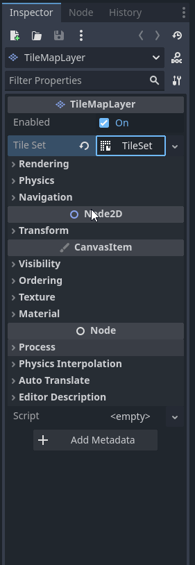

!!! note
    On peut aussi ajouter des couches de navigation et d'occlusion de la même manière.

---

### Définir des collisions pour les tuiles

Une fois que la couche de physique est ajoutée, vous devriez être en mesure de définir des formes de collision pour chaque tuile.

Les formes de collision permettent de définir des zones de collision pour chaque tuile. Cela permet de déterminer si un objet peut entrer en collision avec une tuile et comment cette collision doit être gérée.

1. Dans l'éditeur de **TileSet**, sélectionnez une tuile avec l'outil de sélection.
2. Développez la section "Physique" dans l'éditeur de **TileSet**.
3. Dessinez la forme de collision directement sur la tuile.
    - La touche rapide `F` permet de tracer un rectangle qui prend toute la tuile.

<video autoplay controls src="assets/TileSet_add_collision.mp4" title="Title"></video>

Pour modifier des points au polygone de collision, utilisez les outils qui sont au-dessus de la tuile affichée.

!!! warning
    Les animations ci-bas représentent un autre jeu de tuiles, mais le principe est le même pour toutes les tuiles.

On peut aisément faire une forme triangulaire avec le rectangle de base en supprimant un des points.

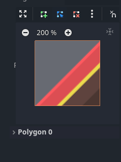

On peut aussi utiliser le rectangle de base pour créer des formes plus complexes en ajoutant des points.

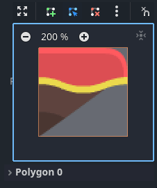

---

### Exercices

- Attribuez des formes de collision à toutes les tuiles qui ont une surface pour marcher.

---

### Sauvegarder le TileSet
Dans bien des cas lorsque l'on crée un jeu, on réutilise les mêmes tuiles pour plusieurs niveaux. Il est donc important de sauvegarder le `TileSet` pour pouvoir le réutiliser dans d'autres scènes.

Pour sauvegarder un `TileSet`, il suffit de cliquer sur le bouton `Enregistrer` sur la propriété `TileSet`.

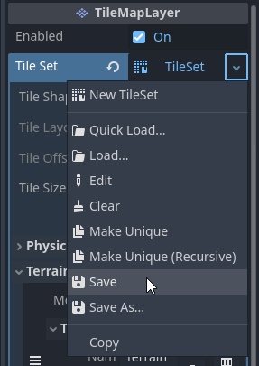

---

### Placer les tuiles dans la TileMap

Une fois que vos tuiles et leurs propriétés sont configurées, vous pouvez les placer dans la **TileMap** :

1. Sélectionnez votre nœud **TileMapLayer** dans la scène.
2. Ouvrez l'éditeur de **TileMap** et choisissez votre **TileSet**.
3. Peignez vos tuiles directement dans la scène en utilisant l'outil pinceau.

<video controls src="assets/Tiling_a_tilemap.mp4" title="Title"></video>

4. Vous pouvez maintenant tester votre scène et voir comment les collisions fonctionnent avec le joueur.

---

## Conclusion

Les outils de `TileSet` et de `TileMap` sont des outils puissants pour créer des jeux 2D. Ils permettent de créer des niveaux de manière plus rapide et plus efficace. Ils permettent aussi de créer des niveaux plus grands et plus complexes.

---

## Exercices

- Trouvez vous un *tilesheet* sur le site itch.io qui serait compatible avec votre projet de session.
- Créez un `TileSet` avec le *tilesheet* que vous avez trouvé.
- Créez un `TileMap` et peignez les tuiles dans la scène.

---

## Références

- [Vidéo FR : Comment utiliser les terrains TileMap dans Godot 4](https://www.youtube.com/watch?v=N6aVQ2ylMrU)
- [Guide to TileSet Terrains](https://github.com/dandeliondino/godot-4-tileset-terrains-docs)
- [TileSet Explorer](https://donitz.itch.io/tileset-explorer)
