# Le Tilemap Terrain <!-- omit in toc -->

## Introduction
Nous avons vu comment tracer une carte de tuiles manuellement. C'est utile, cependant, c'est un vrai travail de moine! Godot offre une fonctionnalité qui permet de réduire le travail grandement en utilisant les Terrains (anciennement autotile).

Cette fonctionnalité permet de tracer la carte en donnant la responsabilité à Godot pour sélectionner les bonnes tuiles. Il suffit de lui donner les tuiles de base et les règles de sélection.

Pour utiliser cette fonctionnalité, il faut utiliser un `TileSet` et un nœud `TileMapLayer`. Le `TileSet` contient les tuiles de base et le `TileMapLayer` contient la carte de tuiles.

## Ressources pour l'article
Pour cet article, je vais utiliser le projet `c07_TileMap_Terrain`dans mes projets du cours.

Si vous désirez partir de zéro, j'utilise comme fond de carte de [Ninja Adventure](https://pixel-boy.itch.io/ninja-adventure-asset-pack).

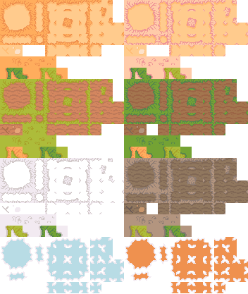{width=50%}

- Les tuiles sont de dimensions 16x16 pixels.

## Prérequis
Pour l'article, on prend pour acquis les points suivants:

- Godot 4.6 ou plus récent est installé
- Le projet mentionné ci-haut
- Cependant, vous pouvez ajouter une nouvelle scène au projet.
    - Utilisez un nœud `Node2D` comme racine.
    - Ajoutez un nœud `TileMapLayer` avec un nouveau `TileSet` de 16x16 pixels.
    - Glisser l'image fourni dans cet article.

## Création du terrain
Une fois que le TileSet est créé et importé, il faut créer le terrain.

1. Pour ce faire, il faut aller dans les propriétés du nœud `TileMapLayer` et sélectionner le `TileSet` dans la propriété `Tile Set`. 
2. Cliquer sur `Terrain Sets`
3. Sélectionner un mode. Pour l'article, je vais utiliser le mode `Match Corners and Sides`
4. Ensuite, il faut ajouter un `Element`. Nous en ajouterons 2 soit un pour la terre et l'autre pour le gazon.
5. Donner un nom au terrain. Pour l'article, je vais utiliser `Dirt` et `Grass`
6. Pour la couleur, utiliser une couleur complémentaire au terrain
    - Cela n'a aucun impact sur le jeu. C'est pour mieux discerner les masques de terrain dans l'éditeur.
    - Il y a l'outil `Color Picker` pour sélectionner une couleur.

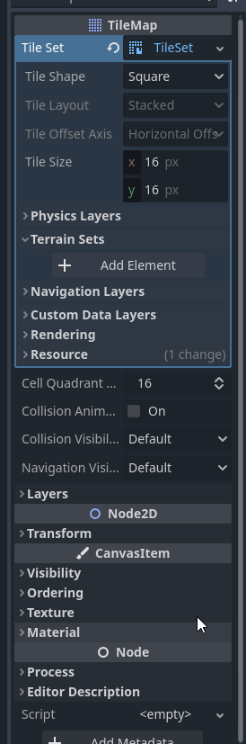

<video src="assets/tileset_select_color.mp4" controls title="Title"></video>

### Sélection d'un jeu de tuiles (TileSet)
Pour que Godot puisse générer les masques de terrain, il faut lui donner un jeu de tuiles adéquat. Qu'est-ce qu'un jeu de tuiles adéquat? C'est un jeu de tuiles qui contient les tuiles de base pour le terrain avec plusieurs variantes pour chaque tuile. On y retrouve des transitions pour les coins, les côtés et les centres.

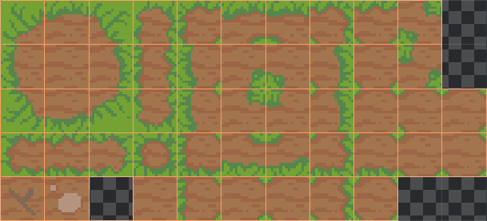

On remarque dans l'image ci-dessus qu'il y a plusieurs variantes pour chaque tuile. Les coins, les côtés et les centres sont tous différents. C'est ce qu'il faut pour que Godot puisse générer les masques de terrain. Pour le mode `Match Corners and Sides`, il faut **47 variantes** pour chaque direction et transition. S'il y a des tuiles supplémentaires, c'est qu'il y a des doublons avec quelques variantes pour les tuiles de centre (remplissages).

### Sélectionner les tuiles qui seront utilisées
Maintenant que le terrain est créé, il faut tracer le masque de terrain. Le masque de terrain est une carte de tuiles qui indique à Godot quelles tuiles utiliser pour chaque case. Il s'agit de la logique à utiliser pour sélectionner les tuiles.

1. La première étape sera de sélectionner l'onglet `TileSet`. Cet onglet permet de configurer le jeu de tuiles.
2. Sélectionner l'outil `Paint` dans la barre d'outils.
3. Dans `Paint properties`, sélectionner `Terrains`.
4. Dans `Painting`, sélectionner le terrain à peindre. Dans notre cas, `Terrain Set 0`

    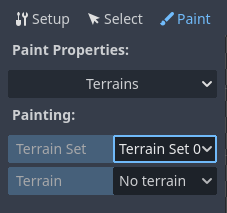

5. Sélectionner les tuiles qui seront utilisées pour tracer le masque de terrain.

    

### Tracer le masque de terrain
Maintenant vient le moment un peu plus corsé soit le traçage du masque de bit.

Mon astuce personnelle est de tracer le sol ensuite les délimitations (exemple : Le gazon).

1. Suivant les étapes précédentes, sélectionner le `Terrain Set 0`.
2. Pour Terrain, sélectionner `Dirt`.
3. Commencer à tracer les surfaces représentant le sol.

    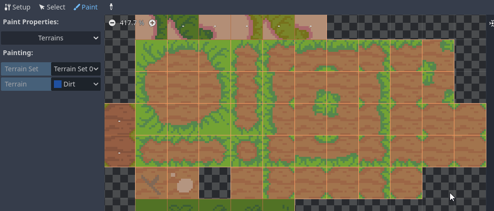

    - La couleur du masque sera celle sélectionnée lors de la création des `Terrain`. Je propose toujours une couleur complémentaire, car c'est plus facile à distinguer.

Voici le résultat pour le sol.

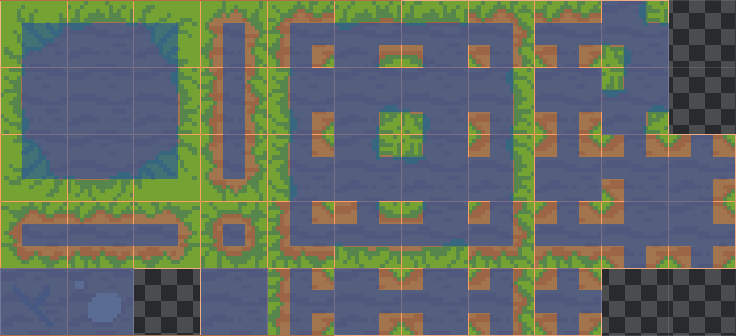

4. Répéter les étapes 2 à 3 pour le gazon.

    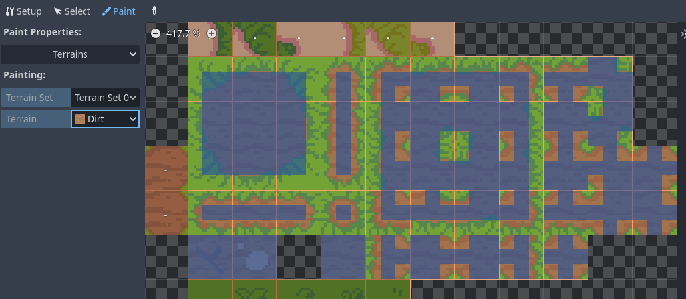

Voici le résultat pour le gazon et le sol.

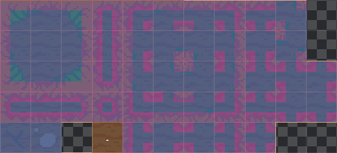

#### La logique derrière le système de sélection de tuiles
Pour la sélection des tuiles automatiques, la logique du système est la suivante:

- Le bit central est le bit de la tuile courante.
- Les bits autour sont les bits des tuiles adjacentes.
- La tuile sélectionnée par le système sera celle dont les bits autour du centre ont des bits identiques sur les tuiles adjacentes.

### Ajout de tuiles supplémentaires
Il y a quelques tuiles avec plus de gazon dans le bas du l'image. Il faut les ajouter au TileSet. Pour ce faire, il suffit de cliquer sur les tuiles avec un point blanc pour les ajouter à l'ensemble de tuiles.

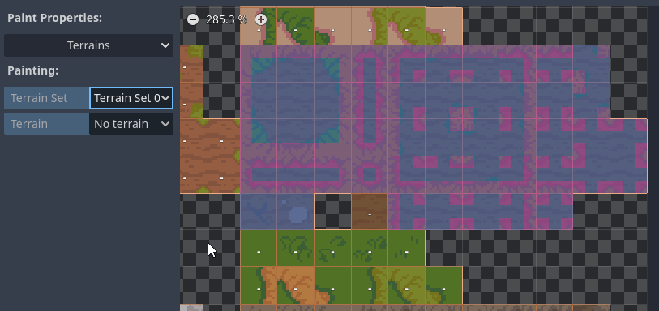

Ensuite, il suffit de continuer à tracer le masque de terrain.

Le résultat final est le suivant.

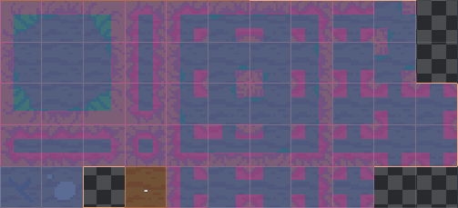

Remarquez que l'on a omis une série de tuiles dans la rangée plus. Il s'agit de tuile avec des combinaisons qui touchent d'autres types de terrain.

### Probabilité
Vous avez probablement remarqué qu'il y a des tuiles pleines du même genre soit `Dirt` et `Grass`. On peut faire en sorte que les tuiles apparaissent avec des taux de probabilité différent. Pour ce faire, on va mettre une probabilité de 3% pour les probabilité d'apparition de celles-ci.

1. Sélectionner l'onglet `TileSet`
2. Sélectionner la `Paint Properties/Probability`
3. Entrer 0.03 dans la zone de texte
4. Cliquer sur les tuiles que l'on désire modifier la probabilité d'apparition.

Voici le résultat de la distribution des probabilités.

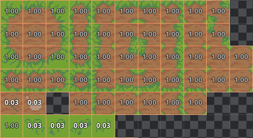

### Tracer le terrain

1. Sélectionner l'onglet `TileMap`
2. Sélectionner le sous-onglet `Terrains` (Coin supérieur gauche du volet)
3. Sélectionner le type de terrain désiré. Il y a 2 choix selon ce que nous avons créé précédemment soit `Dirt` et `Grass`.
4. Avec les outils de crayon, ligne, rectangle ou peinture, tracer le terrain.

Voici le résultat que l'on pourra s'attendre.

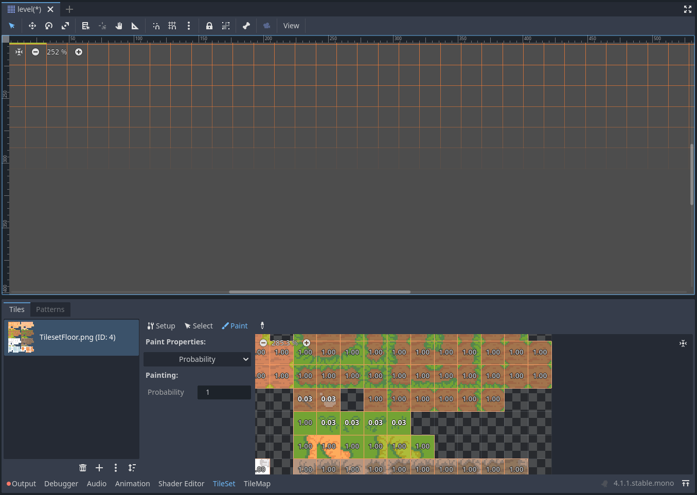

On remarque que les tuiles se sélectionnent toutes seules. C'est le système de sélection de tuiles qui fait le travail. Il suffit de tracer le masque de terrain et le système de sélection de tuiles fait le reste.

!!! note
    Il est important de ne pas oublier un bit dans les masques, car cela peut empêcher le bon fonctionnement du système de sélection de tuiles.

## Les patrons (*Patterns*)
Certains éléments de décor occupent plusieurs tuiles : un arbre, une maison, un rocher, un pont. Les placer tuile par tuile est long et on risque d'en oublier une ou de les décaler. Les **patrons** (*Patterns*) permettent d'enregistrer un groupe de tuiles déjà placées pour ensuite le réutiliser d'un seul clic.

### Créer un patron

1. Dans un `TileMapLayer`, tracez une première fois l'objet complet (ex. : un arbre de 2×3 tuiles) avec l'outil crayon.
2. Dans l'onglet `TileMap`, choisissez l'outil **Sélection** (`S`).
3. Tracez un rectangle de sélection autour de l'objet.
4. Copiez la sélection avec `Ctrl + C`.
5. Ouvrez le sous-onglet **Patterns** (à côté de `Tiles` et `Terrains`).
6. Cliquez dans l'espace vide de la liste, puis collez avec `Ctrl + V`. Une vignette du patron apparaît.

!!! tip
    Une cellule ne contient qu'une seule tuile par couche. Si vous placez un arbre sur la même couche que le gazon, chaque tuile de l'arbre **remplace** la tuile de gazon : les parties transparentes de l'arbre laisseront voir le fond vide plutôt que le gazon. Placez plutôt les objets multituiles sur une couche à part (voir la section suivante).

### Utiliser un patron

1. Dans le sous-onglet **Patterns**, cliquez sur la vignette du patron.
2. Choisissez un outil de peinture (crayon, ligne, rectangle ou pot de peinture).
3. Cliquez dans la scène pour placer l'objet complet.

Avec les outils ligne, rectangle et pot de peinture, le patron est répété. C'est pratique pour tracer rapidement une clôture, une rangée d'arbres ou une forêt complète.

Pour supprimer un patron, sélectionnez sa vignette dans le sous-onglet **Patterns** et appuyez sur `Supprimer`.

!!! note "Les patrons sont enregistrés dans le `TileSet`"
    Même si on les crée dans l'onglet `TileMap`, les patrons sont stockés dans la ressource `TileSet`. Si le `TileSet` est enregistré dans un fichier `.tres`, ses patrons sont disponibles dans tous les `TileMapLayer` et toutes les scènes qui l'utilisent.

## Travailler avec les couches
Il est possible de superposer plusieurs couches de tuiles. Cela permet de tracer des éléments par-dessus le terrain. C'est utile pour ajouter des éléments de décor ou des éléments interactifs.

Pour ajouter une couche :

1. Regroupez vos couches sous un nœud parent `Node2D` (par exemple `Niveau`).
2. Ajoutez un deuxième nœud `TileMapLayer` comme frère du premier.
3. Renommez chaque nœud selon son rôle. Le nom du nœud sert de nom de couche. Dans notre exemple, on utilise `Ground` et `Nature`.
4. Assignez le même `TileSet` à la nouvelle couche. Pour ce faire, enregistrez d'abord le `TileSet` en fichier `.tres` à partir de la première couche, puis chargez-le dans la propriété `Tile Set` de la deuxième.

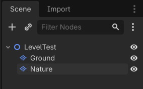

L'ordre d'affichage suit l'ordre des nœuds dans l'arbre de scène : un nœud plus bas dans la liste est dessiné par-dessus ceux qui sont au-dessus. On peut aussi ajuster la propriété `Z Index` de chaque couche.

Pour tracer sur une couche, il suffit de sélectionner le nœud `TileMapLayer` désiré dans l'arbre de scène, puis de tracer les éléments dans l'onglet `TileMap` comme nous l'avons fait précédemment.

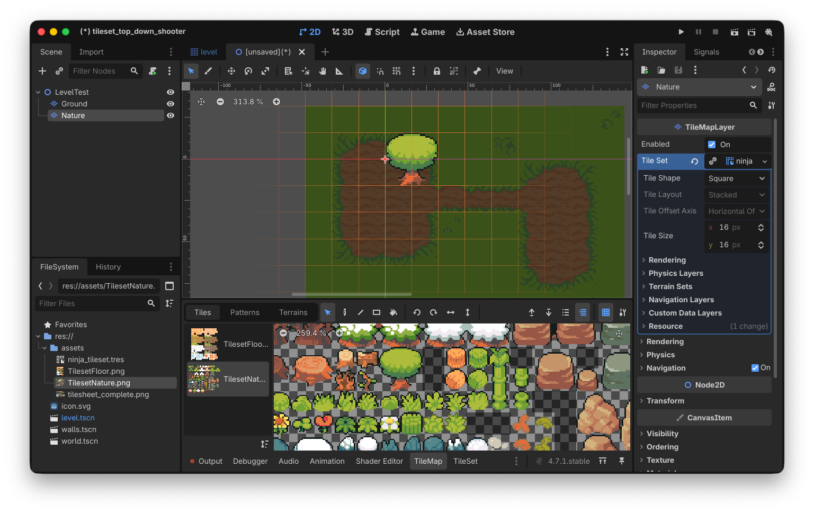

!!! tip
    Les boutons en haut à droite de l'onglet `TileMap` permettent d'atténuer les autres couches pendant que l'on peint (*Highlight Selected TileMap Layer*), ce qui aide à voir sur quelle couche on travaille.

## Résumé
On a vu comment utiliser les propriétés de terrains pour tracer un fond de jeu rapidement. Ce qui est important de retenir est que le système de sélection de tuiles est basé sur les bits des tuiles adjacentes. Il faut donc s'assurer que les bits sont bien placés pour que le système fonctionne correctement.
Dépendant du mode de terrain, on a besoin d'un ensemble de tuiles distinctes pour que le système fonctionne correctement. Dans le cas du mode `Match Corners and Sides`, il faut 47 variantes pour chaque direction et transition. Dans le cas de `Match Corners`, il faut 

## Références
- [Godot Docs - Using TileSet](https://docs.godotengine.org/fr/stable/tutorials/2d/using_tilesets.html#doc-using-tilesets)
- [Godot Docs - Utiliser les TileMaps](https://docs.godotengine.org/fr/4.x/tutorials/2d/using_tilemaps.html)
- [Tilesetter.org](https://www.tilesetter.org/)
- [Terrain Autotiling and Alternative tiles - Godot 4](https://youtu.be/vV8uKN1VnN4?si=JvF7z2vFa5sNdplm)