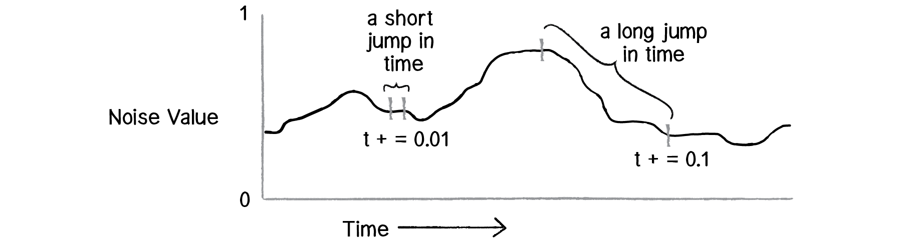
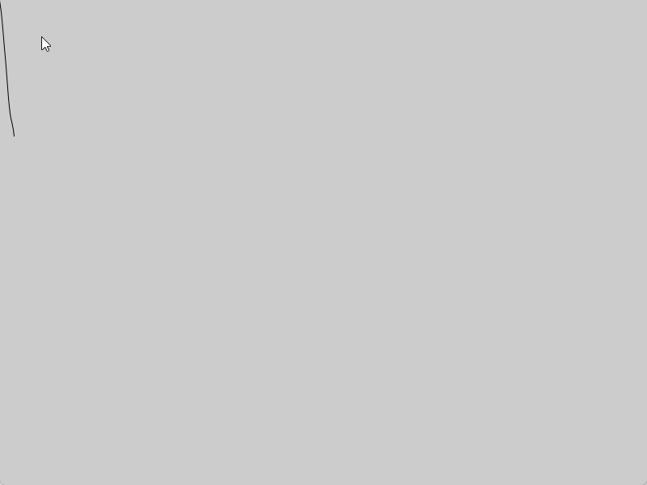
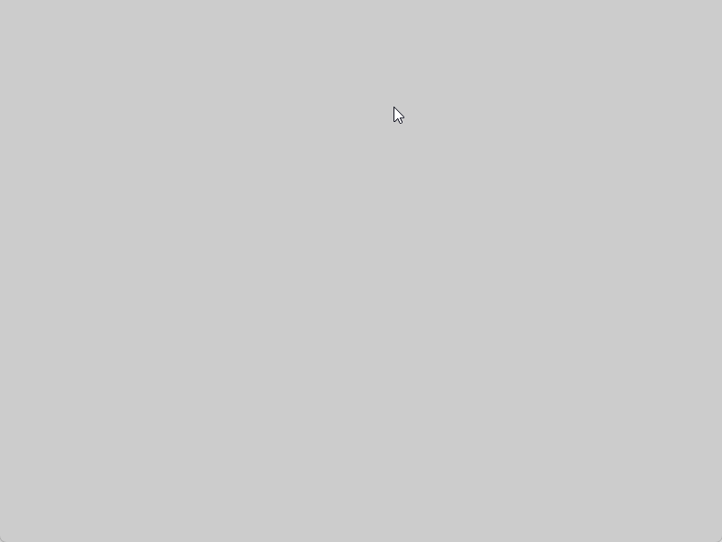

# Génération procédurale

## Introduction
Dans ce court article, nous allons voir comment générer des plateformes de manière procédurale. Ainsi, je vais vous montrer une méthode que j'ai utilisé pour réaliser une démonstration.

La méthode ne répondra pas à toutes les solutions, mais elle peut vous donner une idée de comment procéder ou encore d'extrapoler pour d'autres cas.

## OpenSimplex Noise
Avant de commencer, je vais vous présenter le bruit que j'ai utilisé pour générer les plateformes. Il s'agit d'un bruit de Perlin, mais avec une fonction de transition plus lisse. Cela permet d'avoir un bruit plus naturel.

Le bruit de Perlin permet de générer des valeurs aléatoires, mais avec une certaine cohérence. J'utilise ce bruit pour générer des plateformes de manière procédurale.

En utilisant une graine aléatoire, on génère des valeurs différentes à chaque fois. À l'inverse, on peut utiliser une graine fixe pour générer toujours les mêmes valeurs.

Le bruit a une valeur déterminée par une position et une graine. Ainsi, on peut varié la position pour générer des valeurs plus ou moins lisses. Plus les positions seront proches, plus les valeurs seront similaires et vice versa. Vous pouvez vous reférer à l'image ci-dessous pour mieux comprendre.	



Voici un exemple de bruit de Perlin généré avec Processing.

```java
float yoff = 0.0;
float previous;
float t = 0;
float n = noise(yoff) * height;
float dir = 1;

void setup () {
  size (800, 600);
  background(204);
}

void draw() {
  previous = n; 
  yoff = yoff + .02;  
  n = noise(yoff) * height;  
  line (t - 1, previous, t, n);
  
  if (t > width)
    t = 0;
    
  t++;
}
```

Exemple avoir un saut de `0.02`



Exemple avoir un saut de `0.005`



Pour plus d'informations, je vous invite à lire l'article de [Khan Academy](https://www.khanacademy.org/computing/computer-programming/programming-natural-simulations/programming-noise/a/perlin-noise).

## Génération des plateformes
En utilisant les propriétés du bruit de Perlin, on peut générer des plateformes de manière procédurale. L'idée est relativement simple.

On avance sur l'axe des `x` par petits pas et, à chaque pas, on lit la valeur du bruit à cette position pour déterminer de combien la prochaine plateforme doit monter ou descendre par rapport à la précédente.

Ensuite, pour chaque plateforme, on génère une valeur aléatoire qui déterminera sa longueur. À chaque fin de plateforme, on génère un autre nombre aléatoire qui déterminera la distance (l'écart) avant la prochaine plateforme.

Voici une implémentation en Processing. Plutôt que d'utiliser un `TileMap`, chaque plateforme est représentée par un simple rectangle. On utilise la fonction `noise()` de Processing, qui repose sur un bruit de Perlin, pour déterminer la hauteur de chaque plateforme.

On y utilise également la classe abstraite `Actor` (fournie plus haut) dont hérite une classe `Rectangle`, qui se charge d'afficher chaque plateforme.

Puisqu'il n'y a pas de personnage dans cet exemple, les flèches du clavier servent uniquement à déplacer la caméra afin de pouvoir explorer les plateformes générées. La touche `R` permet de régénérer une nouvelle carte.

```java
/// Classe abstraite pour les éléments graphique
abstract class Actor {
  PVector location;
  PVector velocity;
  PVector acceleration;

  color fillColor = color(255);
  color strokeColor = color(255);
  float strokeWeight = 1;

  // Méthode qui permet de mettre à jour les informations
  // interne de la classe
  abstract void update(int time);

  // Méthode qui fait le rendu de la classe
  abstract void display();
}

/// Représente une plateforme sous forme de rectangle
class Rectangle extends Actor {
  float w, h;

  Rectangle(float x, float y, float w, float h) {
    location = new PVector(x, y);
    velocity = new PVector(0, 0);
    acceleration = new PVector(0, 0);

    this.w = w;
    this.h = h;

    fillColor = color(100, 200, 120);
    strokeColor = color(20, 60, 30);
    strokeWeight = 2;
  }

  // Les plateformes sont statiques, rien à mettre à jour
  void update(int time) {
  }

  void display() {
    fill(fillColor);
    stroke(strokeColor);
    strokeWeight(strokeWeight);
    rect(location.x, location.y, w, h);
  }
}

ArrayList<Rectangle> platforms = new ArrayList<Rectangle>();

float tileSize = 32;

// Position de la caméra (déplacée avec les flèches)
PVector camera;
float camSpeed = 6;
boolean moveLeft, moveRight, moveUp, moveDown;

void setup() {
  size(900, 600);
  camera = new PVector(0, 0);
  generateMap();
}

void draw() {
  background(30, 30, 40);
  updateCamera();

  pushMatrix();
  translate(-camera.x, -camera.y);

  for (Rectangle p : platforms) {
    p.update(millis());
    p.display();
  }

  popMatrix();

  drawUI();
}

void updateCamera() {
  if (moveLeft)  camera.x -= camSpeed;
  if (moveRight) camera.x += camSpeed;
  if (moveUp)    camera.y -= camSpeed;
  if (moveDown)  camera.y += camSpeed;
}

void drawUI() {
  fill(255);
  noStroke();
  text("Flèches : déplacer la caméra   |   R : régénérer la carte", 10, 20);
}

void keyPressed() {
  if (keyCode == LEFT)  moveLeft = true;
  if (keyCode == RIGHT) moveRight = true;
  if (keyCode == UP)    moveUp = true;
  if (keyCode == DOWN)  moveDown = true;

  if (key == 'r' || key == 'R') generateMap();
}

void keyReleased() {
  if (keyCode == LEFT)  moveLeft = false;
  if (keyCode == RIGHT) moveRight = false;
  if (keyCode == UP)    moveUp = false;
  if (keyCode == DOWN)  moveDown = false;
}

void generateMap() {
  platforms.clear();

  float xOffset = 0;
  float xIncrement = 0.35;

  // Contrôle l'agressivité de la variation en Y entre les plateformes.
  // Plus la valeur est grande, plus le relief est abrupt.
  float noiseAmplitude = 25;

  int yLevel = 10;

  int nbPlatforms = 15;
  int platformLength = 5;

  int xStart = 0;
  int xEnd = xStart + platformLength;
  int gapLength = 2;

  for (int i = 0; i < nbPlatforms; i++) {
    int length = xEnd - xStart + 1;

    Rectangle platform = new Rectangle(xStart * tileSize, yLevel * tileSize, length * tileSize, tileSize);
    platforms.add(platform);

    platformLength = (int) random(5, 10);
    gapLength = (int) random(2, 5);

    xStart = xEnd + gapLength;
    xEnd = xStart + platformLength;
    xOffset += xIncrement;

    // On centre le bruit autour de 0 (noise() retourne une valeur entre 0 et 1)
    // puis on l'amplifie avec noiseAmplitude pour obtenir la variation en Y
    float n = (noise(xOffset) - 0.5) * 2;
    yLevel = (int) (n * noiseAmplitude) + yLevel;
  }
}
```

Le résultat : on avance sur l'axe des `x` par petits pas (`xIncrement`) et on lit la valeur du bruit à cette position pour déterminer de combien la prochaine plateforme doit monter ou descendre par rapport à la précédente. La longueur des plateformes et la distance entre elles restent aléatoires.

## Résumé
Dans cet article, nous avons vu comment une manière simple de générer des plateformes de manière procédurale. On peut facilement améliorer cette méthode en générant les plateformes au fil de l'avancement de la caméra (ou du personnage), plutôt que toutes d'un coup. On peut aussi ajouter des obstacles, des ennemis, etc. Dans tous les cas, ce sera à vous de jouer!
