# Les terrains (autotiling) <!-- omit in toc -->

<!--
Plan de séance (~60 min)
- 0:00 Pourquoi les terrains + vocabulaire (10 min)
- 0:10 Les trois modes (15 min)
- 0:25 Démo guidée : Pixel Platformer (20 min)
- 0:45 Probabilités (5 min)
- 0:50 Pièges fréquents + exercices (10 min, le reste en devoir)
-->

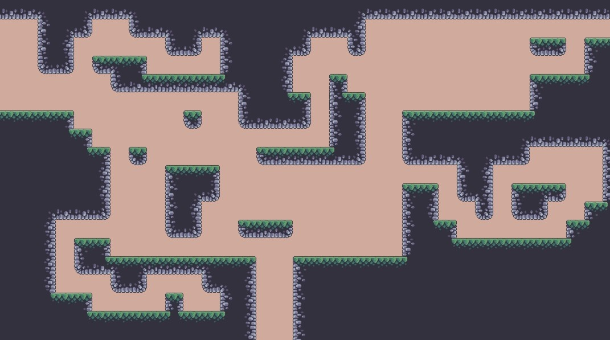

## Pré-requis

- Avoir suivi la leçon [Utilisation des TileSets](../c07a_plateformes_TileSets/index.md) : savoir créer un `TileMapLayer`, un `TileSet` et y ajouter un atlas de tuiles.

!!! note "À propos des captures d'écran"
    Les captures de cette leçon proviennent de Godot 4.1, où l'on utilisait un nœud `TileMap`. Depuis Godot 4.3, on utilise plutôt le nœud `TileMapLayer`. Les éditeurs de `TileSet` et de terrains sont les mêmes : partout où vous voyez `TileMap`, pensez `TileMapLayer`.

---

## Pourquoi les terrains?

Lorsqu'on construit un niveau avec des tuiles, un même type de sol a besoin de plusieurs variantes : un coin extérieur, un coin intérieur, un bord gauche, un bord du haut, un centre, etc. Placer toutes ces variantes à la main est long et on se trompe facilement. C'est encore pire si l'on génère les niveaux par code (génération procédurale) : il faudrait programmer soi-même toute la logique de sélection des tuiles.

Les **terrains** règlent ce problème. Au lieu de peindre des *tuiles*, on peint un *terrain* (« de la terre », « du gazon », « de l'eau ») et Godot choisit automatiquement la bonne tuile pour chaque cellule selon ses voisines.

!!! info "Terrains et autotiles"
    Les terrains remplacent les *autotiles* de Godot 3.x. Une différence importante : une tuile de terrain reste une tuile d'atlas ordinaire, avec des données de terrain en plus. On peut donc toujours la placer manuellement, et elle garde toutes les autres propriétés d'une tuile (collision, animation, etc.).

---

## Comment fonctionnent les terrains

### Trois niveaux : jeu de terrains, terrain, tuile

Le système est organisé en trois niveaux :

- Un **TileSet** contient un ou plusieurs **jeux de terrains** (*Terrain Sets*).
- Un **jeu de terrains** contient un ou plusieurs **terrains** (*Terrains*). Chaque jeu de terrains a un **mode** qui détermine comment les tuiles se raccordent.
- Un **terrain** regroupe une ou plusieurs **tuiles**.

### Le bit central et les bits voisins

Chaque tuile de terrain est découpée en petites zones appelées **bits** :

- Le **bit central** (*center bit*) indique à quel terrain appartient la tuile au complet.
- Les **bits voisins** (*peering bits*) sont sur les bords et les coins. Ils indiquent quel terrain doit se trouver de ce côté. On peut les voir comme les bosses et les creux d'une pièce de casse-tête : ils déterminent à côté de quelles tuiles celle-ci peut s'emboîter.

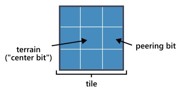

La combinaison des terrains assignés au bit central et aux bits voisins s'appelle le **masque** (*bitmask*) de la tuile.

### Exemple

Dans cette feuille de tuiles, on retrouve trois terrains : l'eau, le gazon et la terre.

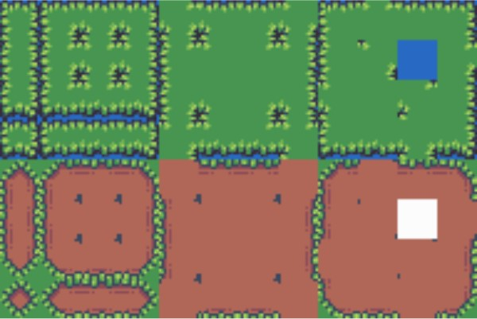

*Adapté de [The Field of Floating Islands](https://opengameart.org/content/the-field-of-the-floating-islands) par Buch (CC0).*

On assigne la tuile d'eau au terrain `Eau`, les tuiles de gazon au terrain `Gazon` et les tuiles de terre au terrain `Terre`. Lorsqu'on peint ensuite le terrain `Terre` sur une cellule, Godot choisit une tuile dont le bit central est `Terre` **et** dont les bits voisins correspondent aux cellules autour.

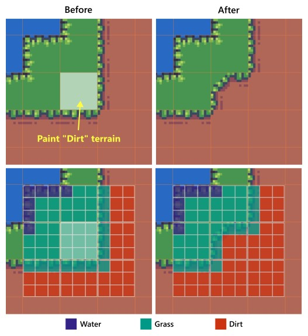

Remarquez que Godot a aussi modifié trois tuiles voisines pour que tout se raccorde.

!!! warning "Godot ne change jamais le terrain d'une voisine"
    Pour raccorder les tuiles, Godot peut remplacer une tuile voisine par une autre variante, mais **toujours du même terrain**. Une cellule de gazon reste du gazon; seule sa variante (bord, coin, etc.) change.

---

## Choisir un mode de terrain

Il existe trois modes. Le mode détermine quels bits voisins possède une tuile, donc quelles formes on peut dessiner et combien de tuiles il faut dessiner dans son logiciel de pixel art.

### Match Sides (raccord par les côtés)

Les bits voisins sont sur les **côtés** seulement (4 pour une tuile carrée). Les tuiles en diagonale n'ont aucun effet.

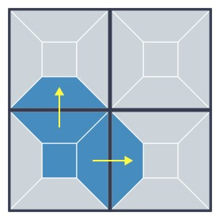

- **Tuiles nécessaires :** 16.
- **Avantages :** le plus simple à configurer. Idéal pour des lignes droites (plateformes, routes, tuyaux, clôtures).
- **Limites :** pas de lignes diagonales. Aucune différence entre un coin intérieur et un coin extérieur : on ne peut donc pas faire de formes plus complexes qu'un rectangle si le dessin exige des coins intérieurs.

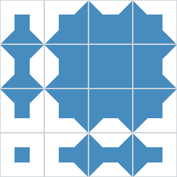{width=40%}

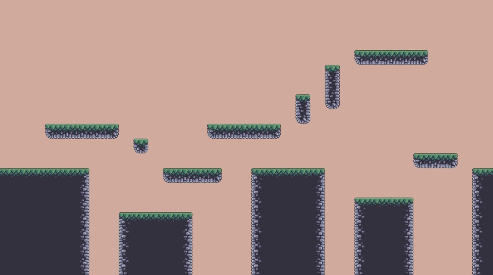

### Match Corners (raccord par les coins)

Les bits voisins sont sur les **coins** seulement (4 pour une tuile carrée). Chaque coin est partagé par **4 tuiles**, qui doivent toutes avoir le même terrain à ce coin.

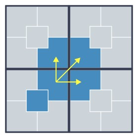

- **Tuiles nécessaires :** 16 (souvent 15 dans les feuilles de tuiles, sans la tuile isolée).
- **Avantages :** permet des formes complexes. Idéal pour de grandes zones (paysages, cavernes).
- **Limites :** le terrain se peint par blocs de **2×2 minimum**. Pas de lignes d'une seule tuile de large.

!!! warning
    En mode *Match Corners*, les coins de **toutes** les tuiles voisines doivent correspondre. Si vous peignez une ligne d'une seule tuile de haut, Godot ne trouvera pas de tuile valide.

    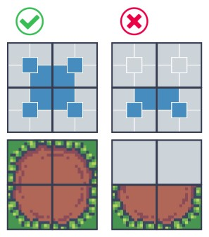

!!! tip
    Utilisez l'outil **rectangle** pour peindre : c'est une façon simple de toujours peindre au moins 2×2 tuiles. En génération procédurale, assurez-vous de ne jamais assigner moins de 2×2 cellules à un terrain (par exemple en échantillonnant votre bruit une fois pour chaque bloc de 2×2).

La plupart des feuilles de tuiles publiques utilisent la disposition suivante (coins extérieurs à gauche, coins intérieurs à droite) :

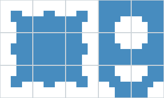{width=50%}

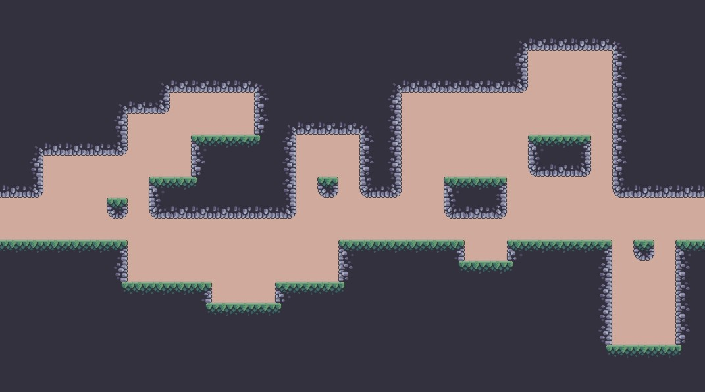

### Match Corners and Sides (raccord par les coins et les côtés)

Les bits voisins sont sur les **coins et les côtés** (8 pour une tuile carrée). C'est l'équivalent du mode « 3×3 minimal » de Godot 3.

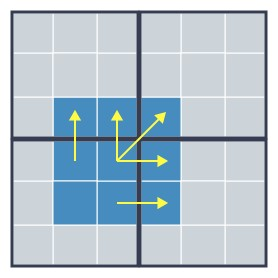

- **Tuiles nécessaires :** 47.
- **Avantages :** le mode le plus polyvalent. On peut dessiner toutes les formes des deux autres modes : chemins d'une tuile de large, grandes zones, virages, etc.
- **Limites :** il faut beaucoup de tuiles. Pas de lignes diagonales non plus.

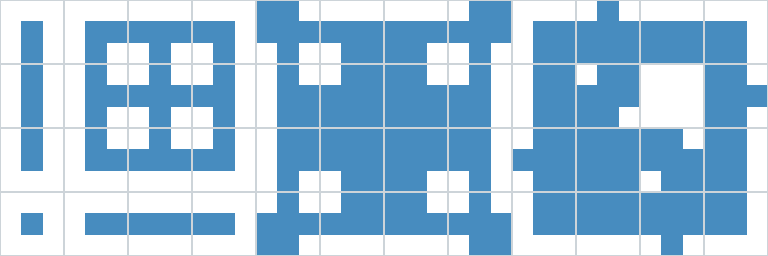

!!! tip "Générer les 47 tuiles automatiquement"
    Des outils gratuits comme [Webtyler](https://wareya.github.io/webtyler/) et [TilePipe2](https://aleksandrbazhin.itch.io/tilepipe2) génèrent les 47 tuiles à partir de quelques tuiles de base.

### Résumé

| Mode | Bits voisins (carré) | Tuiles | Idéal pour |
|------|:---:|:---:|------|
| Match Sides | 4 côtés | 16 | Lignes, plateformes minces, rectangles simples |
| Match Corners | 4 coins | 16 | Grandes zones, cavernes (blocs de 2×2 min.) |
| Match Corners and Sides | 4 côtés + 4 coins | 47 | Tout, si on a les tuiles |

!!! note
    En pratique, c'est souvent la **feuille de tuiles** qui décide du mode : on regarde comment les tuiles ont été dessinées et on les compare aux gabarits. Les gabarits (en PNG) sont disponibles dans le [dépôt source](https://github.com/dandeliondino/godot-4-tileset-terrains-docs/tree/master/templates).

---

## Démonstration guidée : configurer un jeu de terrains

Nous allons configurer les tuiles de sol et de champignon de la feuille *Pixel Platformer*. Téléchargez-la (clic droit → *Enregistrer sous…*) et ajoutez-la à votre projet.

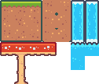{width=40%}

*Adapté de [Pixel Platformer](https://kenney.nl/assets/pixel-platformer) par Kenney (CC0). Tuiles de 18×18 pixels.*

En observant les tuiles :

- Le **sol** se raccorde par ses coins (il a des coins intérieurs) : mode *Match Corners*.
- Le **champignon** se raccorde par ses côtés (chapeau horizontal, pied vertical) : mode *Match Sides*.

Un jeu de terrains n'a qu'un seul mode : nous aurons donc besoin de **deux jeux de terrains**.

!!! warning "Des jeux de terrains différents ne se raccordent pas entre eux"
    Les tuiles de deux jeux de terrains différents ne peuvent pas se raccorder, puisqu'elles n'ont pas les mêmes bits voisins. Ici, ce n'est pas un problème : le sol et les champignons sont peints séparément sur un fond vide. Si deux terrains doivent former une transition entre eux (ex. gazon → terre), ils doivent être dans le **même** jeu de terrains.

### Étape 1 : Créer le TileSet

1. Ajoutez un nœud `TileMapLayer` à votre scène et créez-lui un nouveau `TileSet`.
2. Réglez `Tile Size` à **18×18** px.
3. Dans l'éditeur de **TileSet** (volet du bas), glissez la feuille de tuiles pour créer l'atlas, puis retirez les tuiles d'eau (on ne les utilisera pas).

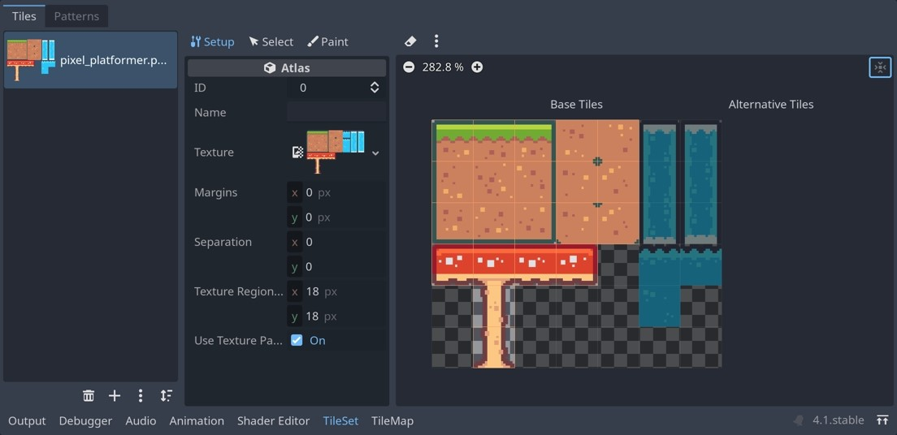

### Étape 2 : Créer les jeux de terrains

1. Sélectionnez le `TileMapLayer` et, dans l'inspecteur, cliquez sur la ressource `TileSet` pour la déplier.
2. Dépliez **Terrain Sets** et cliquez sur **Add Element**.

    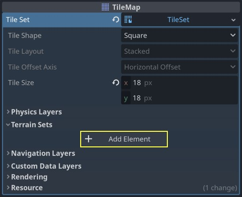

3. Dans le menu **Mode**, choisissez **Match Corners**.

    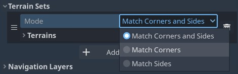

4. Dépliez **Terrains** et cliquez sur **Add Element** pour ajouter un terrain.

    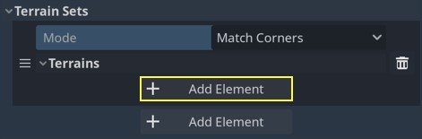

5. Nommez le terrain `Sol` et donnez-lui une couleur. (Dans les captures, les terrains s'appellent `Ground` et `Mushroom`.)

    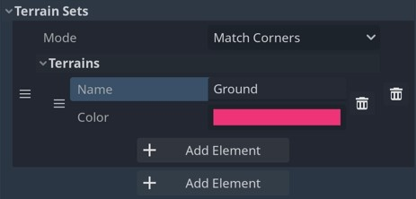

!!! tip
    La couleur n'a aucun effet dans le jeu : elle sert seulement à afficher le masque par-dessus les tuiles dans l'éditeur. Choisissez une couleur vive qui contraste avec vos tuiles.

6. Répétez pour créer un **deuxième** jeu de terrains en mode **Match Sides**, avec un terrain `Champignon`.

    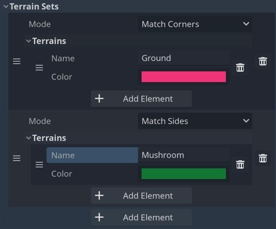

!!! note "Les numéros commencent à 0"
    Les jeux de terrains sont numérotés selon leur ordre dans le `TileSet`, à partir de **0**. Les terrains sont numérotés de la même façon, à partir de **0**, à l'intérieur de chaque jeu. Ici :

    | Terrain | Jeu de terrains | Terrain |
    |---|:---:|:---:|
    | `Sol` | 0 | 0 |
    | `Champignon` | 1 | 0 |

    Ces numéros sont importants en mode *Select* et en programmation.

### Étape 3 : Peindre les masques en mode Paint

C'est la méthode la plus rapide et la plus visuelle.

1. Dans l'éditeur de **TileSet**, ouvrez le mode **Paint**.
2. Dans **Paint Properties**, choisissez **Terrains**.

    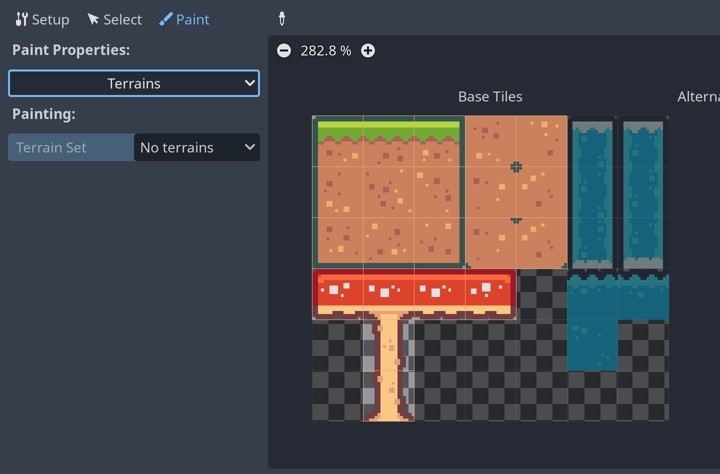

3. Choisissez d'abord le **Terrain Set** : `Terrain Set 0`.

    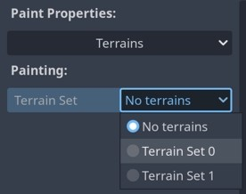

4. Cliquez-glissez sur toutes les tuiles de sol pour leur assigner ce jeu de terrains. Les tuiles sans jeu de terrains affichent un `-`.

    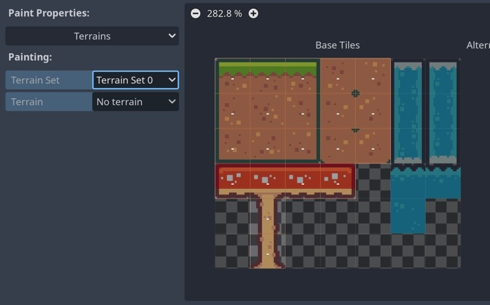

5. Choisissez ensuite le **Terrain** : `Sol`.

    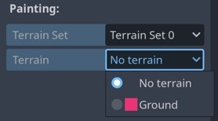

6. Peignez le bit central et les bits voisins de chaque tuile de sol en suivant le gabarit.

    {width=40%}

    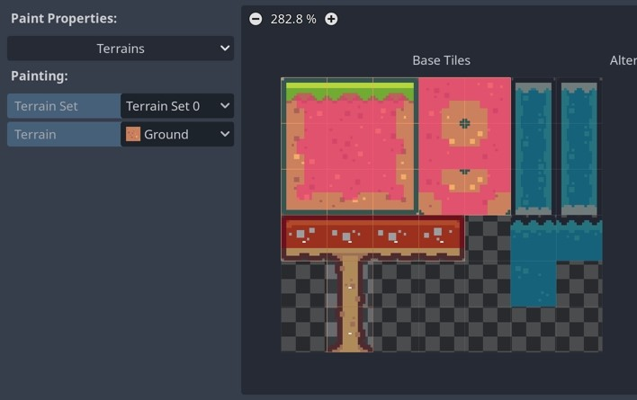

On laisse **vides** les bits voisins qui touchent le vide : ainsi, Godot placera ces tuiles là où le sol touche l'air.

!!! warning "Toujours peindre le bit central"
    Chaque tuile de terrain doit avoir son bit central assigné. Si le centre est vide, Godot doit deviner à quel terrain la tuile appartient et le résultat devient imprévisible.

!!! tip
    Clic gauche : peindre un bit. Clic droit : effacer un bit.

### Étape 4 : Configurer les masques en mode Select

Pour les champignons, nous allons utiliser l'autre méthode : le mode **Select**. Elle est plus lente, mais elle montre les valeurs réelles derrière les couleurs. C'est aussi ce qu'on manipulerait par code.

1. Ouvrez le mode **Select** et cliquez sur une tuile du chapeau de champignon.

    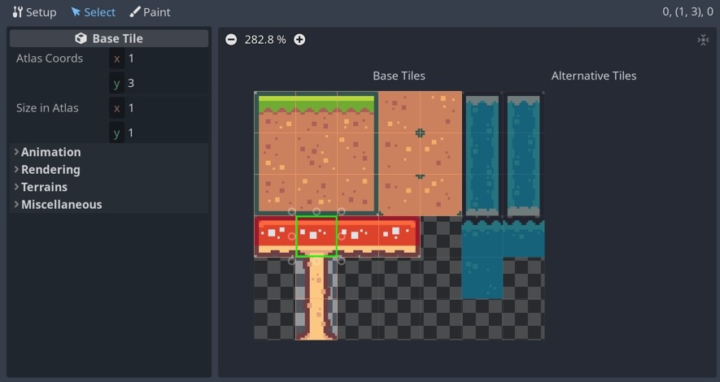

2. Dépliez la section **Terrains**. `Terrain Set` et `Terrain` valent `-1`, ce qui veut dire « aucun ».

    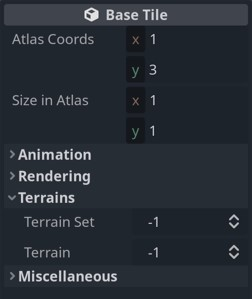

3. Réglez **Terrain Set** à `1` et **Terrain** à `0` (`Champignon`). Le champ `Terrain` correspond au bit central. La section **Terrains Peering Bit** apparaît.

    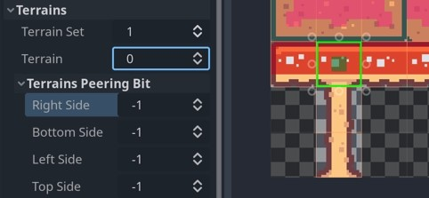

4. Réglez à `0` (`Champignon`) les côtés où l'on veut trouver une autre tuile de champignon. Laissez à `-1` (vide) les autres.

    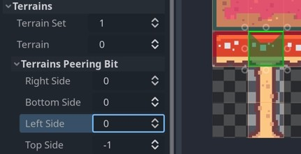

5. Faites de même pour les autres tuiles de champignon.

    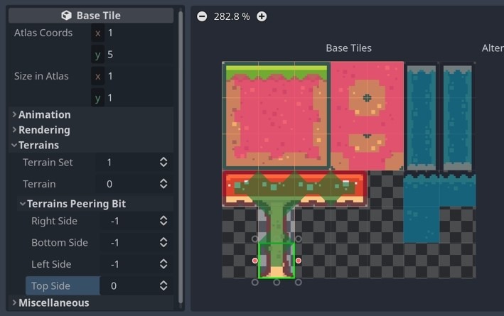

!!! note "La valeur -1"
    Pour un bit voisin, `-1` veut dire « vide ». C'est l'équivalent de laisser le bit non peint en mode *Paint*.

### Étape 5 : Peindre le niveau

1. Sélectionnez le `TileMapLayer` et ouvrez l'onglet **TileMap** du volet du bas.
2. Choisissez le sous-onglet **Terrains**.
3. Choisissez le terrain `Sol` ou `Champignon` dans la liste de gauche.
4. Peignez avec le **pinceau** ou le **rectangle**.

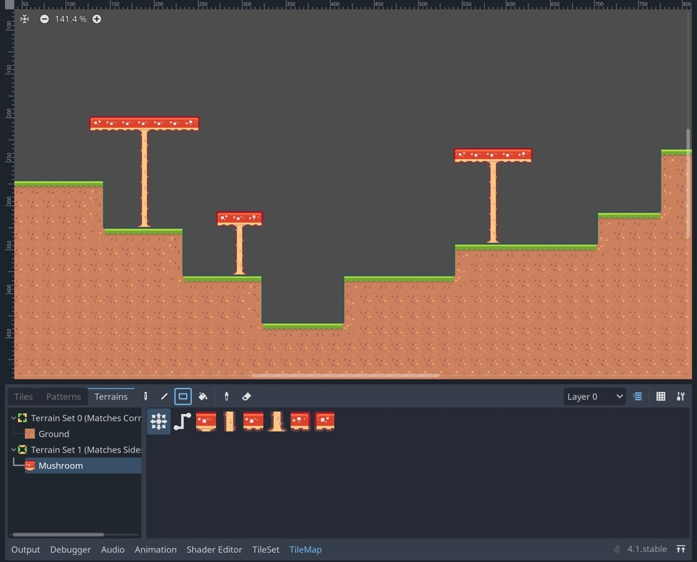

Deux modes de peinture sont offerts au-dessus des tuiles du terrain :

- **Connect** (premier bouton) : raccorde la zone peinte à tout ce qui l'entoure, y compris les tuiles voisines. C'est le mode le plus utilisé.
- **Path** (deuxième bouton) : raccorde seulement les cellules dans l'ordre où vous les peignez. Pratique pour tracer un chemin ou une route sans qu'il se colle aux zones à côté.

On peut aussi cliquer directement sur une tuile de la liste pour la placer manuellement, sans raccord automatique.

!!! warning "N'oubliez pas les collisions"
    Les terrains s'occupent seulement de l'**apparence**. Pour que le joueur puisse marcher sur le sol, les tuiles ont toujours besoin d'une forme de collision (voir [Définir des collisions pour les tuiles](../c07a_plateformes_TileSets/index.md#definir-des-collisions-pour-les-tuiles)).

---

## Varier les tuiles avec les probabilités

Lorsque **plusieurs tuiles ont exactement le même masque**, Godot en choisit une au hasard. On peut s'en servir pour ajouter de la variété, par exemple des fleurs et des champignons dans le gazon.

Prenons la feuille *Tiny Town*, avec une tuile de gazon uni en haut à gauche et quelques variantes décorées.

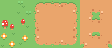{width=40%}

*Adapté de [Tiny Town](https://kenney.nl/assets/tiny-town) par Kenney (CC0). Tuiles de 16×16 pixels.*

Avec un jeu de terrains en *Match Corners* contenant `Gazon` et `Terre`, si seul le gazon uni a un masque, la carte ressemble à ceci :

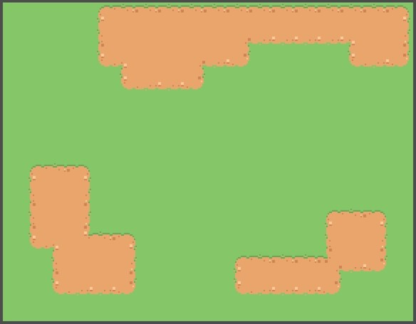

Si on donne le **même masque** (tout `Gazon`) à toutes les variantes, Godot les choisit au hasard, avec la même chance pour chacune. Le résultat est trop chargé :

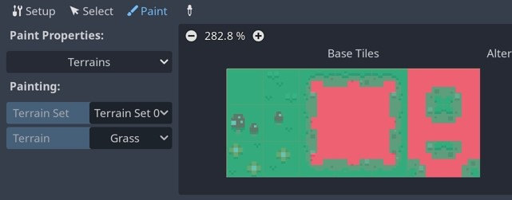

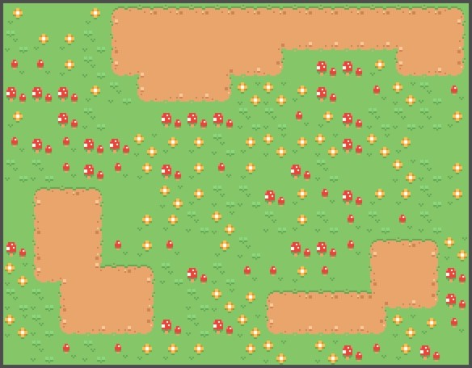

Pour corriger ça, on ajuste la **probabilité** de chaque tuile :

1. En mode **Select**, cliquez sur une tuile.
2. Dépliez **Miscellaneous**, puis cliquez sur l'étiquette **Probability** pour afficher les valeurs sur toutes les tuiles. Par défaut, elles valent `1.00`.

    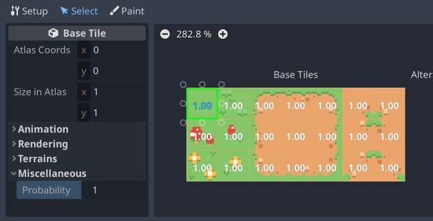

3. Baissez la probabilité des tuiles décorées, par exemple `0.25` pour les trèfles, `0.05` pour les fleurs et `0.01` pour les champignons.

    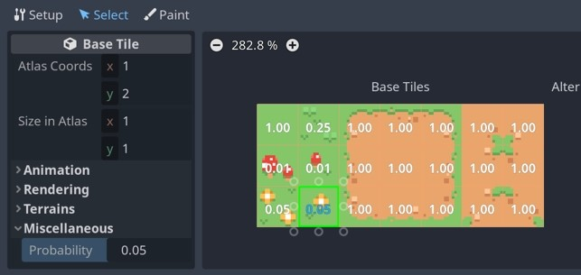

Le gazon uni redevient la tuile la plus fréquente et les décorations deviennent rares :

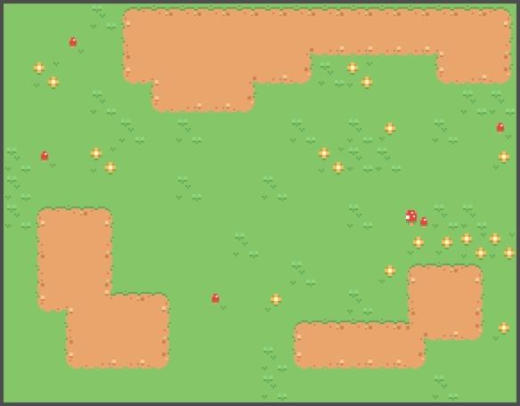

!!! note
    La probabilité est un **poids relatif**, pas un pourcentage. Une tuile à `1.0` sort 100 fois plus souvent qu'une tuile à `0.01` ayant le même masque. Pour une tuile de terrain, la probabilité n'a d'effet que si d'autres tuiles ont exactement le même masque.

---

## Pièges fréquents

| Symptôme | Cause probable |
|---|---|
| Godot place une tuile bizarre ou un « trou » | Aucune tuile n'a le masque demandé : il manque une variante dans la feuille, ou un bit est mal peint. |
| Des tuiles d'un autre terrain apparaissent | Une tuile n'a pas son bit central assigné. |
| En *Match Corners*, les lignes minces sont brisées | Normal : ce mode exige des blocs de 2×2 minimum. |
| Deux terrains ne font pas de transition entre eux | Ils sont dans deux jeux de terrains différents. |
| Le joueur passe à travers le sol | Les terrains ne gèrent pas la collision : ajoutez une couche de physique et des formes de collision. |
| Le terrain n'apparaît pas dans l'onglet *Terrains* | Le bon `TileSet` n'est pas assigné au `TileMapLayer`, ou aucun masque n'est peint. |

---

## Exercices

### Exercice guidé

1. Reproduisez la démonstration avec la feuille *Pixel Platformer* : jeu de terrains 0 (`Sol`, *Match Corners*) et jeu de terrains 1 (`Champignon`, *Match Sides*).
2. Ajoutez une couche de physique et des formes de collision aux tuiles de sol et au chapeau des champignons.
3. Peignez un petit niveau d'au moins un écran de large avec des marches, un trou et deux champignons.
4. Ajoutez votre personnage du projet `c07_plateforme` et vérifiez qu'il peut marcher sur le sol et sauter sur les champignons.
5. Essayez de peindre une plateforme de sol d'une seule tuile de haut. Que se passe-t-il? Pourquoi?

### Défi

1. Trouvez sur [itch.io](https://itch.io/game-assets/tag-tileset) une feuille de tuiles compatible avec votre projet de session.
2. Comparez-la aux gabarits pour déterminer le bon mode de terrain.
3. Configurez le jeu de terrains et peignez une zone de votre niveau.
4. Si votre feuille a des variantes décoratives, ajustez leurs probabilités.

---

## Références

- Source de cette leçon : [Godot 4 TileSet Terrains Docs](https://github.com/dandeliondino/godot-4-tileset-terrains-docs), par dandeliondino. Contenu adapté de la documentation officielle de Godot, © Juan Linietsky, Ariel Manzur et la communauté Godot, [CC BY 3.0](https://creativecommons.org/licenses/by/3.0/). Le dépôt contient aussi un projet de départ avec tous les exemples.
- [Documentation officielle : Using TileSets](https://docs.godotengine.org/fr/stable/tutorials/2d/using_tilesets.html)
- [Documentation officielle : Using TileMaps](https://docs.godotengine.org/fr/stable/tutorials/2d/using_tilemaps.html)
- [Wang Tiles, par cr31](https://web.archive.org/web/2023/http://www.cr31.co.uk/stagecast/wang/intro.html) (archive) : la théorie derrière le raccord des tuiles.
- [TileSet Explorer](https://donitz.itch.io/tileset-explorer)
- [Vidéo FR : Comment utiliser les terrains TileMap dans Godot 4](https://www.youtube.com/watch?v=N6aVQ2ylMrU)
