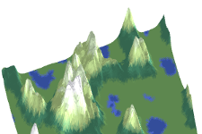
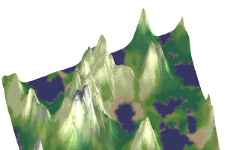

# Travail - Documentation du projet
Maintenant que le cœur du projet est essentiellement terminé, il faudra ajouter la portion concernant la documentation et l’aide pour le projet.

Il y a deux volets pour la documentation :
- Document d’une page en MarkDown expliquant le concept du projet et aux moins deux points saillants du développement
- Aide intégrée au projet

## Document court
Dans ce document de tout au plus une page, vous expliquez les concepts utilisés dans le projet. Les objectifs du jeu ou de la simulation. Vous devez aussi indiquer les sources d’information utilisées.

De plus, vous devez inclure au moins deux points saillants en lien avec le développement. Par exemple, vous pouvez expliquer comment vous avez fait pour pour faire une génération procédurale ou encore comment vous avez implémenté une machine à état fini.

## Exemple de document
Dans le projet, je me suis un peu inspiré du mécanisme du premier jeu Age of Empire. Il y a un mécanisme permettant de générer de façon aléatoire un territoire géographique.

La génération procédurale est un concept qui est très populaire dans le domaine du jeu vidéo. Il y a plusieurs approches pour générer un terrain. Par exemple, on peut utiliser un algorithme de bruit pour générer un terrain. Il y a plusieurs variantes de bruit qui peuvent être utilisé. Par exemple, le bruit de Perlin, le bruit de Worley, le bruit de Simplex, etc. Il y a aussi des approches plus complexes comme le bruit de Perlin fractal ou le bruit de Worley fractal. Il y a aussi des approches plus basique comme le bruit de Perlin 2D ou le bruit de Worley 2D.

À la base cette fonctionnalité a été utilisé avec l’algorithme OpenSimplexNoise (OSN) en 2D. En utilisant paramétrant les options dans le menu du même nom, l’utilisateur peut générer un terrain différent à chaque fois avec des caractéristique spécifique tel que l’altitude maximal des montages, le niveau des lacs, la quantité d’arbres, etc.

L’algorithme du OSN n’est que la base pour l’algorithme de génération. En effet, il y a 2 cartes OSN l’une pour déterminer l’élévation et une seconde pour déterminer le taux d’humidité. Cette approche permet de générer des biomes selon 2 facteurs distincts. De plus, on élimine l’effet de bande qu'une seule carte d'élévation de base aurait pu produire.

<table>
    <tr>
        <td>
            <figure>
                
                <figcaption>Figure 1 : Terrain basé avec une seule valeur de bruit</figcaption>
            </figure>
        </td>
        <td>
            <figure>
                
                <figcaption>Figure 2 : Terrain basé 2 valeurs de bruit</figcaption>
            </figure>
        </td>
    </tr>
</table>

Pour effectuer cet algorithme, je me suis basé sur cet [article](https://www.redblobgames.com/maps/terrain-from-noise/). L’article discute plus en profondeur sur une mécanique pour simuler aussi la dispersion des objets et la création d’îles.

## Aide intégrée
Dans le projet, vous devez ajouter un menu **Options** (ou équivalent) dans lequel le joueur pourra retrouver les instructions pour utiliser le jeu. On devra y retrouver toutes les touches utilisées.

>**Note :** On ne veut pas avoir les instructions dans le menu principal.

## Structure du document
Le document devra comporter les éléments suivants :
- Titre du jeu en H1
- Créateur du jeu (Votre nom)
- Petite introduction expliquant le concept du jeu
  - Deux ou trois phrases
- Section **Concepts utilisés**
  - Liste des concepts utilisés
  - Pour chaque concept
    - Sous titre avec le nom du concept
    - Description du concept
    - Source de l’information
    - Capture d’écran ou image illustrant le concept

# Grille de correction
| Critère | Points |
| --- | --- |
| Document d’une page en MarkDown expliquant le concept du projet et aux moins deux points saillants du développement | 65 |
| Aide intégrée au projet | 25 |
| Structure du document | 10 |

# Travail à remettre
- Le document MarkDown appelé `readme.md` à la racine de votre projet.
- Le document MarkDown remis sur Léa
- Présenter la documentation intégrée au projet au professeur.