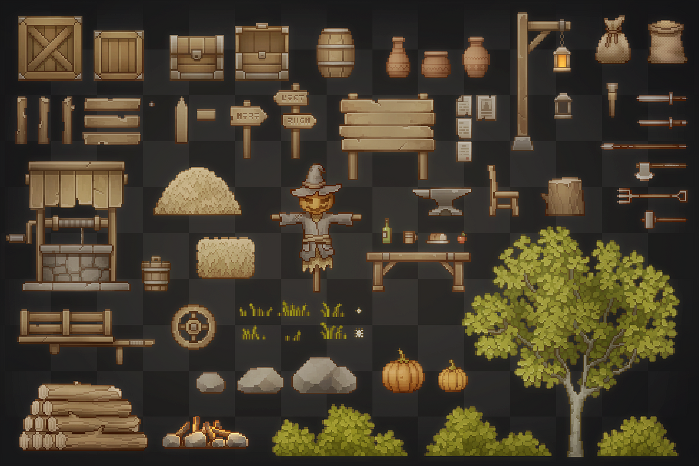

# Ressource Tutoriel pour Jeux de plateforme <!-- omit in toc -->

# Table des matières <!-- omit in toc -->
- [Sujets précis](#sujets-précis)
  - [Personnage rapidement](#personnage-rapidement)
- [Jeux complets](#jeux-complets)
- [Ressources](#ressources)
  - [Sprites et visuels](#sprites-et-visuels)
  - [Sons et musiques](#sons-et-musiques)

# Sujets précis

## Personnage rapidement

[Dominate Godot Platformer Movement! - The Ultimate Beginner Tutorial](https://www.youtube.com/watch?v=aQazVHDztsg)

---

Create A Platformer Game in 20 SECONDS! (Godot 4)

---

 [Creating a 2D Platform Shooter | Godot | Part 1: Movement & Shooting Mechanics](https://www.youtube.com/watch?v=hJaZag6A44o)

---

# Jeux complets

[Godot 4 Tutorial - Beginner Platformer](https://www.youtube.com/watch?v=vGY2rUlTzWM&list=PLrIQ1Pnht4mLpggIYQftRtgT_GjaWKA6W)

---

[Heartbeast - Pixel Platformer Tutorial / Code Along](https://www.youtube.com/watch?v=f3WGFwCduY0&list=PL9FzW-m48fn16W1Sz5bhTd1ArQQv4f-Cm)

# Ressources

## Sprites et visuels

[Generic RUN n' GUN pack](https://bakudas.itch.io/generic-run-n-gun)

---

[Treasure Hunters](https://pixelfrog-assets.itch.io/treasure-hunters)

---

[Ansimuz - Legacy Collection](https://ansimuz.itch.io/gothicvania-patreon-collection)

---

[Girl Knight Character Asset](https://jumpbutton.itch.io/girlknightasset)

---

[Pixel Art Platformer - Village Props](https://cainos.itch.io/pixel-art-platformer-village-props)

## Sons et musiques

- Générateur de son 8 bit [jsfxr](https://sfxr.me/)