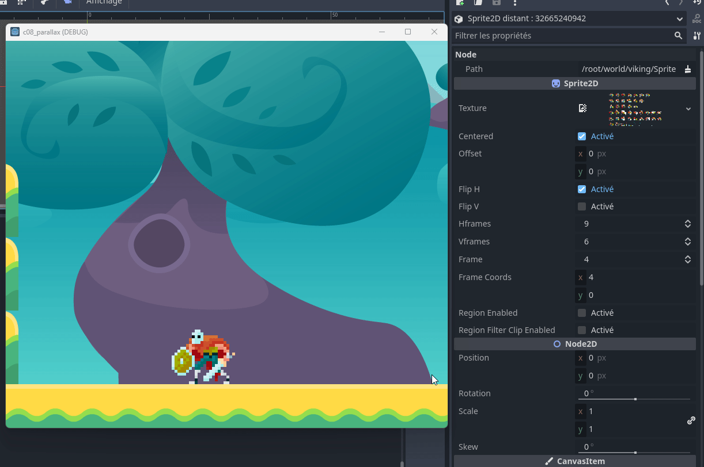

# Utiliser le débogueur distant
Godot permet de déboguer un jeu en cours d'exécution sur un appareil distant. Cela permet de déboguer un jeu sur un appareil mobile, par exemple. Dans le cas qui nous intéresse dans l'immédiat, le jeu sera local.

# Prérequis
- Avoir un projet Godot fonctionnel

# Étapes
1. Le projet doit être en exécution
2. Sous le volet `Scène`, sélectionner `Distant`
3. Sélectionner le noeud à observer
4. Dans le volet des propriétés, observer les valeurs des propriétés du noeud sélectionné se modifier au gré de l'exécution du projet

