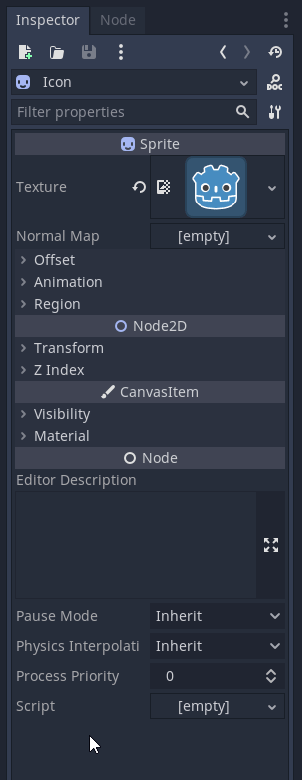
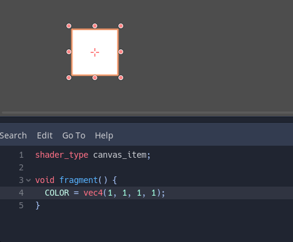

# Les shaders en Godot <!-- omit in toc -->

- [Introduction](#introduction)
- [Les shaders dans Godot](#les-shaders-dans-godot)
  - [Projet de base](#projet-de-base)
  - [Créer un shader](#créer-un-shader)
  - [Écrire le code GLSL](#écrire-le-code-glsl)
    - [Exemple simple](#exemple-simple)
  - [TODO](#todo)
- [Références](#références)

# Introduction
- Les shaders sont des programmes qui permettent de dessiner des objets dans un moteur de jeu.
- Ils sont utilisés pour les effets de lumière, les ombres, les textures, les effets de particules, etc.
- Les shaders sont écrits en GLSL (OpenGL Shading Language), un langage de programmation bas niveau.
- Le code est compilé pour la carte graphique et exécuté sur le GPU (Graphics Processing Unit).
- Les shaders sont écrits dans un fichier texte avec l'extension `.glsl` ou `.shader`
  - Godot sauvegarde avec l'extension `.gdshader` pour les shaders écrits dans l'éditeur de code.
- Les shaders sont utilisés dans Godot pour les matériaux, les post-process, les effets de particules, etc.

> **Note**
> 
> Étant donné que les shaders sont écrits en GLSL, il est possible, avec quelques conversions, d'utiliser des shaders dans d'autres moteurs de jeu. Par exemple, les shaders peuvent être utilisés dans Unity, Unreal Engine, etc.

# Les shaders dans Godot
Dans cet article, nous allons voir comment créer et utiliser un shader 2D dans Godot. On va faire clignoter une texture. Ce shader pourra être réutilisé, par exemple pour faire clignoter un ennemi ou un joueur qui se fait toucher ou encore pour d'autres effets.

## Projet de base
Étant donné que le code GLSL est identique pour tous les projets, vous pouvez prendre le projet de votre choix ou encore démarrer un projet vide pour suivre la démonstration.

**Note :** L'exemple pourra s'appliquer à facilement à votre projet de session. 

Dans le projet, vous devez avoir un sprite avec une texture. Comme indiquer précédemment, j'utilise le projet vide de Godot, j'ai pris le sprite `Icon` que j'ai mis directement dans la scène.


## Créer un shader
Pour créer un nouveau shader, vous pouvez suivre les étapes suivantes:

1. Sélectionnez le noeud `Sprite`
2. Dans l'inspecteur, sélectionnez le menu déroulant `Material`
3. Cliquez sur le bouton `New ShaderMaterial`
   - Une sphère apparait dans l'inspecteur
   - Un nouveau noeud `ShaderMaterial` est créé dans la hiérarchie
   
4. Cliquez `Material` dans l'inspecteur
5. Créez un nouveau `Shader` pour la propriété du même nom
6. Cliquez sur `Shader` une seconde fois pour développer l'éditeur de shader
   

## Écrire le code GLSL
Le langage GLSL est basé sur le C. Il est donc possible d'utiliser des variables, des fonctions, des boucles, des conditions, etc.

Comme j'en ai fait part, nous allons programmer un shader relativement simple. Nous allons travailler sur les pixels directement.

La première étape sera de déterminer le type de shader que nous allons utiliser. Dans notre cas, nous allons utiliser un shader 2D. La première ligne de code doit définir le type de shader avec la syntaxe suivante.

```glsl
shader_type <type>;
```

Les types valides sont les suivants:
- spatial : pour le rendu 3D
- canvas_item : pour le rendu 2D
- particles : pour les systèmes de particules

Nous allons donc utiliser le type `shader_type canvas_item;`.

```glsl
shader_type canvas_item; // Première ligne de code
```

Ensuite, il faudra utiliser la fonction de shader qui sera utilisée. Dans notre cas, nous allons utiliser la fonction `fragment`. Cette fonction est appelée pour chaque pixel du sprite. Ainsi, nous allons donc pouvoir modifier les pixels directement. Elle permet de déterminer la couleur que le pixel doit avoir.

```glsl
shader_type canvas_item;

void fragment() {
  // Code du shader
}
```

> **Note**
>
> Si le sprite a une dimension de 1920x1080, la fonction `fragment` sera appelée 2 073 600 fois!

### Exemple simple
La variable `COLOR` contient la couleur du pixel et est de type `vec4` soit un vecteur de 4 valeurs. La première valeur est le rouge, la deuxième le vert, la troisième le bleu et la quatrième l'alpha (transparence). Les valeurs sont comprises **entre 0 et 1**.

Assignons la valeur 1 à tous les composantes de `COLOR` pour obtenir un pixel blanc.

```glsl
shader_type canvas_item;

void fragment() {
  COLOR = vec4(1, 1, 1, 1);
}
```
Sauvegardez et observez le résultat en direct dans la scène.


- Testez en modifiant la valeur de `COLOR` pour obtenir un pixel rouge ou dans une autre couleur
- Testez en modifiant la transparence



## TODO

La fonction "fragment" s'exécute sur tous les fragments dans notre cas chaque pixel. La variable COLOR est la couleur du pixel. Nous pouvons la modifier pour changer la couleur du pixel. Nous pouvons également utiliser la variable UV pour accéder aux coordonnées de texture du pixel. Nous pouvons utiliser la fonction texture() pour accéder à la texture et obtenir la couleur du pixel à ces coordonnées.

Aussitôt que le shader est compilé, il est utilisé pour dessiner tous les objets qui utilisent ce shader. Nous pouvons donc voir le résultat de notre shader en temps réel.

`uniform` permet de définir des variables qui peuvent être modifiées dans l'éditeur de matériaux. Nous pouvons donc modifier la couleur du shader en temps réel.

On peut sauvegarder les shaders pour pouvoir les réutiliser pour d'autres objets dans le jeu voire différent projet.

Lorsque l'on appliquer un `shader` à une scène en particulier, il faudra cocher "Local to Scene" pour que le shader ne soit pas appliqué à toutes les scènes du projet. Par exemple, si le shader fait clignoter, tout le monde va clignoter.

# Références
- [Shading Language](https://docs.godotengine.org/en/3.0/tutorials/shading/shading_language.html) (GLSL) - OpenGL Wiki
- [Godot Shader Tutorial](https://www.youtube.com/watch?v=ctevHwoRl24)