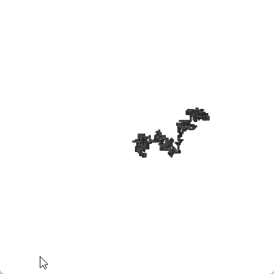
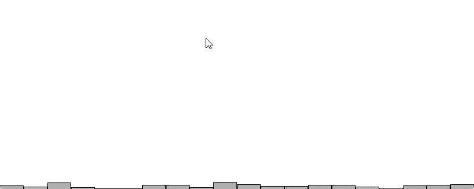
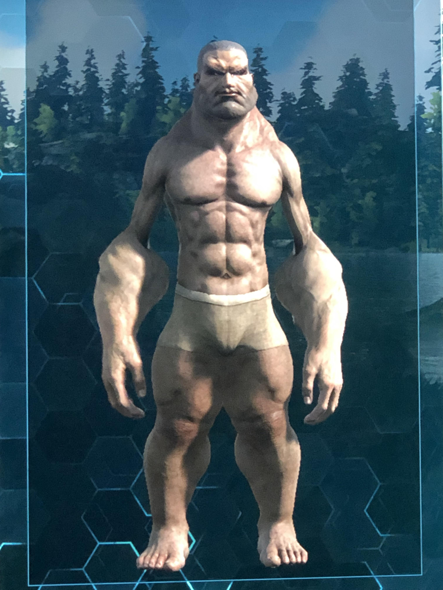
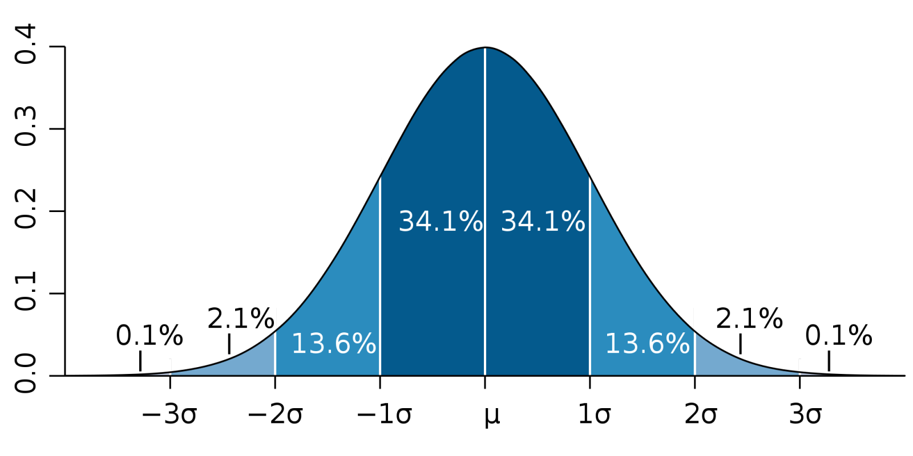
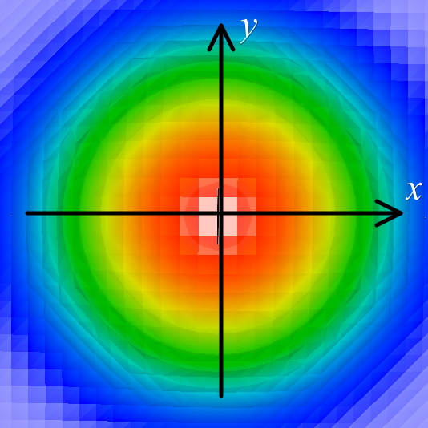
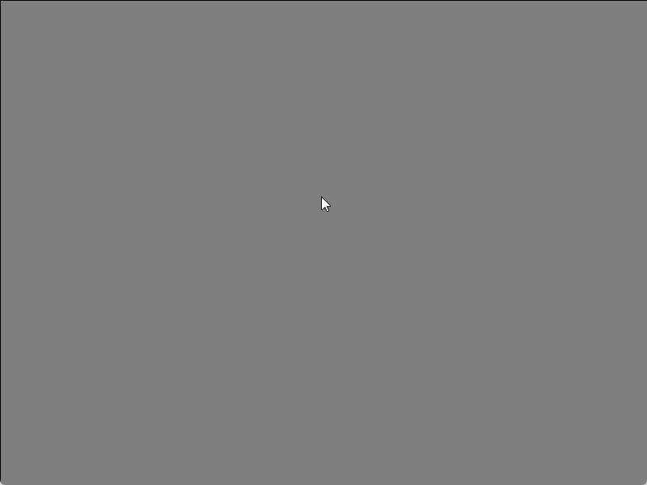

# Les nombres aléatoires <!-- omit in toc -->

# Table des matières <!-- omit in toc -->
- [Objectifs](#objectifs)
- [Introduction](#introduction)
- [Le marcheur aléatoire](#le-marcheur-aléatoire)
- [Nombre aléatoire](#nombre-aléatoire)
  - [Dans les jeux](#dans-les-jeux)
- [Distribution normale](#distribution-normale)
  - [Comment faire pour gérer la distribution normale?](#comment-faire-pour-gérer-la-distribution-normale)
  - [Exemple de cas d'utilisation](#exemple-de-cas-dutilisation)
- [Exercices](#exercices)

# Objectifs
- Comprendre les bases des nombres aléatoires
- Les différents types de distributions
- Le bruit de Perlin

# Introduction
Un ordinateur est une machine déterministe. Cela signifie que si vous lui donnez les mêmes données d'entrée, il donnera toujours la même sortie. Ainsi, il ne peut pas générer de nombres aléatoires. Cela peut être un problème si vous voulez simuler des phénomènes aléatoires. Pour cela, on utilise des générateurs de nombres aléatoires.

Ces nombres sont générés à partir d'une graine (**seed**) qui est un nombre initial. Si vous utilisez la même graine, vous obtiendrez les mêmes nombres aléatoires. Cela peut être utile pour déboguer un programme.

> **Note :** Je sais que vous avez hâte d'avoir les pieds dans `Godot`. Cependant, il est important de comprendre les bases mathématiques et algorithmiques qui se cachent derrière les jeux vidéo. `Processing` permet de simplifier la programmation graphique. C'est pourquoi je vous propose de commencer par ce langage. 

# Le marcheur aléatoire
Un exemple classique de simulation aléatoire est le marcheur aléatoire. Un marcheur aléatoire est un objet qui se déplace aléatoirement dans un espace. Il peut se déplacer dans n'importe quelle direction avec une probabilité égale.

Voici un exemple Processing pour simuler un marcheur aléatoire.

```java
int x = 0;
int y = 0;
int step = 2;

void setup() {
  size(400, 400);
  background(255);

  x = width / 2;
  y = height / 2;
}

void draw() {  
    int r = int(random(4));

    if (r == 0) {
        x += step;
    } else if (r == 1) {
        x -= step;
    } else if (r == 2) {
        y += step;
    } else {
        y -= step;
    }
}
```

<details>
<summary>Résultat</summary>

Ce code donnera un résultat similaire à celui-ci :



</details>


# Nombre aléatoire
Un nombre aléatoire est un nombre que l'on ne peut généralement pas prédire. Dans la plupart des langages de programmation, une fonction `random` est utilisée pour générer des nombres aléatoires entre 0 et 1. Par exemple, en Processing, la fonction `random()` génère un nombre aléatoire entre 0 et 1 exclusivement.

À partir de la valeur retournée par `random()`, on peut générer des nombres aléatoires dans un intervalle donné. Par exemple, pour générer un nombre aléatoire entre 0 et 9, on peut utiliser la formule suivante :

```java
int r = int (random() * 10);
```

Remarquez l'animation ci-dessous. Elle montre comment les nombres aléatoires sont distribués de manière uniforme entre 0 et 20.



Ainsi, c'est comme si l'on avait un dé à 20 faces. Chaque face a la même probabilité d'apparaître. On appellera cette distribution une **distribution uniforme**.

## Dans les jeux
On retrouve la distribution uniforme dans plusieurs types de jeux. Par exemple, dans un jeu de cartes, chaque carte a la même probabilité d'apparaître. Dans un jeu de dés, chaque face a la même probabilité d'apparaître. Certains jeux utilisent la distribution uniforme pour générer des physiques de personnages aléatoires.



# Distribution normale
Disons que l'on désire générer une population de zombies. Chaque zombie a une taille donnée en mètre. Dans une population réelle, la taille des zombies ne suit pas une distribution uniforme, c'est-à-dire qu'il y a plus de chance que l'on tombe sur un zombie de 1.72 mètre qu'un zombie de 2 mètres. Dans ma population, j'ai plus de zombies qui ont des tailles variants entre 1.65 et 1.75 mètre que des individus de 2 mètres et plus. La même chose pour des zombies de moins de 1.50 mètres. La hauteur des populations animales suit généralement une distribution normale. Ainsi, il y a une concentration des hauteurs plus fréquentes autour de la moyenne qu'aux extrêmes.

---

Voici un graphique montant une distribution normale.



La lettre grecque μ (mu) représente la moyenne et σ (sigma) l'écart-type. L'écart-type est une mesure de la dispersion des valeurs autour de la moyenne. Plus l'écart-type est grand, plus les valeurs sont dispersées. Plus l'écart-type est petit, plus les valeurs sont regroupées autour de la moyenne.

Ainsi à ±1 écart-type, on retrouve 68% de la population. À ±2 écart-type, on retrouve 95% de la population. À ±3 écart-type, on retrouve 99.7% de la population.

> **Note :** La distribution normale est également appelée distribution gaussienne, courbe normale ou cloche de Gauss.

---


Dans l'exemple qui suit, nous avons une distribution normale avec une moyenne de 24 et un écart-type de 5.


La fonction que l'on retrouvera dans Processing sera `randomGaussian()` qui retourne une valeur avec une moyenne de 0 et un écart-type de 1.

Voici le code pour l'animation précédente :

```java
// Retourne un nombre avec une moyenne de 0 et un écart-type de 1.
// La règle générale de la courbe normale (ou gaussienne)
// ±1 écart-type : 68% de la population
// ±2 écart-type : 95% de la population
// ±3 écart-type : 99.7% de la population

int[] randomCounts;

void setup () {
  size (800, 320);
  randomCounts = new int[50];
  
}

void draw () {
  
  background (255);
  
  float num = randomGaussian();
  float sd = 5; // Standard deviation | Écart-type
  float mean = randomCounts.length / 2; // Moyenne
  
  int index = int (sd * num + mean);
  randomCounts[index]++;
  
  stroke (0);
  fill (175);
  int w = width / randomCounts.length;
  
  for (int x = 0; x < randomCounts.length; x++) {
    rect (x * w, height - randomCounts[x], w - 1, randomCounts[x]);
  }  
}
```

## Comment faire pour gérer la distribution normale?
Pour générer une distribution normale, on fait ce que l'on appelle un changement d'échelle.
- On prend une valeur aléatoire générée par `randomGaussian()`
- On la multiplie par l'écart-type désiré.
- On ajoute ensuite la moyenne désirée.

Cela nous donne une valeur aléatoire avec la distribution normale désirée.

```java
float num = randomGaussian();
float sd = 5; // Standard deviation | Écart-type
float mean = randomCounts.length / 2; // Moyenne

int value = int (sd * num + mean);
```

## Exemple de cas d'utilisation
Dans un jeu de tir, on peut utiliser une distribution normale pour gérer la précision des tirs. Lorsque le joueur tire, on génère une valeur aléatoire avec une distribution normale selon son niveau de fatigue, la distance de la cible, etc. Par exemple, après un sprint, le joueur sera plus fatigué et sa précision sera moins bonne. Ainsi, en augmentant l'écart-type, on augmente la dispersion des tirs.

<table>
<tr>
<td>



</td>

<td>
Dans l'exemple ci-contre, la zone rouge est chaude et bleue froide. Ainsi, la dimension de la zone rouge est  proportionnelle à l'écart-type en X et Y.
</td>
</tr>
</table>

Voici un exemple de code pour gérer la précision des tirs à l'aide de la souris.

```java
float precision = 5; // Précision de base
float fatigue = 0; // Fatigue du joueur

void setup() {
  size(800, 600);
  background(127);
}

void draw() {
  fill(127, 127, 127, 10);
  rect (0, 0, width, height);

  if (mousePressed) {
    drawBullet();
  }

  if (keyPressed) {
    if (key == 'a') {
      fatigue += 0.1;
    } else if (key == 'z') {
      fatigue -= 0.1;
    }

    if (key == 'r') {
        background(127);
    }
  }
}

void drawBullet() {
  float numX = randomGaussian();
  float numY = randomGaussian();

  float sd = precision + fatigue; // Standard deviation | Écart-type
  float mean = 0; // Moyenne

  int x = int (sd * numX + mean);
  int y = int (sd * numY + mean);

  fill(0);
  ellipse(mouseX + x, mouseY + y, 5, 5);
}

```

<details>
<summary>Résultat</summary>

Ce code donnera un résultat similaire à celui-ci :



</details>

# Exercices
TODO : Compléter les exercices