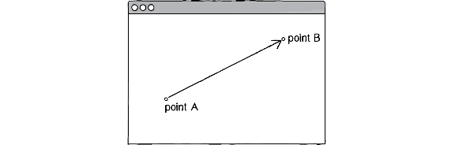
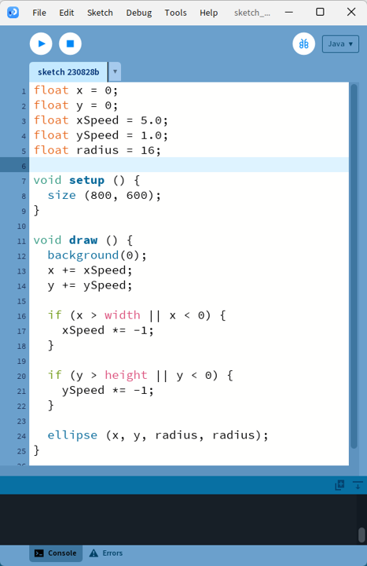
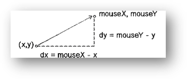

# Les vecteurs <!-- omit in toc -->

[Liste de vidéos de support](https://www.youtube.com/watch?v=mWJkvxQXIa8&list=PLRqwX-V7Uu6ZwSmtE13iJBcoI-r4y7iEc)

# Table des matières <!-- omit in toc -->
- [Vecteur : définition](#vecteur--définition)
- [Vecteur : utilité](#vecteur--utilité)
- [Vecteur : exemple](#vecteur--exemple)
  - [Simplification de l'exemple avec les vecteurs](#simplification-de-lexemple-avec-les-vecteurs)
- [Vecteur : classe](#vecteur--classe)
- [Vecteur : déplacement](#vecteur--déplacement)
- [Exercice](#exercice)
- [Opérations d’intérêt](#opérations-dintérêt)
- [Termes à connaître](#termes-à-connaître)
- [Accélération](#accélération)
- [Autres opérations](#autres-opérations)
- [Trajectoire](#trajectoire)
- [Exercice](#exercice-1)
- [Références](#références)


# Vecteur : définition
- Le terme **vecteur** peut signifier plusieurs choses dépendant du contexte.
  - En biologie : Décrit un organisme qui transmet une infection d’un hôte à un autre.
  - En programmation : Décrit une structure de tableau de données.
- En mathématique, un vecteur est un concept permettant de représenter une longueur (magnitude) et une direction.



# Vecteur : utilité
- Dans le monde des jeux vidéo, réalité virtuelle ou autre simulation, les vecteurs sont utilisés partout.
- **C’est une connaissance fondamentale à la programmation de jeux et applis multimédia.**
- C’est un bloc de construction nécessaire pour toute application ayant des implications mathématiques.

---

# Vecteur : exemple

- Voici du code représentant une balle qui rebondit aux limites de l’écran
- [Lien pour l’exécuter](pde://github.com/nbourre/0sw_processing_exemples/raw/master/bin/s01_no_vectors.pdez)
  - Au moment d’écrire ces lignes, il y avait un bug dans Processing. Il faut cliquer une 2e fois sur le lien tout en ayant une fenêtre ouverte.



- Ce que l’on remarque est l’utilisation de plusieurs variables X et Y similaires.
  - Position X et Y.
  - Vitesse X et Y.
- Une des complications est la gestion de toutes ces variables.
- Imaginez maintenant que vous devez gérer l’accélération, la position d’une cible, le vent et la friction.
  - Quelles seraient les variables probables?
  - Utilisation de deux variables dans chacun des cas.
  - Dans un monde 3D ce serait 3 variables…

---

## Simplification de l'exemple avec les vecteurs

<table style="border: none;">

<tr>
<td>

```java
float x;
float y;
float z;
```

</td>
<td>

Vecteur location; // ou position

</td>
</tr>

<tr>
<td>

```java
float xSpeed;
float ySpeed;
float zSpeed;
```

</td>
<td>

Vecteur speed; // ou velocity

</td>
</tr>

<tr>

<td  colspan="2">

On simplifie le code en utilisant les vecteurs.

</td>
</tr>

</table>


---

# Vecteur : classe
- Processing offre la classe `PVector` qui représente un vecteur.
- Dans cette classe, on y retrouve les propriétés X et Y en `float`.
- On y retrouve plusieurs méthodes pour effectuer des opérations avec les vecteurs.

---

# Vecteur : déplacement
- Pour simuler du mouvement à l’aide des vecteurs, il faut utiliser la translation.
  - Pour effectuer une translation, il suffit d’additionner la vitesse à la position.
- Le mouvement est un déplacement dans le temps.
- La vitesse représente un déplacement dans le temps.
- La vitesse peut être représentée par un vecteur.
- Le déplacement est une distance dans une unité donnée.
  - Exemple : L’unité pixel.

```java
location = new PVector(50, 50);
vitesse = new PVector(1, 1);
// On additionne à location le vecteur de vitesse
location.add(vitesse)

// Équivalent sans vecteur
locX = 50;
locY = 50;
vitX = 1;
vitY = 1;
locX += vitX;
locY += vitY;
```

---

# Exercice
- Dans un exercice précédent, vous deviez faire une ellipse qui rebondit sur les côtés de la fenêtre. Améliorez le code pour utiliser des vecteurs pour déplacer la balle.

---

# Opérations d’intérêt
- Soustraction
  - Idem que l’addition.
  - Méthode `sub(PVector)`.
  - Exemple : Pour trouver la distance entre deux vecteurs.
- Multiplication par un scalaire
  - On multiplie chacun des composants du vecteur par une valeur scalaire.
  - 𝐴 ∗ 𝑣 (𝑥, 𝑦) = 𝑣 (𝐴𝑥, 𝐴𝑦).
  - Méthode `mult(float)`.
- Division par un scalaire
  - Idem que la multiplication.

---

# Termes à connaître

- Magnitude
  - La magnitude est la longueur du vecteur en utilisant le théorème de Pythagore.
- Normalisation
  - Ramène le vecteur à une longueur de 1 unité.
  - On divise le vecteur par sa longueur.
  - Cela donne la direction du vecteur.
  - Exemple : Pour limiter la vitesse d’un objet. On normalise le vecteur de vitesse puis on le multiplie par la vitesse maximale.

# Accélération
- L’accélération est le taux de variation de la vitesse.
- En programmation, on additionne l’accélération à la vitesse.

```java
acceleration = new PVector(1, 1);
vitesse = new PVector(0, 0);
vitesse.add(acceleration);
location.add(vitesse);
```

---

# Autres opérations
- Dans un jeu, on limite souvent les vitesses.
- Pour limiter les vitesses, on ajoute une méthode qui limite la longueur d’un vecteur.
- L’algorithme est le suivant :
  - Si `vecteur.longueur > max`
    - `vecteur.normalise()` // On le met à une longueur de 1 unité.
    - `vecteur.mult(max)`
  - Fin si

---

# Trajectoire
- À chaque fois que l’on désire calculer une trajectoire, il faut calculer la magnitude et la direction.
- Prenons l’exemple où l’on désire que notre objet se déplace vers la souris.
- Calculons la direction.
  - Celle-ci est la distance entre le X et Y de l’objet et le X et Y de la souris.

```java
PVector souris = new PVector(mouseX, mouseY);
PVector dir = PVector.sub(souris, location);
```



---

- Nous avons maintenant le vecteur qui pointe directement à l’emplacement de la souris.
- Si nous additionnons la direction à la position, l’objet apparaîtrait immédiatement à la souris et ce n’est pas l’effet désiré.
- Ce que l’on doit faire, c’est de décider à quelle vitesse l’objet doit se rendre à la souris.
- Pour ce faire, on normalisera le vecteur pour ensuite le multiplier par une valeur qui déterminera sa vitesse en unité.
- Pour finaliser, on applique ce vecteur à l’accélération.

---

# Exercice
- Modifiez l’exercice avec la balle pour avoir une forme qui accélère dans la direction de la flèche appuyée par l’utilisateur.
- Faites un projet où une image (cible, balle, etc.) poursuit la souris.
  - Essayez avec différentes vitesses.


# Références
- À lire pour le prochain cours
- https://natureofcode.com/book/introduction/
- https://natureofcode.com/book/chapter-1-vectors/