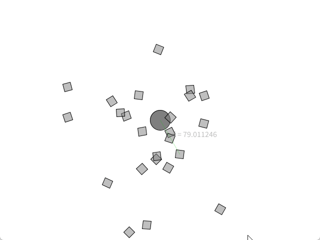

# Attraction gravitationnelle <!-- omit in toc -->

# Table des matières <!-- omit in toc -->


---

# Attraction gravitationnelle


La loi gravitationnelle de Newton est une loi physique classique qui décrit l'attraction gravitationnelle entre deux objets massifs. Elle est donnée par la formule suivante :

$$F_g = G \frac{m_1 m_2}{r^2}\hat{r}$$

où :
- $G$ est la constante gravitationnelle universelle,
- $m_1$ et $m_2$ sont les masses des deux objets,
- $r$ est la distance entre les deux objets.

Dans le cadre d'une simulation pour un jeu vidéo, voici ce que chaque élément de cette formule représente :
- $F_g$ est le vecteur de force que l'on passera à la méthode `applyForce`;
- $G$ est une constante qui vaut $6.674 \times 10^{-11}$ m$^3$ kg$^{-1}$ s$^{-2}$. Dans notre cas, nous prendrons $G = 1$ pour simplifier les calculs;
- $m_1$ et $m_2$ sont les masses des deux objets. On pourrait définir la taille des objets en fonction de leur masse;
- $r$ est la distance entre les deux objets.
- $\hat{r}$ est le vecteur unitaire qui pointe de l'objet 1 vers l'objet 2.

Si on regarde le numérateur de la formule ($G \cdot m_1 \cdot m_2$), plus les objets sont massifs, plus la force gravitationnelle est grande. Cependante, si on regarde le dénominateur ($r^2$), plus les objets sont éloignés, plus la force gravitationnelle est faible. Mathématiquement, on peut dire que la force gravitationnelle est **inversement proportionnelle** au carré de la distance.

## Code de base

Le code de la formule pourra alors ressembler à ceci :

```java
PVector force = PVectors.sub(this.position, other.position);
float distance = force.mag();

float magnitude = (G * this.mass * other.mass) / (distance * distance);

force.setMag(magnitude);
```

# Classe `Attractor`

Pour simplifier la gestion de l'attraction gravitationnelle, nous allons créer une classe `Attractor` qui contiendra les méthodes suivantes :

- `display` : pour afficher l'objet attracteur;
- `attract` : pour calculer la force d'attraction entre l'objet attracteur et un objet donné.

Le code du fichier principale pourrait alors ressembler à ceci :


```java
Attractor attractor;
Mover mover;

void setup() {
  size(800, 800);
  attractor = new Attractor(width / 2, height / 2);
  mover = new Mover(width / 4, height / 4, 1);
}

void draw() {
  background(255);
  
  PVector force = attractor.attract(mover);
  mover.applyForce(force);
  mover.update();

  attractor.display();
  mover.display();
}
```

La méthode `attract` de la classe `Attractor` pourrait alors ressembler à ceci :

```java
PVector attract(Mover m) {
  PVector force = PVector.sub(this.position, m.position);
  float distance = force.mag();

  // On évite la division par 0
  // On limite les distances trop grandes
  distance = constrain(distance, 5, 25); 

  // On ignore G pour simplifier les calculs
  float magnitude = (this.mass * m.mass) / (distance * distance);
  force.setMag(magnitude);
  
  return force;
}

```

Dépendant des initiales, on pourrait obtenir un résultat similaire à ceci :


## Exercice
- Créez la classe `Attractor` avec les méthodes `display` et `attract`.
- Reproduisez l'animation montrée dans l'exemple.

---

# Plusieurs corps

Avec la section précédente, nous pouvons maintenant attirer un objet avec un autre. Cependant, il serait intéressant de pouvoir attirer plusieurs objets en même temps. Pour ce faire, nous allons créer un tableau de `Mover` et les faire interagir entre eux. Ainsi, il faudra modifier la classe `Mover` pour qu'elle puisse calculer la force d'attraction entre elle et un autre objet.

Le résultat pourrait ressembler à ceci :



## Exercice
- Faites les modifications requises pour obtenir un résultat similaire à l'exemple.