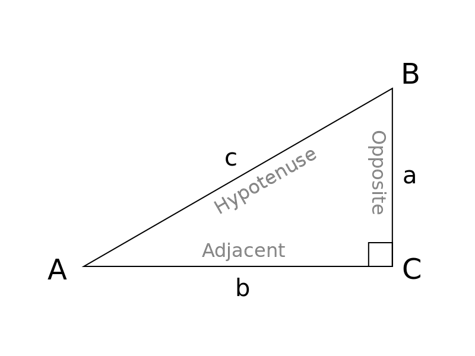
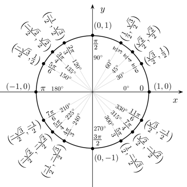
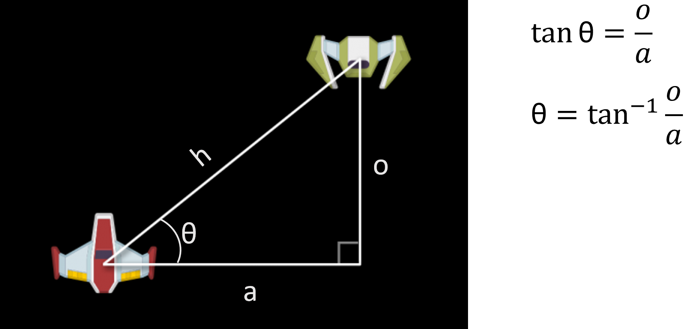
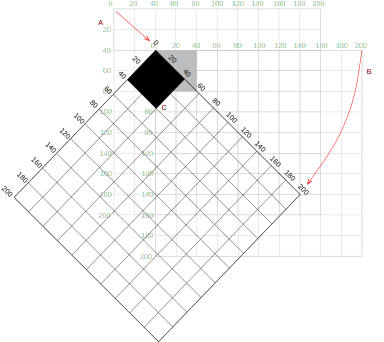
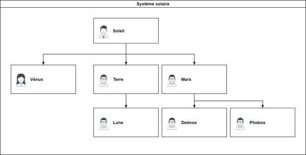

# Les oscillations et les collisions circulaires <!-- omit in toc -->
De la trigonométrie!... Oh boboy!
---

# Table des matières <!-- omit in toc -->
- [Plan de leçon](#plan-de-leçon)
- [Trigo de base](#trigo-de-base)
- [Cercle trigonométrique : Ce qu’il faut retenir](#cercle-trigonométrique--ce-quil-faut-retenir)
- [Trigonométrie en programmation](#trigonométrie-en-programmation)
- [`pushMatrix()` et `popMatrix()`](#pushmatrix-et-popmatrix)
  - [Scénario](#scénario)
  - [Les fonctions `pushMatrix()` et `popMatrix()`](#les-fonctions-pushmatrix-et-popmatrix)
  - [Analogie `pushMatrix()` et `popMatrix()`](#analogie-pushmatrix-et-popmatrix)
- [Exemple d’imbrication](#exemple-dimbrication)


---

# Plan de leçon

- Rappel très rapide sur la trigonométrie de base
- Trigonométrie en programmation
- `pushMatrix()` et `popMatrix()`
- Mouvement angulaire
- Coordonnées polaires
- Les collisions circulaires

---

# Trigo de base

- Dans notre contexte, on se limitera aux fonctions de base, soit sinus, cosinus et tangente.
- Le Sinus est le côté opposé de l’angle sur l’hypoténuse.
- Le Cosinus est le côté adjacent de l’angle sur l’hypoténuse.
- La Tangente est le côté opposé de l’angle sur le côté adjacent.
- Mnémonique : SOHCAHTOA



---

# Cercle trigonométrique : Ce qu’il faut retenir

<table>
  <tr>
    <td>

- $2\pi\ rad = 360°$
- $\pi\ rad = 180°$
- $\frac{\pi}{2}\ rad = 90°$
- $\frac{\pi}{3}\ rad = 60°$
- $\frac{\pi}{4}\ rad = 45°$
- $\frac{\pi}{180}\ rad = 1°$
- Si l'on veut incrémenter de 1°, on peut se faire une constante `DEG_TO_RAD` égale à $\frac{\pi}{180}$.

    </td>
    <td>
    
    

    </td>
  </tr>
</table>


---

# Trigonométrie en programmation

- C’est bien beau la théorie, mais à quoi ça peut servir en programmation?
- Exemple : Pointer un vaisseau vers un vaisseau ennemi devient simple avec la trigonométrie.



```java
float angle = atan2(enemy.y - player.y, enemy.x - player.x);
```

> **Note** : On utilise la fonction `atan2` pour obtenir l’angle en radians entre deux points. Elle est plus précise que `atan` et prend en compte les quadrants.

---

- Dans la très grande majorité des cas, les fonctions trigonométriques en programmation sont en **radians et non en degrés**.
- Formules de conversion :
  - radians = PI * (degrés / 180)
  - degrés = (radians * 180) / PI
- Dans Processing, il existe la fonction `float radians(float degrees)`.

```java
background(0);
pushMatrix();
  translate(width / 2, height / 2);
  rotate(angle);
  stroke(255);
  line (-100, -100, 100, 100);
popMatrix();
```

---

# `pushMatrix()` et `popMatrix()`

## Scénario

- On veut faire un système solaire où les planètes tournent autour de l’étoile, et les lunes autour de leur planète.
  - Certains astres dépendent de la position de l’astre parent par exemple la lune autour de la Terre
- Disons que l'on désire contrôler un bras robotisé avec plusieurs segments.
  - Chaque segment dépend de la position du segment précédent.
- Ces calculs peuvent devenir complexes, car on doit calculer la position d'un objet en fonction de la position d'un autre objet.
- Pour simplifier la tâche, on introduit le concept de **matrice de transformation**.

---

## Les fonctions `pushMatrix()` et `popMatrix()`
- La compréhension intrinsèque de ceux-ci nécessite de comprendre le concept de pile de matrices ce qui sort des compétences de ce cours.

Pour simplifier :
- `pushMatrix()` permet de sauvegarder la matrice d’affichage actuelle.
- `popMatrix()` permet de remettre la dernière matrice d’affichage sauvegardée.

---

## Analogie `pushMatrix()` et `popMatrix()`

- Imaginez une matrice comme une feuille de papier quadrillée.
- `pushMatrix()` met la feuille de côté dans sa position actuelle sur une pile.
- On peut ensuite dessiner sur la feuille actuelle et faire des transformations.
  - On peut par exemple faire des rotations, des translations, des mises à l’échelle comme si l'on déplaçait la feuille.




---

- `popMatrix()` remet la dernière feuille en place par rapport à la feuille actuelle.
- Cela permet de relativiser les calculs géométriques entre les objets graphiques.

En résumé, ces deux fonctions sont essentielles pour isoler les transformations géométriques entre les objets graphiques qui se retrouvent entre le `pushMatrix()` et le `popMatrix()`.

---

<table>
  <tr>
    <td>

    - **Il s'utilise toujours en pair push-pop.**
    - **On peut les imbriquer.**
    - Par exemple, si l’on veut dessiner un objet où il y a d’autres composants-enfants qui sont positionnés relativement au parent
    - Voici une [vidéo explicative](https://www.youtube.com/watch?v=o9sgjuh-CBM&ab_channel=TheCodingTrain) de Daniel Shiffman
    - Question : Comment pourrait-on animer le robot ci-contre?

    </td>
    <td>
    wip/c02c_oscillation/assets/robot.webp
    </td>
  </tr>
</table>


---


# Exemple d’imbrication

<table>
  <tr>
    <td>
    


    </td>
    <td>
    
```java
pushMatrix();
  soleil.draw();
  pushMatrix();
    venus.draw();
  popMatrix();
  pushMatrix();
    terre.draw();
    pushMatrix();
      lune.draw();
    popMatrix();
  popMatrix();
  pushMatrix();
    mars.draw();
    pushMatrix();
      deimos.draw();
    popMatrix();
    pushMatrix();
      phobos.draw();
    popMatrix();
  popMatrix();
popMatrix();

```

    </td>
  </tr>
</table>


<!-- Tableau html à 2 colonnes pour copier coller

<table>
  <tr>
    <td>
    

    </td>
    <td>
    

    </td>
  </tr>
</table>

-->