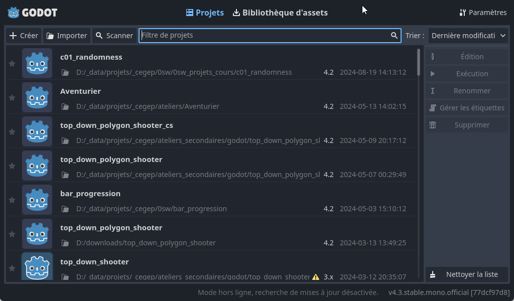
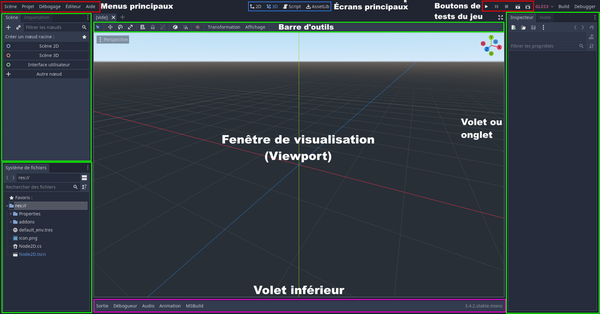
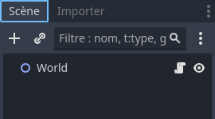
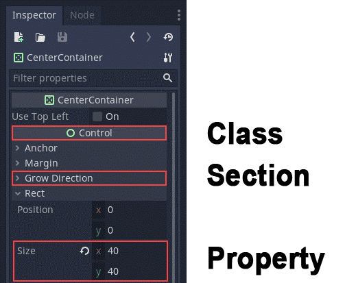
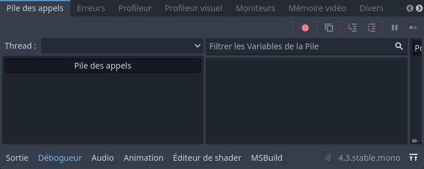

# Premier pas avec Godot <!-- omit in toc -->

Apprendre les rudiments de l’environnement de développement Godot.

---

# Table des matières <!-- omit in toc -->
- [Plan de leçon](#plan-de-leçon)
- [Notes préliminaires](#notes-préliminaires)
- [Gestionnaire de projets](#gestionnaire-de-projets)
- [Création d’un nouveau projet](#création-dun-nouveau-projet)
- [L’environnement de travail](#lenvironnement-de-travail)
  - [Système de fichiers](#système-de-fichiers)
  - [Volet Scène](#volet-scène)
  - [Volet Inspector](#volet-inspector)
  - [La zone de travail (workspace)](#la-zone-de-travail-workspace)
  - [Volet inférieur](#volet-inférieur)
  - 
  - [Les types d’environnement de travail](#les-types-denvironnement-de-travail)
- [Scènes et nœuds](#scènes-et-nœuds)
  - [Les nœuds](#les-nœuds)
  - [Les scènes](#les-scènes)
  - [Exercice : Bonjour le monde](#exercice--bonjour-le-monde)
- [Exercice : Bonjour le monde (suite)](#exercice--bonjour-le-monde-suite)
- [Exercice : Bonjour le monde (suite)](#exercice--bonjour-le-monde-suite-1)
- [Configurer le projet](#configurer-le-projet)
- [Script](#script)
- [Introduction](#introduction)
- [Objectifs](#objectifs)
- [Monter la scène](#monter-la-scène)
- [Ajouter un script](#ajouter-un-script)
- [Le script](#le-script)
- [Le script (suite)](#le-script-suite)
- [Signal et GetNode](#signal-et-getnode)
- [Exécution du script](#exécution-du-script)
- [GetNode()](#getnode)
- [Autres informations sur le script](#autres-informations-sur-le-script)
- [Les fonctions de rappel](#les-fonctions-de-rappel)
- [Les fonctions de rappel](#les-fonctions-de-rappel-1)
- [\_Process(float delta)](#_processfloat-delta)
- [\_PhysicsProcess(float delta)](#_physicsprocessfloat-delta)
- [Les groupes](#les-groupes)
- [Les méthodes surchargeables](#les-méthodes-surchargeables)
- [Créer et détruire un nœud](#créer-et-détruire-un-nœud)
- [Exercice](#exercice)
- [Les signaux](#les-signaux)
- [Les signaux](#les-signaux-1)
- [Les signaux : Exercice](#les-signaux--exercice)
- [Les signaux : Exercice (suite)](#les-signaux--exercice-suite)
- [Les signaux : Exercice (suite)](#les-signaux--exercice-suite-1)
- [Les signaux : Exercice (suite)](#les-signaux--exercice-suite-2)
- [Les signaux : Exercice (suite)](#les-signaux--exercice-suite-3)
- [Les signaux en code](#les-signaux-en-code)
- [Les signaux en code : Exercice](#les-signaux-en-code--exercice)
- [Signaux personnalisés](#signaux-personnalisés)
- [Instanciation](#instanciation)

---

# Plan de leçon

- Notes préliminaires
- Gestionnaire de projets
- L’environnement de travail

---

# Notes préliminaires

- Godot est un moteur de jeux vidéo 2D et 3D à code source ouvert.
- Le langage de base est le `GDScript` qui est un pseudo-python mais pour alléger la charge cognitive nous allons utiliser le langage C# pour le développement des projets.
- J’utiliserai l’interface en anglais pour faciliter la recherche de ressources.
- Vous pouvez utiliser la langue qui vous convient.
- Au moment de réviser ces notes j’utilisais la version 4.3 avec C# Mono.
- Je vous invite à regarder les séries de vidéos suivantes :
  - [Mes vidéos](https://youtu.be/D89lwa1TZ5c?si=Lb6ZWMvspNOkuoea) sur Godot (Attention! Certaines datent de l’ancienne version)

---

# Gestionnaire de projets

- Premier démarrage : le gestionnaire de projets est vide.

- C’est l’endroit où l’on retrouve nos projets récents.
- Dans cette fenêtre, on peut :
  - Créer un nouveau projet
  - Rechercher des projets dans un dossier (Scan)
  - Importer un projet
  - Effectuer d’autres opérations sur des projets
- Pour modifier la langue, il suffit de cliquer sur le bouton dans le coin supérieur droit avec une icône de globe.

---

# Création d’un nouveau projet

- Pour créer un nouveau projet, il faut le placer dans un dossier vide.
  - Je suggère de regrouper vos projets au même endroit, il y a un bouton pour créer le dossier du projet.
- Godot s’occupera de la création des différents fichiers nécessaires pour le projet.
- **Note :** J’utiliserai un seul dépôt pour mes projets Godot. Vous pouvez y accéder [ici](https://github.com/nbourre/0sw_projets_cours).

---

# L’environnement de travail

- L’environnement de travail de Godot peut sembler intimidant au début, mais si vous avez de l’expérience avec Visual Studio ou un autre environnement similaire, celui-ci s’y ressemble.
- À l’instar de VS, l’interface est très modulable; ainsi, on peut déplacer les panneaux aux endroits qui nous conviennent.

---

## Système de fichiers

- La barre de menus contient le menu principal, les workspaces, et les boutons de test.
- Le volet `FileSystem` contient la structure du dossier du projet.
- On y retrouve aussi les ressources (assets) :
  - Images, sons, etc.

---

## Volet Scène

- Le volet "Scene" permet d’effectuer la gestion des scènes dans le projet.

---

## Volet Inspector

- Il y a aussi le concept de nœud que l’on verra sous peu.
- Le volet `Inspector` permet de gérer les propriétés de la scène active.

---

## La zone de travail (workspace)

- Lorsque l’on sélectionne une zone de travail, la barre d’outils s’adapte selon le contexte.
- La barre d’outils se retrouve dans la partie supérieure de la zone de travail.

---

## Volet inférieur

- Comme plusieurs IDE, le volet inférieur contient plusieurs outils de débogage ainsi que d’édition d’animations.

---

## Les types d’environnement de travail

- Dans la partie supérieure de la fenêtre de Godot, il y a quatre boutons qui permettent de changer l’environnement de travail.
- Il y a quatre environnements de travail (workspaces) :
  - 2D, 3D, Script et AssetLib
- L’environnement **2D** sert principalement pour le… 2D et les interfaces.
- L’environnement **3D** sert à travailler avec les meshes, l’éclairage, et le design de niveau pour les jeux 3D.
- L’environnement **Script** est un éditeur de code complet avec un débogueur.
- L’environnement **AssetLib** est une librairie de ressources telles que des scripts, des images, des add-ons, etc.

---

# Scènes et nœuds

- [Documentation officielle](https://docs.godotengine.org/en/stable/getting_started/step_by_step/scenes_and_nodes.html)
- Ma vidéo [Débuter avec Godot 4](https://www.youtube.com/watch?v=D89lwa1TZ5c)
- Godot fonctionne sous le concept de **scènes** et **nœuds**.

---

## Les nœuds

- Les nœuds sont les ingrédients de base pour créer un jeu.
- Chaque nœud a une fonctionnalité spécialisée.
- Chaque nœud possède les attributs suivants :
  - Il a un nom
  - Il a des propriétés modifiables
  - Il peut recevoir des fonctions de rappel (`callback`) pour traiter chaque *frame*
  - Il peut être étendu pour avoir plus de fonctionnalités
  - Il peut être ajouté à un autre nœud en tant qu’enfant
    - Cela crée un graphe.
- Ne vous inquiétez pas si vous n’avez pas tout compris, on revient sur le sujet plus tard.

---

## Les scènes

- Une scène est composée d’un groupe de nœuds organisés de façon hiérarchique.
- Une scène :
  - A toujours un nœud racine
  - Peut être sauvegardée et chargée
  - Peut être instanciée (comme un objet)
- Exécuter un jeu revient à exécuter une scène.
- Un projet peut contenir plusieurs scènes, mais un jeu pour démarrer doit avoir une scène principale.

---

## Exercice : Bonjour le monde

- Comme tout bon premier exemple, nous allons créer un projet `Bonjour le monde`.
- Nous allons ajouter un nœud `Label` via le bouton "+" dans le coin supérieur gauche du volet Scene.
- Le bouton "Other node" revient à la même action.
- Une fenêtre apparaîtra dans laquelle on pourra rechercher le nœud désiré.
- Effectuez la recherche "Label".
- Appuyez sur Create.

---

# Exercice : Bonjour le monde (suite)

- Plusieurs choses se passent après avoir cliqué sur Create :
  - Premièrement, la scène se met en 2D car un Label est un nœud de type 2D.
  - Deuxièmement, l’étiquette apparaît sélectionnée dans la scène dans le coin supérieur gauche du viewport.
- La seconde étape sera de changer le texte dans le volet Inspector.
- Modifiez la propriété "Texte" pour "Bonjour le monde!".
- Exécutez le code en cliquant sur le bouton Exécuter la scène dans le coin supérieur droit ou [F6].

---

# Exercice : Bonjour le monde (suite)

- Godot demandera à sauvegarder la scène.
- Donnez un nom significatif comme "bonjour".
- L’endroit de sauvegarde sera le dossier "res://" qui est le dossier des ressources.
- Si tout va bien, une fenêtre s’affichera avec le texte de l’étiquette.

---

# Configurer le projet

- Comme indiqué plus tôt, un projet peut avoir plusieurs scènes.
- Il faut configurer le projet pour sélectionner la scène principale.
- Pour configurer le projet, il suffit d’aller dans le menu "Project à Project settings".
- Configurons le projet pour exécuter la scène principale :
  - Dans le volet de gauche sous la catégorie "Application" sous "Run"
  - Changer la propriété "Main Scene" pour récupérer la scène de "Bonjour le monde".
  - Une fois modifié, lorsque l’on exécutera le jeu avec [F5], la scène principale sera lancée.

---

# Script

TODO : Ajouter image

---

# Introduction

- Dans cette partie, nous allons faire un projet dans lequel un bouton changera le texte d’une étiquette à l’aide du code.
- Godot accepte 3 langages :
  - GDScript : Langage natif de Godot ressemblant à Python. C’est le favori de ceux qui apprennent à programmer. Il est utilisé dans la plupart des tutoriels.
  - C# : Langage favori des programmeurs et des gros projets. Ce sera le langage utilisé dans le cours pour faciliter l’apprentissage.
  - GDNative/C++ : C’est du C++ :)

---

# Objectifs

- On verra les éléments suivants :
  - Attacher un script à un nœud
  - Accrocher un élément graphique (UI) via un signal (événement)
  - Écrire un script qui accède à d’autres nœuds dans la scène
- Il est suggéré de survoler les références de GDScript.

---

# Monter la scène

- Avec le projet "Hello World", ajoutez les nœuds suivants dans la même hiérarchie :
  - Panel
  - Label
  - Button
- Vous pouvez mettre un nœud à la racine de la scène en cliquant avec le bouton de droite.
- Positionnez les contrôles pour obtenir ce qui est affiché ci-contre.
- Propriété "Rect" de "Panel" pour la dimension de ce dernier.

TODO : Ajouter image

---

# Ajouter un script

- Dans le volet Scene, cliquez avec le bouton droit sur le nœud Panel et sélectionnez Attach Script.
- La boîte de dialogue pour la création de script s’affichera.
- On peut y régler entre autres :
  - Le langage de programmation
  - Le nom du fichier
- Sélectionnez le langage "C#".
- Dans Path, donnez un nom significatif au script. Exemple : TestPanel.cs.
- Cliquez sur "Create".
- L’éditeur de script s’ouvrira.
- Un bouton apparaîtra à côté du Panel. En cliquant dessus, on ouvre le script attaché.

---

# Le script

- La méthode "_Ready" est générée automatiquement.
- Celle-ci s’exécute une fois que tous les enfants entrent en activité dans la scène.
- Le rôle du script est d’ajouter des comportements à un nœud.

---

# Le script (suite)

TODO : Ajouter code

---

# Signal et GetNode

- Godot utilise le terme "signal" qui est un synonyme d’événement.
- La convention Godot pour le nom des méthodes de signaux est celle-ci : On[NomNoeud][NomSignal].
  - Dans notre cas : OnButtonPressed.
- Pour attacher un signal à un événement, il suffit d’ajouter la méthode à l’événement.
- La méthode GetNode<T>(nomNoeud) permet de retrouver le nœud relatif au nœud possédant le script.

---

# Exécution du script

- Vous pouvez exécuter la scène pour tester le script.

---

# GetNode()

- La méthode GetNode() est fréquemment utilisée pour retrouver un nœud.
- Le chemin donné en paramètre est une string relative au nœud possédant le script.
- Assumons que le nœud courant est "Character" et le graphe suivant :
  - /root
  - /root/Character
  - /root/Character/Sword
  - /root/Character/Backpack/Dagger
  - /root/MyGame
  - /root/Swamp/Alligator
  - /root/Swamp/Mosquito
  - /root/Swamp/Goblin
- Les chemins possibles sont :
  - GetNode("Sword")
  - GetNode("Backpack/Dagger")
  - GetNode("../Swamp/Alligator")
  - GetNode("/root/MyGame")

---

# Autres informations sur le script

- Remarquez que le script hérite du nœud.
  - Par exemple : `public class XYZ : Panel`.
- N’oubliez pas que c’est du C#, ainsi les propriétés du nœud sont directement accessibles dans le code.
  - Par exemple, la propriété "Text" sera accessible pour un nœud de type Label.
- Il est possible d’utiliser Visual Studio Code pour éditer le code et avoir l’auto-complétion.
- Veuillez consulter ce lien : [https://giulianob.svbtle.com/godot-csharp-setup](https://giulianob.svbtle.com/godot-csharp-setup).

---

# Les fonctions de rappel

TODO : Ajouter image

---

# Les fonctions de rappel

- Godot fonctionne beaucoup avec des callbacks (fonctions de rappel) ou des fonctions virtuelles.
- Cela évite de créer plusieurs "if" qui sont vérifiés à chaque fois dans une boucle.
- Toutefois, on peut quand même utiliser des fonctions de traitements continues comme les boucles de jeux classiques.
- Godot offre "_Process(float delta)" et "_PhysicsProcess()".

---

# _Process(float delta)

- La méthode _Process est appelée à chaque début de frame.
- Elle n’est pas synchronisée à aucune fréquence.
- Elle est donc exécutée à temps variable.
- Pour gérer la variabilité, le paramètre delta contient le temps défilé depuis le dernier appel de la fonction.
- Voir le projet "c01d_process".
- delta peut être utilisé pour calculer des variations constantes, cela indépendamment du taux de rafraîchissement.
- Il s’agit d’une valeur en fraction de seconde, par exemple 0.016s.
- Par exemple, le mouvement d’une balle doit aller à 60px/sec, peu importe la puissance de la machine.
- Il suffit de multiplier la vitesse par le delta.
  - Ex : `vitesse.x = 60 * delta;`.

---

# _PhysicsProcess(float delta)

- Similaire à _Process, cette méthode diffère car elle est synchronisée au FPS par défaut, qui est de 60 FPS.
- Elle est dépendante du FPS de l’application.
- Cependant, sur un appareil plus lent (ex. RasPi), les attentes pourraient être imprévisibles.
- Il est possible de configurer le taux de rafraîchissement dans les réglages du projet sous "Physics -> Common -> Physics FPS".
- Elle est exécutée après chaque exécution de la _process.

---

# Les groupes

- On se rappelle que Godot fonctionne avec un système de graphe (arbre hiérarchique).
- Il est possible d’associer les nœuds à des groupes pour exécuter des instructions à l’ensemble du groupe.
- Il faut faire appel à la méthode "AddToGroup(nomGroupe)".
  - Exemple de cas :
    - Indiquer à un groupe d’ennemis d’atteindre un point donné sur la carte.
    - Notifier les objets qu’un événement X est arrivé.
- La fonction "GetTree().GetNodesInGroup(nomGroupe)" permet de récupérer les nœuds qui sont dans un groupe nommé en paramètre.

---

# Les méthodes surchargeables

- _EnterTree() : Appelé lorsque le nœud s’intègre au graphe.
  - Pour chaque nœud enfant, cette méthode est appelée.
- _Ready() : Appelé après _EnterTree().
  - Lorsque tous les nœuds enfants sont intégrés dans le graphe.
- _ExitTree() : Appelé lorsque le nœud sort du graphe.
  - Tous les nœuds enfants ont quitté le graphe à ce point.
- Exemple :
  - NœudA entre en scène : NœudA._EnterTree() est exécuté.
  - NœudB est ajouté à NœudA : NœudB._EnterTree() et NœudB._Ready() sont appelés.
  - NœudC est ajouté à NœudA : NœudC._Enter Tree() et NœudC._Ready() sont appelés.
  - NœudA._Ready() est exécuté.

---

# Créer et détruire un nœud

- Il est important de disposer des objets lorsqu’ils ne sont plus utilisés pour optimiser l’utilisation de la mémoire.
- Exemple :
  - `Sprite _sprite = new Sprite();`
  - `AddChild(_sprite); // Ajoute un enfant au nœud courant`
- Destruction :
  - Méthode 1 : `_nomNoeud.Free(); // Libère le nœud`
    - Problème potentiel au niveau des threads si le nœud exécute une tâche.
  - Méthode 2 : `_nomNoeud.QueueFree(); // Libère le nœud après que ses tâches sont complétées`

---

# Exercice

- Avec le projet qui contient le "Panel", "Label" et "Button" :
  - Modifiez le script en y ajoutant les méthodes ci-contre dans chacun des nœuds.
  - Exécutez.

TODO : Ajouter code

---

# Les signaux

- Les événements de Godot

---

# Les signaux

- Godot fonctionne avec le patron de conception de l’observateur.
- Ce patron permet à un nœud d’envoyer un message que certains nœuds peuvent écouter et réagir en conséquence.
- Par exemple, au lieu de vérifier continuellement si un bouton est appuyé, il suffit que le bouton envoie un signal lorsqu’il est appuyé.
- Lecture suggérée :
  - Game Programming Patterns - Observers
  - Wikipedia - Observer Pattern
- Les signaux permettent de découpler les objets du jeu, ce qui permet une meilleure organisation et gestion du code.
- Ainsi, lorsqu’un signal est émis, seulement les objets intéressés peuvent réagir.

---

# Les signaux : Exercice

- Dans un premier temps, nous allons faire un exemple en utilisant l’interface.
- Nous allons utiliser les nœuds Timer et Sprite pour faire clignoter une image.
- Ajoutez la hiérarchie suivante :
  - ExempleTimer : Node2D
  - Timer : Timer
  - Sprite : Sprite2D

---

# Les signaux : Exercice (suite)

- Sélectionnez le Sprite2D dans les nœuds.
- Dans l’inspecteur, à la propriété Texture, sélectionnez Load et chargez l’image Icon.svg.

---

# Les signaux : Exercice (suite)

- Attachez un script à ExempleTimer.
- Sélectionnez Timer.
- Dans les propriétés, cochez "On" pour Autostart.
  - Cela va faire en sorte que le chronomètre va débuter dès le démarrage de la scène.
- Allez dans l’onglet "Node"; vous allez voir les différents signaux acceptés pour chaque classe héritée.
  - Cela ressemble drôlement aux événements dans Visual Studio.
- Double-cliquez sur `timeout()`, une fenêtre apparaîtra.

---

# Les signaux : Exercice (suite)

- Timer est en bleu car c’est l’objet émettant le signal.
- Dans le "Receiver Method", on voit la méthode que l’observateur exécutera lorsqu’il recevra le message.
- On peut changer le nom de la méthode.
- Sélectionnez le nœud racine auquel vous aviez attaché un script.
- Cliquez sur "Connect".
  - Bug alert! Il semble que la fonction générée soit à l’extérieur de la classe.

---

# Les signaux : Exercice (suite)

TODO : Ajouter code

---

# Les signaux en code

- Il est possible de connecter des signaux via le code au lieu de l’éditeur.
  - C’est surtout utilisé lorsque l’on crée des instances via le code et que l’on doit y attacher des signaux.
  - Pensez aux écouteurs d’événement en JavaScript que l’on attache en code avec "addEventListener".
- Pour attacher un signal avec le code, il faudra utiliser le nom de l’événement et ajouter la fonction à celui-ci.

TODO : Ajouter code

---

# Les signaux en code : Exercice

- Avec le projet ExempleTimer :
  - Dans l’éditeur, déconnectez le signal `timeout()` à l’aide du bouton Disconnect.
  - Nous allons utiliser la méthode `Connect()` dans la méthode `_Ready()` pour connecter.
- Dans la méthode `_Ready()`, ajoutez le code qui suit.

TODO : Ajouter code

---

# Signaux personnalisés

- Il est possible de créer des signaux personnalisés.
  - Exemples d’utilité :
    - Un personnage tire
    - Des ennemis approchent un lieu précis
- Pour émettre un signal, on appelle la méthode `EmitSignal()`.

TODO : Ajouter code

---

# Instanciation

- Dans les petits projets l’utilisation d’une seule scène avec quelques nœuds peut fonctionner mais dans les projets plus grands le nombre de nœuds peut devenir ingérable
- L’instanciation permet d’intégrer des scènes sauvegardées à l’intérieur d’une autre scène
