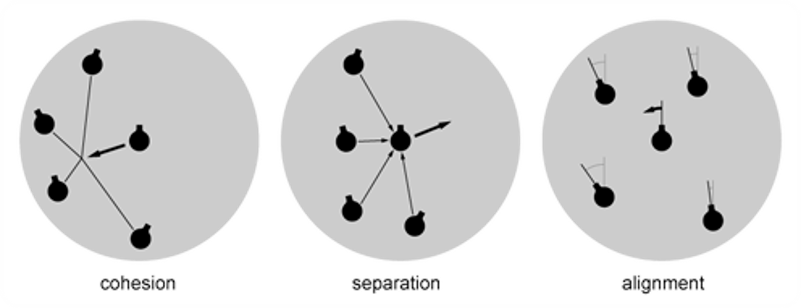
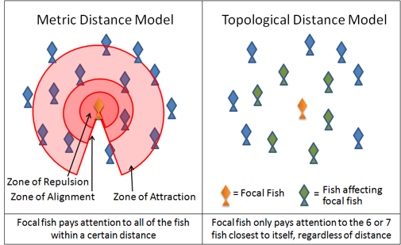

# Algorithme d'agrégation <!-- omit in toc -->
Programmation créative - L’agrégation et les collisions

## Table des matières <!-- omit in toc -->
- [Plan de leçon](#plan-de-leçon)
- [Récupération du projet](#récupération-du-projet)
  - [Branche Master](#branche-master)
- [Qu’est-ce qu’une agrégation?](#quest-ce-quune-agrégation)
  - [Exemples d’agrégation](#exemples-dagrégation)
  - [Notions scientifiques](#notions-scientifiques)
  - [La séparation ou répulsion](#la-séparation-ou-répulsion)
    - [Tâches](#tâches)
    - [Algorithme](#algorithme)

---

# Plan de leçon
- Récupération du projet
- Chercher une cible
- L’agrégation
  - Qu’est-ce que l’agrégation?
  - Notions scientifiques
  - Cohésion
  - Séparation
  - Alignement
- TBD : Les collisions de base
- TBD : Les projectiles

---

# Récupération du projet
- Dans votre dossier de travail pour les projets, récupérez le projet `demo_boids`
  - `git clone https://github.com/nbourre/demo_boids.git`
  - Ou cliquez ici pour ouvrir le projet directement
- Activez la branche `master` pour la première partie
  - `git checkout master`
- Testez l’application
  - Seulement des boids qui se promènent
- Parcourez le code pour comprendre les grandes lignes (5 min)

---

## Branche Master
Les boids ne se déplace qu’avec une vitesse initiale

---

# Qu’est-ce qu’une agrégation?
- Une agrégation est un groupe d’agents dans lequel chaque individu est indépendant et dépendant des autres individus
- Dans la littérature, on va lire sur le *swarm*|*flocking behaviour*
- Chaque individu se nomme un *boid*
- Synonyme : Essaim, troupeau, banc, volée, etc.


---

## Exemples d’agrégation

 | 

---

## Notions scientifiques
- Le principe de volée nécessite 3 forces
  - La cohésion
  - La séparation
  - L’alignement
- L’addition de ces trois forces sur un ensemble d’agents simule l’effet du comportement de troupeau chez les animaux



- Chacune des forces s’applique dans une limite de distance
- Généralement l’ordre de distance est la répulsion, l’alignement et ensuite la cohésion



---

## La séparation ou répulsion
- La force de séparation ou de répulsion est celle qui permet à l’agent de d’éloigner des voisins trop près
- On pourrait la définir comme la bulle personnelle
- On calcule en effectuant la moyenne de la différence des distances divisé par la distance
- Ensuite on trouve le vecteur pour trouver la force de braquage

---

### Tâches
- Activez la branche « s04_separation »
  - `git checkout separation`
  - Ou cliquez [ici](https://github.com/nbourre/0sw_processing_exemples/raw/master/bin/s04_demo_boids_sep.pdez) pour ouvrir le projet directement
  - Exécutez le projet

### Algorithme
- Pour chaque agents qui sont dans la bulle de répulsion
  - Diff <-- agent.position – autre.position
  - Normalise diff
  - Divise diff par la distance
  - Somme la diff
- Suivant
- Diviser la somme par le nombre d’agents trouvés
  - Cela calcule la direction à atteindre
- Normaliser la division
- Multiplier par la vitesse max
- Soustraire la vitesse de l’agent
- Limiter par la vitesse de braquage max

```java
PVector separate (ArrayList<Boid> boids) {
  PVector steer = new PVector(0, 0, 0);
  
  int count = 0;
  
  for (Boid other : boids) {
    float d = PVector.dist (this.location, other.location);
    
    if ((d > 0) && (d < separationRadius)) {
      // Calculer le vecteur de différence avec le voisin
      PVector diff = PVector.sub (this.location, other.location);
      
      diff.normalize();
      diff.div(d); // Pondération selon la distance, plus loin = moins pesant
      
      steer.add(diff);
      count++;
    }
  }
    
  if (count > 0) {
    steer.div((float)count);
  }
  
  if (steer.mag() > 0) {
    steer.setMag(topSpeed);
    steer.sub(velocity);
    steer.limit(topSteer);
  }
  
  
  return steer;
}
```

---

Branche separation
TODO : Insérer l'image

---

L’alignement
L’alignement est la force qui permet à l’agent de suivre le groupe
Elle se calcule en effectuant la moyenne de la vitesse des agents qui sont dans le voisinage établi

Tâches
Activez la branche « s04_alignment »
Ou cliquez ici pour ouvrir le projet directement
Exécutez le projet
Algo	
Calculer la moyenne des vitesses du voisinage
Calculer la force de braquage avec la moyenne trouvée


---

Branche alignement

---

La cohésion
La cohésion est la force à laquelle un agent s’attache à d’autres agents
Généralement, c’est la force dont le voisinage est le plus grand
Branche « cohesion »
Ou cliquez ici pour ouvrir le projet directement
Calcul
On calcule la cohésion en effectuant la moyenne de la position de chacun des agents
Ce calcul donne la cible à atteindre pour l’agent
Ensuite, on calcule la force de braquage pour atteindre cette cible
 
Algo
Cible  Calculer la moyenne des positions des voisins
Calculer le vecteur de braquage pour atteindre la cible

---

Branche cohesion

---

Calculer le vecteur de braquage
Dans certaine situation, on voudrait qu’un objet atteigne une cible tout en ayant une vitesse de rotation limitée
Exemple : Véhicule qui se braque dans une direction

Algo
Trouver le vecteur de différence entre la cible et l’objet
Limiter le vecteur de différence (vitesse max)
Trouver la différence entre le vecteur de différence en la vitesse de l’objet (vitesse de braquage)
Limiter le vecteur de braquage
Retourner le vecteur de braquage

---

Calculer le vecteur de braquage

---

Somme
Après avoir calculé les trois forces, on applique une pondération pour chacune d’elle
Par la suite, on les applique à l’agent
Le résultat final dépendra des facteurs suivants
La distance de l’application de chaque force
La pondération de chaque force
Tâches
Activez la branche « cohesion »
Exécutez le projet


---

Exemple

---

Premier jet avec la collision
Les collisions

---

Avant la théorie
Si vous ne l’avez pas sur votre ordi clonez le projet https://github.com/nbourre/0sw_processing_exemples
Si vous l’avez déjà
Faites un « git pull »
Vous pouvez aussi forker le projet dans votre compte

---

Collision
Le principe de collision est essentiel dans le jeu vidéo
Le fonctionnement peut être relativement simple jusqu’à très complexe
En 2D, il y a plusieurs types de collision entre autres la boîte limite, le pixel à pixel et la séparation des convexes
Dans le cas présent, nous voyons la collision simple c’est-à-dire la gestion d’intersection entre deux rectangles soit la Bounding Box

---

Collision
Pour vérifier s’il y a collision entre deux objets, il suffit de vérifier si la boîte est en intersection avec une seconde boîte
Une boîte est simplement un rectangle qui délimite l’objet
Il suffit d’ajouter une propriété de type Rectangle
Le rectangle est généralement instancié à la dimension de la texture de l’objet


---

Collision
Il faut aussi mettre à jour la position du rectangle en même temps que celui de la texture d’où l’utilité de la méthode Update dans la classe
On ajoute une méthode public  IsColliding dans la classe qui retourne un booléen indiquant s’il y a collision
Cette méthode prend en paramètre un objet de type Rectangle qui représente l’objet à comparer avec le présent

---

Collision
IsColliding est relativement simple, car elle retourne la valeur de la méthode Intersect() de la propriété Rectangle de la classe
public bool IsColliding(Rectangle otherObject)
{
   return BoundingBox.Intersects(otherObject);
}

---

Collision
Pour ensuite gérer la collision cela dépendra du jeu
Une méthode très simple est simplement d’inverser la direction de l’objet qui entre en collision avec un autre

---

Collision cercle
bool cercleCollision (Cercle autre)
{
   distance = calculDistance(ceci.centre, autre.centre)
   si ceci.rayon + autre.rayon <= distance
      retourne vrai
   fin si
   retourne faux
}

---

Projet : s03_collision_cercles

---

Collision
Problème d’algo?? 

---


Tir de projectiles

---

Description
Un projectile est un objet qui se déplace à partir d’un point
Généralement, il a une vitesse constante
Parfois, on limite le nombre de projectiles dans l’écran ou encore le nombre tiré dans un temps imparti
En plus des propriétés standards de physique, nous avons besoin d’une horloge pour calculer le temps
On aura besoin d’une liste de projectiles pour limiter le nombre à l’écran
Pour économiser de la mémoire, on peut avoir un booléen pour indiquer si le projectile est encore actif
Il ne sert à rien de calculer un projectile qui est sorti de l’écran


---

Boucle de jeux simples et horloges
Une méthode pour calculer le temps est d’avoir une variable qui différentie le temps entre deux appels de boucle de jeux
Celle que j’utilise est la suivante
J’utilise généralement les variablesct, pt et dt
La variable deltaTime permet de donnerle délai en microsecondes depuis le dernier appel
Elle permettra aussi d’avoir des accumulateurs de temps
void draw () {
  currentTime = millis();
  deltaTime = currentTime - previousTime;
  previousTime = currentTime;

  update(deltaTime);
  display();  
}

---

Accumulateur de temps
Voici une méthode que j’utilise souvent
Elle n’est pas à l’épreuve de tout, mais elle fonctionne
int shoot_acc = 0;   // Accumulateur de temps
int shoot_int = 250; // Interval des tirs
void update(int delta) {
  shoot_acc += delta;
  
  if (keyPressed && key == ' ') {
    if (shoot_acc >= shoot_int) {
      shoot_acc = 0;
      
      gun.shoot();
    }
  }
}

---

Projet : s03_turret
Observez le code de la classe Projectile
On remarque que le projectile se calcule que s’il est activé
Ensuite de la classe principale
Il y a l’horloge
Il y a une liste de projectiles que l’on instancie les projectiles qu’au besoin
Si un projectile sort de l’écran, on le désactive au lieu de détruire l’objet cela permet d’optimiser la gestion de la mémoire
Lorsque la liste atteinte son maximum d’items et que l’on désire tirer encore, on regarde pour le premier élément libre dans la liste pour le réactiver.

---

Exercices
Modifier le code des boids que l’on retrouve au début de la leçon
Ajouter deux portails carrés dans le code où lorsqu’il y a un contact avec un portal, le boid est téléporté vers l’autre portal


---

Références
http://en.wikipedia.org/wiki/Swarm_behaviour
http://processing.org/examples/flocking.html
http://igeo.jp/tutorial/43.html
http://gamedevelopment.tutsplus.com/tutorials/the-three-simple-rules-of-flocking-behaviors-alignment-cohesion-and-separation--gamedev-3444


---
