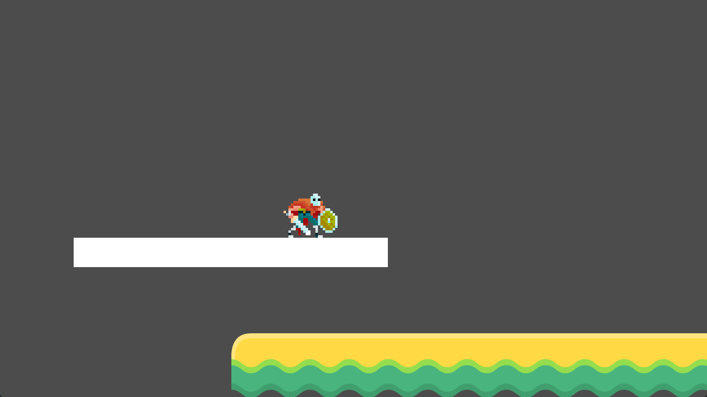

# Les plateformes mobiles <!-- omit in toc -->



# Table des matières <!-- omit in toc -->


# Introduction
Dans bien des jeux de type plateforme, les plateformes mobiles sont un élément essentiel pour créer des niveaux intéressants et stimulants. Dans cette leçon, nous allons apprendre à créer une plateforme mobile qui se déplace de manière fluide entre deux positions.

Il y a plusieurs façons de créer des plateformes mobiles dans Godot. On peut utiliser un `AnimationPlayer` pour animer les déplacements, ou bien utiliser une `Tween` pour créer des transitions fluides entre les positions ou encore calculer les déplacements en fonction du temps. Dans cette leçon, nous allons utiliser une `Tween` pour créer une plateforme mobile.

# Noeud AnimatableBody2D

Un noeud qui facilite la création de plateformes mobiles est `AnimatableBody2D`. Ce nœud est similaire à `CharacterBody2D`, mais avec des fonctionnalités de mouvement animables. Il permet de gérer des objets mobiles avec des interactions physiques, tels que des plateformes ou des personnages, tout en conservant des mouvements interpolés.

Il nécessite un `CollisionShape2D` pour détecter les collisions et idéalement un noeud qui permet d'afficher l'image de la plateforme qui peut être un sprite ou un autre type de noeud. J'utilise dans mon exemple initial un `ColorRect` pour afficher la plateforme.

TODO : Refaire les notes pour le tween


**Tween** : Une `Tween` crée des transitions fluides entre des propriétés, comme la position, la rotation, ou l'opacité. Les `Tween` sont parfaits pour animer des mouvements, des changements de couleur, des redimensionnements, etc.

### Le Code

```gdscript
extends Node2D

@export var offset = Vector2(0, -320)
@export var duration = 5.0

@onready var anim_body : AnimatableBody2D = $AnimatableBody2D

func _ready() -> void:
    start_tween()

func start_tween():
    var tween = get_tree().create_tween().set_process_mode(Tween.TWEEN_PROCESS_PHYSICS)
    tween.set_loops().set_parallel(false)
    tween.tween_property(anim_body, "position", offset, duration / 2)
    tween.tween_property(anim_body, "position", Vector2.ZERO, duration)
```

### Explication des Principales Lignes

- **Ligne 1-2** : `offset` détermine la distance de déplacement de la plateforme, et `duration` contrôle la durée de l’animation.
- **Ligne 4** : On récupère le `AnimatableBody2D` pour l’animer.
- **Fonction `_ready`** : Déclenche l’animation au démarrage.
- **`start_tween`** : Crée une `Tween`, active le mode de traitement physique, et définit deux animations successives :
  - **Déplacement vers `offset`**.
  - Retour à la position initiale avec des boucles infinies.

Cette structure permet de créer une plateforme mobile avec des transitions fluides entre les positions définies.