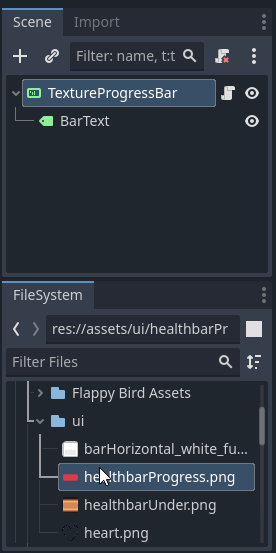

# Le `TextureProgressBar` <!-- omit in toc -->

# Table des matières <!-- omit in toc -->
- [Introduction](#introduction)
- [Configuration](#configuration)
  - [Image de fond et de progression](#image-de-fond-et-de-progression)
  - [Les propriétés](#les-propriétés)
- [Le script](#le-script)
- [Ajout de texte](#ajout-de-texte)
  - [Le script avec le texte](#le-script-avec-le-texte)
- [Utilisation](#utilisation)
- [Références](#références)

---
# Introduction
Le `TextureProgressBar` est un contrôle qui permet d'afficher une barre de progression avec une texture. En plus d'être une barre de progression, il peut aussi être utilisé pour afficher des jauges, des compteurs, etc.

# Configuration
Il est relavivement simple à utiliser. Pour la configuration, il suffit d'avoir deux images. Une pour le fond et une pour la barre de progression. Ensuite, il suffit de les assigner aux propriétés `Under` et `Progress` du contrôle.

## Image de fond et de progression
À partir du système de fichiers, on peut simplement glisser-déposer les images dans les propriétés correspondantes ou encore directement sur le noeud dans la scène.



## Les propriétés
Quelques propriétés d'intérêt:

- `Nine Patch Stretch` : Permet de définir si l'image de fond peut être étirée ou non.
  - Important, l'image de fond doit être rectangulaire, les lignes horizontales et verticales seront étirées, mais les coins resteront intacts.
  - L'option `Stretch Margin` apparait lorsqu'on coche cette option. Elle permet de définir les marges qui ne seront pas étirées.


- `Min Value` et `Max Value` : Permet de définir les valeurs minimales et maximales de la barre de progression.
- `Value` : Permet de définir la valeur actuelle de la barre de progression.

# Le script

Étant donné que la barre de progression pourrait être utilisée pour plusieurs choses, je fais une classe de base générale qui pourrait être utilisée pour plusieurs choses.

On ajout une fonction `update_value` qui permet de mettre à jour la valeur de la barre de progression de l'extérieur.

```gd
class_name GenericProgressBar
extends TextureProgressBar

func update_value (new_value : int, max : int):
	max_value = max
	value = new_value
```

# Ajout de texte
Pour ajouter du texte à la barre de progression, il suffit d'ajouter un `Label` comme enfant du `TextureProgressBar`. Ensuite, il suffit de le configurer comme on le ferait pour un `Label` normal.


## Le script avec le texte
Étant donné que l'on a du texte, il faut maintenant le mettre à jour.

```gd
class_name GenericProgressBar
extends TextureProgressBar

@export var bar_name : String
@onready var text : Label = $BarText

func update_value (new_value : int, max : int):
	max_value = max
	value = new_value
	text.text = str(bar_name, " : ", int(value), " / ", int (max))
```

# Utilisation
Disons que l'on désire afficher une barre de progression pour la vie d'un personnage. On pourrait utiliser la composition pour ajouter une barre de progression au personnage ou encore détacher la barre de progression du personnage et la placer ailleurs.

```gd
class_name World
extends Node2D

var player : Player
var health_bar : GenericProgressBar

func _ready():
    player = $


---
# Références
