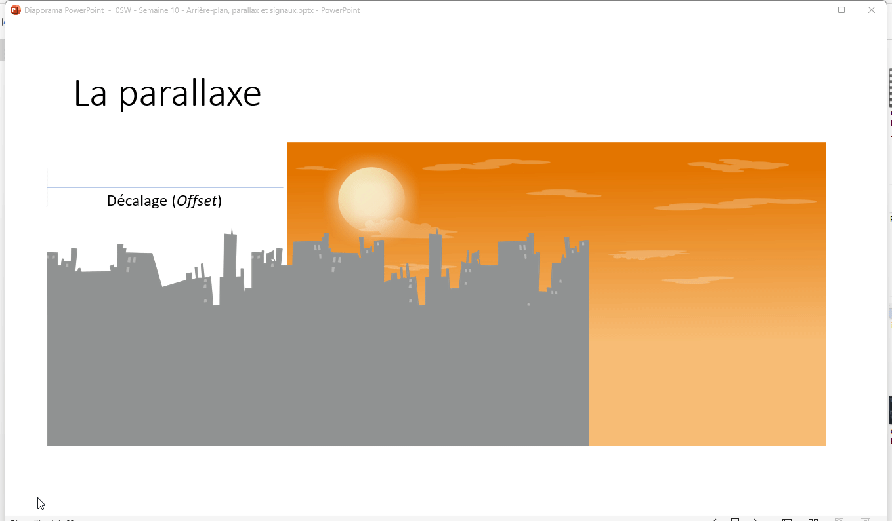
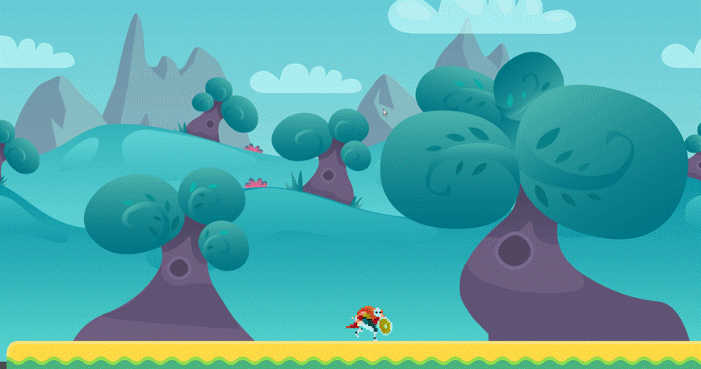
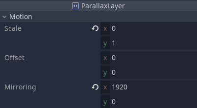

# La parallaxe <!-- omit in toc -->

- [Introduction](#introduction)
- [ParallaxBackground avec Godot](#parallaxbackground-avec-godot)
  - [ParallaxLayer](#parallaxlayer)
- [Défilement automatique](#défilement-automatique)


# Introduction
- Dans le monde du jeu, la parallaxe est le principe qui permet de simuler une profondeur dans un monde 2D
- On simule la parallaxe avec des images qui défilent à des vitesses variées
- Pour simplifier la compréhension, nous allons prendre un décor à deux couches
  - Disons `couche_0` pour le fond et `couche_1` pour le devant
- `couche_0` restera immobile, car celle-ci représentera du décor lointain tel que des montages ou encore des étoiles
- `couche_1` déroulera à une vitesse donnée, mais moins rapide que celle de la caméra disons 50%
- Lors du défilement, si l’on atteint la limite de la couche_1, on refera une affiche de celle-ci à partir de l’autre extrémité



# ParallaxBackground avec Godot



- Pour faire un effet parallaxe avec Godot, on peut utiliser le nœud `ParallaxBackground`
- Ensuite, il faut lui ajouter les nœuds `ParallaxLayer`
- Dans `ParallaxLayer`, il faut ensuite ajouter l’image que l’on désire via le nœud `Sprite`

## ParallaxLayer
- Les propriétés importantes de ce nœud sont `Motion.Scale X|Y` et `Mirroring`
- `Scale` permet de déterminer la vitesse de défilement du paysage
  - Une valeur < 1 va faire défiler le paysage plus lentement que la couche principale et vice versa
- `Mirroring` permet de répéter le paysage lorsque l’image arrive à la fin de son affichage



# Défilement automatique
- Il est possible de faire défiler automatiquement le paysage via un script
- Par exemple, si l'on désire que des nuages lointain se déplace ou encore simuler un levé ou un couché de soleil.
- Il suffit d’ajouter un script au nœud `ParallaxBackground` et de modifier dynamiquement la valeur de la propriété `MotionOffset`

Voici un exemple de code :

```cs
public class ParallaxBackground : Godot.ParallaxBackground
{
    [Export]
    float Cloud_Speed = -15f;

    ParallaxLayer cloudLayer;
    Sprite cloudSprite;

    public override void _Ready()
    {        
        cloudLayer = GetNode<ParallaxLayer>("clouds");
        cloudSprite = cloudLayer.GetNode<Sprite>("Sprite");
    }

    public override void _Process(float delta)
    {
       cloudLayer.MotionOffset = 
         new Vector2(cloudLayer.MotionOffset.x + (Cloud_Speed * delta), 0);          
    }
}

```