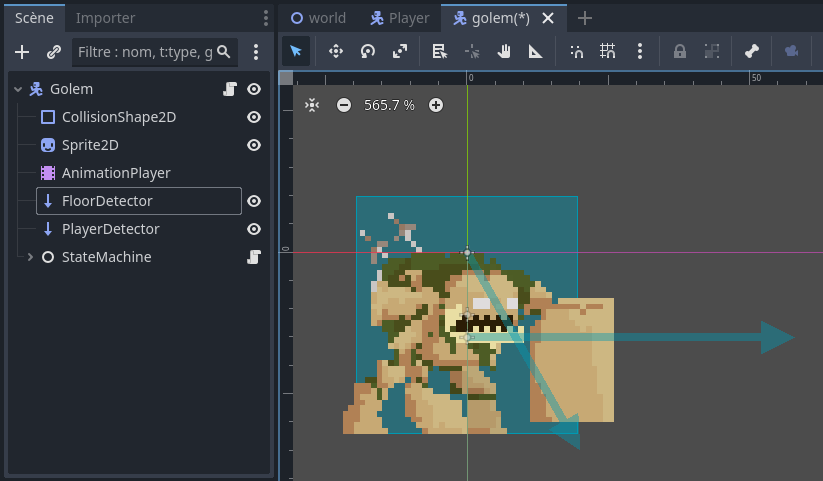

# Le ray casting <!-- omit in toc -->

# Table des matières <!-- omit in toc -->
- [Introduction](#introduction)
- [Exemple](#exemple)
  - [Comment ça marche](#comment-ça-marche)
- [Noeud RayCast2D](#noeud-raycast2d)
- [Dans le code](#dans-le-code)
- [Conclusion](#conclusion)
- [Références](#références)

---

# Introduction
Le ray casting est une technique dans laquelle on émet un rayon depuis un point donné dans une direction donnée, et on regarde ce que ce rayon touche. C'est une technique très utilisée dans les jeux vidéos pour simuler la lumière, les ombres et la détection d'objets.

La partie qui nous intéresse est la détection d'objets. En effet, le ray casting est utilisé pour détecter les collisions entre objets, et pour déterminer ce que le rayon touche.

# Exemple
Observez le gif ci-dessous. L'ennemi (Golem) est capable de détecter le bout de la plateforme et de changer de direction. Cela est possible grâce au ray casting.


Voici ce à quoi ressemble le ray casting avec le debug activé.


## Comment ça marche
Dans le gif précédent, on remarque qu'il y a deux flèches qui partent de l'ennemi. Ces flèches représent les rayons. On envoie un rayon dans chaque direction, et on regarde ce que le rayon touche. Si le rayon ne touche plus le sol, alors on change de direction.

---

# Noeud RayCast2D
Godot propose un noeud `RayCast2D` qui permet de faire du ray casting en 2D. Ce noeud permet de détecter les collisions entre objets, et de déterminer ce que le rayon touche.

Son utilisation est relativement simple. Il suffit de placer un noeud `RayCast2D` dans la scène, et de le configurer pour qu'il détecte les collisions.

Voici la scène qui a été utilisée pour les gif précédents



J'ai renommé les noeuds `RayCast2D` en `FloorDetector` et `PlayerDetector` pour plus de clarté.

Les paramètres du `RayCast2D` qui nous intéressent sont les suivants:
- `Target Position`: La position de la cible du rayon. C'est la direction dans laquelle le rayon est envoyé.
- `Collision Mask`: Le masque de collision. Les objets qui sont sur le même masque de collision que le rayon peuvent être détectés.
- `Collide with ...`: Les types d'objets avec lesquels le rayon peut entrer en collision.
  -  `Areas`: Les noeuds `Area2D`
  -  `Bodies`: Les noeuds `PhysicsBody2D`
- `Position`: La position du noeud `RayCast2D`. C'est le point de départ du rayon.


**Question :** Avec les propriétés indiquées dans l'image ci-dessus, quelle flèche est représentée : le `FloorDetector` ou le `PlayerDetector`? Pourquoi?

---

# Dans le code
Pour détecter les collisions avec un `RayCast2D`, il suffit de vérifier si la méthode `is_colliding()` retourne `true`. Si c'est le cas, alors le rayon touche un objet.

```gd
	if not floor_detector.is_colliding():
        character.direction *= -1
        floor_detector.target_position.x *= -1
        player_detector.target_position.x *= -1
```

Remarquez que le code ci-dessus est utilisé pour changer la direction du Golem. Si le rayon ne touche plus le sol, alors on change de direction. On doit aussi changer la direction du rayon pour qu'il soit envoyé dans la bonne direction.

Dans le code précédent, on ne regarde pas le type d'objet avec lequel le rayon entre en collision. Ainsi n'importe quel objet peut être détecté par le rayon. Cela pourrait être une source de bogue, mais dans notre cas, cela ne pose pas de problème.

Si l'on veut détecter un type d'objet spécifique, on peut utiliser la méthode `get_collider()` pour obtenir le noeud avec lequel le rayon entre en collision. Ensuite, on peut vérifier le type de l'objet avec lequel le rayon entre en collision.

```gd
func handle_player():
	if (player_detector.is_colliding()) :
        # On récupère le noeud avec lequel le rayon entre en collision
		var collider = player_detector.get_collider()
		
		if collider == player:
			# Player détecté
            # On change d'état
			Transitioned.emit(self, "dash")
			return
```


---

# Conclusion
- Le ray casting est une technique très utilisée dans les jeux vidéos pour détecter les collisions entre objets.
- Godot propose un noeud `RayCast2D` qui permet de faire du ray casting en 2D.
- Il suffit de vérifier si la méthode `is_colliding()` retourne `true` pour savoir si le rayon touche un objet.
- On peut utiliser la méthode `get_collider()` pour obtenir le noeud avec lequel le rayon entre en collision.
- On peut utiliser le masque de collision pour détecter un type d'objet spécifique.

---

# Références
- [RayCast In Godot Tutorial: How To Create Smarter Enemies (Enemy AI)](https://www.youtube.com/watch?v=_AheThiIiyg)
- 