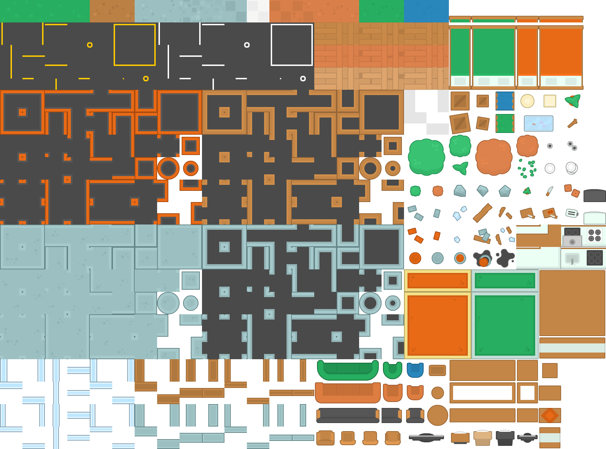
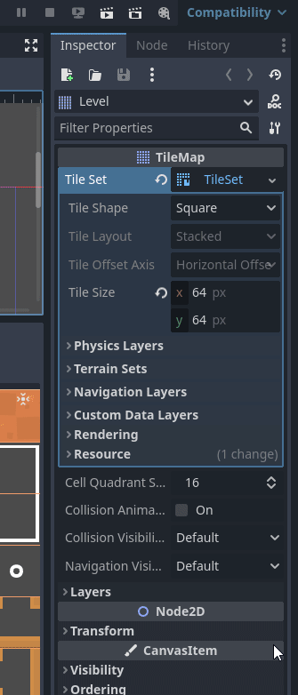

# Le Tilemap Terrain <!-- omit in toc -->

- [Introduction](#introduction)
- [Ressources pour l'article](#ressources-pour-larticle)
- [Prérequis](#prérequis)
- [Création du terrain](#création-du-terrain)
- [Tracer le masque de terrain](#tracer-le-masque-de-terrain)
- [Références](#références)

# Introduction
Nous avons vu comment tracer une carte de tuiles manuellement. C'est utile, cependant, c'est un vrai travail de moine! Godot offre une fonctionnalité qui permet de réduire le travail grandement en utilisant les Terrains (anciennement autotile).

Cette fonctionnalité permet de tracer la carte en donnant la responsabilité de sélectionner les bonnes tuiles à Godot. Il suffit de lui donner les tuiles de base et les règles de sélection.

Pour utiliser cette fonctionnalité, il faut utiliser un TileSet et un TileMap. Le TileSet contient les tuiles de base et le TileMap contient la carte de tuiles.

# Ressources pour l'article
Pour cet article, je vais utiliser le fond de carte de [Kenney Top-Down Shooter](https://kenney.nl/assets/top-down-shooter).

- Les tuiles sont de dimensions 64x64 pixels.

# Prérequis
Pour l'article, on prend pour acquis les points suivants:
- Godot 4 est installé
- Un projet Godot 4 est créé
- Le TileSet est créé

# Création du terrain
Une fois que le TileSet est créé et importé, il faut créer le terrain.

<table>
<tr><td>

1. Pour ce faire, il faut aller dans les propriétés du noeud `TileMap` et sélectionner le `TileSet` dans la propriété `Tile Set`. 
2. Cliquer sur `Terrain Sets`
3. Sélectionner un mode. Pour l'article, je vais utiliser le mode `Match Corners and Sides`
4. Donner un nom au terrain. Pour l'article, je vais utiliser `Walls`
5. Mettre une couleur complémentaire au terrain
   - Cela n'a aucun impact sur le jeu. C'est pour mieux discerner les masques de terrain dans l'éditeur.

</td><td>

</td></tr>
</table>

# Tracer le masque de terrain
Maintenant que le terrain est créé, il faut tracer le masque de terrain. Le masque de terrain est une carte de tuiles qui indique à Godot quelles tuiles utiliser pour chaque case. Il s'agit de la logique à utiliser pour sélectionner les tuiles.

# Références
- [Godot Docs - Using TileSet](https://docs.godotengine.org/en/stable/tutorials/2d/using_tilesets.html#doc-using-tilesets)
- [Godot Docs - Using TileMaps](https://docs.godotengine.org/en/stable/tutorials/2d/using_tilemaps.html)
- [Tilesetter.org](https://www.tilesetter.org/)
- [Terrain Autotiling and Alternative tiles - Godot 4](https://youtu.be/vV8uKN1VnN4?si=JvF7z2vFa5sNdplm)