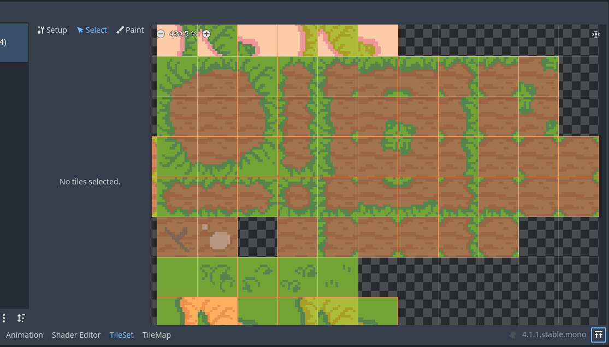

# Le Tilemap Terrain <!-- omit in toc -->

- [Introduction](#introduction)
- [Ressources pour l'article](#ressources-pour-larticle)
- [Prérequis](#prérequis)
- [Création du terrain](#création-du-terrain)
  - [Sélection d'un jeu de tuiles (TileSet)](#sélection-dun-jeu-de-tuiles-tileset)
  - [Sélectionner les tuiles qui seront utilisées](#sélectionner-les-tuiles-qui-seront-utilisées)
  - [Tracer le masque de terrain](#tracer-le-masque-de-terrain)
- [Références](#références)

# Introduction
Nous avons vu comment tracer une carte de tuiles manuellement. C'est utile, cependant, c'est un vrai travail de moine! Godot offre une fonctionnalité qui permet de réduire le travail grandement en utilisant les Terrains (anciennement autotile).

Cette fonctionnalité permet de tracer la carte en donnant la responsabilité à Godot pour sélectionner les bonnes tuiles. Il suffit de lui donner les tuiles de base et les règles de sélection.

Pour utiliser cette fonctionnalité, il faut utiliser un TileSet et un TileMap. Le TileSet contient les tuiles de base et le TileMap contient la carte de tuiles.

# Ressources pour l'article
Pour cet article, je vais utiliser le fond de carte de [Ninja Adventure](https://pixel-boy.itch.io/ninja-adventure-asset-pack).

- Les tuiles sont de dimensions 16x16 pixels.

# Prérequis
Pour l'article, on prend pour acquis les points suivants:
- Godot 4 est installé
- Un projet Godot 4 est créé
- Le TileSet est créé
  - Si ce n'est pas le cas, ajouter un noeud `Tilemap` avec un nouveau Tileset de 16x16 pixels.
  - Glisser l'image fourni dans cet article.

# Création du terrain
Une fois que le TileSet est créé et importé, il faut créer le terrain.

<table>
<tr><td>

1. Pour ce faire, il faut aller dans les propriétés du noeud `TileMap` et sélectionner le `TileSet` dans la propriété `Tile Set`. 
2. Cliquer sur `Terrain Sets`
3. Sélectionner un mode. Pour l'article, je vais utiliser le mode `Match Corners and Sides`
4. Ensuite, il faut ajouter un `Element`. Nous en ajouterons 2 soit un pour la terre et l'autre pour le gazon.
5. Donner un nom au terrain. Pour l'article, je vais utiliser `Dirt` et `Grass`
6. Pour la couleur, utiliser une couleur complémentaire au terrain
   - Cela n'a aucun impact sur le jeu. C'est pour mieux discerner les masques de terrain dans l'éditeur.
   - Il y a l'outil `Color Picker` pour sélectionner une couleur.

</td><td>

<video src="assets/tileset_select_color.mp4" controls title="Title"></video>

</td></tr>
</table>

## Sélection d'un jeu de tuiles (TileSet)
Pour que Godot puisse générer les masques de terrain, il faut lui donner un jeu de tuiles adéquat. Qu'est-ce qu'un jeu de tuiles adéquat? C'est un jeu de tuiles qui contient les tuiles de base pour le terrain avec plusieurs variantes pour chaque tuile. On y retrouve des transitions pour les coins, les côtés et les centres.

On remarque dans l'image ci-dessus qu'il y a plusieurs variantes pour chaque tuile. Les coins, les côtés et les centres sont tous différents. C'est ce qu'il faut pour que Godot puisse générer les masques de terrain. Pour le mode `Match Corners and Sides`, il faut **47 variantes** pour chaque direction et transition. S'il y a des tuiles supplémentaires, c'est qu'il y a des doublons avec quelques variantes pour les tuiles de centre (remplissages).

## Sélectionner les tuiles qui seront utilisées
Maintenant que le terrain est créé, il faut tracer le masque de terrain. Le masque de terrain est une carte de tuiles qui indique à Godot quelles tuiles utiliser pour chaque case. Il s'agit de la logique à utiliser pour sélectionner les tuiles.

1. La première étape sera de sélectionner l'onglet `TileSet`. Cet onglet permet de configurer le jeu de tuiles.
2. Sélectionner l'outil `Paint` dans la barre d'outils.
3. Dans `Paint properties`, sélectionner `Terrains`.
4. Dans `Painting`, sélectionner le terrain à peindre. Dans notre cas, `Terrain Set 0`   

5. Sélectionner les tuiles qui seront utilisées pour tracer le masque de terrain.   

## Tracer le masque de terrain
Maintenant vient le moment un peu plus corsé.
<!-- TODO : Continuer... -->

# Références
- [Godot Docs - Using TileSet](https://docs.godotengine.org/en/stable/tutorials/2d/using_tilesets.html#doc-using-tilesets)
- [Godot Docs - Using TileMaps](https://docs.godotengine.org/en/stable/tutorials/2d/using_tilemaps.html)
- [Tilesetter.org](https://www.tilesetter.org/)
- [Terrain Autotiling and Alternative tiles - Godot 4](https://youtu.be/vV8uKN1VnN4?si=JvF7z2vFa5sNdplm)